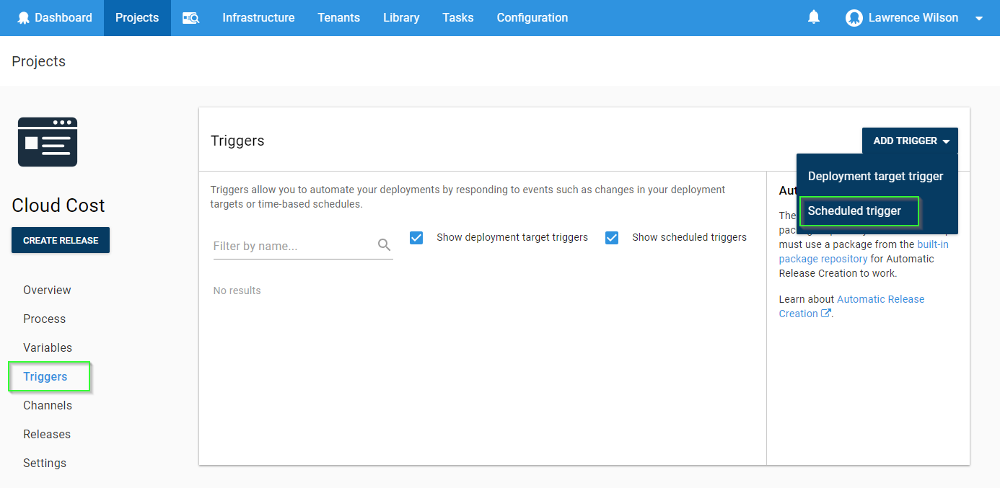
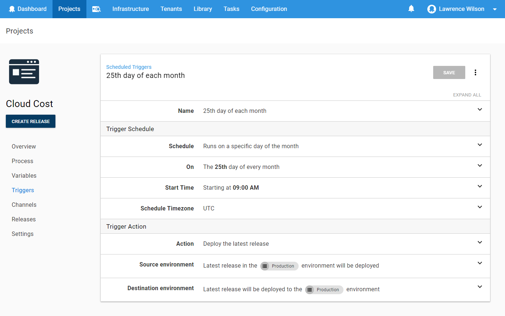
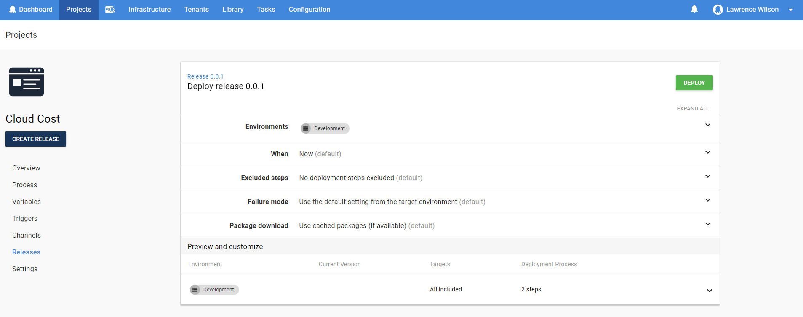
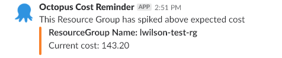

Updated 2018-04-23 - This blog post has been updated after our Octopus 2018.4 release which now has support for [recurring scheduled deployments](https://octopus.com/blog/octopus-release-2018.4#recurring-scheduled-deployments) to illustrate how to run a deployment regularly on a schedule.

Have you ever deployed a Virtual Machine into Azure for a quick 10-minute test only to come back 2 months later and realize it's been running the whole time? This blog post shows how you can use Octopus to notify you via Slack if an Azure resource group cost spikes above an expected amount - which you can specify using resource group tags. Since Octopus has the ability to authenticate to many different cloud platforms, and deploy resources to them, it naturally has the ability to get useful data out too. This makes Octopus a great candidate to run the scripts we need to see how much our resources are costing.

## Scenario
I love a good scenario, so without further ado, please meet OctoFX; A fictional firm of highly skilled developers who deploy resources into the cloud and run tests against them. Lately, they're noticing it's hard to remember to delete certain resources when the testing is complete and would like to be notified when a resource's cost exceeds a cost limit. While each cloud platform has their own way of notifying you of cost, OctoFX have chosen to use Octopus to run these scripts because it allows them to follow a consistent approach irrespective of which cloud platform they're using. In this scenario, we will be defining a tag called NotifyCostLimit which, when this limit is hit, Octopus will send out slack notifications. If there is no NotifyCostLimit applied, the default value of $100 will be assumed.

This blog entry only covers the steps taken to query Microsoft Azure, but you can apply a similar approach with AWS as well. So, let's get it done! If you would like to see the process that the script takes, you can follow along with each of the following objectives. Alternatively, you can skip through to the `Configure it in Octopus` section of this blog to see the completed script.  

## Limitations
A few key things to note here:
- The cmdlet ([Get-AzureRmConsumptionUsageDetail](https://docs.microsoft.com/en-us/powershell/module/azurerm.consumption/get-azurermconsumptionusagedetail?view=azurermps-5.4.0)) used to retrieve the cost items can only get Resource Manager details, this means that we won't see any Service Manager Resources costs at all.
- It might take up to two weeks for the consumption details to be available and we should consider that the earliest data entry we see might be from two weeks ago.
- Cost figures do not include tax.

## Objective 1: Get all cost items for all subscriptions in Azure.
The main focus of the script segment below is to retrieve consumption usage details. This can be accomplished by using the [Get-AzureRmConsumptionUsageDetail](https://docs.microsoft.com/en-us/powershell/module/azurerm.consumption/get-azurermconsumptionusagedetail?view=azurermps-5.4.0) cmdlet from Azure PowerShell. Here we provide two dates, StartDate (today minus 30 days) and the EndDate (today)

```powershell
write-output "Getting all cost items for this subscription in Azure"
write-output "Subscription ID: $SubscriptionId "

$now = get-Date

$startDate = $($now.Date.AddDays(-$DateRangeInDays))
$endDate = $($now.Date)

write-output "Start Date:  $startDate  "
write-output "end Date:  $endDate "


$SubConsumptionUsage = Get-AzureRmConsumptionUsageDetail -StartDate $startDate  -EndDate $endDate
```

## Objective 2: Find all of the resource group names which existed during this billing period.
Now, we take each line from the consumption usage details to trim off the beginning part of each Instance ID. Then, we strip out everything after the resource group name. In the end, we are finished with resource group names. Since resource groups are case insensitive, I have made each resource group name lower-case.

```powershell
write-output "Finding all of the resource group names which existed during this billing period."
$SubIdPrefix = "/subscriptions/" + $SubscriptionId
$RgIdPrefix = $SubIdPrefix + "/resourceGroups/"

$resourceGroupName = @()
$resourceGroups = @()

foreach ($line in $SubConsumptionUsage) {
    if ($line.InstanceId -ne $null ) {
        $thisRgName = $($line.InstanceId.ToLower()).Replace($RgIdPrefix.ToLower(),"")
        $toAdd = $thisRgName.Split("/")[0]
        $toAdd = $toAdd.ToString()
        $toAdd = $toAdd.ToLower()
        $toAdd = $toAdd.Trim()

        if ($resourceGroups.Name -notcontains $toAdd) {
            $resourceGroupName = [PSCustomObject]@{
            Name = $toAdd
            }
            $resourceGroups += $resourceGroupName
        }
    }
}

write-output "Found these Resource groups: "
$resourceGroups
```

## Objective 3: Calculate the cost of each Resource Group, then flag ones that exceed NotifyCostLimit.
For each resource group name encountered we filter the details by resource group and add all the costs together. This becomes the total cost of each resource group.

```powershell
Write-Output "Calculating the cost of each Resource Group, then flag ones that exceed NotifyCostLimit."
$currentResourceGroups = Get-AzureRmResourceGroup
$rgIndexId = 0

foreach ($rg in $resourceGroups) {

    #$thisRg = $null
    $RgIdPrefix = $SubIdPrefix + "/resourceGroups/" + $rg.Name
    $ThisRgCost = $null
    $SubConsumptionUsage | ? { if ( $_.InstanceId -ne $null) { $($_.InstanceId.ToLower()).StartsWith($RgIdPrefix.ToLower()) } } |  ForEach-Object { $ThisRgCost += $_.PretaxCost   }
    $toaddCost = [math]::Round($ThisRgCost,2)
    $resourceGroups[$rgIndexId] | Add-Member -MemberType NoteProperty -Name "Cost" -Value $toaddCost

    if ($currentResourceGroups.ResourceGroupName -contains $rg.Name) {

        $addingResourceGroup = Get-AzureRmResourceGroup -Name $($rg.Name)
        $resourceGroups[$rgIndexId] | Add-Member -MemberType NoteProperty -Name "NotifyCostLimit" -Value $($addingResourceGroup.tags.NotifyCostLimit)

    }

    $rgIndexId ++

}
```

## Objective 4: Filter the items whose cost is higher than expected.
To accomplish this next part, we will pipe our resource groups to the `where-object` (which is shortened to a `?` to filter each item which is greater-than or equal to the cost notification tag `NotifyCostLimit`.
```powershell
Write-Output "Filtering the items whose cost is higher than the allowed limit."
$reminderGroups = $resourceGroups | ? {
    if ($_.NotifyCostLimit -ne $Null) {

        $_.Cost -ge $_.NotifyCostLimit

    }
    else {

        $_.Cost -ge $DefaultNotifyCostLimit

    }
}
```
## Objective 5: Notify the correct people using a Slack notification.
Finally, we will be reminding people that they might have a test resource which has reached the cost limit for that resource.
```powershell
function new-SlackMessage ( $resourceGroup ) {

    $orange = "#F9812A"
    $attachments = @{}
    $fieldNumber = 0
    $username = "Octopus Cost Reminder"
    $IconUrl = "https://octopus.com/images/company/Logo-Blue_140px_rgb.png"
    $payload = @{
    #channel = "General";
    username = $username;
    icon_url = $IconUrl;
    attachments = @(
    );
    }


    $state = "Current cost: $($resourceGroup.Cost)"
    $description = "ResourceGroup Name: $($resourceGroup.Name)"
    $ownerContact = "OwnerContact: $($resourceGroup.OwnerContact)"
    $colour = $orange

    if ($fieldNumber -eq 0){
        $pretext = "This Resource Group has spiked above expected cost"
    }
    else {
        $pretext = $null
    }

    $thisFallbackMessage = "$description has spiked above expected cost (Current Cost: $state)"

    #Some results can have multiple fields:
    $fields = @(
        @{
        title = $description;
        value = $state;
        });


    $thisAttachment = @{
        fallback = $thisFallbackMessage;
        color = $colour;
        pretext = $pretext;
        fields = $fields;
    }

    $payload.attachments += $thisAttachment

    return $payload

}

function New-SlackNotification ($hook, $group)
{

    $message = New-SlackMessage -resourceGroup $group
    Invoke-Restmethod -Method POST -Body ($message | ConvertTo-Json -Depth 4) -Uri $hook

}

if ($reminderGroups -ne $null) {
    Write-Output "Sending a Slack notification about these groups"
    $reminderGroups
    foreach ($group in $reminderGroups) {

        New-SlackNotification -hook $slackHook -group $group


    }
}
else {
    Write-Output "There are no groups which need attention"
}
```
## Configure it in Octopus
Now to get to the fun part, configuring Octopus!

## Pre-requisites
Please ensure you have setup these two pre-requisites, in order to get this going:
- An Azure Service Principal setup in Octopus.
- A slack account configured with your slack hook URL.

## Setting up the Octopus Service Principal Account
We first need to ensure that Octopus has a Service Principal Account configured to see into your Azure Subscription. Please feel free to check out our documentation on [creating an Azure service principal account](https://g.octopushq.com/AzureServicePrincipalAccount) for more information on how to perform that task. For the purposes of this account, you need to ensure that it has at least `Reader` access to the subscription.

## Setting up the Slack Notification Account
Please check out the [slack documentation](https://api.slack.com/) for how to create a new slack integration and get the slack Hook URL. Once you have the URL, you need to make sure it's set as a project variable in Octopus.

## Create your new Project
Create your new Project in Octopus, mine is called `Cloud Cost`, then define these 4 project variables:
- SubscriptionId (Type: String). The Subscription ID which can be retrieved from Azure PowerShell by running `Get-AzureRmSubscription`.
- DateRangeInDays (Type: Integer). The script takes the current day and counts backwards by this many days to form a range to check usage cost.
- DefaultNotifyCostLimit (Type: Integer). If a resource group isn't tagged with a `NotifyCostLimit`, Octopus will default to this value.
- SlackHook (Type: String). The full URL of your slack hook.


## Create a new Step (Azure PowerShell Script)
Create a new step named `Get Azure subscription cost` using `Run an Azure PowerShell Script` step template.
Specify the account as your Service Principal Account which has access to the subscription you're getting cost data from.
Paste the full script below into your Script Content section.
Save the first step.


```powershell
write-output "Getting all cost items for this subscription in Azure"
write-output "Subscription ID: $SubscriptionId "

$now = get-Date

$startDate = $($now.Date.AddDays(-$DateRangeInDays))
$endDate = $($now.Date)

write-output "Start Date:  $startDate  "
write-output "end Date:  $endDate "

$SubConsumptionUsage = Get-AzureRmConsumptionUsageDetail -StartDate $startDate  -EndDate $endDate

write-output "Finding all of the resource group names which existed during this billing period."
$SubIdPrefix = "/subscriptions/" + $SubscriptionId
$RgIdPrefix = $SubIdPrefix + "/resourceGroups/"

$resourceGroupName = @()
$resourceGroups = @()

foreach ($line in $SubConsumptionUsage) {
    if ($line.InstanceId -ne $null ) {
        $thisRgName = $($line.InstanceId.ToLower()).Replace($RgIdPrefix.ToLower(),"")
        $toAdd = $thisRgName.Split("/")[0]
        $toAdd = $toAdd.ToString()
        $toAdd = $toAdd.ToLower()
        $toAdd = $toAdd.Trim()

        if ($resourceGroups.Name -notcontains $toAdd) {
            $resourceGroupName = [PSCustomObject]@{
            Name = $toAdd
            }
            $resourceGroups += $resourceGroupName
        }
    }
}

write-output "Found these Resource groups: "
$resourceGroups

Write-Output "Calculating the cost of each Resource Group, then flag ones that exceed NotifyCostLimit."
$currentResourceGroups = Get-AzureRmResourceGroup
$rgIndexId = 0

foreach ($rg in $resourceGroups) {

    #$thisRg = $null
    $RgIdPrefix = $SubIdPrefix + "/resourceGroups/" + $rg.Name
    $ThisRgCost = $null
    $SubConsumptionUsage | ? { if ( $_.InstanceId -ne $null) { $($_.InstanceId.ToLower()).StartsWith($RgIdPrefix.ToLower()) } } |  ForEach-Object { $ThisRgCost += $_.PretaxCost   }
    $toaddCost = [math]::Round($ThisRgCost,2)
    $resourceGroups[$rgIndexId] | Add-Member -MemberType NoteProperty -Name "Cost" -Value $toaddCost

    if ($currentResourceGroups.ResourceGroupName -contains $rg.Name) {

        $addingResourceGroup = Get-AzureRmResourceGroup -Name $($rg.Name)
        $resourceGroups[$rgIndexId] | Add-Member -MemberType NoteProperty -Name "NotifyCostLimit" -Value $($addingResourceGroup.tags.NotifyCostLimit)

    }

    $rgIndexId ++

}

Write-Output "Filtering the items whose cost is higher than the allowed limit."
$reminderGroups = $resourceGroups | ? {
    if ($_.NotifyCostLimit -ne $Null) {

        $_.Cost -ge $_.NotifyCostLimit

    }
    else {

        $_.Cost -ge $DefaultNotifyCostLimit

    }
}

function new-SlackMessage ( $resourceGroup ) {

    $orange = "#F9812A"
    $attachments = @{}
    $fieldNumber = 0
    $username = "Octopus Cost Reminder"
    $IconUrl = "https://octopus.com/images/company/Logo-Blue_140px_rgb.png"
    $payload = @{
        #channel = "General";
        username = $username;
        icon_url = $IconUrl;
        attachments = @(
        );
    }

    $state = "Current cost: $($resourceGroup.Cost)"
    $description = "ResourceGroup Name: $($resourceGroup.Name)"
    $colour = $orange

    if ($fieldNumber -eq 0){
        $pretext = "This Resource Group has spiked above expected cost"
    }
    else {
        $pretext = $null
    }

    $thisFallbackMessage = "$description has spiked above expected cost (Current Cost: $state)"

    $fields = @(
        @{
        title = $description;
        value = $state;
        });

    $thisAttachment = @{
        fallback = $thisFallbackMessage;
        color = $colour;
        pretext = $pretext;
        fields = $fields;
    }

    $payload.attachments += $thisAttachment

    return $payload

}

function New-SlackNotification ($hook, $group)
{

    $message = New-SlackMessage -resourceGroup $group
    Invoke-Restmethod -Method POST -Body ($message | ConvertTo-Json -Depth 4) -Uri $hook

}

if ($reminderGroups -ne $null) {
    Write-Output "Sending a Slack notification about these groups"
    $reminderGroups
    foreach ($group in $reminderGroups) {

        New-SlackNotification -hook $slackHook -group $group

    }
}
else {
    Write-Output "There are no groups which need attention"
}
```

## Creating your new release.
Save your new step and create a new release!


## Setup a deployment schedule (Optional)
Optionally, you can set your Cloud Cost project to run on a recurring schedule. One possibility could be to run this task once per month, on a set day.
In your new project, select {{Triggers,Add Trigger,Scheduled trigger}}. 



- Under the **Name** section, provide a name to describe this schedule, I've chosen to use "25th day of each month"
- Under the **Trigger Schedule** section, I've set this to **Days per month** and set the day to be the **25th** day of each month - With a start time of 09:00AM.
- Under the **Trigger Action** section, you can select which release you would prefer to run. I've chosen to deploy the **latest** release of this project. 
- Under both the  **Source environment** and **Destination environment** choose the same environment. I've chosen the **Production** environemnt.

This will cause the latest release in the source environment to be re-deployed on the 25th day of each month.



Save your new schedule.

## Deploying your new release.

Now Lets's Deploy!



## Troubleshooting
If your script fails to run because it can't find `Get-AzureRmConsumptionUsageDetails`, please ensure that the latest AzureRM module is installed on your Octopus Server and create another Octopus Variable called `Octopus.Action.Azure.UseBundledAzurePowerShellModules` with a value of `False`. For more information on why you could be receiving this error, please check out or documentation on [Configuring the Version of the Azure PowerShell Modules](https://g.octopushq.com/PowerShellModulesVersion)

## Finishing up
Congratulations! You  have successfully deployed your project to check Costs in Azure!


Let's check out the Slack Notification!


