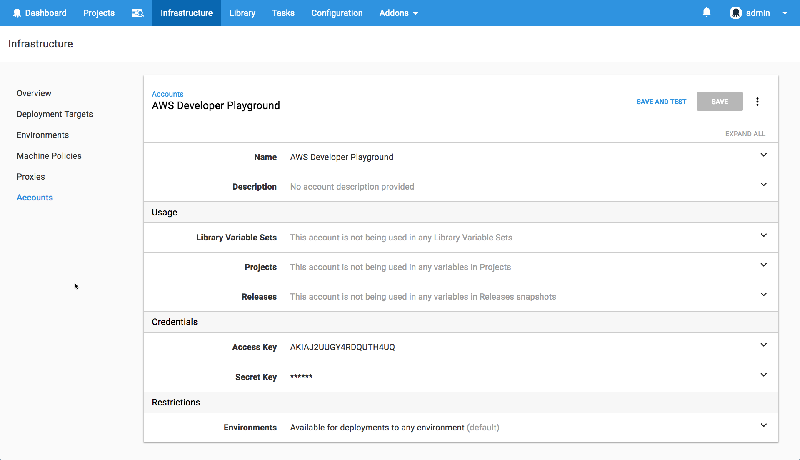

Octopus Deploy integrates with popular cloud services like [Amazon Web Services (AWS)](https://aws.amazon.com/) and [Microsoft's Azure platform](https://azure.microsoft.com/) to make it easy to deploy your apps safely and securely. Integrating with Amazon is as simple as adding your AWS Access Key and Secret Key, however, Azure requires a few more details and it's not immediately obvious how to set things up. This is enabled by Azure Active Directory (AD) registered applications (or application registrations) but it can be tricky to setup so we're going to take a deep dive and walk through the process.

Azure Accounts in Octopus require four values which are used to authenticate with Azure and interact with it securely.

* Azure Subscription ID
* Azure AD Tenant ID
* Azure AD Registered Application ID
* Azure AD Registered Application Password/Key

The first three values are GUIDs, and the final one is a password. These values can be found in the Azure Portal or via Powershell. Personally, I never remember where all the values are found so we recorded a video to show help everyone!

## Octopus Deep Dive

<iframe width="560" height="315" src="https://www.youtube.com/embed/KnN-ahD6nN4" frameborder="0" allow="autoplay; encrypted-media" allowfullscreen></iframe>

## Further reading

Checkout our [Azure docs](https://octopus.com/docs/infrastructure/azure) for further information include step by step instructions on how to [create Octopus Azure accounts](https://octopus.com/docs/infrastructure/azure/creating-an-azure-account/creating-an-azure-service-principal-account) and other important issues like [security and permisisons](https://octopus.com/docs/infrastructure/azure/creating-an-azure-account/creating-an-azure-service-principal-account#note-on-least-privilege).

## Wrap-up

Now you're good to go. You can enter all these values into Octopus or use them in your own application to integrate with Azure. If you've ever struggled to add an Octopus Azure account, I hope this helps! If there's another part of the Octopus that is puzzling you, let us know in the comments and we'll take a deeper look.

Don't forget to subscribe to our [YouTube](https://youtube.com/octopusdeploy) channel as we're adding new videos regularly. Happy deployments! :)
