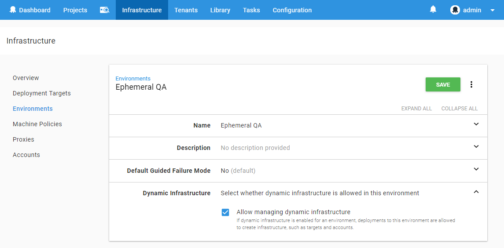
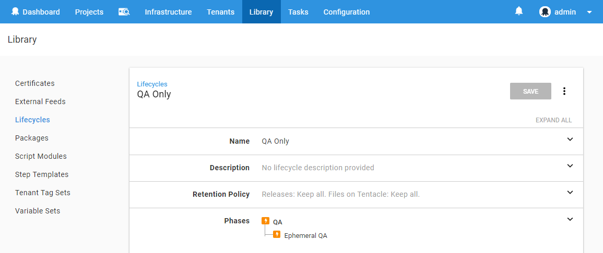
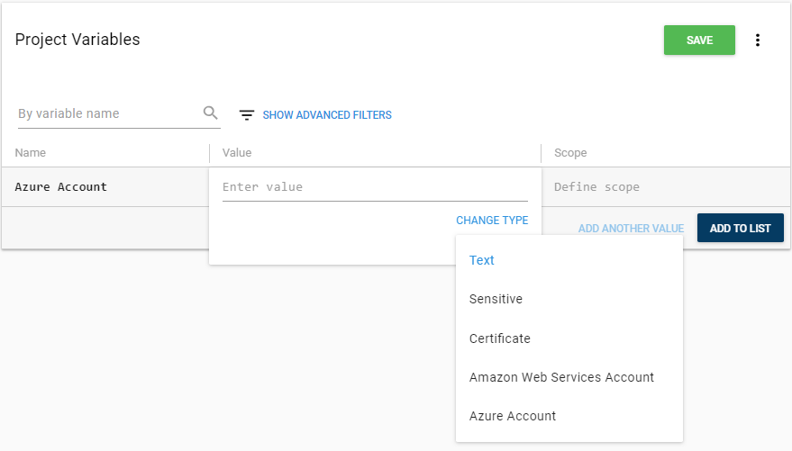
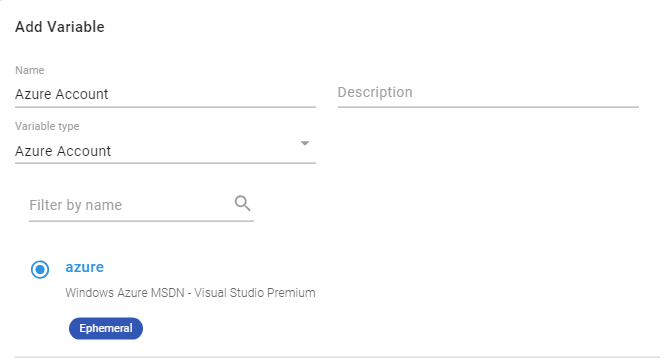

In 2018.5, we have introduced the ability to manage your Azure deployment targets from within your deployment process. 
Using the Azure Powershell modules you can create Resource Groups and Web Apps within your Azure subscription, but you could deploy your applications to them without some heavy lifting within Octopus.

In this blog post, I will walk-through a basic example of how you could manage a Web Application in QA environment, hosted in Azure, from setup to tear down.

## Setup

First we need to configure Octopus to manage our new project.

### Create an Environment and configure dynamic infrastructure

By default, an environment is not allowed to have dynamic targets create or removed, so you will need to turn this on by editing the Environment settings.



### Create an Azure Account

See the documentation on [Creating an Azure Service Principal Account](https://octopus.com/docs/infrastructure/azure/creating-an-azure-account/creating-an-azure-service-principal-account) for instructions.

### Create a new lifecycle

So as to simplify our QA environment, and prevent it from deploying to other environments (such as Production), we can create a new [Lifecycle](https://octopus.com/docs/infrastructure/lifecycles) that only allows deployments to our new environment.



### Create a Script Module

You will quite often need reusable scripts to include various projects, to generate a unique site name put the following PowerShell function in a **Script Module**, availble under the **Library** section:

```powershell
function GetSiteName($prefix) 
{
	# Octopus variables
	$environment = $OctopusParameters['Octopus.Environment.Name'].Replace(" ", "").Replace(".", "-")
	$tenant = $OctopusParameters['Octopus.Deployment.Tenant.Name'].Replace(".", "-")
	
	# A unique name based on the Octopus environment, release, and tenant
	$uniqueName = "$prefix-$environment-$tenant"
    
    return $uniqueName
}
```

### Create a Variable Set

Since we will need a common variable value between the setup and tear-down projects, we can put that in a **Variable Set**, also available under the **Library** section.

Add a new **Variable Set**, and create a single variable:


### Create the Setup project

The first project we need to create is the one that will create all the infrastructure and deploy the application.

Create a new project and do some initial setup:

 - Under *Process*, change the *Lifecycle* from the *Default* to the new lifecycle created earlier.
 - Under *Variables* -> *Library Sets*, click *INCLUDE LIBRARY VARIABLE SETS*, and select the **Variable Set** created in the previous step.
 - Under *Settings*:
   - change *Deployment Targets* to *Allow deployments to be created when there are no deployment targets*
   - change *Skip Deployment Targets* to *Skip deployment targets if they are or become unavailble*. This is optional and depends on your requirements, please see the [documentation](https://octopus.com/docs/deployment-patterns/elastic-and-transient-environments/deploying-to-transient-targets) for more information.

When setting up the process for this project, we are going to need an **Azure Account**, there are a few different ways to provide the account to the steps:

1. Directly on the step

2. Via a project variable
    - Go to the *Variables* page, and create a new variable, set its type to *Azure Account* and then select the Azure account you created earlier.




3. Via a tenant variable, if your tenants have different Azure Accounts.

    - Go to *Variables* -> *Project Templates* and click *ADD TEMPLATE*, set the *Control Type* to *Azure Account* and give the variable a name. This variable will be given a value later when we set up *Tenants*.


Create a project
    - configure tenants setting
    
### Create tenants

In this example, I am using tenants to demonstrate how you can structure a QA environment. A tenant might represent a Tester, or a Customer.

Under the **Tenants** menu, add two new Tenants, and connect them to the **Web App Setup** project, and the environment we created earlier.


## Deploy


## Tear down

Create a project for Tear down
    - configure variable set
    - add step
    - configure scheduled deployment


Setup a process with a powershell script