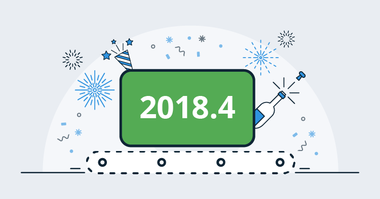
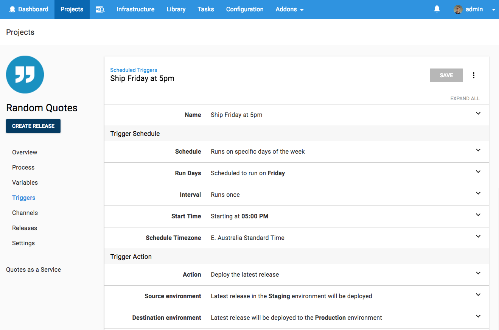
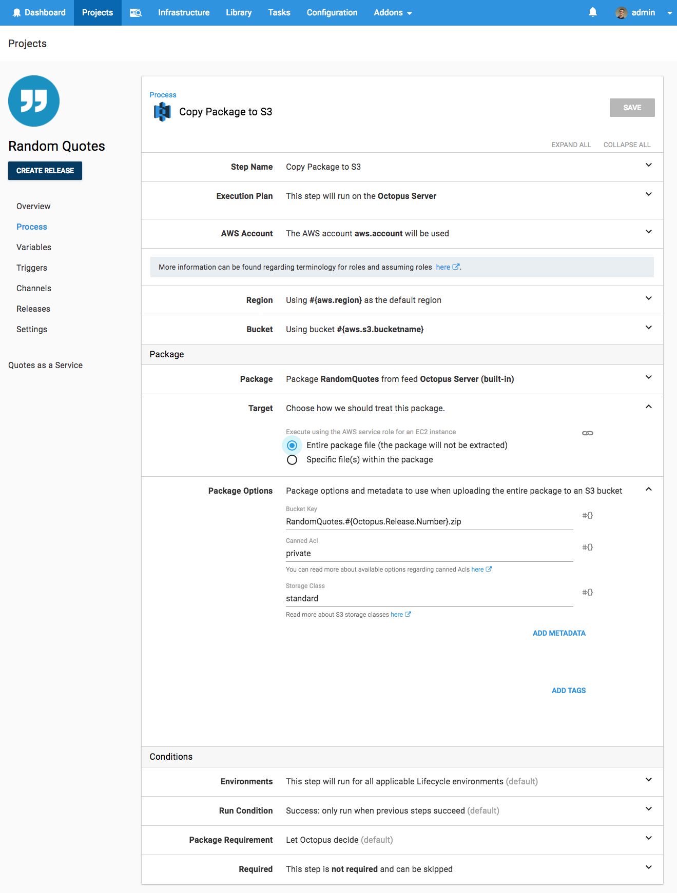
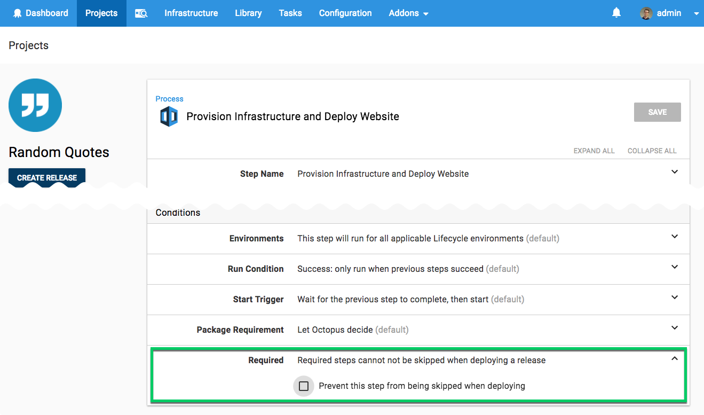

This month, our headline feature is _Recurring Scheduled Deployments_ which was one of our [most highly requested features](https://octopusdeploy.uservoice.com/forums/170787-general/suggestions/6599104-recurring-scheduled-deployments), and we’re very happy to ship it. We’re also shipping a new first-class AWS S3 step that makes working with Amazon Web Services easier, and we added the ability to set a step as required so it can't be skipped.

## In This Post

!toc

## Release Tour

<iframe width="560" height="315" src="https://www.youtube.com/embed/AR45wMd1_8o" frameborder="0" allowfullscreen></iframe>

## Recurring Scheduled Deployments

Octopus has long supported scheduled deployments. You can simply specify when to execute a deployment, but this only worked a single time. Our new recurring scheduled deployments feature lets you trigger a deployment as often as you like. This could be deploying a release to your test or QA environment for daily testing, deploying your latest stable release every Friday at 5pm, or even spinning up and tearing down virtual infrastructure on a schedule to save money when it’s not being used... like evenings and weekends.

This will become even more powerful when we ship operations focused [maintenance processes](https://github.com/OctopusDeploy/Specs/blob/master/MainenanceProcess/index.md) on a schedule. Watch this blog for more information on upcoming features.

## First-class Amazon Web Services S3 Support

We're continuing to improve our Amazon Web Services (AWS) support by adding a [first-class S3 step](https://octopus.com/docs/deployments/aws/aws-s3-create-bucket). This greatly simplifies getting packages/files into S3 buckets and working with them in the AWS eco-system.

## Required Steps

Deployment-process steps can be skipped at deploy time.  This is very convenient, but there are times when you may want to prevent specific steps from being skipped. Manual-intervention steps are an obvious example (they were in fact already unable to be skipped if responsibility was restricted to specified teams).  Other examples might be steps which send notifications or run verification processes.  
With 2018.4 you can [mark a step as required](https://octopus.com/docs/projects/steps/conditions#required), and it will not be eligible to be skipped. 

This resolves the following UserVoice requests:

- [Required Steps](https://octopusdeploy.uservoice.com/forums/170787-general/suggestions/5823326-required-steps)
- [Add permissions to stop deployers from skipping steps](https://octopusdeploy.uservoice.com/forums/170787-general/suggestions/6511629-add-permissions-to-stop-deployers-from-skipping-st) 
- [Allow to mark a deployment step as mandatory (un-skippable)](https://octopusdeploy.uservoice.com/forums/170787-general/suggestions/20592493-allow-to-mark-a-deployment-step-as-mandatory-un-s) 

## Breaking Changes

Automatically Release Creation (ARC) now enforces channel constraints when selecting packages. Because channels can constrain packages to exclude pre-release packages, we will use the channel rules as a guard against pre-release packages and enable pre-release package selection by default. This means automatic release creation can start selecting pre-release packages for releases created in a channel that has no channel rules, which differs from the existing behavior and is a breaking change.

To continue only selecting stable packages for automatic release creation, setup the channel that automatic releases are created into to limit packages to those without pre-release tags (a pre-release tag of `^$`).

## Upgrading

As usual the [steps for upgrading Octopus Deploy](https://octopus.com/docs/administration/upgrading) apply. Please see the [release notes](https://octopus.com/downloads/compare?to=2018.4.0) for further information.

## Wrap Up

That’s it for this month. Feel free leave us a comment and let us know what you think! Go forth and deploy!
