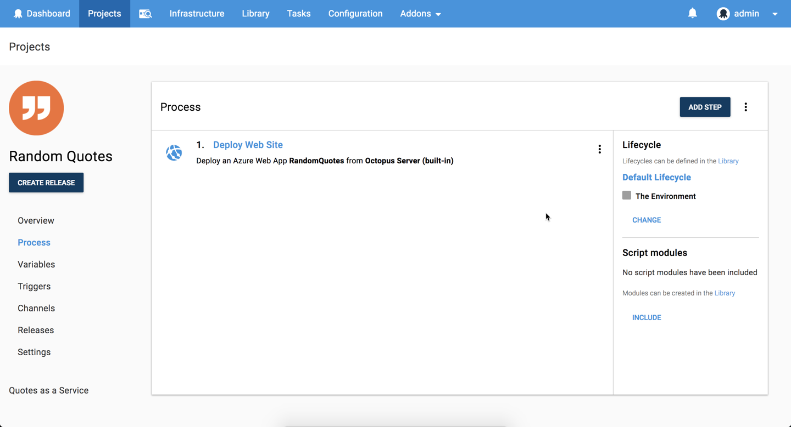
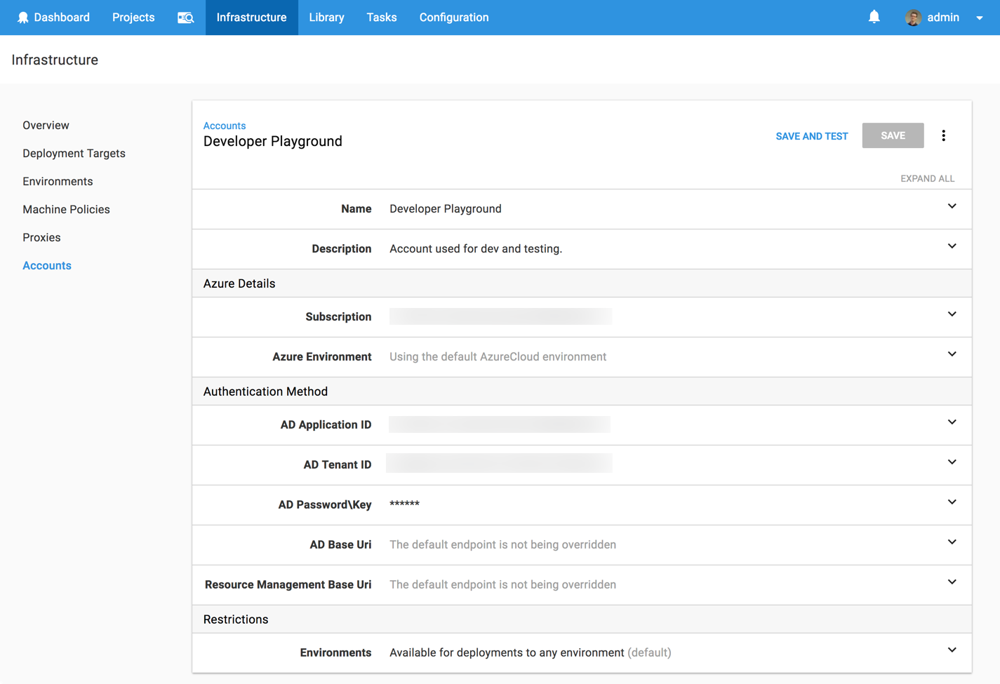

Welcome to another **Will it Deploy?** Episode where we try to automate the deployment of different technologies with Octopus Deploy. In this episode, we're trying to deploy an ASP.NET MVC 5 web app to a Microsoft Azure App Service. We also explore setting up a cloud-based delivery pipeline with [AppVeyor](https://appveyor.com) and Octopus.

NOTE: Octopus Cloud is coming soon! Head over to [Octopus Cloud](https://octopus.com/cloud) to register your interest and stay up to date with our cloud-based solution. 

<iframe width="560" height="315" src="https://www.youtube.com/embed/uIWGd7EUxXE" frameborder="0" allow="autoplay; encrypted-media" allowfullscreen></iframe>

## Problem

### Tech Stack

Our app is a random quote generation web app called [Random Quotes](https://github.com/OctopusSamples/WillItDeploy-Episode006). This is fairly simple, but it'll allow us to walk through how to automate the deployment of an ASP.NET MVC web application to Microsoft's Azure platform.

* Microsoft [ASP.NET MVC 5](https://docs.microsoft.com/en-us/aspnet/mvc/mvc5) web app.
* [NUnit](http://nunit.org/) unit testing framework.
* Build with [AppVeyor](https://appveyor.com)
* Deploy with [Octopus](https://octopus.com/cloud)

Kudos to our marketing manager [Andrew](https://twitter.com/andrewmaherbne) who has been learning to code and built the first cut of this app. Nice job! 

### Deployment Target

Microsoft's Azure Platform - [App Service](https://azure.microsoft.com/en-au/services/app-service/).

## Solution

So will it deploy? **Yes it will!** 

Our cloud-based delivery pipeline looks like the following:

Our deployment process looks like the following:

The first step is to add an Octopus Azure account, which has all the details required to enable me to connect to the Azure platform, safely and securely. It is used to authenticate with Azure when deploying or executing scripts.

Then we add the following steps to successfully deploy our app including cloud infrastructure provisioning and a zero downtime production deployment.

- Octopus **Deploy an Azure Web App** step to deploy our web application to our App Service.

This project uses the following variables to store our resource group name, website name, and app settings. Nice and simple!

This episode's [GitHub repo](https://github.com/OctopusSamples/WillItDeploy-Episode001) contains all the resources and links used in this video.

### Wrap-up

We hope you enjoyed this episode as we have many more in the works! If there's a framework or technology you'd like us to explore, let us know in the comments.

Don't forget to subscribe to our [YouTube](https://youtube.com/octopusdeploy) channel as we're adding new videos regularly. Happy deployments! :)
