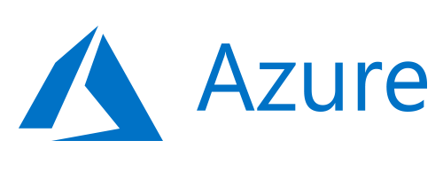
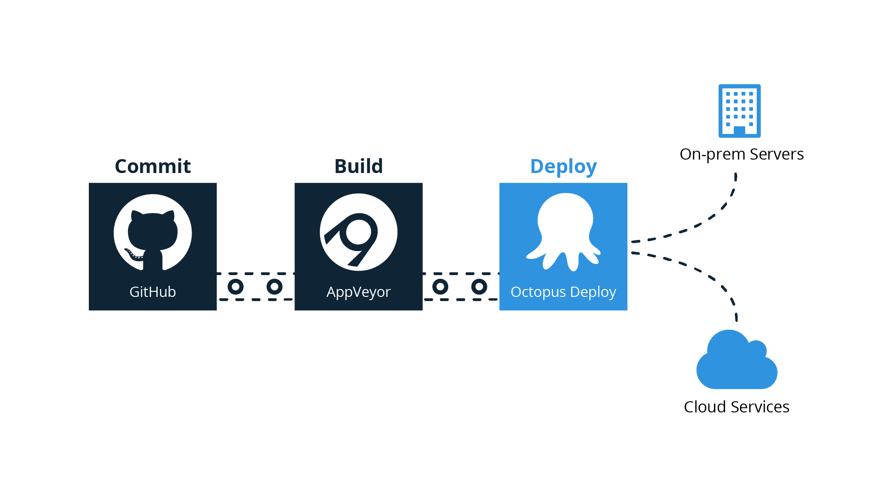
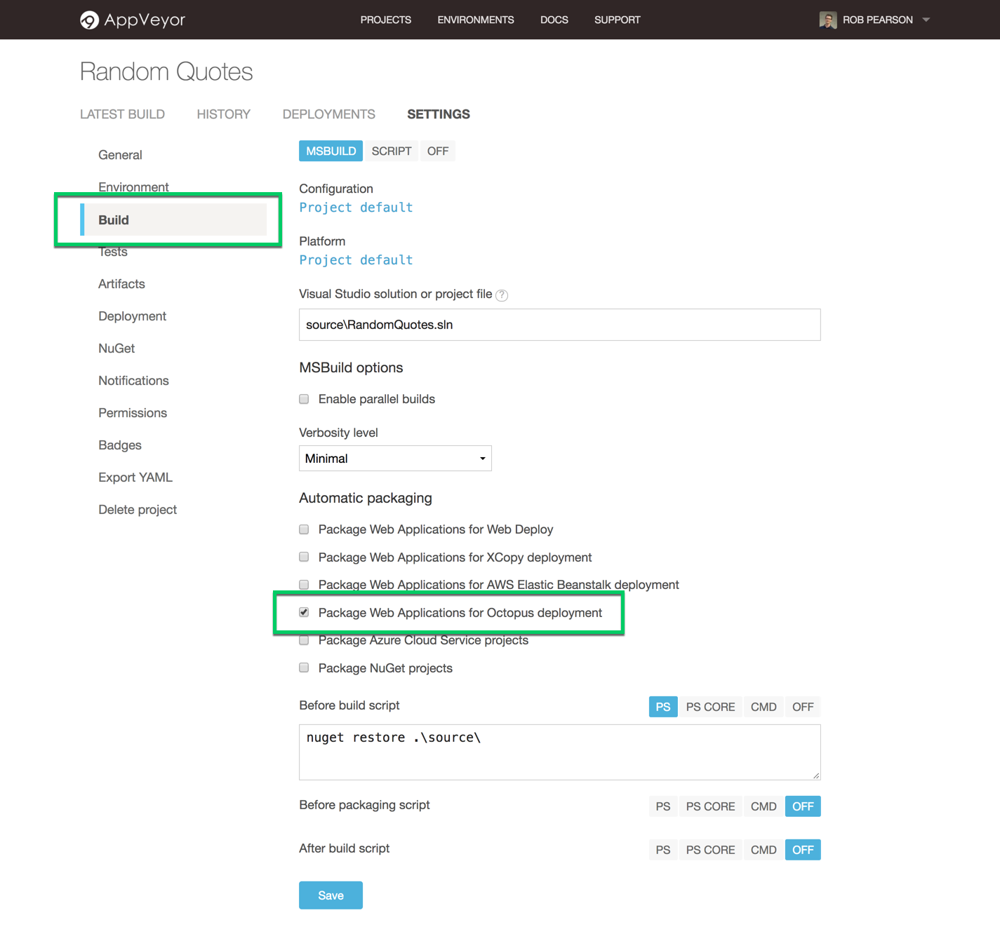
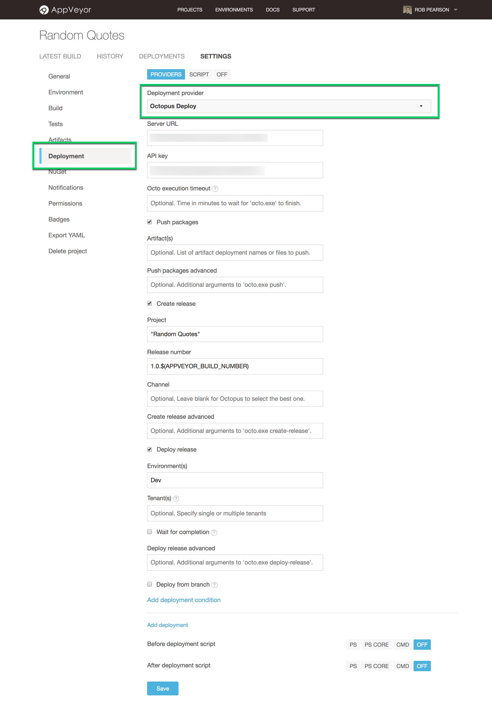
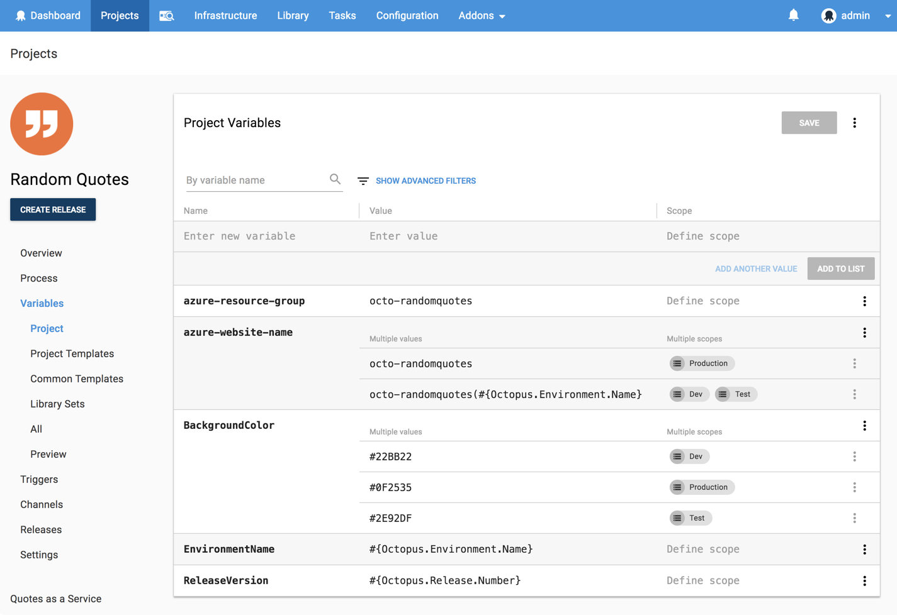

Welcome to another **Will it Deploy?** episode where we try to automate the deployment of different technologies with Octopus Deploy. In this episode, we're trying to deploy an ASP.NET MVC 5 web app to a Microsoft Azure App Service. We also explore setting up a cloud-based delivery pipeline with [AppVeyor](https://appveyor.com) and [Octopus](https://octopus.com/cloud).

<iframe width="560" height="315" src="https://www.youtube.com/embed/uIWGd7EUxXE" frameborder="0" allow="autoplay; encrypted-media" allowfullscreen></iframe>

NOTE: [Octopus Cloud](https://octopus.com/cloud) is coming soon! Register your interest and stay up to date with our cloud-based solution.

## Problem

### Tech Stack

Our app is a random quote generator web app called [Random Quotes](https://github.com/OctopusSamples/WillItDeploy-Episode006). This is fairly simple, but it'll allow us to walk through how to automate the deployment of an ASP.NET MVC web application to Microsoft's Azure platform.

* Microsoft [ASP.NET MVC 5](https://docs.microsoft.com/en-us/aspnet/mvc/mvc5) web app.
* [NUnit](http://nunit.org/) unit testing framework.
* Build with [AppVeyor](https://appveyor.com).
* Deploy with [Octopus](https://octopus.com/cloud).

Kudos to our marketing manager [Andrew](https://twitter.com/andrewmaherbne) who has been learning to code and built the first cut of this app. Nice job!

### Deployment Target

[Microsoft's Azure Platform](https://azure.microsoft.com/) - [App Service](https://azure.microsoft.com/en-us/services/app-service/).

## Solution

So will it deploy? **Yes it will!**

Our cloud-based delivery pipeline looks like the following:

We're committing our source code to [GitHub](https://github.com/OctopusSamples/WillItDeploy-Episode006), building our app automatically with [AppVeyor](https://appveyor.com), and deploying to [Microsoft Azure](https://azure.microsoft.com/en-au/services/app-service/) with [Octopus](https://octopus.com/cloud).

It's quick and easy to integrate AppVeyor with Octopus. We simply selected the 'Package Web Applications for Octopus deploy' build option and configured an 'Octopus Deploy' deployment provider.

Our deployment process looks like the following:

We have a single step in our deployment process which is an Octopus **Deploy an Azure Web App** step to deploy our web application to our App Service. It's very simple to configure and we mostly use the defaults. We did turn on the Configuration Variable replacement feature update our `web.config` file during deployments.

This project uses the following variables to store our Azure resource group name, website name, as well as a handful of other application settings like our banner background color, release version and environment name. This is simple but it illustrates how we can change our configuration as our web app is promoted through environments.

This episode's [GitHub repo](https://github.com/OctopusSamples/WillItDeploy-Episode006) contains all the resources and links used in this video.

### Wrap-up

We hope you enjoyed this episode as we have many more in the works! If there's a framework or technology you'd like us to explore, let us know in the comments.

Don't forget to subscribe to our [YouTube](https://youtube.com/octopusdeploy) channel as we're adding new videos regularly. Happy deployments! :)
