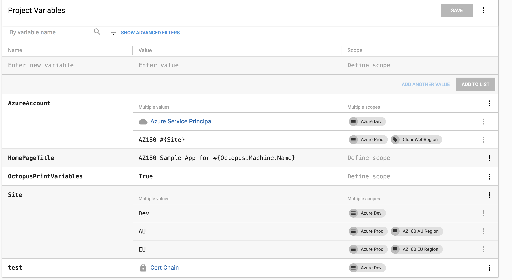

In 2018.5, we have introduced the ability to manage your Azure deployment targets from within your deployment process. 
Using the Azure Powershell modules you can create Resource Groups and Web Apps within your Azure subscription, but you could not deploy your applications to them without some heavy lifting within Octopus.

In this blog post, I will walk-through a basic example of how you could manage a Web Application in QA environment, hosted in Azure, from setup to tear down, including the resources you need in Azure and Octopus to make it all happen.

Obviously, you will need an application to deploy, but I will leave that as an [exercise for the reader](https://octopus.com/blog/deploying-an-octopus-pi#build-the-application).

## Setup

First, we need to configure Octopus to manage our new project.

### Create an Azure Account

See the documentation on [Creating an Azure Service Principal Account](https://octopus.com/docs/infrastructure/azure/creating-an-azure-account/creating-an-azure-service-principal-account) for instructions.

### Create an Environment and configure dynamic infrastructure

By default, an environment is not allowed to have dynamic targets create or removed, so you will need to turn this on by editing the Environment settings.


### Create a new lifecycle

So as to simplify our QA deployment, and prevent it from deploying to other environments (such as Production), we can create a new [Lifecycle](https://octopus.com/docs/infrastructure/lifecycles) that only allows deployments to our new environment.


### Create a Script Module

You will quite often need reusable scripts to include various projects, to generate a unique site name put the following PowerShell function in a **Script Module**, available under the **Library** section:

```powershell
function GetSiteName($prefix) 
{
    # Octopus variables
    $environment = $OctopusParameters['Octopus.Environment.Name'].Replace(" ", "").Replace(".", "-")
    $tenant = $OctopusParameters['Octopus.Deployment.Tenant.Name'].Replace(".", "-")

    # A unique name based on the Octopus environment, release, and tenant
    $uniqueName = "$prefix-$environment-$tenant"

    return $uniqueName
}
```

### Create a Variable Set

Since we will need a common variable value between the setup and tear-down projects, we can put that in a **Variable Set**, also available under the **Library** section.

Add a new **Variable Set**, and create a single variable:


### Create the Setup project

The first project we need to create is the one that will create all the infrastructure and deploy the application.

Create a new project and do some initial setup:

 - Under *Process*, change the *Lifecycle* from the *Default* to the new lifecycle created earlier.
 - Under *Variables* -> *Library Sets*, click *INCLUDE LIBRARY VARIABLE SETS*, and select the **Variable Set** created in the previous step.
 - Under *Settings*:
   - change *Deployment Targets* to *Allow deployments to be created when there are no deployment targets*
   - change *Skip Deployment Targets* to *Skip deployment targets if they are or become unavailable*. This is optional and depends on your requirements, please see the [documentation](https://octopus.com/docs/deployment-patterns/elastic-and-transient-environments/deploying-to-transient-targets) for more information.

When setting up the process for this project, we are going to need an **Azure Account**, there are a few different ways to provide the account to the steps:

1. Directly on the step

2. Via a project variable
    - Go to the *Variables* page, and create a new variable, set its type to *Azure Account* and then select the Azure account you created earlier.


3. Via a tenant variable, if your tenants have different Azure Accounts.

    - Go to *Variables* -> *Project Templates* and click *ADD TEMPLATE*, set the *Control Type* to *Azure Account* and give the variable a name. This variable will be given a value later when we set up *Tenants*.

### The Deployment Process

Let's get a deployment process configured.


The first step here is an **Azure PowerShell Script**. The step should be configured to run on the Octopus Server, it doesn't require a role at this point.

The script will query Azure to check for the existence of the target Resource Group and create the Resource Group, the App Service Plan, and the Web App if required. We are also setting an expiry date using a *Tag* on the Resource Group, which will be used later in the teardown project.

The last line in the script is the magic that allows our next step to work, it will create a new **Azure Web App Target** in the Octopus server and assign it a role of *QATest*. The last parameter will allow the command to create or update an existing target that matches on name.

*** TODO *** insert final script here

The next step is a **Deploy an Azure Web App** step. This is where we will deploy the application to the target we created in the previous step. You will need to set the target roles to be *QATest*, it will not be available in the list, you will need to type it in and select *Add*.

:::warn
Improved management for *Roles* is coming in the future, but for the moment you will need to type the role name manually
:::

The last step is a notification step, which could be Slack, email or something else.

In my Slack notification step I set the following custom settings:

*Title* is `Deployment to #{Octopus.Deployment.Tenant.Name}`

*Message* is `#{Octopus.Project.Name} release #{Octopus.Release.Number} to #{Octopus.Environment.Name} for #{Octopus.Deployment.Tenant.Name} Deployed #{Octopus.Action[Setup Azure Web App].Output.Action} to #{Octopus.Action[Setup Azure Web App].Output.Url}`.

The `Url` and `Action` output parameters were created in the first script step.

Create a project
    - configure tenants setting
    
### Create tenants

In this example, I am using tenants to demonstrate how you can structure a QA environment. A tenant might represent a Tester or a Customer.

Under the **Tenants** menu, add two new Tenants and connect them to the **Web App Setup** project, and the environment we created earlier.

For each tenant, you will need to click **CONNECT PROJECT** and select the setup project we just created. If you have chosen to create your Azure account variable as a *Project Template* you will need to provide the actual Azure account at this step. This allows you to provide different accounts for each tenant if required.


## Teardown

All of those Azure resources are potentially costing you money, even when no one is using them, so we can use a second project to tear down the applications from both Azure and Octopus.

Create a new project and do some setup configuration in *Settings*:

- change *Deployment Targets* to *Allow deployments to be created when there are no deployment targets*

- change *Skip Deployment Targets* to *Skip deployment targets if they are or become unavailable*.


Under the *Variables* -> *Library Sets* include the library variable set we created earlier. This will be used in our tear-down script

Using another one of the new Octopus Infrastructure Cmdlets `Remove-OctopusTarget`, we can tear down the Octopus targets and the Azure resources in a single *Azure PowerShell Script* step.

The script uses the Expiry tag on the Azure resource group to determine which pieces to remove.

```powershell
$date = [System.DateTime]::Today
# find all resource groups marked for expiry, with a name starting with #{Prefix}
Write-Host "Checking for resources expiring on or before $date"
$resourceGroups = Get-AzureRmResourceGroup | `
                        Where { $_.ResourceGroupName.StartsWith($Prefix) `
                                -and $_.Tags -ne $null `
                                -and $_.Tags.ContainsKey("Expiry") `
                                -and [DateTime]::Parse($_.Tags["Expiry"]) -ile $date }

Write-Host "Found $($resourceGroups.Count) resource groups"

foreach ($rg in $resourceGroups) {
  Write-Host "Removing $($rg.ResourceGroupName)"
  Remove-AzureRmResourceGroup -Name $rg.ResourceGroupName -Force
  Remove-OctopusTarget -targetIdOrName $rg.ResourceGroupName
}
```

After running the teardown project, all resource groups with an Expiry tag of the execution date or earlier will be removed and the corresponding Octopus *Azure Web App* target will be removed as well.

Using the recently introduced [Scheduled Project Triggers](https://octopus.com/docs/deployment-process/project-triggers/scheduled-project-trigger) you can trigger the teardown script to be executed nightly or weekly.

## Azure Resource Manager Templates and Cloud Regions

With all targets added in `2018.5`, Cloud Regions still have a role in scoping your deployment scripts to support a [Multi-region Deployment Pattern](https://octopus.com/docs/deployment-patterns/multi-region-deployment-pattern). You can incorporate 
Run Template against `CloudWebRegion` roles
Run app deployment against `CloudWebApp` roles

```
{
    "$schema": "https://schema.management.azure.com/schemas/2015-01-01/deploymentTemplate.json#",
    "contentVersion": "1.0.0.0",
    "parameters": {
        "site_name": {
            "defaultValue": "AZ180",
            "type": "String"
        },
        "config_web_name": {
            "defaultValue": "web",
            "type": "String"
        },
        "hostNameBindings_az180.azurewebsites.net_name": {
            "defaultValue": "az180.azurewebsites.net",
            "type": "String"
        },
        "sites_AZ180_serverFarmId": {
            "defaultValue": "/subscriptions/95bf77d2-64b1-4ed2-9de1-b5451e3881f5/resourceGroups/ShannonsResourceGroup/providers/Microsoft.Web/serverfarms/Default1",
            "type": "String"
        }
    },
    "variables": {},
    "resources": [
        {
            "comments": "Generalized from resource: '/subscriptions/95bf77d2-64b1-4ed2-9de1-b5451e3881f5/resourceGroups/AZ180ResourceGroup/providers/Microsoft.Web/sites/AZ180'.",
            "type": "Microsoft.Web/sites",
            "kind": "app",
            "name": "[parameters('site_name')]",
            "apiVersion": "2016-08-01",
            "location": "South Central US",
            "tags": {
                "hidden-related:/subscriptions/95bf77d2-64b1-4ed2-9de1-b5451e3881f5/resourcegroups/ShannonsResourceGroup/providers/Microsoft.Web/serverfarms/Default1": "empty"
            },
            "scale": null,
            "properties": {
                "enabled": true,
                "hostNameSslStates": [
                    {
                        "name": "[concat(parameters('site_name'),'az180.azurewebsites.net')]",
                        "sslState": "Disabled",
                        "virtualIP": null,
                        "thumbprint": null,
                        "toUpdate": null,
                        "hostType": "Standard"
                    },
                    {
                        "name": "[concat(parameters('site_name'),'az180.scm.azurewebsites.net')]",
                        "sslState": "Disabled",
                        "virtualIP": null,
                        "thumbprint": null,
                        "toUpdate": null,
                        "hostType": "Repository"
                    }
                ],
                "serverFarmId": "[parameters('sites_AZ180_serverFarmId')]",
                "reserved": false,
                "siteConfig": null,
                "scmSiteAlsoStopped": false,
                "hostingEnvironmentProfile": null,
                "clientAffinityEnabled": true,
                "clientCertEnabled": false,
                "hostNamesDisabled": false,
                "containerSize": 0,
                "dailyMemoryTimeQuota": 0,
                "cloningInfo": null
            },
            "dependsOn": []
        },
        {
            "comments": "Generalized from resource: '/subscriptions/95bf77d2-64b1-4ed2-9de1-b5451e3881f5/resourceGroups/AZ180ResourceGroup/providers/Microsoft.Web/sites/AZ180/config/web'.",
            "type": "Microsoft.Web/sites/config",
            "name": "[concat(parameters('site_name'), '/', parameters('config_web_name'))]",
            "apiVersion": "2016-08-01",
            "location": "South Central US",
            "tags": {
                "hidden-related:/subscriptions/95bf77d2-64b1-4ed2-9de1-b5451e3881f5/resourcegroups/ShannonsResourceGroup/providers/Microsoft.Web/serverfarms/Default1": "empty"
            },
            "scale": null,
            "properties": {
                "numberOfWorkers": 1,
                "defaultDocuments": [
                    "Default.htm",
                    "Default.html",
                    "Default.asp",
                    "index.htm",
                    "index.html",
                    "iisstart.htm",
                    "default.aspx",
                    "index.php",
                    "hostingstart.html"
                ],
                "netFrameworkVersion": "v4.0",
                "phpVersion": "5.6",
                "pythonVersion": "",
                "nodeVersion": "",
                "linuxFxVersion": "",
                "requestTracingEnabled": false,
                "remoteDebuggingEnabled": false,
                "remoteDebuggingVersion": null,
                "httpLoggingEnabled": false,
                "logsDirectorySizeLimit": 35,
                "detailedErrorLoggingEnabled": false,
                "publishingUsername": "$AZ180",
                "publishingPassword": null,
                "appSettings": null,
                "metadata": null,
                "connectionStrings": null,
                "machineKey": null,
                "handlerMappings": null,
                "documentRoot": null,
                "scmType": "None",
                "use32BitWorkerProcess": true,
                "webSocketsEnabled": false,
                "alwaysOn": false,
                "javaVersion": null,
                "javaContainer": null,
                "javaContainerVersion": null,
                "appCommandLine": "",
                "managedPipelineMode": "Integrated",
                "virtualApplications": [
                    {
                        "virtualPath": "/",
                        "physicalPath": "site\\wwwroot",
                        "preloadEnabled": false,
                        "virtualDirectories": null
                    }
                ],
                "winAuthAdminState": 0,
                "winAuthTenantState": 0,
                "customAppPoolIdentityAdminState": false,
                "customAppPoolIdentityTenantState": false,
                "runtimeADUser": null,
                "runtimeADUserPassword": null,
                "loadBalancing": "LeastRequests",
                "routingRules": [],
                "experiments": {
                    "rampUpRules": []
                },
                "limits": null,
                "autoHealEnabled": false,
                "autoHealRules": null,
                "tracingOptions": null,
                "vnetName": "",
                "siteAuthEnabled": false,
                "siteAuthSettings": {
                    "enabled": null,
                    "unauthenticatedClientAction": null,
                    "tokenStoreEnabled": null,
                    "allowedExternalRedirectUrls": null,
                    "defaultProvider": null,
                    "clientId": null,
                    "clientSecret": null,
                    "issuer": null,
                    "allowedAudiences": null,
                    "additionalLoginParams": null,
                    "isAadAutoProvisioned": false,
                    "googleClientId": null,
                    "googleClientSecret": null,
                    "googleOAuthScopes": null,
                    "facebookAppId": null,
                    "facebookAppSecret": null,
                    "facebookOAuthScopes": null,
                    "twitterConsumerKey": null,
                    "twitterConsumerSecret": null,
                    "microsoftAccountClientId": null,
                    "microsoftAccountClientSecret": null,
                    "microsoftAccountOAuthScopes": null
                },
                "cors": null,
                "push": null,
                "apiDefinition": null,
                "autoSwapSlotName": null,
                "localMySqlEnabled": false,
                "managedServiceIdentityId": null,
                "xManagedServiceIdentityId": null,
                "ipSecurityRestrictions": null,
                "http20Enabled": false,
                "minTlsVersion": "1.0"
            },
            "dependsOn": [
                "[resourceId('Microsoft.Web/sites', parameters('site_name'))]"
            ]
        },
        {
            "comments": "Generalized from resource: '/subscriptions/95bf77d2-64b1-4ed2-9de1-b5451e3881f5/resourceGroups/AZ180ResourceGroup/providers/Microsoft.Web/sites/AZ180/hostNameBindings/az180.azurewebsites.net'.",
            "type": "Microsoft.Web/sites/hostNameBindings",
            "name": "[concat(parameters('site_name'), '/', parameters('hostNameBindings_az180.azurewebsites.net_name'))]",
            "apiVersion": "2016-08-01",
            "location": "South Central US",
            "scale": null,
            "properties": {
                "siteName": "AZ180",
                "domainId": null,
                "hostNameType": "Verified"
            },
            "dependsOn": [
                "[resourceId('Microsoft.Web/sites', parameters('site_name'))]"
            ]
        }
    ]
}
```


Post Deployment Script
```
New-OctopusAzureWebAppTarget -name “WebAppTarget-$OctopusMachineName” -azureWebApp "AZ180#{Site}" -azureResourceGroupName "AZ180ResourceGroup" -octopusAccountIdOrName $AzureAccount -octopusRoles “CloudWebApp”
```

Variables:

