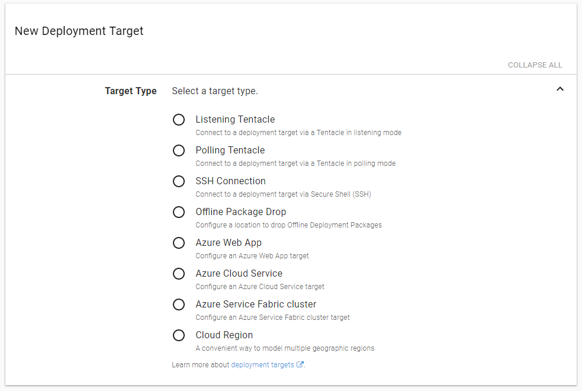
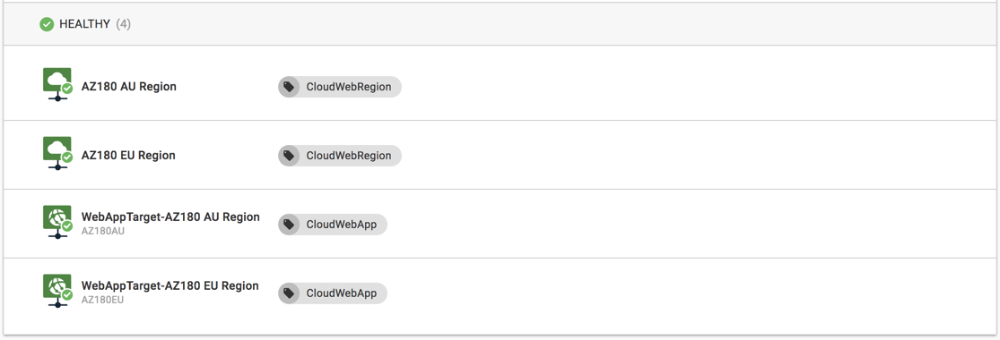

This month, we shipped the next generation of our Azure support. Octopus `2018.5` bundles the latest Azure SDK and Powershell Modules, introduces new deployment targets for Azure Web Apps, Cloud Services and Service Fabric Clusters, plus adds the ability to dynamically manage them in Octopus using PowerShell Cmdlets.

## In This Post

!toc

## Release Tour

<iframe width="560" height="315" src="https://www.youtube.com/embed/raepkFD7kx8" frameborder="0" allowfullscreen></iframe>

## PaaS Targets for Azure



This release reintroduces both **Azure Web Apps** and **Azure Cloud Service** modeled as deployment targets, and introduces **Azure Service Fabric Clusters** to the deployment target family. This brings improved visibility of your infrastructure and environments, enables you to easily deploy to multiple targets/regions and unlocks new operations focused tasks like service health checks etc. 



For more information on the PaaS Targets, have a read of [blog post](https://octopus.com/blog/paas-targets) introducing the ideas. 

## Managing Octopus Infrastructure

One of the problems with our initial implementation of **Azure Web App** Targets was that there was no easy path to dynamically create them as needed. You could easily create the Azure Web App, but Octopus required manual steps to represent them in Octopus.

Now you can create those new **PaaS targets** as easily as Azure resources, using our new built-in PowerShell Cmdlets.

The initial release of these cmdlets will allow you to create **Azure Accounts** and all of the new Azure deployment targets. For example:

```powershell
# Octopus variables
$serviceName = "MyNewServiceName"
$accountName = "Developer Playground"
$roleNames = "web"

# Create new target in Octopus
New-OctopusAzureWebAppTarget -Name $serviceName -AzureWebApp $serviceName -AzureResourceGroupName $serviceName -OctopusAccountIdOrName $accountName -OctopusRoles $roleNames
```

For more information, see our PaaS targets [blog post](https://octopus.com/blog/paas-targets) and our dynamic infrastructure [documentation](https://octopus.com/docs/infrastructure/dynamic-infrastructure).

## Azure Accounts as Variables

You can now set your Azure Accounts as Variables, for both project variables, tenant variables and library variable sets.

This will give you the benefit of being able to scope different accounts across each environment or tenant. You can still select an account directly on the Azure PowerShell step, just as you have always done, but now you can also bind this to an Azure Account Variable.

The properties of the Azure Account (Client Id, Subscription Id, Tenent Id etc.) will also be available to use in your scripts. Just turn on the `OctopusPrintVariables` option to [see all the variables available](https://octopus.com/docs/support/debug-problems-with-octopus-variables#DebugproblemswithOctopusvariables-Writethevariablestothedeploymentlog).

## Improved Support for PEM Certificate Chains

Previously certificate chains (i.e. a primary certificate plus one or more intermediate or authority certificates) could only be uploaded in PFX format, and PFX was the only export format which would contain the chain certificates.

As of release 2018.5: 

- PEM files containing certificate chains can be uploaded. 
- A new expanded [certificate variable](https://octopus.com/docs/deployment-process/variables/certificate-variables#expanded-properties) has been added: `MyCertificate.ChainPem` (assuming the certificate variable is named `MyCertificate`) which allows accessing the chain certificates in PEM format
- When [exporting a certificate](https://octopus.com/docs/deploying-applications/certificates/export-certificate) containing a chain, the various certificate components can be optionally included (see image below)


## Licensing Changes

Some important licensing changes are coming in Octopus 2018.5:

- Your existing Azure **steps** will not count towards your licensing limits, just like before. Nothing has changed here.
- **Azure targets** will start contributing to your licensing limits just like other targets in Octopus.
  - Any existing "old" Azure targets will be upgraded to the new format, and will begin counting towards your licensing limits.
- **Offline Drop** targets will start contributing to your licensing limits just like other targets in Octopus.

:::warning
If you make heavy use of the "old" Azure targets or Offline Drop targets, please take the time to ensure your Octopus Server will still be compliant with your license after you upgrade. Octopus will check this for you during the upgrade process. If you run into trouble, please reach out to our [support team](https://octopus.com/support) for help!
:::

## Breaking Changes

As mentioned, we have upgraded the Azure SDK library and the Azure PowerShell modules to support the latest Azure features. Most notably missing was support for nested ARM templates, which will now work out of the box.

These upgrades have also forced the minimum supported environment for Octopus Server to **Microsoft .NET 4.5.2** and **PowerShell 5.0** so you'll need to plan your upgrade accordingly. The **PowerShell 5.0** requirement is only if you are running the Azure PowerShell scripts.

Azure [recently announced](https://blogs.msdn.microsoft.com/appserviceteam/2018/03/12/deprecating-service-management-apis-support-for-azure-app-services/) that from June 30th 2018 they are retiring support for Service Management API (NOTE: Management Certificates use Service Management API). This affects deployments to Azure App Services.

**Please switch to using Service Principals for your Octopus Azure accounts**:  https://g.octopushq.com/AzureServicePrincipalAccount

## Upgrading

As usual [steps for upgrading Octopus Deploy](https://octopus.com/docs/administration/upgrading) apply. Please see the [release notes](https://octopus.com/downloads/compare?to=2018.5.0) for further information.

## Wrap up

That’s it for this month. Feel free leave us a comment and let us know what you think! Go forth and deploy!
