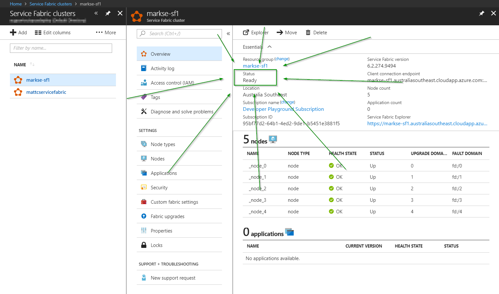
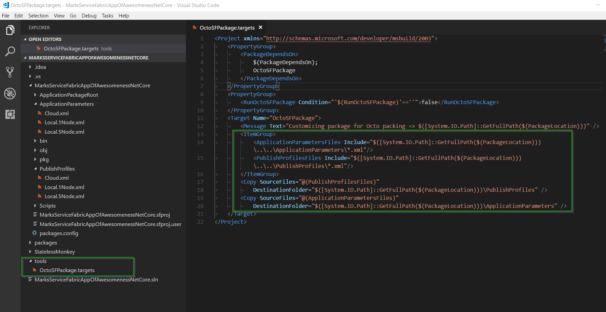
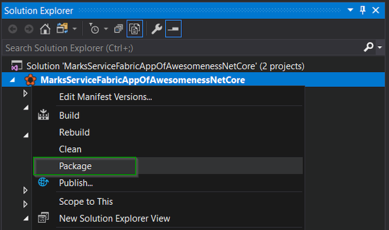
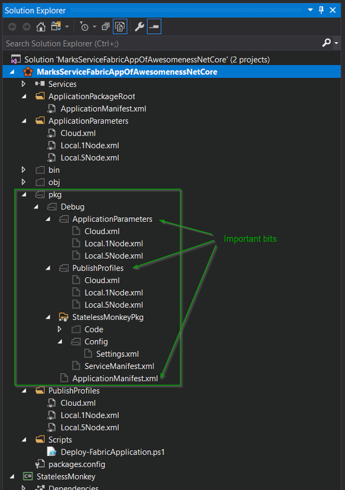
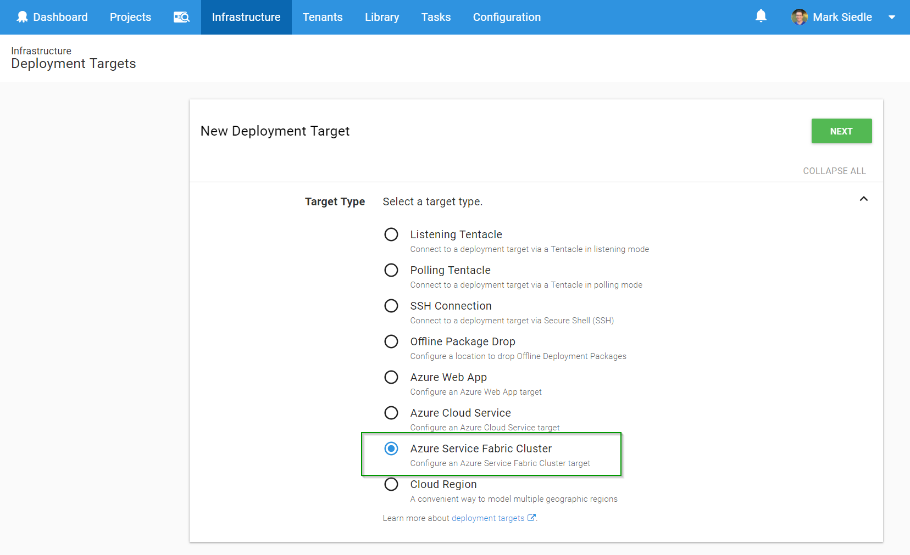
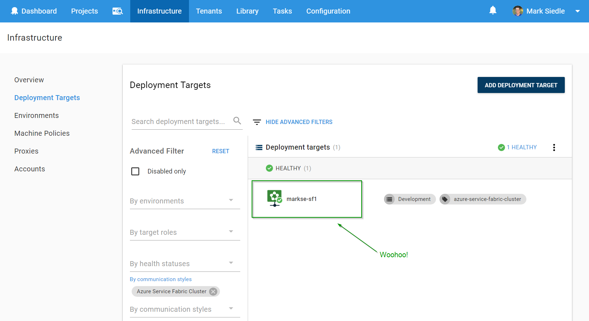
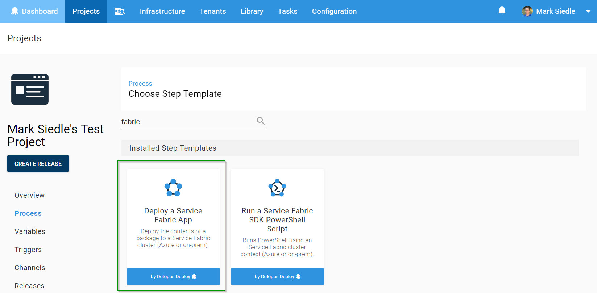
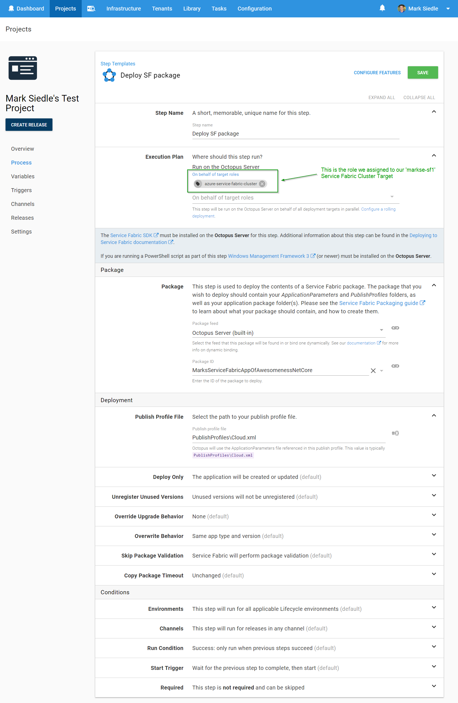
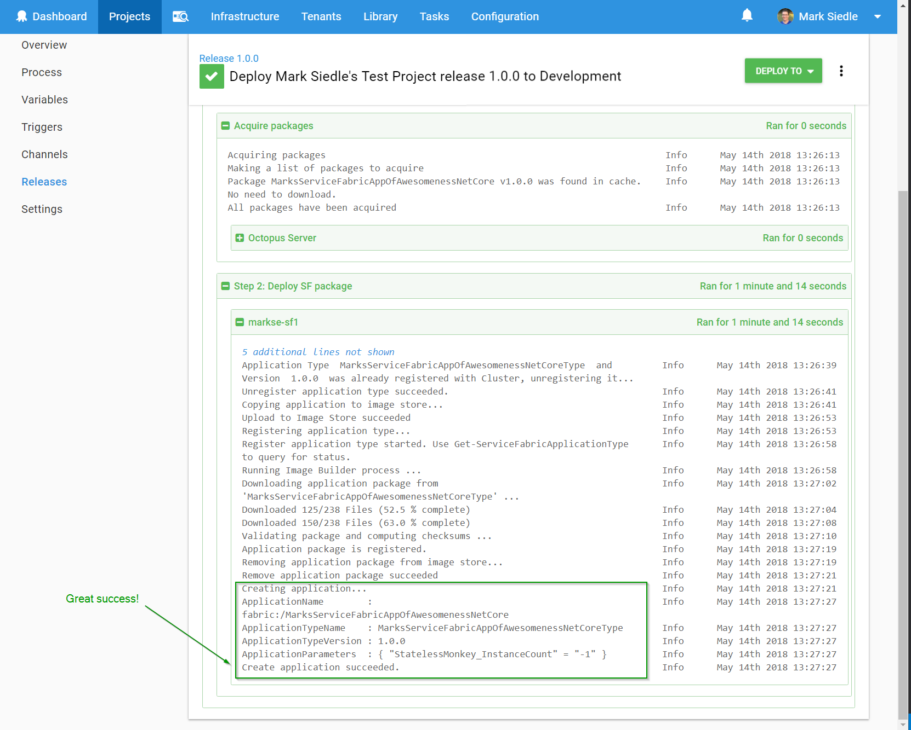

With the [release of 2018.5](https://octopus.com/blog/octopus-release-2018.5) and the introduction of [Azure Service Fabric Cluster targets](https://octopus.com/blog/paas-targets), we thought it'd be the perfect opportunity to provide a quick overview of the new Service Fabric deployment targets with Octopus Deploy.

Service Fabric can be more than a little overwhelming if you're just starting out :) Especially if you're just trying to get a high-level overview of the steps required to create a flexible/repeatable deployment scenario. This post aims to address that by showing off the new Azure Service Fabric Cluster targets in action with Octopus Deploy!

## Service Fabric and the Foreseeable Future

Azure recently [announced](https://blogs.msdn.microsoft.com/appserviceteam/2018/03/12/deprecating-service-management-apis-support-for-azure-app-services/) that from June 30th, 2018 they are retiring support for Service Management API. After this announcement (and much confusion to the community regarding the future of Cloud Services - source: me =P), it was confirmed that Cloud Services will still be supported, but there's a clear push to move people towards the newer Resource Management world. There's also statements like this to consider: _"Cloud Services is similar to Service Fabric in degree of control versus ease of use, but it's now a legacy service and Service Fabric is recommended for new development"_ ([source](https://docs.microsoft.com/en-us/azure/app-service/choose-web-site-cloud-service-vm)).

With Service Fabric being the recommended path for new cloud service development in Azure moving forward, let's see how easy it is to get setup with your own Service Fabric cluster and deploy to it.

## Creating a Service Fabric Cluster on Azure

Azure have made it really easy to get up and running securely with Service Fabric clusters. The [documentation on Service Fabric](https://docs.microsoft.com/en-us/azure/service-fabric/) and resources have come a long way in the last year or so, and it's a great resource for anyone wanting to see some quick-start guides and step-by-step tutorials.

To jump to the fun bits, you can get a walkthrough of [creating an Azure Service Fabric cluster via the Azure portal](https://docs.microsoft.com/en-us/azure/service-fabric/service-fabric-cluster-creation-via-portal) or, if scripting's more your thing, [creating an Azure Service Fabric cluster via ARM](https://docs.microsoft.com/en-us/azure/service-fabric/service-fabric-cluster-creation-via-arm).

For this example, we created our cluster manually via the Azure portal method.

### Gotcha #1: The Initial Wait Time

When spinning up Service Fabric clusters on Azure, we need to watch the status of our cluster carefully and make sure it says "Ready" before trying to connect or deploy anything.

<strike>This is worth mentioning because there is typically a long wait time after creating the cluster on Azure until all nodes have been provisioned and "baseline upgrades" of our nodes have taken place, then finally it's all ready. This process can take anywhere from 1-6 hours from what we've observed, depending on the alignment of the moon and the stars on any given day :)</strike>

Since this blog post was published, the spin-up times have improved significantly for Service Fabric clusters on Azure to be under an hour, and several times even under half an hour. But just remember to wait until the status is "Ready" before trying to connect or deploy anything ;) <i>(Edit 23rd October 2018)</i>

Once we've successfully created our cluster, it should appear like this in our Azure portal:

In this case, we've set up both [Certificate](https://octopus.com/docs/deployments/azure/service-fabric/connecting-securely-with-client-certificates) and [Azure Active Directory](https://octopus.com/docs/deployments/azure/service-fabric/connecting-securely-with-azure-active-directory) security modes on our cluster so that we can easily test connections with either security mode.

## Packaging for Service Fabric

Microsoft made it super <strike>developer</strike> demo-friendly to deploy to Service Fabric via Visual Studio.

The problem is, demo-friendly != real-world (_"Friends don't let friends right-click publish"_ amirite).

When deploying Service Fabric apps directly from Visual Studio, Microsoft only _partially_ package all of your files. During the deployment they actually _call back_ into your source code for the `PublishProfiles` and `ApplicationParameters` (so the package folder from your publish, by default, is useless to anything except Visual Studio).

To get around this, we've written specific [packaging documentation](https://octopus.com/docs/deployments/azure/service-fabric/deploying-a-package-to-a-service-fabric-cluster) to help in your real-world deployment pipeline (and not from an over-developed IDE that's sitting on your intern's laptop).

> It’s a figure of speech, Morty. They’re bureaucrats. I don’t respect them.

For this example, we've used the [Custom build targets](https://octopus.com/docs/deployments/azure/service-fabric/packaging#custom-build-targets) section of the packaging documentation to help us copy the `PublishProfiles` and `ApplicationParameters` that we need for our Service Fabric package, to ensure we have _everything_ needed for our deployment.

With our custom build targets file in place, we can now build/package our SF project:

We should then see a "pkg" folder show up with both the `PublishProfiles` and `ApplicationParameters` (thanks to the custom build targets file). This is an example of the final structure that Service Fabric needs from our package.

We can now zip that up using a SemVer-friendly package filename that can be consumed by Octopus. In this case, we've made a file called `MarksServiceFabricAppOfAwesomenessNetCore.1.0.0.zip` which contains that package output mentioned above, and we've uploaded this to our Octopus Server's [build-in package repository](https://octopus.com/docs/packaging-applications/package-repositories/pushing-packages-to-the-built-in-repository).

## Installing the Service Fabric SDK

Because Microsoft loves their GAC, before anything deployment-related can work against Service Fabric, our deployment server needs to have the [Service Fabric SDK](https://g.octopushq.com/ServiceFabricSdkDownload) installed, and PowerShell script execution needs to be enabled (full instructions can be [found here](https://octopus.com/docs/deployments/azure/service-fabric/deploying-a-package-to-a-service-fabric-cluster)).

## It's Time to Deploy

Congratulations. If you've made it this far:

- Our SF cluster is saying it's "Ready".
- We've successfully understood the packaging instructions for creating a standalone Service Fabric package.
- We've installed the Service Fabric SDK on our Octopus deployment server and set the PowerShell script execution as described above.

Now we're ready for the deployment world! (the fun bit.)

Before we continue, if you're using certificates for authentication, make sure you've [added the certificate to the Octopus Certificate Library](https://octopus.com/docs/deployments/certificates/add-certificate) in preparation for its use in your new Service Fabric Cluster Target.

### Create an Octopus Service Fabric Cluster Target

We can now reference our Service Fabric Cluster as a fully-fledged deployment target within Octopus, which will let us communicate with our cluster on Azure.

Firstly, we head over to `Infrastructure > Deployment Targets`, click `Add Deployment Target` and select `Azure Service Fabric Cluster` from the list:

Next, we fill out the details of our Service Fabric Cluster on Azure, remembering to select the right security mode as required. In this case, we're referencing the certificate that was uploaded to our Certificate Library earlier:

We hit `Save`, then we wait for a health check to complete. If all has gone well, our Octopus Server will have used the Service Fabric SDK that's installed on our server to run a health check against the SF cluster (using the security mode parameters we defined) and will have found our target healthy:

We can now reference this deployment target as part of our deployment process via roles, just like any other target!

### Deploying to our new Service Fabric Cluster Target

For this example, we've created a test project and want to **Deploy a Service Fabric Application** package, so we type in "fabric" from our list of available step templates and find the step we want:

We then need to select the role that this step will be deploying to (the role assigned to our target) and select our Service Fabric package we uploaded earlier, including the path to our publish profile:

Hit `Save`, and we're ready to deploy!

After running a deployment, we can see the Azure SF PowerShell cmdlets at work successfully deploying our package to our Azure Service Fabric Cluster:

:woohoo:

## Azure Deployment Targets

The really cool thing about these new Azure Targets is the clear separation that now exists between _infrastructure_ concerns and _deployment process_ concerns. You can now setup and monitor your Azure infrastructure independently of your project's deployment processes, which simplifies and makes it easier to reason about your deployment.

Our new Azure Targets are available from `2018.5`. For more details, you can see the full [2018.5 blog post](https://octopus.com/blog/octopus-release-2018.5) which includes an awesome walkthrough video by a real Canadian.

Please let us know if you have any thoughts/feedback and as always, happy deployments!
