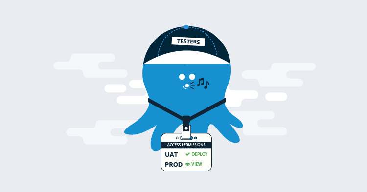
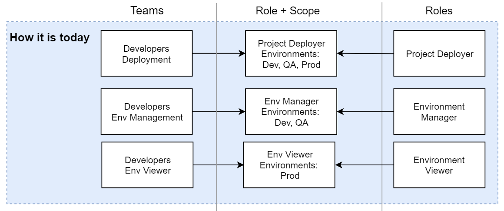
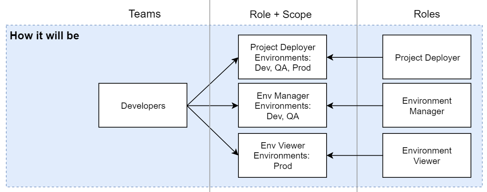
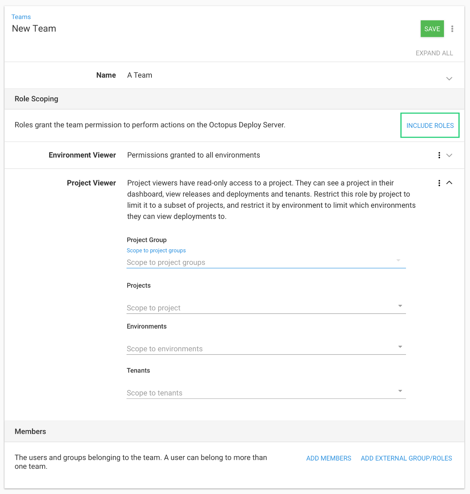

## Team Configuration Improvements

Configuring your Octopus server is not something you do all the time, the focus is on deploying your software and fine tuning your projects.  Way down on the list of interesting things to do with Octopus is configuring teams and permissions.

It's an area of Octopus that hasn't changed in a very long time, we are now making  some improvements around how teams are managed. In this post the focus will be on the structural change to teams, look out for the coming Spaces blog post where we'll be talking about teams again.

## Background

Octopus has fine-grained permissions, for instance:

 - Create a deployment
 - Edit a machine

There are over 100 hundred of these permissions and bundle them together as User Roles, which are logical sets of permissions that achieve specific tasks. For instance:

 - **Environment Manager**: for configuring machines and targets.
 - **Project Deployer**: for deploying projects.

A team is a collection of users, a set of these User Roles, and where the roles apply, such as specific environments, projects or tenants. The way it currently is leads to reasonable overhead in managing teams and permissions.

## How we configure teams now

At the moment, if you have a team of software developers who you want to deploy to the "Development" environment, but you also want them to be able to configure and manage both "Development" and "QA". You would need to create two teams.

On the first team you add the members, grant them the appropriate permissions, and restrict them to "Development" only.

On the second team you add the same members again, and grant them different permissions, and apply restrictions to both "Development" and "QA".

This leads to many arbitrary permutations of teams just to support different scoping of roles. At this point, you have two teams with the same set of users, because it was the only way to achieve different sets of permissions relating to the two environments.

Now, you want those same users to have some visibility into the "Production" environment but with read only access. Hopefully you've guessed right, you need a third team! This goes on and on.

When a new team member joins your organization, you have to add them to three teams. This is a burden to maintain, one way to simplify things was using Active Directory, but that's not for everyone. It's not hard to see why we're building these changes and improvements.

If we visualize this, it's 3 developer teams, which all have the same team members, but exist just to assist in defining the scoping.

## How you will configure teams in the future

We decided it doesn't have to be this onerous. As part of the larger set of work to deliver Spaces, we're working to make Teams easier to manage. We are making team-members the focus of teams, and letting the teams hold as many of the scoped roles as you need.

Naming things is hard, so we're sticking to what's already there and hopefully familiar, they're still called "roles". Soon you can have as many roles as you like on any given team.

If we visualize the change, we can collapse the 3 developer teams into 1 logical team that houses all our developers, and then associate as many roles and scopes as we need.

The User Interface for this will look like this.

## Pit of Success
We've spent a lot of time talking to customers about the complexities of configuring permissions. Often, when they struggling to set something up the way they want it. Our end goal with these changes and future refinements is to make sure everyone falls into the pit of success when configuring their teams and permissions.

To achieve this we'll be coming up with a few more types of roles and improving the names and descriptions to make it easier to pick the right role.

If you have made your own combinations, because what Octopus comes with wasn't right for you, we would like to hear from you. Let us know what you called the role, and some examples of the permissions you added.

## Breaking Change

We try very hard not to introduce breaking changes in our API, and in most cases we avoid it. In this case it will need to be a sharp breaking change. The team data structure is different and we decided attempting to make it partially backwards compatible could cause worse damage and confusion. You will still be able to create the same structured team with a single item that defines the restrictions, if you don't want to take advantage of this change.

If you're currently using the API to create and edit teams, after this feature is released, you will need to update any code using that API as the data structure of teams changes to support linking of multiple roles with their own scope.

## Conclusion

If you have any questions, let us know in the comments. If you have concerns about the API change, let us know via our [support channels](https://octopus.com/support)  with some details of what you're doing at the moment, and we'll walk you through how to configure your teams with the new API.

If all these technical details have you asking for more, be sure to check out this earlier post on how the [permissions work in the React UI](https://octopus.com/blog/permissions-in-react) of Octopus  and be on the lookout for more information coming soon about Spaces.

