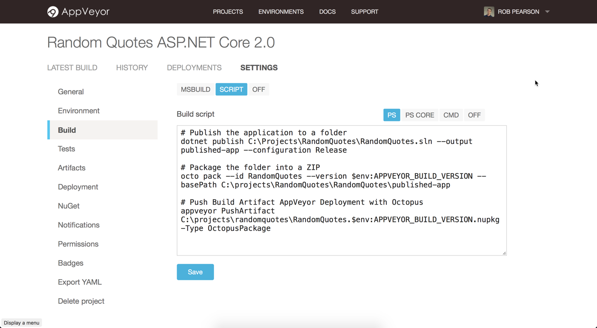
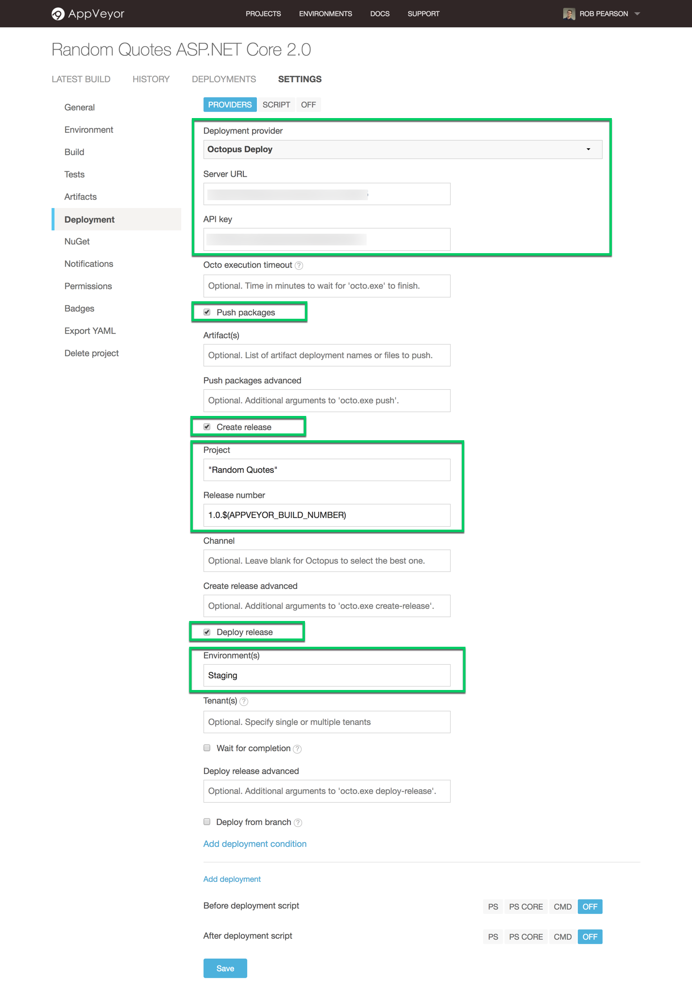
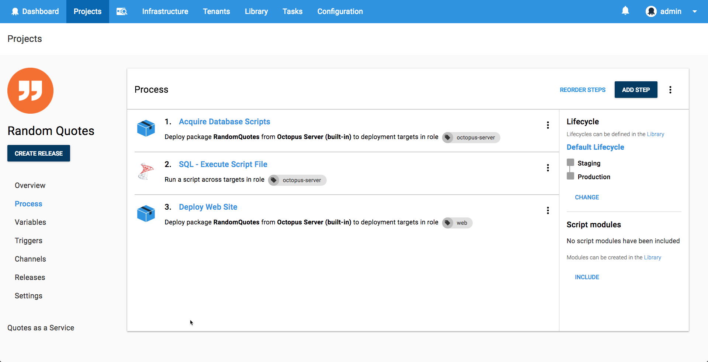
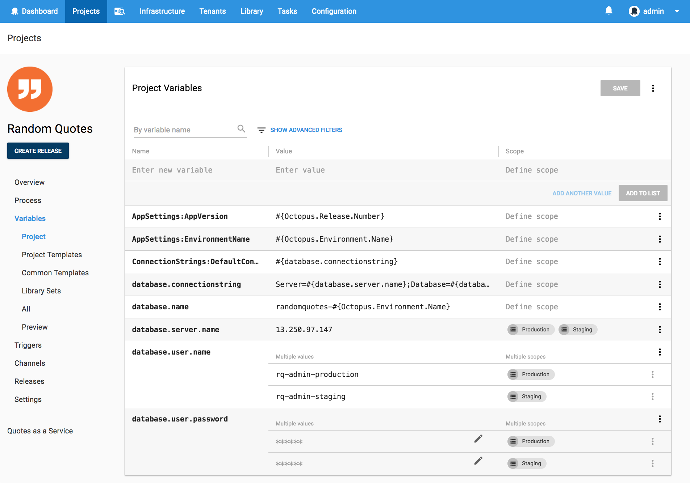

Welcome to another **Will it Deploy?** episode where we try to automate the deployment of different technologies with Octopus Deploy. In this episode, we're trying to deploy an ASP.NET Core 2.0 web app to an Amazon Web Services (AWS) Ubuntu Linux Virtual Machine (VM) with SQL Server for Linux. We also explore setting up a cloud-based delivery pipeline with [AppVeyor](https://appveyor.com) and [Octopus](https://octopus.com/cloud).

<iframe width="560" height="315" src="https://www.youtube.com/embed/KhKnb58xOWk" frameborder="0" allow="autoplay; encrypted-media" allowfullscreen></iframe>

NOTE: [Octopus Cloud](https://octopus.com/cloud) is coming soon! Register your interest and stay up to date with our cloud-based solution.

## Problem

### Tech Stack

Our app is a random quote generator web app called [Random Quotes](https://github.com/OctopusSamples/WillItDeploy-Episode007). This is fairly simple, but it'll allow us to walk through how to automate the deployment of an ASP.NET Core web application with a database to an Ubuntu Linux VM and SQL Server for Linux running in AWS.

* Microsoft [ASP.NET Core 2.0](https://docs.microsoft.com/en-us/aspnet/core/) web app.
* [Entity Framework Core 2.0](https://docs.microsoft.com/en-us/ef/core/) framework.
* Build with [AppVeyor](https://appveyor.com).
* Deploy with [Octopus](https://octopus.com/cloud).

Kudos to our marketing manager [Andrew](https://twitter.com/andrewmaherbne) who has been learning to code and built the first cut of this app. Nice job!

### Deployment Target

* [AWS EC2 Ubuntu](https://aws.amazon.com/marketplace/search/results?x=0&y=0&searchTerms=Ubuntu+Sql+Server+Linux) virtual machine.
* Microsoft [SQL Server 2017 for Linux](https://www.microsoft.com/en-au/sql-server/) database

## Solution

So will it deploy? **Yes it will!**

Our cloud-based delivery pipeline looks like the following:

We're committing our source code to [GitHub](https://github.com/OctopusSamples/WillItDeploy-Episode007), building our app automatically with [AppVeyor](https://appveyor.com), and deploying to an [AWS Ubuntu VM](https://aws.amazon.com/marketplace/search/results?x=0&y=0&searchTerms=Ubuntu+Sql+Server+Linux) with [Octopus](https://octopus.com/cloud).

It's quick and easy to integrate AppVeyor with Octopus. We're using a custom build script to build and package our application and we configure the 'Octopus Deploy' deployment provider to deploy it.

Our deployment process looks like the following:

- Octopus **Deploy a Package** step to acquire/unzip our database scripts on the Octopus Server.
- Octopus Community Contributed step template -  **[SQL - Execute Script File](https://library.octopusdeploy.com/step-template/actiontemplate-sql-execute-script-file)** to execute our Entity Framework Core migration script agaist our SQL Server database. 
- Octopus **Deploy a Package** step to deploy our ASP.NET Core web application to our Ubuntu Linux VM and configure it appropriately.

This project uses the following variables to store our app settings and database connection details.

This episode's [GitHub repo](https://github.com/OctopusSamples/WillItDeploy-Episode007) contains all the resources and links used in this video.

### Wrap-up

We hope you enjoyed this episode as we have many more in the works! If there's a framework or technology you'd like us to explore, let us know in the comments.

Don't forget to subscribe to our [YouTube](https://youtube.com/octopusdeploy) channel as we're adding new videos regularly. Happy deployments! :)

## Learn more

* Guide: [How to deploy an ASP.NET web app to Azure](https://hubs.ly/H0gBQFS0)
* [Packaging for .NETCore, on .NETCore, with Octopus](https://hubs.ly/H0gBQFW0)
* [Build Pipelines and Application Packaging With .NETCore](https://hubs.ly/H0gBQG00)
* [Setting up your own cloud-based CI/CD pipeline Using AppVeyor and Octopus to deploy an ASP.NET web app](https://hubs.ly/H0gBSf60)
* Video: [Deploying to SQL Server with Entity Framework Core](https://hubs.ly/H0gBQG20)
* Documentation: [ASP.NET Core Web Applications](https://hubs.ly/H0gBQG40)
* Documentation: [IIS Websites & Application Pools](https://hubs.ly/H0gBQG80)