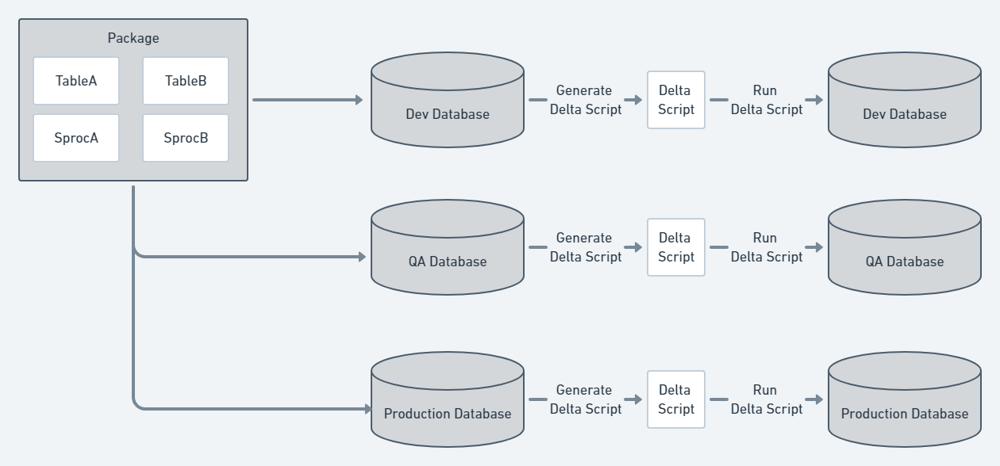
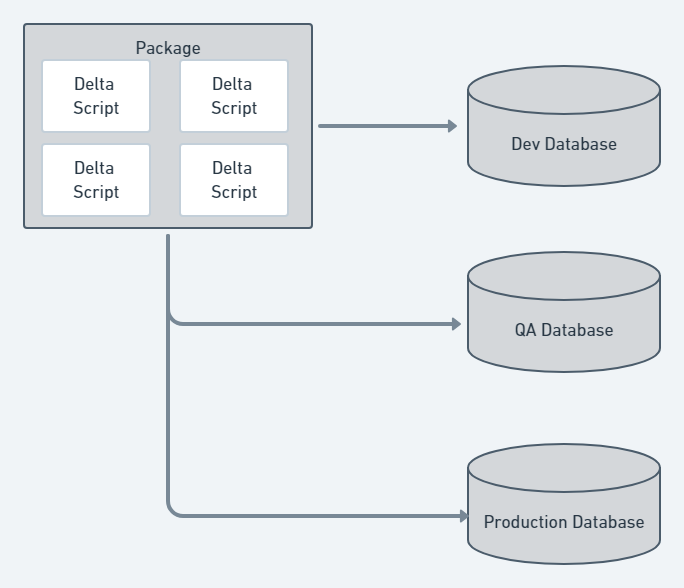
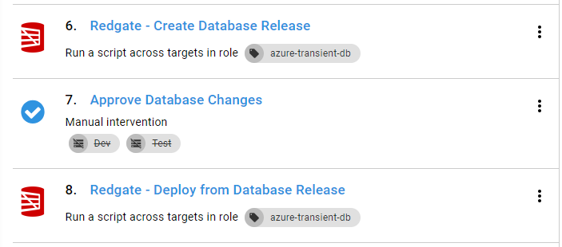
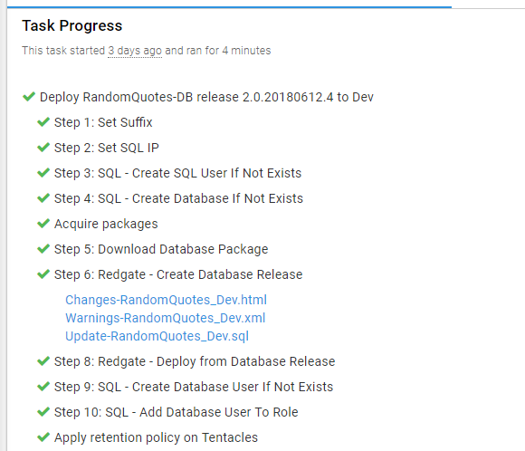

Hopefully after reading the [automated database deployments kick-off post](/blog/2018-06/automated-database-deployments-series-kick-off.md) you’re ready to dive into automated database deployments. Depending on your company, automating database deployments could be a large change, and it could cause friction.  Friction is the enemy of change; the higher the friction, the slower the adoption.  The goal of this post is to help remove that friction.  

This post demonstrates the principles with Microsoft SQL Server, but those same principles still apply to your database technology of choice.

This post discusses the following:

!toc

## Deployment approaches

Deploying databases can be very complex, and there are multiple approaches. Octopus Deploy integrates with multiple third-party tools and approaches, but this flexibility means there’s a lot to choose from, and as you evaluate third-party tools you’ll find they approach deployments in one of two ways, and each approach has its pros and cons.

### #1 Model-driven approach

With the model-driven approach, the desired state of the database is defined.  The state is saved into source control.  During the deployment, the tool compares the desired state with the deployment target and generates a delta script.  This process will be done for each environment.

The database desired state is stored as files in source control. Depending on the tool you use, the files with the desired state could be a series of create scripts, an XML file, or something completely different.  The important thing to know is the tool will be responsible for updating and maintaining those files.

#### Model-driven pros

The tooling for the model-driven approach often integrates with your IDE.  For example, Redgate’s tooling integrates with SQL Server Management Studio, and Microsoft’s SSDT tooling integrates with Visual Studio.  The changes to the schema are made using the IDE, and then the plug-in for the IDE takes over.  It runs a comparison to determine the difference between the change and what is currently in source control.  Then it makes the change to the necessary script on the file system.

All the file system interaction happens behind the scenes.  The tool keeps track of the all the changes, and this allows you to focus on making the database changes and testing them.  After you’re done testing those changes, you use the tool to update the files in source control.  

Finally, some of the tools allow you to mark a table as _static data_, and the data itself is checked into source control.  During deployments, the tool will check the data in the destination table, and if the destination table is missing data or the data is incorrect the delta script will include data change T-SQL statements.

#### Model-driven cons
A unique delta script is generated during deployment per environment.  This is because a change could have been applied to one environment (dev) but not a higher environment (pre-production or production).  That makes the tooling much more complex, and every once in a while, the tool will generate a delta script where an unexpected change is included, especially if permissions are not set correctly.

The tooling will want to control everything about the database, from the tables to the schemas to the users.  You must configure the tool to ignore certain parts of the database.

As smart as the tooling is, it has a difficult time handling more complex changes.  For example, when moving a column from one table to another the tool doesn’t know that’s your intention, and it will drop the column from the old table and create a new empty column in the new table.  The tooling will often include some sort of migration script functionality where you can write your own migration scripts, but the migration scripts have their own rules you must follow.  

The lack of control can be a burden at times.  You might end up creating a custom process that works alongside the tool.  For example, the tool might not support post deployment scripts, and in order to get that, you would have to create a post deploy folder which can be packaged and sent to Octopus.  You would then have to update your process in Octopus to look for the folder and run any scripts it finds.  It works, but now you are responsible for maintaining that process.

### #2 Change-driven approach
A change-driven approach is where all the necessary delta scripts are handwritten.  This is also known as migrations.  Those scripts are checked into source control.  During the deployment, the tool will look to see which change scripts have not been run on the destination database and run them in a specific order.  

#### Change-driven pros
With the change-driven approach, you have complete control over all the scripts.  When deploying a change you know exactly what script is going to run.  Complex changes are much easier to deal with, you just need to write the script and save it to source control.  Some migration frameworks allow you to write code to do migrations to make it easier to implement more complex changes.  In addition, it is much easier to exclude items from deployments.  Just don’t include the script for items you want to exclude.

#### Change-driven cons
The model-driven approach ensures the entire destination database matches the desired state.  Not so with the change-driven approach.  A new table could be added to the destination database outside of the process.  Everyone who has permissions to change the database has to be on board and using the process because one or two rogue developers could cause havoc.  

It is much harder to see the history of a specific object like a table or a stored procedure.  Instead of going to a single file and viewing the history you must do a search to find all the files where the object was changed.  Depending on the number of table changes, it could be easy to miss a key change and not even know it.  

Finally, a lot of developers are not expert SQL developers.  They are used to using the SQL Server Management Studio UI to create tables and indexes.  They don’t know how to write a lot of the changes being made by hand.  It takes a lot of practice to get the T-SQL syntax memorized.  In the case where the tool allows you to write code for more complex changes, there is another learning curve to understand the syntax and the rules.

### Picking an approach

The right approach is very subjective.  

The model-driven approach works best when any of the following apply:

- You’re in the early stages of a project with lots of churn on the database.
- There are multiple people/teams changing the database.
- Your company is first getting into automating database deployments.
- Your code base consists of mature databases with very little expected changes.
- You want to force developers to follow the process automatically (if a change is made to a destination database and it is not checked in it will get deleted; that only needs to happen once before a person learns).
- The majority of the developers who will be making the changes lack the experience at making complex T-SQL statements.

The change-driven approach works best when:

- Everyone who is making the changes is disciplined enough to always follows the process.
- The people making the changes have the experience to make complex database changes.
- You keep bumping into restrictions imposed by the model-driven approach.
- Everyone wants the most possible control over the process.

Don’t be surprised if you initially start with the model-driven approach and after a few years decide to move to the change-driven approach.  When you pick a vendor, RedGate, Microsoft, etc, be sure they offer a software suite that allows for either approach.

## Moving to dedicated databases

Regardless of the tool you pick, I recommend moving the developers to dedicated databases.  The typical approach for dedicated databases is to install SQL Server on the developer’s laptop, which provides the following advantages:

1. Developers can try risky changes without having to worry about affecting anybody else.  If they break something it is only one person affected.
2. Support for branching.  With a shared model there is only one database.  If a breaking database change is made without a corresponding code change it stops everybody from working.  Now, all changes can be made and checked in on a branch and deployed at the same time.
3. Developers apply new changes when they are ready.  With a shared model, a breaking change requires the developer to stop what they are doing and apply the latest code change.  With dedicated databases they can focus on their current task and pull down the change when they are ready to consume it.

The shared model is the opposite of that.  When using a shared model you don‘t get the flexibility of branching, everyone has to be up to date with their code.  Don’t get me wrong, a shared model can work, but it works best with a few developers with a static database schema.  As the team scales out the shared model falls apart quickly.

## Communication

Automating database deployments introduces an interesting challenge.  Prior to the automation, a developer could make a change on a shared database and everyone would see it right away.  That made it a little trickier to step on each other’s toes.  But with automated database deployments and dedicated databases, the risk is much higher.  A change to a table could be made by developer A in their branch, the same table could be changed by developer B in their branch, and both of those changes could conflict with each other.  This means there needs to be a mechanism to let others know what changes are being made.  It could something as simple as a slack message or a discussion during a daily stand-up.  The important thing is to make sure everyone is on the same page.  

## Building trust

In the past, DBAs were the ones who ran the scripts in production because they had the permissions.  Now an automated process will do that work, which can be really scary.  If something goes wrong and the data is lost it could be very difficult to get it back.  Everyone is going to have to trust the process and tooling.  In my experience, the best way to build trust is to use Octopus Deploy artifacts and set permissions on SQL Server.

### Octopus deploy artifacts

With Octopus Deploy [artifacts](https://octopus.com/docs/deployment-process/artifacts), you can create a file containing all the scripts about to be run on the Tentacle and upload it to the server.  A DBA can approve that script prior to running it on the database.  

In some cases, the step template provided by the third-party has artifact creation directly built-in.  For example, here is the process for deploying tooling using Redgate:

During the deployment it created the artifacts automatically:

The artifacts help build that trust by not allowing an approval process, but it also provides an audit history.  In three months, I could come back to this deployment and view what changed on the database.

### Permissions
When implementing automated database deployments, a common question I heard was, “how can we prevent someone from inserting a script to give themselves sysadmin privileges?”  Using the artifacts is a good start, but it doesn’t completely solve the problem.  If the DBA, or the person doing the approval, is swamped, they could easily miss that specific SQL statement in the artifact.  The best way to prevent that from happening is to restrict the permission on the account doing the deployment.  [Our documentation](https://octopus.com/docs/deployment-examples/sql-server-databases#SQLServerdatabases-Permissions) provides several examples, from the least restrictive to the most restrictive.  Keep in mind, those are recommendations.  I encourage talking to your team to determine what you are comfortable with.

## Where to install the Tentacle

You don’t want to install the Tentacle directly on the SQL Server.  SQL Server is often a cluster or a high-availability group, and the Tentacles will try to apply the changes to all the nodes at the same time.  You do not want to have the Tentacles being used to deploy Windows services or IIS web applications handle database deployments.  Those Tentacles could be in a DMZ.  The Tentacle should be running under a specific service account with the necessary permissions to perform the deployment.  The majority of the tools make use of port 1433 and simply run a series of T-SQL scripts.  The Tentacle can be installed on any machine as long as it has a connection to the database.  For those reasons, I recommend you make use of a jump box which sits between Octopus Deploy and SQL Server.  

Please refer to [our documentation](https://octopus.com/docs/deployment-examples/sql-server-databases#SQLServerdatabases-Tentacles) for more information.

## Conclusion

At first glance, this feels like a lot of prep-work, but the important thing to remember is these are guidelines.  Don’t spend weeks discussing and debating, come up with an initial plan and iterate.  At the start of this process, we spent about two days discussing and working through our initial plan.  

My recommendation for rolling this out is:

1. Discuss the items above and come up with an initial plan.
2. Establish a pilot team to iterate through any issues.
3. Wait for the pilot team to have several successful deployments to production.
4. Roll this out to other projects one at a time.  Don’t be surprised if each time you roll it out to a new project you come across something new that requires a change of some sort.  
5. Don’t be afraid to reach out and ask experts.  We can provide some initial guidance, but sometimes, you will need more help.  In that case, there are several companies out there who provide consulting services and are happy to help.

---

Posts in the automated database deployments series:

- [Automated database deployment series kick-off](/blog/2018-06/automated-database-deployments-series-kick-off.md)
- **Iteration Zero**
- [Automated database deployments using state-based Redgate SQL change automation](blog/2018-07/automated-database-deployments-redgate-sql-change-automation-state-based.md)
- [Using ad-hoc scripts in your automated database deployment pipeline](/blog/2018-08/automated-database-deployments-adhoc-scripts.md)
- [Deploy to Oracle Database using Octopus Deploy and Redgate](/blog/2018-10/oracle-database-using-redgate/index.md)
-  [Add post deployment scripts to Oracle database deployments using Octopus Deploy, Jenkins, and Redgate](/blog/2018-11/oracle-database-using-redgate-part-2/index.md)
- [Using DbUp and workers to automate database deployments](/blog/2019-02/dbup-database-deployments/index.md)
- [Automatic approvals in your automated database deployment process](/blog/2019-03/autoapprove-database-deployments/index.md)

## Learn more

* Documentation: [SQL Server Databases](https://hubs.ly/H0gCLCD0)
* [Database deployments with Octopus and Redgate SQL Release](https://hubs.ly/H0gCL0b0)
* [How to deploy a SQL Server with a DACPAC](https://hubs.ly/H0gCLD10)
* DevOps best practice: [How Octopus handles rollbacks](https://hubs.ly/H0gCL0d0)
* [Octopus vs. Build Servers - Why should I use Octopus when I already have a CI Server?](https://hubs.ly/H0gCLDj0)
* Video: [Deploying to SQL Server with Entity Framework Core](https://hubs.ly/H0gCLDx0)
