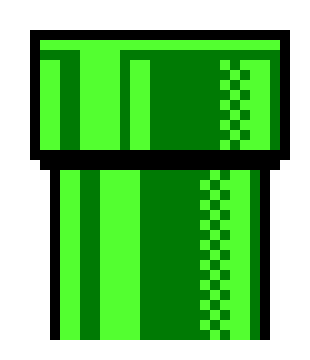

!include <octopus-cli>

Back in February (which is years ago in Internet land), we [published a post](https://octopus.com/blog/continuous-delivery-bitbucket-pipelines) about how you can link your [Bitbucket Pipelines](https://bitbucket.org/product/features/pipelines) build process with deployments through Octopus Deploy. In the time since we wrote this, we have started to publish up-to-date container images of our [octo.exe](https://octopus.com/docs/octopus-rest-api/octopus-cli) command line tool that will turbo-charge your continuous deployment process when scripting outside of the Octopus Portal, particularly for these container-based build chains.



For those of who who missed the previous post, Bitbucket Pipelines provides a really simple and low-cost way of automating builds from Bitbucket code repositories. Combining it with Octopus Deploy means you can properly manage your deployments, while still reducing the amount of overhead to go from code to app. It uses containers under the hood to execute each step which is an awesome new approach to build tooling. This strategy that many vendors have started to use means that every build process can be precisely tailored to the requirements of the application in question. Multiple different platforms and versions of tools can be run side-by-side on demand on the same build infrastructure without any conflicts or pollution across builds.

The octo.exe container is now [published to DockerHub](https://hub.docker.com/r/octopusdeploy/octo/) with both an alpine and nanoserver base image available. This means you can use octo.exe in containerized build chains like those provided by BitBucket. Extending on the ideas outlined by Andy in the previous post, we can now avoid having to install any zip tools or perform any convoluted curl requests.

The `bitbucket-pipelines.yml` in the root of a Node.JS project could be as simple as

```yml
image: node:6.9.4

pipelines:
  default:
    - step:
        name: Build And Test
        caches:
          - node
        script:
          - npm install
          - npm test
          - npm prune --production
        artifacts:
          - "*/**"
    - step:
        name: Deploy to Octopus
        image: octopusdeploy/octo:4.37.0-alpine
        script:
          - export VERSION=1.0.$BITBUCKET_BUILD_NUMBER
          - octo pack --id $BITBUCKET_REPO_SLUG --version $VERSION --outFolder ./out --format zip
          - octo push --package ./out/$BITBUCKET_REPO_SLUG.$VERSION.zip  --server $OCTOPUS_SERVER --apiKey $OCTOPUS_APIKEY
```

After we have built and tested our node app (this step could be improved on by extracting test results etc, but lets ignore that for now) we instruct the Pipelines to pass all the files in the working directory as an artifact. These files will then be available in the working directory of the subsequent step. Note that the second step called `Deploy to Octopus` makes use of the `octopusdeploy/octo:4.37.0-alpine` container. There are essentially just two commands that need to run here; `octo pack` and `octo push`. We can use the Bitbucket provided environment variables to name the package after the repository and produce a version based off the build number, then use custom [secured variables](https://confluence.atlassian.com/bitbucket/environment-variables-794502608.html) set through project settings to set the sever URL and apiKey.

Rather than repeating what Andy covered in [the previous post](https://octopus.com/blog/continuous-delivery-bitbucket-pipelines) about how Bitbucket works, I'd encourage you to read his post for more details about setting up a Bitbucket pipeline and Octopus Deploy CI process from end to end.

The configuration changes above show how it's easier than ever to integrate Octopus Deploy into your build systems, and the approach will work in most containerized build system from Bitbucket Pipelines to [CircleCI](https://circleci.com). Give it a try today and simplify your deployments, now with 100% more containers!

## Learn more

* How to guide: [Setting up your own end-to-end CI/CD pipeline with Bitbucket and Octopus Deploy](https://hubs.ly/H0gCKZg0)
* Blog: [Packages in script steps](https://hubs.ly/H0gCKJ90)
* DevOps best practice: [How Octopus handles rollbacks](https://hubs.ly/H0gCKJd0)
* [Octopus vs. Build Servers - Why should I use Octopus when I already have a CI Server?](https://hubs.ly/H0gCKZJ0)