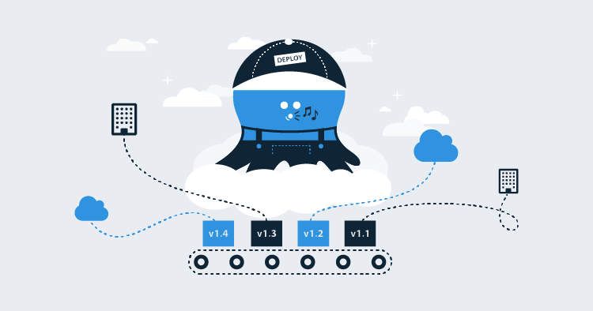

## Intro

Before we started to build the Octopus Cloud platform, we discussed where it should be hosted. We eventually came down to two choices: Amazon Web Services (AWS) or Microsoft Azure.

From there, we settled on AWS mainly because the majority of the team have prior experience with the service offerings from AWS, rather than any specific technical differences between the two cloud providers.

Excited to get started, we jumped head first into the project using Docker and Kubernetes on Windows. This was about eight months ago and, while we had some success, it felt like a constant uphill battle. At the time, Docker and Kubernetes on Windows didn't feel as mature as Docker and Kubernetes on Linux, and we couldn't use Linux because Octopus is not written in .NET Core...yet.

We had to make a difficult decision: carry on with Docker and Kubernetes after spending a good deal of time and effort, or move to a more traditional tried-and-tested method where each customer would have their own EC2 instance. We decided to go down the EC2 instance path, for the time being. The reasoning in the blog post, [Making sense of MVP (Minimum Viable Product) – and why I prefer Earliest Testable/Usable/Lovable](https://blog.crisp.se/2016/01/25/henrikkniberg/making-sense-of-mvp) by Henrik Kniberg, had a lot of influence on our thinking. We realized we were being too strict on ourselves by trying to develop the perfect product from the very beginning.

## Networking
One of the first tasks after creating our AWS account was to delete the default subnets and then the default VPC, so that we could create our own with larger netmasks to accommodate a larger number of customers. The idea was to go big, and, with that in mind, we set our production VPC netmask to `/16` and the netmask for each of our subnets to `/20`. Allowing us to accommodate up to 16 subnets per VPC and 4,091 IP addresses per subnet, providing us a total of 65,456 IP addresses.

The design of our VPC and subnets is based on the [Scenario 2: VPC with Public and Private Subnets (NAT)](https://docs.aws.amazon.com/AmazonVPC/latest/UserGuide/VPC_Scenario2.html) example provided by AWS, and it looks like the following:

.png)

Non-HA Octopus Cloud servers are distributed across our public subnets and are exposed directly to the internet. Future high-availability Octopus Cloud servers will be distributed across our private subnets and exposed to the internet through an application load balancer.

At the time of writing this blog post, the provisioning of Octopus Cloud servers is possible in the Oregon (us-west-2) region on t2.medium EC2 instances without high availability. However, in the not-too-distant future the Sydney (ap-southeast-2), London (eu-west-2), and Frankfurt (eu-central-1) regions are likely to become available, as well as the ability to migrate Octopus Cloud servers from one region to another and add high availability.

To create our VPC and subnets, we used [Terraform](https://www.terraform.io) because of its configuration syntax.

>Terraform uses the HashiCorp Configuration Language (HCL) which is meant to strike a balance between human-readable and editable as well as being machine-friendly.

_Source: [Terraform - Configuration Syntax](https://www.terraform.io/docs/configuration/syntax.html)_

For example, here is a template to provision a VPC with a public and private subnet.

```python
provider "aws" {
  region  = "us-west-2"
}

resource "aws_vpc" "production" {
  cidr_block           = "10.10.0.0/16"
  instance_tenancy     = "default"
  enable_dns_support   = true
  enable_dns_hostnames = true

  tags {
    Name = "Production VPC"
  }
}

resource "aws_internet_gateway" "production" {
  vpc_id = "${aws_vpc.production.id}"

  tags {
    Name = "Production Internet Gateway"
  }
}

resource "aws_route_table" "public" {
  vpc_id = "${aws_vpc.production.id}"

  route {
    cidr_block = "0.0.0.0/0"
    gateway_id = "${aws_internet_gateway.production.id}"
  }

  tags {
    Name = "Production Subnet (Public A/B/C)"
  }
}

resource "aws_eip" "public_a" {
  vpc = true
}

resource "aws_subnet" "public_a" {
  vpc_id                  = "${aws_vpc.production.id}"
  cidr_block              = "10.10.0.0/20"
  availability_zone       = "us-west-2a"
  map_public_ip_on_launch = true

  tags {
    Name = "Production Subnet (Public A)"
  }
}

resource "aws_route_table_association" "public_a" {
  subnet_id      = "${aws_subnet.public_a.id}"
  route_table_id = "${aws_route_table.public.id}"
}

resource "aws_nat_gateway" "public_a" {
  allocation_id = "${aws_eip.public_a.id}"
  subnet_id     = "${aws_subnet.public_a.id}"

  tags {
    Name = "Production NAT Gateway (Public A)"
  }
}

resource "aws_subnet" "private_a" {
  vpc_id            = "${aws_vpc.production.id}"
  cidr_block        = "10.10.16.0/20"
  availability_zone = "us-west-2a"

  tags {
    Name = "Production Subnet (Private A)"
  }
}

resource "aws_route_table" "private_a" {
  vpc_id = "${aws_vpc.production.id}"

  route {
    cidr_block = "0.0.0.0/0"
    gateway_id = "${aws_nat_gateway.public_a.id}"
  }

  tags {
    Name = "Production Subnet (Private A)"
  }
}

resource "aws_route_table_association" "private_a" {
  subnet_id      = "${aws_subnet.private_a.id}"
  route_table_id = "${aws_route_table.private_a.id}"
}
```

If you would like to compare the above Terraform template to a similar CloudFormation template (YAML), AWS have provided an example [here](https://docs.aws.amazon.com/codebuild/latest/userguide/cloudformation-vpc-template.html).

## Security
Security is paramount for the Octopus Cloud.

We engaged [Insomnia Security](https://www.insomniasec.com/) to perform a penetration and vulnerability test against the Octopus Cloud, and the results were very positive, with no major or moderate risks detected.

We have implemented a strict network access control list (ACL) for our production VPC by allowing the bare minimum protocols and ports required for inbound and outbound connectivity. The same can be said for the security group (SG) attached to each Octopus Cloud server and the firewall.

We have also disabled insecure and weak TLS cipher suites - an Octopus Cloud server only supports TLS 1.2 and TLS 1.1 which means older clients such as Windows XP and older browsers cannot access the UI.

## EC2 Instances
Earlier I mentioned that we currently run Octopus Cloud servers on t2.medium EC2 instances which I think would come as a surprise for most people. A t2.medium EC2 instance has 2 vCPUs and 4GB of RAM, and:

>unlike traditional EC2 instances, T2 instances provide a baseline level of CPU performance with the ability to burst above that baseline level. The baseline performance and ability to burst are governed by CPU credits.

_Source: [AWS User Guide - T2 Instances](https://docs.aws.amazon.com/AWSEC2/latest/UserGuide/t2-instances.html)_

The baseline level for a t2.medium is 40%. CPU credits are accumulated while the CPU utilization is below the baseline level, and consumed while above the baseline level. If your Octopus Cloud server consumes all of its credits, the CPU will not be able to burst above its baseline level.

During our closed alpha, closed beta, and usability sessions we found that, while idle, an Octopus Cloud server uses roughly 1% of its CPU; while performing simultaneous deployments, CPU utilization was typically below the baseline level.

Something that did catch us off-guard during our load testing is that we found:

> there is a limit to the number of times T2 Standard instances can receive launch credits. The default limit is 100 launches or starts of all T2 Standard instances combined per account, per region, per rolling 24-hour period.

_Source: [AWS User Guide - T2 Standard](https://docs.aws.amazon.com/AWSEC2/latest/UserGuide/t2-std.html)_

To combat this, we query CloudWatch after the EC2 instance has been provisioned to see whether it launched with or without credits. If it launched without credits, we temporarily enable T2 Unlimited on the EC2 instance until it has finished configuring.

## What's Next?
Allowing customers to provision their Octopus Cloud server in an AWS region other than Oregon (us-west-2) has been something that a lot of our customers have asked for. We looked into which regions made the most sense based on:

- The number of availability zones for redundancy,
- Lowest latency for performance.
- What would give us the best global coverage.

The Sydney (ap-southeast-2), London (eu-west-2), and Frankfurt (eu-central-1) regions were chosen, and they will become available shortly after we launch the Octopus Cloud.

Following on from supporting additional regions, we will also provide the ability to migrate an Octopus Cloud server between these regions.

High availability is also high on our priority list and is likely to launch after we support the Sydney and London regions.

Something we noticed during our closed alpha and closed beta is that a small portion of our customers created their Octopus Cloud server with words like `test`, `demo`, and `sandbox` as part of their subdomain. This got us thinking about scenarios where a customer would want to _change_ their subdomain, and that feature will definitely become available in the near future.

We haven't given up on Docker and Kubernetes. We believe that these technologies will allow us to provision Octopus Cloud servers faster, add an extra layer of security, and help us make good use of co-tenancy for cost savings.
