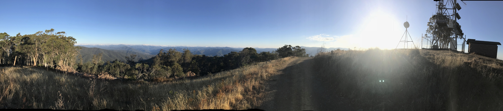
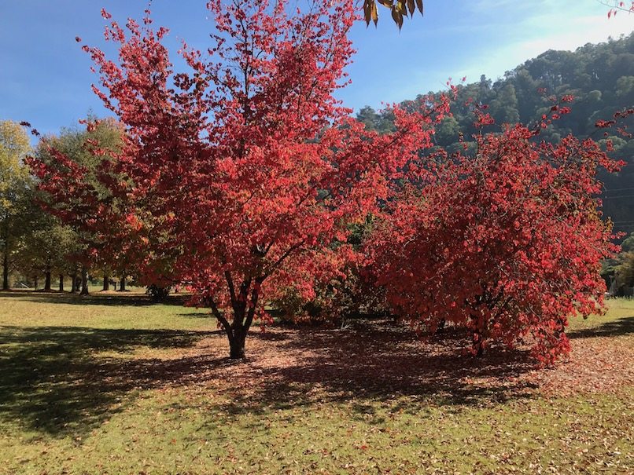
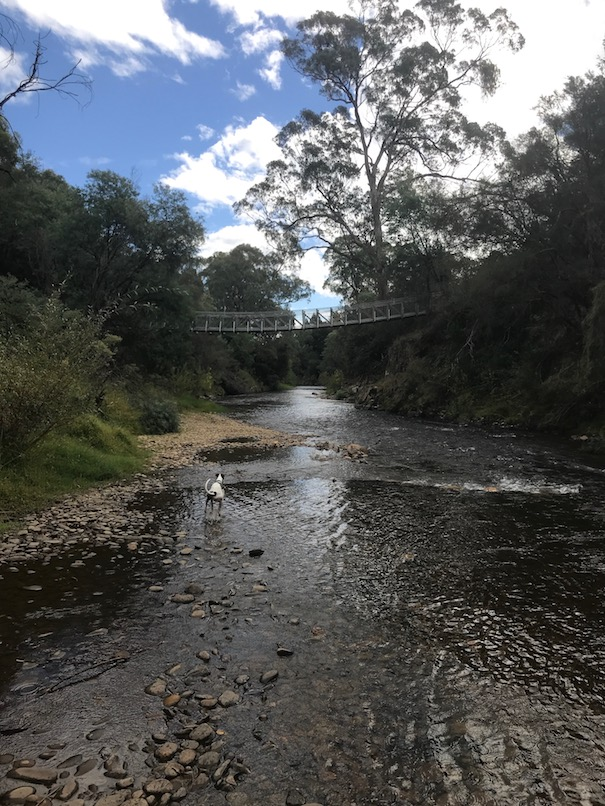
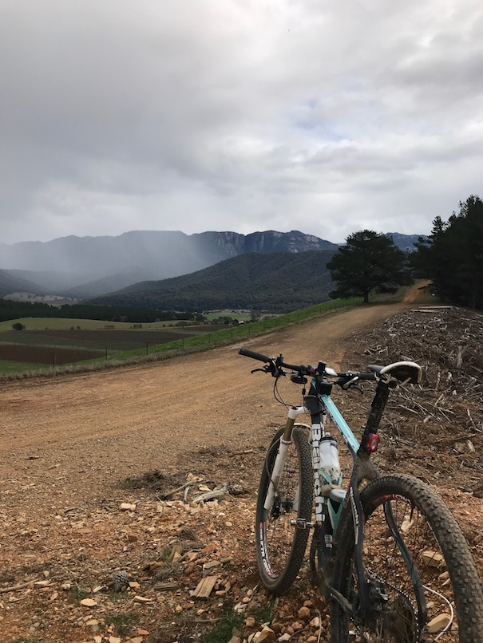

Flexible working can be a game changer in many ways.  I'm Jason, a Cloud Architect here at Octopus Deploy, and I'm going to explain why it's not just been a game changer for me, but a life changer.

When I joined Octopus Deploy in June 2017, I'd been living in Sydney for almost 19 years, and to be honest, I was ready for a change.

In modern Sydney, you live one of three ways. You either pay extortionate rent to live near the CBD, you deal with an extraordinary commute, or you try to strike a balance between the two.

After far too many run-ins with dangerous drivers on my 15km bike commute, I'd given up trying to strike the balance, and committed a big chunk of my paycheque to a warehouse in Rozelle, a walkable 3km from my previous work. Sure, I wasn't spending three or four hours a day on a train, and I was much less likely to be mown down on my bike by someone in a white [ute](https://en.wikipedia.org/wiki/Ute_(vehicle)), but I was was still stressed and often unhappy.

Octopus Deploy is a remote-first workplace. Many of my colleagues are located in Brisbane and others in Melbourne, Adelaide, the US, and even Argentina. Shortly after joining Octopus, I was almost ready to pack up and move to Brisbane to join my new team.

Of course, it turned out the Octopus Cloud team was mostly in Melbourne and well adjusted to remote work, so instead I stayed put. But the Sydney machine was still grinding me down, I was riding my bike even less and I was now paying extortionate rent for no apparent reason.

I'll be honest, I was unhappy. More importantly, I realized I'd been unhappy for years.

I needed a change.

So an idea began to germinate.

When I'd started riding bikes seriously again a few years ago, I went on a flying visit to the town of Bright, in North-East Victoria. After that first visit, I'd go back, time and time again.

Nestled in the mountains, Bright is well known to serious road cyclists and mountain bikers. It's surrounded by forests criss-crossed with superb gravel trails for day-long adventures, has five or six mountain bike parks within a short drive, and is a base for some of Australia's best road rides. Because it's a tourist town, it's also well served by infrastructure, is close to two ski resorts, and has enough cafes, bars and entertainment to keep a pampered city dweller amused at the weekend.

I began to wonder. I'd had an ambition to buy a holiday base in Bright for a long time. Could I maybe... live there?

So I asked the boss if he'd be OK if I moved to Victoria.

The answer was a resounding "yes, of course". I'm still not quite sure if anyone knew quite _where_ in Victoria I was going, but I had a positive answer so the wheels were in motion. I found a house with four bedrooms and a study in Porepunkah, just outside Bright, for far less money than my one bedroom in Sydney. I rented a truck and left.

There were some initial teething troubles, such as getting my wired internet installed (I worked on 4G for the first month), but once I settled in I found I was more relaxed, more focused, and generally happier. Life is simpler, my routine is more consistent, and I get to look at mountains every day!

It took a while, but eventually I realized how much noise dominates your life in a city. It took a while for me to get out of the habit of wearing noise-cancelling headphones everywhere - a habit I haven't entirely shaken. It's a simple, under-appreciated pleasure to pop out for a coffee or to walk the dog and not be assaulted by traffic noise.

It's now about nine months after I moved to Bright, and feral horses couldn't drag me out. Sure, there are little problems that you don't have in a city, but the value of seeing mountains and trees every day means I'm just fine with waiting a few days to get my fridge fixed.

And let's not kid ourselves, it _can_ take a few days to get your fridge fixed in the country. It's not just a cliché, things really do move more slowly here. My town doesn't even get mail delivered to the door. Luckily, Octopus's flexibility means I can take time out of the day to do the little jobs that need doing, and make up time later. Sometimes I can even squeeze in a mid-afternoon bike ride for an hour or two, which I'm finding very useful as the icy mornings and dark evenings of a mountains winter start to bite.

If you're very much an 'on-demand' personality, and you value the infinite choice that city living provides, you might not thrive. But if you can learn to value a certain simplicity of life, it might be just the ticket.
