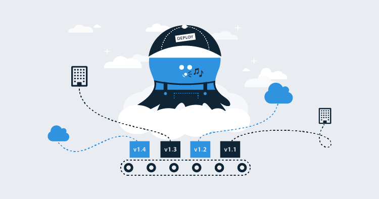

When I first started at Octopus in September 2017, "hosted" (as we referred to it then) had been bandied about for a while, but the real work hadn't really kicked off in earnest. Late in 2017 a team officially formed to bring Hosted to life, bringing together skills from across our team in cloud architecture, infrastructure, and security.  It's been a wild ride, but we're finally at the finish line - Octopus Cloud is launching for public access in the next few weeks.

With the launch coming soon, I wanted to take a moment to write about our journey to this point: why we decided to build Octopus Cloud, things that worked Really Well, other things that Really Didn't Work, and some of the lessons we learned along the way.

This post also launches an Octopus Cloud blog series, with following posts digging in much deeper into some of the specific challenges we faced and overcame, and how our team and company had to change in this cloud-native world. Settle in with a coffee.

## Why put Octopus in the cloud? (a brief history of Octopus)

When Octopus first came to life as one of Paul Stovell's many great ideas, the landscape of programming and development was quite different; deploying reliably and repeatably to on-premises and self-hosted servers was a huge pain. In those days, applications often ran on managed servers, so having a managed deployment server on the same network (or WAN) made total sense.

Fast-forward 5 years and that landscape looks totally different. A lot of teams are developing exclusively (or predominantly) for the cloud: web apps, microservices, "serverless" (code you dump onto someone else's server and make their problem) all exist in this nebulous "other space". When all of your deployment targets live in the cloud, having a managed on-premises deployment server doesn't make a heap of sense. A lot of teams are running their Octopus out of cloud VMs on Azure or AWS anyway, and we even started referring to it as "self-hosted" (not "on-premises"), because so many people aren't running the servers themselves anyway.

So we asked ourselves if we were the customer, would we want to have to deploy and manage a server somewhere just to run Octopus, when all our code is in the cloud? Of course, the answer was no! When we starting hearing comments like "Octopus is the only VM I have any more," we knew it was time to change the status quo.

## How we did it (and why it was Really Hard)

It sounds easy, right? "Just put it in the cloud" is something I hear often, usually from people who really don't understand just how hard that can be. Spoiler alert: it wasn't easy. At all. And it still isn't. Between pushing Octopus to the limits and wrangling AWS, we've all learned a lot - and in subsequent posts, we'll be writing in much more depth on many of these topics.

### "Run on server" (aka "please destroy our servers")

In a nutshell, Octopus was built from the ground-up to _empower_ developers to have seamless, resilient deployments out of the box, but also to be able to hack and tweak as they needed to, to get their specific config working. This means that Octopus has a huge amount of switches you can flip to tune up your deployments as you see fit. And when you control the server yourself, that's totally fine. But allowing _any_ abitrary scripts and executables to run without limitation on our servers makes us very nervous indeed. However, this has forced us to have some very interesting discussions about security and our execution architecture, and has helped to pave the way for some exciting new features ([have a read about Workers](https://octopus.com/blog/octopus-release-2018.6#octopus-workers-backend-enhancements), coming soon).

### Pushing Octopus to the limit (aka "how creative can we be?")

We made a decision when building Octopus Cloud that we should eat our own dogfood, and use Octopus as our primary driver in managing cloud instances. This means we run a special, blessed instance of Octopus that handles the bulk of our management processes, from spinning up all of the AWS infrastructure and security config, to deploying new database servers and storage gateways when we hit particular limits, and recurring deployment to run monitoring and maintenance tasks. It's been an interesting journey, and we've had to get pretty creative, but it's also kick-started some really interesting usability and performance conversations internally that we've not had access to before.

### Keeping our finger on the pulse (aka "3 am alerting woes")

We're a (primarily) Australian team, and that's something we're really proud of! But it does have its downsides with support when so many of our customers are **not** in Australia. So a huge consideration for us was making sure we stay sensitive and responsive to issues with Octopus Cloud, **no matter what time they may occur**. When you rely on us for your deployments, we can't leave you hanging if something goes wrong. So a big part of the Octopus Cloud story has been the journey to hook in meaningful metrics and sensible alerting, so we get notified if anything bad happens.

As a side-note, I ambitiously volunteered as the guinea-pig for our first week of 24/7 on-call, and I had some very furious 3 am moments trying to read stack traces on my phone, getting punched in my side because "my phone is brighter than the sun" (direct quote from my better half).

### Breaking down silos (aka "don't be a knowledge-hoarding dragon")

Everyone has their own interests and specific skills, and it's really tempting to stay in that comfort zone and not venture outside of it. For me, I'm pretty good at MVC and web-appy-Azure stuff, but I stink at Angular, and I think AWS hates me. I try and stick with the stuff I know best, figuring that's the best use of my skills. While this is technically true, it encourages huge pillars of knowledge to form, "Oh it's an MVC problem? Better talk to Andy," which becomes a problem when people are sick, and an even BIGGER problem when you're on call and you only know Your Thing, and nothing else. We've done a lot of pairing, and all dug into stuff that makes us fairly uncomfortable, so we all have a working knowledge of the full stack. But secretly, I still suck at Angular (ssh don't tell anyone).

## What's next? (my attempts to read the crystal ball)

Octopus Cloud is in a really great place. We're currently in invite-only early access, and super-excited to open the doors to anyone keen to try out a cloud instance. But like so many large undertakings, the real journey is still ahead of us. As far as our users are concerned, Octopus Cloud is really a "how", not a "what". Octopus itself is the same great system you've all been using for years, we're just bringing it to you in a different (and more seamless) way. The path forward for the Cloud team will be to take this platform that we've built and improve on it: faster provisioning, lowered costs, increased performance, and so on. You may not even notice these improvements, but we'll be working hard on them all the same.

Thanks for sticking it out to the end! I really hope this has been an interesting insight into how we got here, and where we might go next. Keep an eye out for more posts to come, and don't be afraid to ask any questions in the comments below. If you have technical questions, read our FAQs.

And until we talk again, Happy (almost cloud) Deployments!
