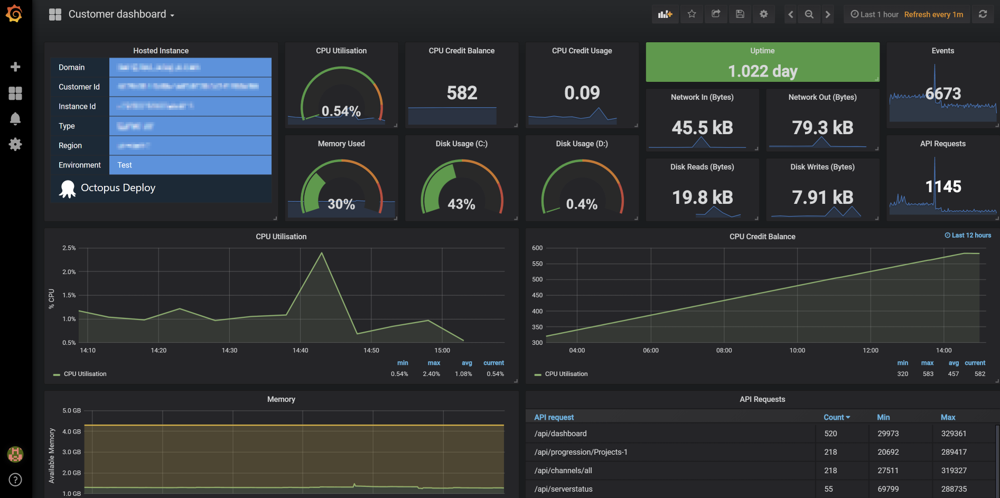

One of the guiding principles that we've followed while building Octopus Cloud is using Octopus Deploy as much as possible, so we can increase our in-house usage of Octopus and essentially 'eat our own dog food'.  We've really focused on this to make sure we feel the same pain that our customers do and help make Octopus even better.

While this has not been without its challenges (a deployment tool is not necessarily the first choice to manage a SaaS platform!), overall it has been a fun journey. It's definitely paid off, and we've been able to test and improve Octopus in the real world.

This post walks through some of the more interesting things that this approach has produced.

## OctopusDSC

[OctopusDSC](https://github.com/OctopusDeploy/OctopusDSC) is our [Desired State Configuration](https://docs.microsoft.com/en-us/powershell/dsc/overview) module that allows installation and configuration of the Octopus Server and Tentacles. While it was already in a fairly good state, it wasn't something we used much in anger, so it had a few rough edges.

Using it for provisioning Octopus Cloud instances, and for our management instance, meant we invested a fair bit of effort into improving it. We've:

* Made it work in High Availability scenarios.
* Improved it to follow best practices around handling passwords.
* Added support for specifying network shares for shared data storage.
* Added the ability to specify the built-in-worker credentials.
* Added an 'installed but not configured' state to substantially improve instance launch times.

## Security

Implementing Octopus Cloud has meant we've been even more focused on all aspects of security. When using [output variables](https://octopus.com/docs/deployment-process/variables/output-variables) to pass around API keys, we realized that there was a potential flaw here where sensitive values could end up outputted as plain-text in logs. There's [now](https://octopus.com/blog/octopus-release-2018.6#sensitive-output-variables) a `-sensitive` parameter to ensure this can't happen.

## Workers Unite!

For a long time, you've been able to run your own scripts on the Octopus Server. In a high-trust environment, this has not been a problem, but for some organizations (and especially in a SaaS world) this is less than ideal. To address this, we added the ability to specify a user account to use when running scripts on the server with the [built-in worker](https://octopus.com/docs/administration/workers/built-in-worker). That allows us to run scripts as a separate, low privileged user, reducing the potential impact.

While this significantly reduces the scope for things going wrong, it's still not as good as we want. We've done a whole lot of work to implement Workers (a way to configure one or more tentacles as places to offload work - including running scripts - from the Octopus server) the first part of which [dropped in 2018.6.0](https://octopus.com/blog/octopus-release-2018.6). This lays the groundwork for allowing us, in the future, to farm these run-on-server tasks out to single-use containers, giving us much greater isolation.

## Metrics

Effectively managing a whole bunch of Octopus Servers means we really need to know whats going on, both pre-emptively and when an incident happens. We use [Elasticsearch](https://www.elastic.co/) to store our metrics, [Grafana](https://grafana.com/) to view them, and [Telegraf](https://www.influxdata.com/time-series-platform/telegraf/) to read and ship metrics. We added functionality to the Octopus Server to log task and web API metrics to file, so telegraf can ingest them and ship them off to Elasticsearch. This, combined with some inbuilt telegraf functionality, allows us to have some awesome dashboards like:



One of the great things about us running and managing Octopus is that we get to see broad, high-level metrics about how Octopus is performing in the real world. It also means that if there's a performance issue, we're the ones who get bitten by the increased costs of higher-spec machines - something that can only be a win for improving Octopus performance!

We'll drill into the detail of metrics and dashboarding in another blog post soon.

## Tenants

We use the [multi-tenant deployment pattern](https://octopus.com/docs/deployment-patterns/multi-tenant-deployments) very heavily. This has helped us find a bunch of areas that aren't as easy to use as we'd like. While we haven't made much progress in this area (too many good ideas, not enough time!), we've learned a lot and have some good ideas to make this better in the future.

One quick win that we did manage to implement was the ability to use the [script console](https://octopus.com/docs/administration/script-console) with tenants. Previously, you had to look up the infrastructure page, find all instances associated with that tenant, take a note of them, then go back to the script console and select the instances manually. Pretty painful, not to mention error-prone. Now, it's as simple as selecting the tenant and you're good to go!  

## Squashing Those Bugs

Using the new [Terraform](https://octopus.com/docs/deployment-examples/terraform-deployments), [S3](https://octopus.com/docs/deployment-examples/aws-deployments/s3), and [CloudFormation](https://octopus.com/docs/deployment-examples/aws-deployments/cloudformation) steps fairly early-on allowed us to find a bunch of those niggly edge-cases that only show up in the real world. While it's annoying for us to find them while trying to build out Octopus Cloud, it's much more preferable for us to hit these bugs than for you the customer. One of the benefits of using these features as soon as they are available means that the developers involved are still in the same 'head space', and the bugs can be easily found and fixed, rather than 3 months down the track when all context has been forgotten.

Another dogfooding win was finding a pesky timing bug that caused a browser redirect during login on slow connections. All our dev testing was done with fast(ish) connections, so the bug never manifested. Deploying and using this ourselves meant we found and fixed the bug fairly quickly.

## Usability

Our usability team has been doing some user-testing and watching as customers have walked through the signup process and getting started with Octopus. This has been a great eye-opener to see both new and existing customers use the product and see where things aren't the smooth, easy experience we assume they are. We've already started implementing some of the UX improvements out of this testing with great results.

Keep an eye out for a blog post soon talking about this in further detail.

## Little Niggles

Using Octopus on a daily basis has highlighted little niggles that got in the way of the super-smooth experience we want it to be. One of these was the 'running tasks' link on the `Configuration->Nodes` page. It would display '3 running tasks' as a link, and you'd think that clicking on that link would show you those 3 tasks, but instead, it showed all tasks from that node, regardless of state. While this wasn't exactly a show stopper, it was one that annoyed me frequently enough that I took the time out to fix it. Now, you only see the running tasks - very useful when you're draining a node, ready to replace it!

Another one of those little niggles was the message that gets shown when a task is blocked by another:

```
Cannot start this task yet because "ServerTasks-46122" (has a read lock) tasks are currently running
and this task cannot be run in conjunction with any other tasks. Please wait...
```

While it was functional (it told you that it was blocked on something), it was jarring, partially due to the grammar, but also due to the challenge of figuring out what `ServerTasks-46122` was. You could copy the ID and manipulate the URL to get to it, but it wasn't intuitive. Now, the grammar has been fixed, and the ID is now a direct link to the running task. Again, not a show-stopper, but one of those things that makes life much easier when you're trying to figure out what's going on.

## Lots More To Do

While there's a lot more to talk about than I've mentioned in this post, I don't want to bore you too much. We've still got a long list of things we'd like to tackle - keep your eyes peeled for a continual stream of improvements.

Happy (Octopus Cloud) deployments!
