My previous blog posts discussed why [you need automated database deployments](https://octopus.com/blog/automated-database-deployments-series-kick-off) and [tips for getting started](https://octopus.com/blog/automated-database-deployments-iteration-zero).

This article walks through setting up an automated database deployment pipeline using the [state-based approach](https://www.red-gate.com/products/sql-development/sql-change-automation/approaches) for [Redgate’s SQL Change Automation](https://www.red-gate.com/products/sql-development/sql-change-automation/).  I picked this tool because it is easy to set up, integrates with SSMS, and I already had a demo setup.  I’m also a [biased](https://www.red-gate.com/hub/events/friends-of-rg/friend/BobWalker) towards Redgate’s tooling.

By the end of this article you will have a working proof of concept you can demo.

!toc

## Prep work

For this demo, you need a running SQL Server instance, an Octopus Deploy instance, and a CI server.  I recommend using a dev environment or your local machine for this proof of concept.  

## Tools needed

You will need the following tools. The examples given use TeamCity and VSTS/TFS, but even if you’re using a different tool, the core concepts and UI for all the CI tools are very similar.  

- Octopus Deploy:
    - [Free license for Octopus Cloud or Octopus Server](https://octopus.com/free)
- Redgate SQL Tool-belt
    - [14-day free trial](https://www.red-gate.com/dynamic/products/sql-development/sql-toolbelt/download).  
- CI Tool (pick one):
    - [Jenkins](https://jenkins.io/download).
    - [TeamCity](https://www.jetbrains.com/teamcity/download/).
    - [TFS](https://visualstudio.microsoft.com/tfs/).
    - [VSTS](https://visualstudio.microsoft.com/team-services/).
    - [Bamboo](https://www.atlassian.com/software/bamboo/download).
- SQL Server Management Studio (SSMS):
    - [Free download](https://docs.microsoft.com/en-us/sql/ssms/download-sql-server-management-studio-ssms).
- SQL Server:
    - [SQL Express](https://www.microsoft.com/en-us/sql-server/sql-server-editions-express).
    - [SQL Developer](https://www.microsoft.com/en-us/sql-server/sql-server-downloads).

## Installing software

If you run into issues installing any of these tools, please go to the vendor’s website for help.  If you need any help installing Octopus Deploy please start with our [docs](https://octopus.com/docs/installation) or contact [support](mailto:support@octopus.com).

### Developer machine

This is the machine you will use to make the schema changes and check them into source control.  When you install Redgate’s SQL Tool-belt, you will be prompt to install quite a bit of software.  You only need to install the following:
- SQL Source Control
- SQL Prompt (it isn’t required, but it makes things much easier)
- SSMS Integration Pack

### Build server

Both Octopus Deploy and Redgate have plug-ins for the major build servers:

- Jenkins:
    - [Octopus download](https://download.octopusdeploy.com/octopus-tools/4.37.0/OctopusTools.4.37.0.zip). Please note, you can have Jenkins interact with Octopus by using octo.exe.  You can read more about that in our [documentation](https://octopus.com/docs/api-and-integration/jenkins).
    - [Redgate download](https://plugins.jenkins.io/redgate-sql-ci).
- TeamCity:
    - [Octopus download](https://download.octopusdeploy.com/octopus-teamcity/Octopus.TeamCity.zip).
    - [Redgate download](https://www.red-gate.com/dlmas/TeamCity-download).
- VSTS/TFS:
    - [Octopus download](https://marketplace.visualstudio.com/items?itemName=octopusdeploy.octopus-deploy-build-release-tasks).
    - [Redgate download](https://marketplace.visualstudio.com/items?itemName=redgatesoftware.redgateDlmAutomationBuild).
- Bamboo:
    - [Octopus download](https://marketplace.atlassian.com/apps/1217235/octopus-deploy-bamboo-add-on?hosting=server&tab=overview).
    - [Redgate download](https://marketplace.atlassian.com/apps/1213347/redgate-dlm-automation-for-bamboo?hosting=server&tab=overview).

### Deployment target
Installing an Octopus Tentacle on SQL Server is a big no-no.  The [documentation](https://octopus.com/docs/deployment-examples/sql-server-databases#SQLServerdatabases-Tentacles) goes into further details why.  Instead, we will install the Tentacle on a jump box that sits between Octopus Deploy and SQL Server.  For security purposes, I recommend running the Tentacle as a specific user account.  This way you can make use of integrated security.  Here is [some documentation](https://octopus.com/docs/infrastructure/windows-targets/running-tentacle-under-a-specific-user-account) on how to configure that.  Keep in mind that only works if you are using Active Directory.  If you are not using that, you can still use this process, you just need to use SQL Users instead.

For the jump box, you need to install the following items:
- SQL Change Automation PowerShell 3.0.
- SQL Change Automation.

## Sample project

For this walk-through, I modified the RandomQuotes project. The source code for this sample can be found in this [GitHub repo](https://github.com/OctopusDeploy/AutomatedDatabaseDeploymentsSamples).  Fork the repository so you can make modifications as you follow this article.

## Configuring the CI/CD pipeline

Everything you need is already checked into source control.  All we need to do is build it and push it to the SQL Server.  

### Octopus Deploy configuration

You need the step templates from Redgate to [create a database release](http://library.octopus.com/step-templates/c20b70dc-69aa-42a1-85db-6d37341b63e3/actiontemplate-redgate-create-database-release) and [deploy a database release](http://library.octopus.com/step-templates/7d18aeb8-5e69-4c91-aca4-0d71022944e8/actiontemplate-redgate-deploy-from-database-release).  When you browse the step template you might notice the step template to [deploy directly from a package](http://library.octopus.com/step-templates/19f750fb-2ce8-4361-859e-2dfcdf08a952/actiontemplate-redgate-deploy-from-package).  The state-based functionality for SQL Change Automation works by comparing the state of the database stored in the NuGet package with the destination database.  Each time it runs, it creates a new set of delta scripts to apply. The recommended process is:

1. Download the database package to the jump box.
2. Create the delta script by comparing the package on the jump box with the database on the SQL Server.
3. Review the delta script (this can be skipped in dev).
4. Run the script on SQL Server using the Tentacle on the jump box.

Using the step template to deploy from the package prevents the ability to review the scripts.  

This is the process I have put together for deploying databases.


This process creates the main SQL user for the database, the database, adds the SQL user to the database, and the user to the role.  If you want your process to do that, you can download those step templates from the [Octopus Community Step Template Library](http://library.octopus.com/listing).  

If this is the beginning of your automated database deployment journey, you don’t have to add all that functionality. The main steps you need from the above screenshot are:


Let’s walk through each one.  The download a package step is very straightforward, no custom settings aside from picking the package name.


The Redgate - Create Database Release step is a little more interesting.  What trips most people up is the **Export Path**.  The export path is the location the delta script will be exported to.  This must be a directory outside of the Octopus Deploy Tentacle folder.  This is because the **Redgate - Deploy from Database Release** step needs access to that path and the Tentacle folder will be different for each step:

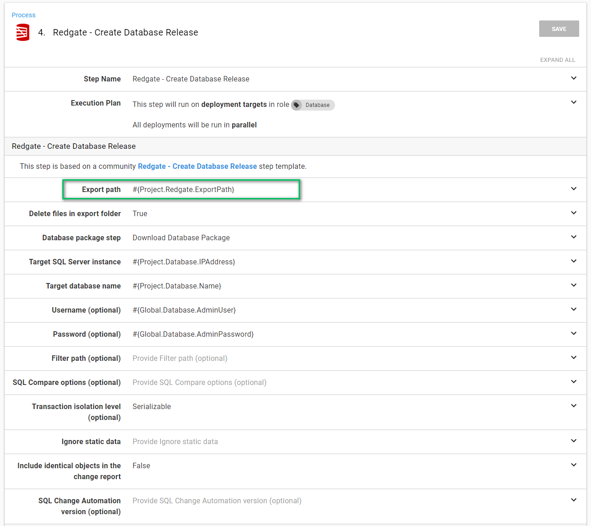

I like to use a project variable:

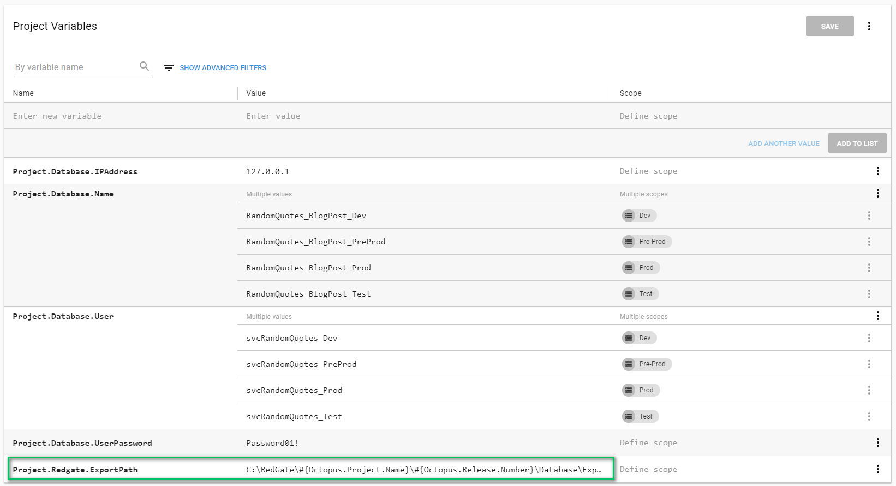

The full value of the variable is:

```
    C:\RedGate\#{Octopus.Project.Name}\#{Octopus.Release.Number}\Database\Export
```

Other recommendations on this screen:
- I have supplied the username and password.  I recommend using integrated security and having the Tentacle running as a specific service account.  I don’t have Active Directory setup on my test machine so I used SQL Users for this demo.
- Take a look at the [default SQL Compare Options](https://documentation.red-gate.com/sr1/using-sql-compare-options-in-sql-release/default-sql-compare-options-used-by-sql-release), and make sure they match what you need.  If they don’t, you need to supply the ones you want in the `SQL Compare Options (optional)` variable.  You can view the documentation [here](https://documentation.red-gate.com/sc11/using-the-command-line/options-used-in-the-command-line).  If you do decide to use custom options, I recommend creating a variable in a [library variable set](https://octopus.com/docs/deployment-process/variables/library-variable-sets) so those options can be shared across many projects.
- Use a custom filter in the event you want to limit what the deployment process can change.  I wrote a lengthy blog post on how to do that [here](https://www.codeaperture.io/2016/10/13/using-sql-source-control-to-filter-out-unwanted-items/).  My personal preference is to filter out all users and let the DBAs manage them.  Even better, let Octopus manage them since it can handle environmental differences.

The next step is approving the database release. I recommend creating a custom team to be responsible for this, but I prefer to skip this step in dev and QA:


The create database release step makes use of the artifact functionality built into Octopus Deploy. This allows the approver to download the files and review them:

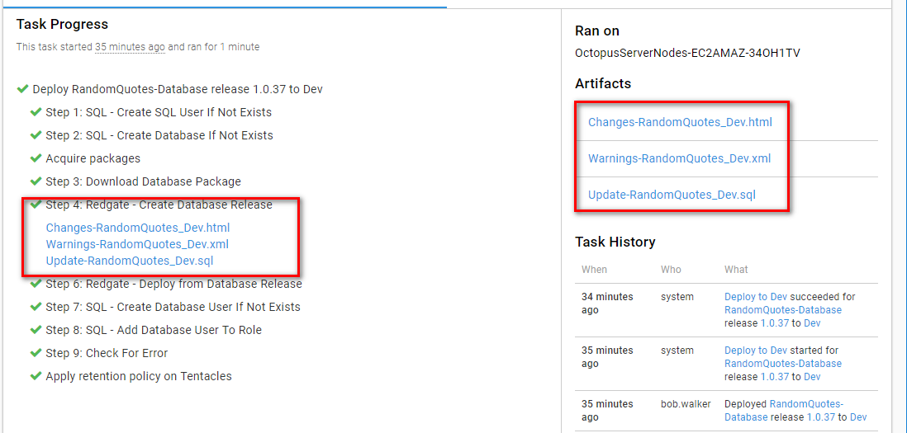

The final step is deploying the database release.  This step takes the delta script in the export data path and runs it on the target server, which is why I recommend putting the export path in a variable:


That’s it for the Octopus Deploy configuration. Now it’s time to move on to the build server.

### Build server configuration

For this blog post, I use VSTS/TFS and TeamCity.  At a minimum, the build should do the following:

1. Build a NuGet package containing the database state using the Redgate plug-in.
2. Push that package to Octopus Deploy using the Octopus Deploy plug-in.
3. Create a release for the package which was just pushed using the Octopus Deploy plug-in.
4. Deploy that release using the Octopus Deploy plug-in.

#### VSTS / TFS build

Only three steps are needed in VSTS/TFS to build and deploy a database:


The first step will build the database package from source control.  The highlighted items are the ones you need to change.  The subfolder path variable is relative.  I am using sample Git repo which is why the _RedgateSqlChangeAutomationStateBased_ folder is in the path:

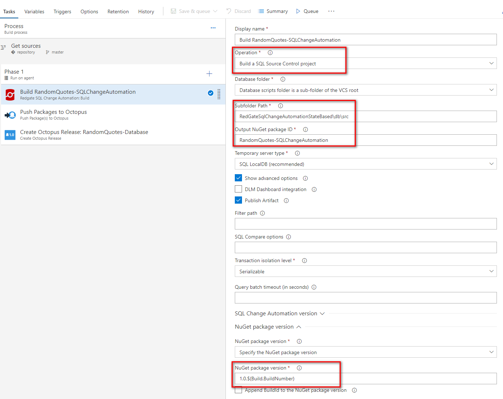

The push package to Octopus step requires you to know the full path to the artifact generated by the previous step.  I’m not 100% sure how you would know without trial and error:


Here is the full value if you’d like to copy it:

```
    $(Build.Repository.Localpath)\RandomQuotes-SQLChangeAutomation.1.0.$(Build.BuildNumber).nupkg
```

The Octopus Deploy server must be configured in VSTS/TFS.  You can see how to do that in our [documentation](https://octopus.com/docs/api-and-integration/tfs-vsts/using-octopus-extension).

The last step is to create a release and deploy it to dev.  After connecting, VSTS/TFS with Octopus Deploy you can read all the project names.  You can also configure this step to deploy the release to dev.  Clicking the **Show Deployment Progress** will stop the build and force it to wait for Octopus to complete:

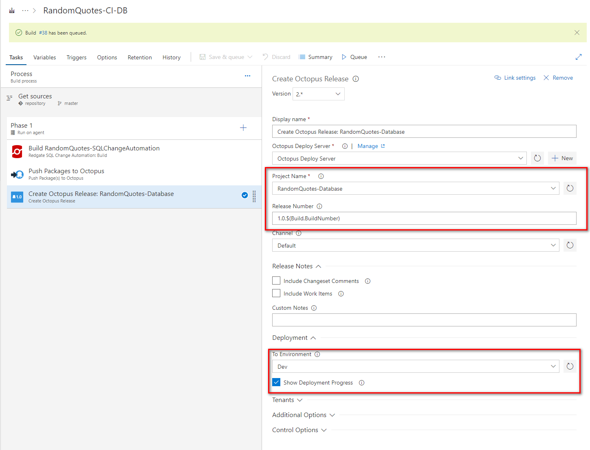

#### TeamCity

The TeamCity setup is very similar to the VSTS/TFS setup.  Only three steps are needed:


The first step, the build database package step, has similar options to VSTS/TFS.  You will need to enter the folder as well as the name of the package:

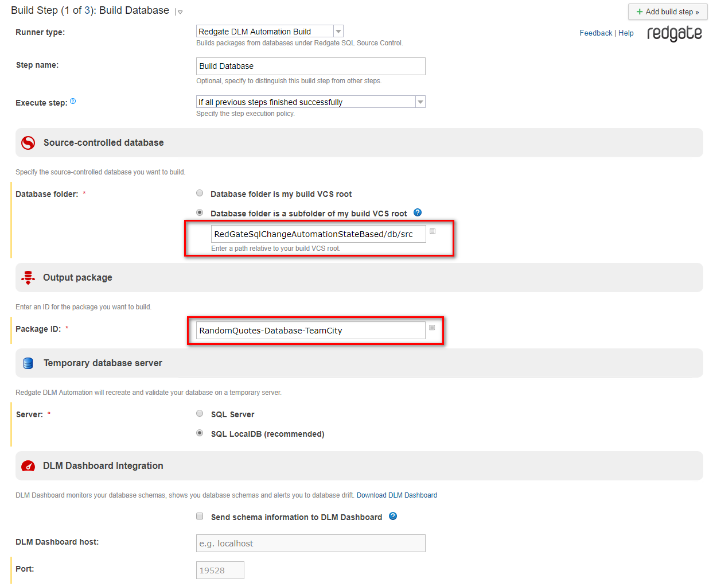

You have to enter a package version in the advanced options, otherwise you will get errors from the Redgate tooling about an invalid package version:

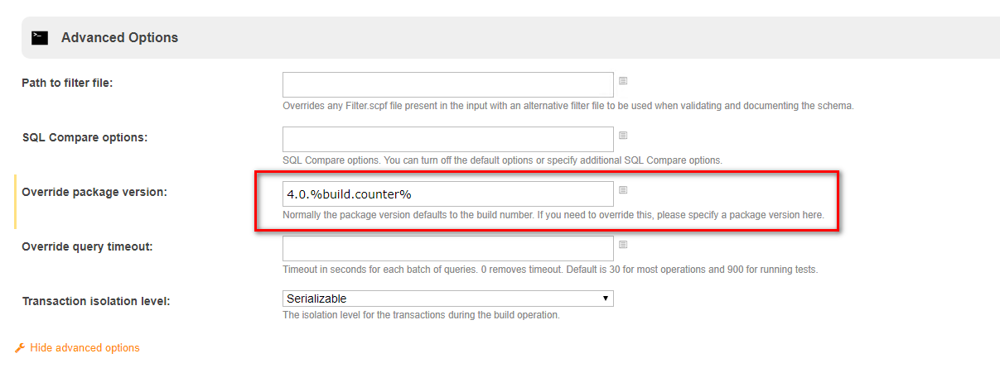

The publish package step requires all three of the options to be populated.  By default, the Redgate tool will create the NuGet package in the root working directory:


The final step is creating and deploying the release. Similar to before, you provide the name of the project, the release number, and the environment you are deploying to:

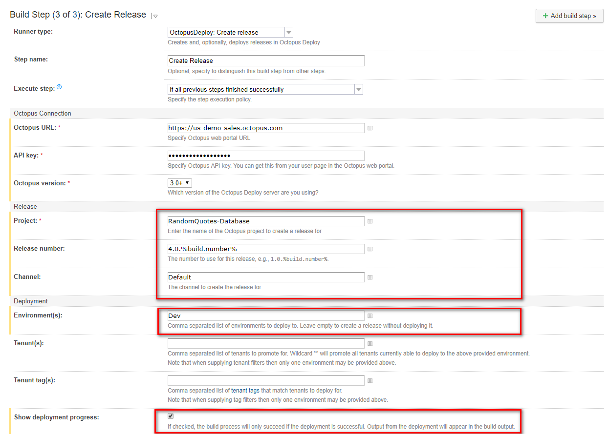

## The CI/CD pipeline in action
Now it is time to see all of this in action.  For this demo, I create a new database, *RandomQuotes_BlogPost_Dev*:

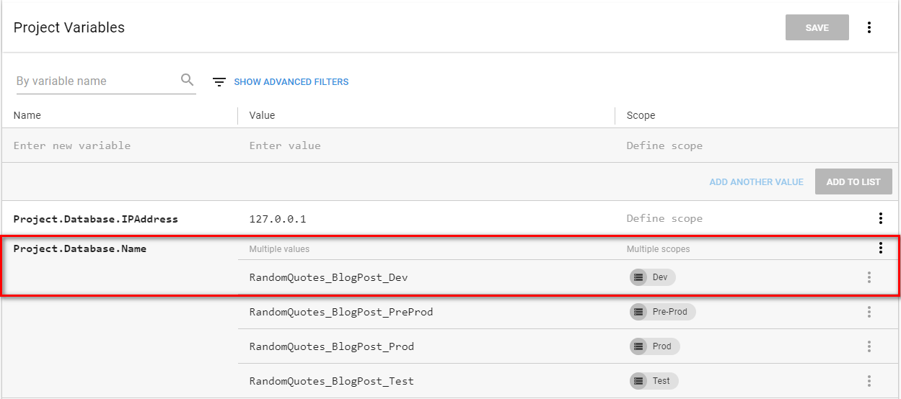

As you can see, I do not have any databases with that name. I have used this SQL Server as my test bench for automated deployments:


Let’s take a quick look at the tables stored in source control:

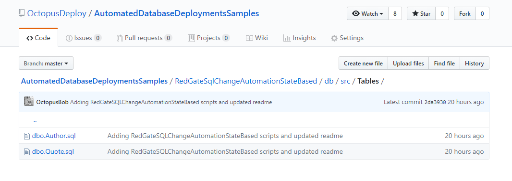

If we open one of those files, we can see the create script generated by Redgate’s SQL Source Control:


Kick off a build and let’s see that whole pipeline in action.  The build looks successful:

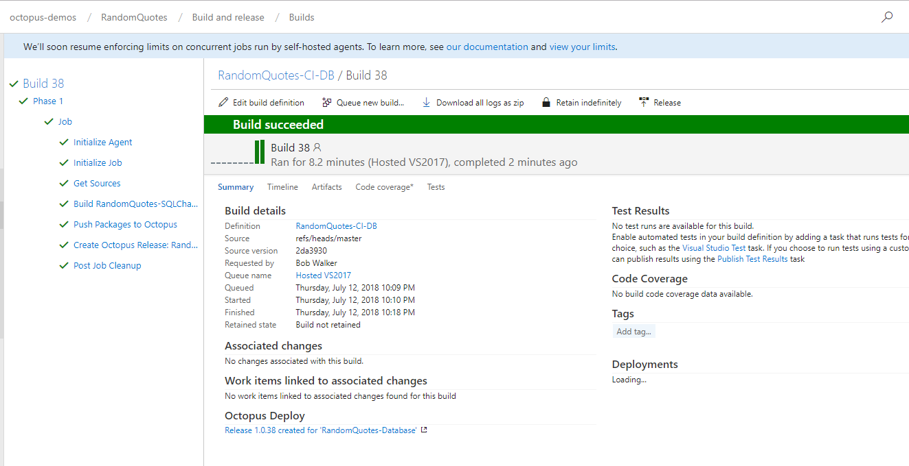

No surprise, the deployment was successful in Octopus Deploy.  The VSTS/TFS build was set to wait on Octopus Deploy to finish deploying the database.  If the deployment failed the build would’ve failed:

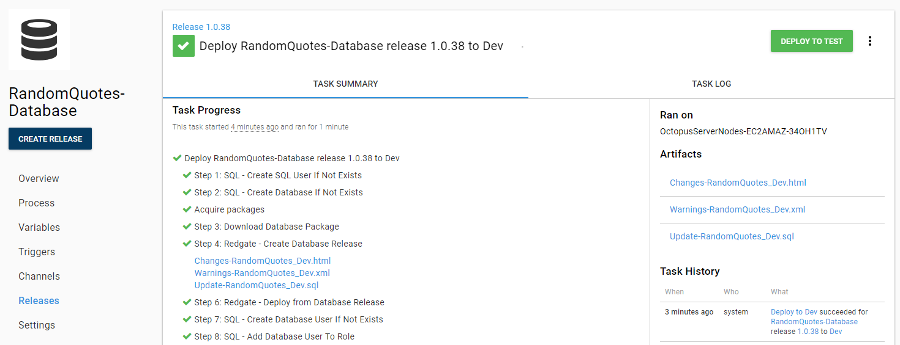

Going back to SSMS and we can now see the database and the tables have been created:

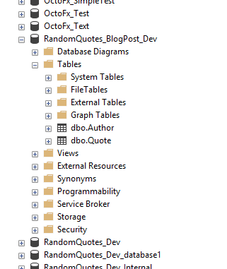

## Changing the schema

That works with an existing project, but let’s make a small change and test the process. There is a bit more setup involved with this:

1. Clone your forked repo to your local machine.
2. Open up SSMS and create a random quotes database on your local machine or dev.
3. In SSMS bind the source controlled database to the newly created database.  You can read how to do that in the [documentation](https://www.red-gate.com/products/sql-development/sql-source-control/resources/how-to-set-up-sql-source-control).

When linking the database to source control you need to provide the full path to the folder where the source control is stored.  I store all my code in a folder called C:\Code.git. The full path is:

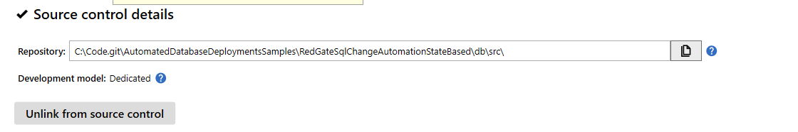

Here is the text of that path for you to copy:

```
C:\Code.git\AutomatedDatabaseDeploymentsSamples\RedGateSqlChangeAutomationStateBased\db\src\
```

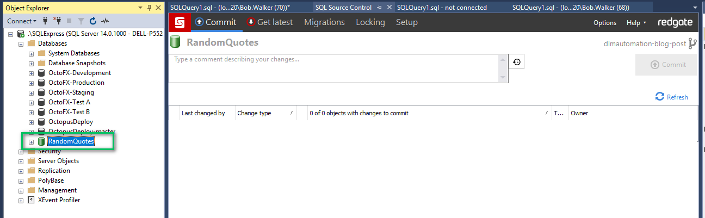

Now we can make the change to the database.  For this test, let’s just add in a stored procedure which will return a value:


Now we can commit that change to source control:


Assuming the CI/CD build is set to fire on commit, you should see that new sproc appears in dev.

## Conclusion

Automating database deployments does require a bit of prep-work but the payoff is well worth the effort.  Having the auditing alone is well worth it.  With this tool, I can now see who made a change, when a change was made, and when that change went into production.  In the past, that was kept in another location with a 50/50 shot of it being updated.

As you start down this journey my recommendation is to add the manual verification step to all environments until trust has been established.  This will ensure you don’t accidentally check in a change which blows away half the team’s database changes.  

Until next time, happy deployments!

---

Posts in the automated database deployments series:

- [Automated database deployment series kick-off](/blog/2018-06/automated-database-deployments-series-kick-off.md)
- [Iteration Zero](/blog/2018-06/automated-database-deployments-iteration-zero.md)
- **Automated database deployments using state-based Redgate SQL Change Automation**
- [Using ad-hoc scripts in your automated database deployment pipeline](/blog/2018-08/automated-database-deployments-adhoc-scripts.md)
- [Deploy to Oracle Database using Octopus Deploy and Redgate](/blog/2018-10/oracle-database-using-redgate/index.md)
-  [Add post deployment scripts to Oracle database deployments using Octopus Deploy, Jenkins, and Redgate](/blog/2018-11/oracle-database-using-redgate-part-2/index.md)
- [Using DbUp and workers to automate database deployments](/blog/2019-02/dbup-database-deployments/index.md)
- [Automatic approvals in your automated database deployment process](/blog/2019-03/autoapprove-database-deployments/index.md)
