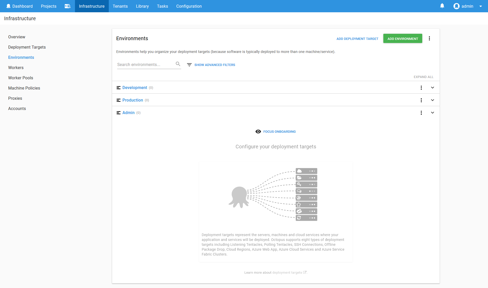
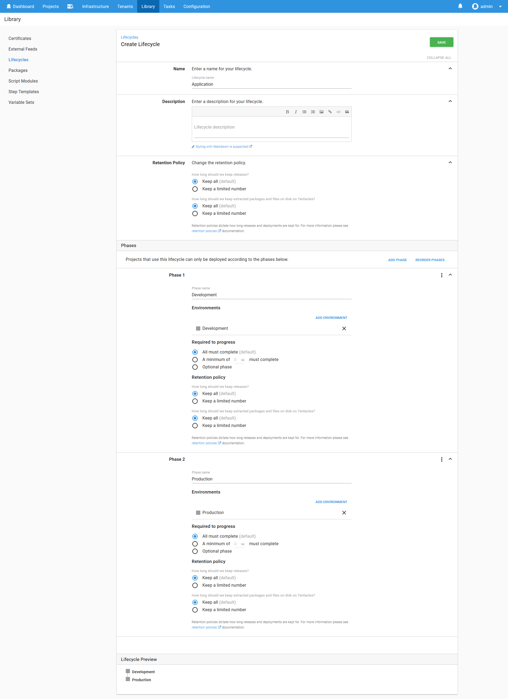
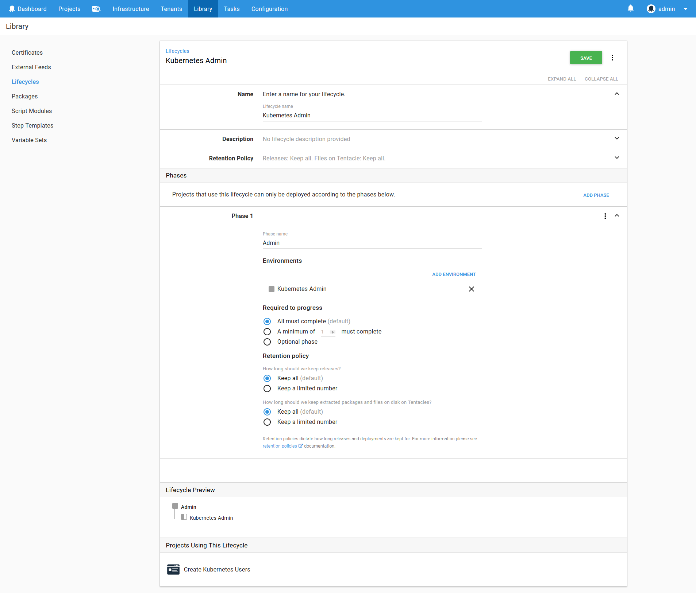
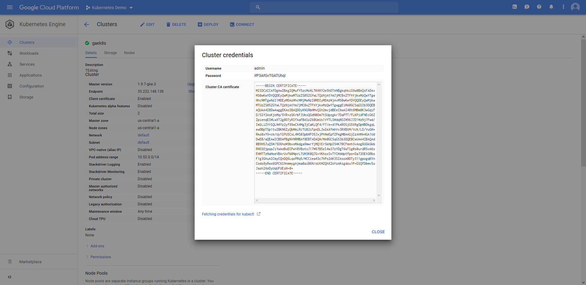
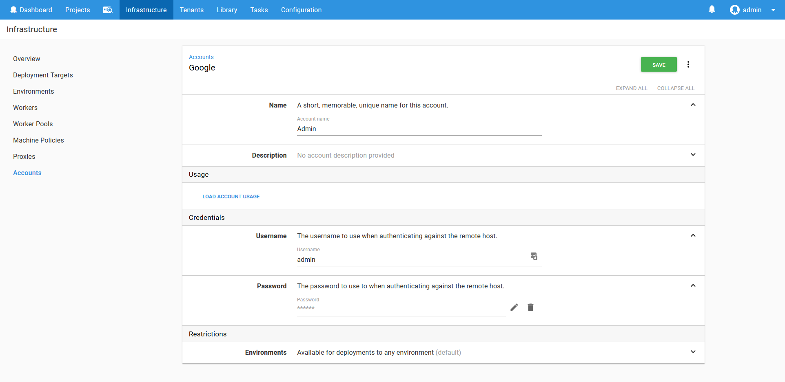
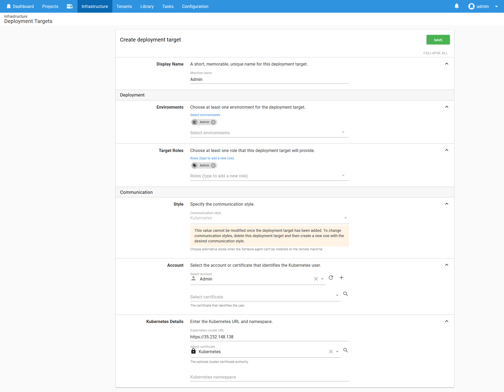
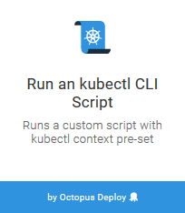
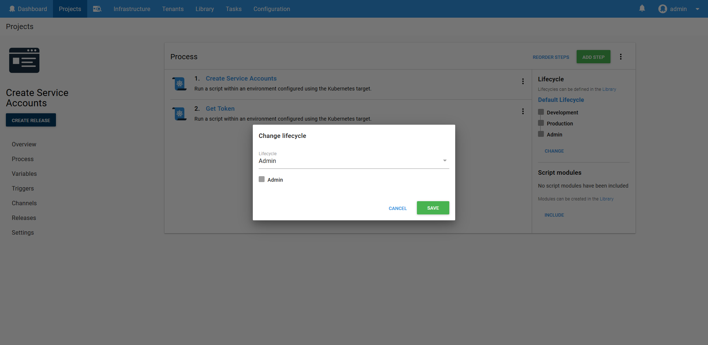
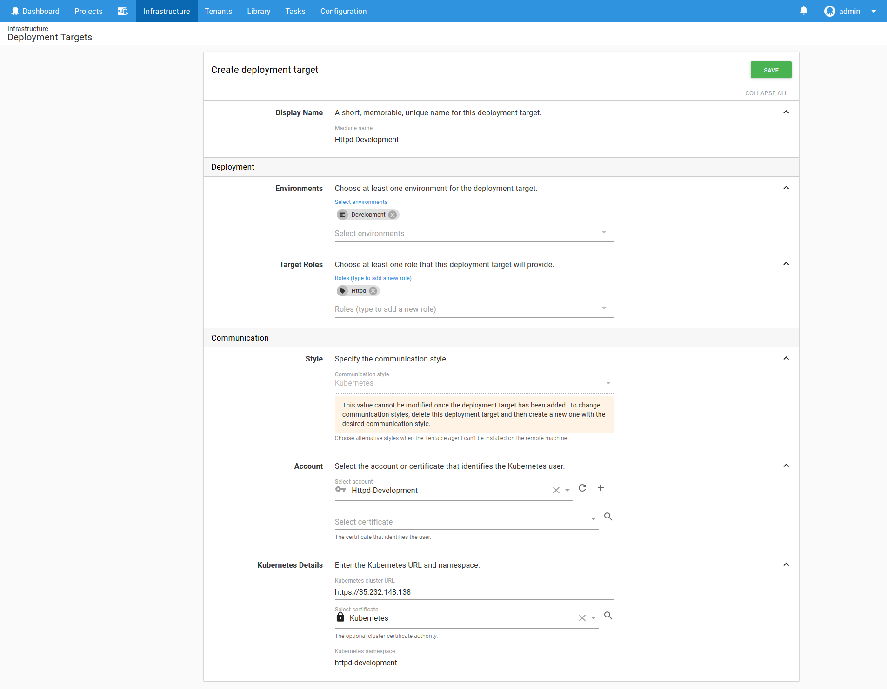

Octopus 2018.8 previews a number of new features to make managing Kubernetes deployments easy. These Kubernetes steps and targets have been designed to allow teams to deploy applications to Kubernetes taking advantage of the Octopus dashboards, security, account management, variable management and integration with other platforms and services.

In this blog post we'll walk through the process of deploying a simple Docker container to a Kubernetes cluster that hosts multiple environments.

:::warning
The Kubernetes functionality in Octopus 2018.8 is a preview only, and must not be used for production deployments or enabled on production Octopus instances.
:::

## Prerequisites

To follow along with this blog post, you will need to have a Kubernetes cluster already configured, and with Helm installed. This blog post will use the Kuberenetes service provided by Google Cloud, but any Kubernetes cluster will do.

[Helm](https://helm.sh/) is a package manager for Kuberenetes, and we'll use it to install some third party services into the Kubernetes cluster. Google Cloud provides [documentation](https://cloud.google.com/community/tutorials/nginx-ingress-gke#install-helm-in-cloud-shell) describing how to install Helm in their cloud, and other cloud providers will provide similar documentation.

## Preparing the Octopus Server

The Kubernetes steps in Octopus require that the `kubectl` executable be available on the path. One of the easiest ways to install `kubectl` is with [Chocolatey](https://chocolatey.org/packages/kubernetes-cli).

Likewise the Helm steps require the `helm` executable to be available on the path. Helm is also available from [Chocolatey](https://chocolatey.org/packages/kubernetes-helm).

## What we Will Create

Before we dive into the specifics of deploying a Kuberenetes application, it is worth understanding what we are trying to achieve with this example.

Our infrastructure has the following requirements:
* Two environments: Development and Production
* One Kuberenetes cluster
* A single application (we're deploying the [HTTPD Docker image](https://hub.docker.com/_/httpd/) as an example here)
* The application is exposed by a custom URL path like http://myapp/httpd
* Zero downtime deployments

At a high level, this is what we will end up with.


Don't worry if this diagram looks intimidating, as we'll build up each of these elements step by step.

## The environments

Although we listed two environments as requirements, we'll actually create three. The additional environment, called Admin, will be where we run utility scripts to create user accounts.



## The Lifecycles

The default lifecycle in Octopus assumes that all environments will be deployed to, one after the other. This is not the case for us. We have two distinct lifecycles: Development -> Production, and Admin as a standalone environment where utility scripts are run.

To model the progression from Development to Production, we'll create a lifecycle called Application. It will contain two phases, the first being deployments to the Development environment, and the second being deployments to the Production environment.



To model the scripts run against the Kubernetes cluster, we'll create a lifecycle called Admin. It will contain a single phase being deployments to the Admin environment.



## The Admin Target

A Kubernetes target in Octopus is conceptually a permission boundary within a Kubernetes cluster. It defines this boundary using a Kubernetes namespace and a Kubernetes account.

As the number of environments, teams, applications and services being deployed to a Kubernetes cluster grows, it is important to keep them isolated to prevent resources from accidentally being overwritten or deleted, or to prevent resources like CPU and memory being consumed by rouge deployments. Permissions and resource limits can be enforced by applying them to Kubernetes namespaces, and those restrictions are then applied to any deployment that is placed in the namespace.

In keeping with the practise of least privilege, each namespace will have a corresponding system account that only has privileges to that single namespace.

The combination of a namespace and a service account that is limited to the namespace makes up a typical Octopus Kubernetes target.

Having said that, we need some place to start in order to create the namespaces and service accounts, and for that we will create a Kubernetes target with the administrator credentials that deploys to the Admin environment.

First, we need to create an account that holds the administrator user credentials. The Kubernetes cluster in Google Cloud provides a user called `admin` with a randomly generated password that we can use.



These credentials are saved in a username/password Octopus account.



:::hint
Other cloud providers use different authentication schemes for their administrator users. See the [documentation](https://octopus.com/docs/deployment-examples/kubernetes-deployments/kubernetes-target#accounts) for details on using account types other than a username and password.
:::

Most Kubernetes clusters expose their API over HTTPS, but will often do so using an untrusted certificate. In order to communicate with the Kubernetes cluster, we can either disable any validation of the certificate, or provide the certificate as part of the Kubernetes target. Disabling certificate validation is not considered best practise, so we will instead upload the Kubernetes cluster certificate to Octopus.

The certificate is provided by Google as a PEM file, like this (copied from the Cluster CA certificate field in the Cluster credentials dialog):

```
-----BEGIN CERTIFICATE-----
MIIDCzCCAfOgAwIBAgIQMufY5zcMoXLTKHXY2e5hDTANBgkqhkiG9w0BAQsFADAv
MS0wKwYDVQQDEyQwMjkwMTUzZS05ZGYwLTQzNjAtYmJjMC0xZTFhYjkxMzQwYTgw
HhcNMTgwNzI1MDEyMDAzWhcNMjMwNzI0MDIyMDAzWjAvMS0wKwYDVQQDEyQwMjkw
MTUzZS05ZGYwLTQzNjAtYmJjMC0xZTFhYjkxMzQwYTgwggEiMA0GCSqGSIb3DQEB
AQUAA4IBDwAwggEKAoIBAQDDyKNlRbHMvQlh2mvjdBEeIXwAI40t6MBm8K3wGqiF
D/SlY2AsKjsMq/5VR+zlKrbFJUkxQGdN0Dm7tSUpzgkr7DaPTT/FLKPidFNEcG6Z
ZpienqESWLwXT2g8O7yRIfAaFBASzZ60UeUs1VYTLSWdqNSIW96JJD1WzNj7Fwd/
ImlLiZVVlQLN4Yz2yf99wCX4Mg3jCaKLQF4/f7/e+d1PkAROSjG5tRgOpHBDkgqL
ewDBpT5p1tuIBKN6ZyQbMkLRcTU82iFpnDLJwlkXfmhVv3RXBtM/VcK/LD/VuGH+
Rko8xY9+ckrUyYlPU5CxL4WS03pbHFO5JxjPhNeEpfZPAgMBAAGjIzAhMA4GA1Ud
DwEB/wQEAwICBDAPBgNVHRMBAf8EBTADAQH/MA0GCSqGSIb3DQEBCwUAA4IBAQAd
0B9H5JuQSW/5O6hoW9bvoMAdga9mwrYjMQ1ErSkHpI94K70CFmnh3vAog6UGkGkb
RN5SOjpqaJiYwAoBuECPwV8VBotsJ17W67B5zl4w37zYDgT6wTlg0s0urdRSvA6s
EHHTTzNaHoeVBArUvFb0NprL7UH3K0QJG+VKhsxSvTYIWddptfpo+Da72OEtGRbs
F1g3GhuAICmyCQnDQ6LqxPRq5/WCCiea43c7hPs2AK3SIAsoA0DTy311gpogqKVn
Cods8yRwx6GPC6l9nmmygAjma0ai06N/oUtWZQhX2oYzAKsgdzu1P+DlQfDbmv5u
Jash2XeDyUqUFUEsH+0+
-----END CERTIFICATE-----
```

This text is then saved to a file called `k8s.pem`, and uploaded to Octopus.


With the user account and the certificate saved, we can now create the Kubernetes target called Admin.

This target will deploy to the Admin environment, and take on a role that is also called Admin. The account will be the Admin account we created above, and the cluster certificate will reference the certificate we saved above.

Because this Admin target will be used to run utility scripts, we don't want to have it target a Kubernetes namespace, so that field is left blank.



We now have a target that we can use to prepare the service accounts for the other namespaces.

## The HTTPD Development Service Account

We now have a Kubernetes target, but this target is configured with the cluster administrator account. It is not a good idea to be running deployments with an administrator account, so what we need to do is create a namespace and service account that will allow us to deploy only the resources we need for our application.

To do this, we need to create four resources in the Kubernetes cluster: a namespace, a service account, a role and a role binding. We've already discussed namespaces and service accounts. A role defines the actions that can be applied and the resources they can be applied to. A role binding associates a service account with the role, granting the service account the permissions that were defined in the role.

Kubernetes can represent these resources as YAML, and YAML can represent multiple documents in a single file by separating them with a triple dash. So the YAML document below defines these four resources .

```yaml
---
kind: Namespace
apiVersion: v1
metadata:
  name: httpd-development
---
apiVersion: v1
kind: ServiceAccount
metadata:
  name: httpd-deployer
  namespace: httpd-development
---
kind: Role
apiVersion: rbac.authorization.k8s.io/v1
metadata:
  namespace: httpd-development
  name: httpd-deployer-role
rules:
- apiGroups: ["", "extensions", "apps"]
  resources: ["deployments", "replicasets", "pods", "services", "ingresses", "secrets", "configmaps"]
  verbs: ["get", "list", "watch", "create", "update", "patch", "delete"]
---
kind: RoleBinding
apiVersion: rbac.authorization.k8s.io/v1
metadata:
  name: httpd-deployer-binding
  namespace: httpd-development
subjects:
- kind: ServiceAccount
  name: httpd-deployer
  apiGroup: ""
roleRef:
  kind: Role
  name: httpd-deployer-role
  apiGroup: ""
```

To create these resources, we need to save the YAML as a file, and then use `kubectl` to create them in the cluster. To do this, we use the `Run a kubectl CLI Script` step.



This step will then target the Admin Kubernetes target, and run the following script, which saves the YAML to a file and then uses `kubectl` to apply the YAML.

```PowerShell
Set-Content -Path serviceaccount.yml -Value @"
---
kind: Namespace
apiVersion: v1
metadata:
  name: httpd-development
---
apiVersion: v1
kind: ServiceAccount
metadata:
  name: httpd-deployer
  namespace: httpd-development
---
kind: Role
apiVersion: rbac.authorization.k8s.io/v1
metadata:
  namespace: httpd-development
  name: httpd-deployer-role
rules:
- apiGroups: ["", "extensions", "apps"]
  resources: ["deployments", "replicasets", "pods", "services", "ingresses", "secrets", "configmaps"]
  verbs: ["get", "list", "watch", "create", "update", "patch", "delete"]
---
kind: RoleBinding
apiVersion: rbac.authorization.k8s.io/v1
metadata:
  name: httpd-deployer-binding
  namespace: httpd-development
subjects:
- kind: ServiceAccount
  name: httpd-deployer
  apiGroup: ""
roleRef:
  kind: Role
  name: httpd-deployer-role
  apiGroup: ""
"@

kubectl apply -f serviceaccount.yml
```


Once this script is run, a service account called `httpd-deployer` will be created. This service account is automatically assigned a token that we can use to authenticate with the Kubernetes cluster. We can run a second script to get this token.

```
$user="httpd-deployer"
$namespace="httpd-development"
$data = kubectl get secret $(kubectl get serviceaccount $user -o jsonpath="{.secrets[0].name}" --namespace=$namespace) -o jsonpath="{.data.token}" --namespace=$namespace
[System.Text.Encoding]::ASCII.GetString([System.Convert]::FromBase64String($data))
```

:::warning
We have retrieved the token as part of a script step here for demonstration purposes only. Displaying the token in the log output is a security risk, and should be done with caution.
:::

Before we deploy the script, we need to make sure the project is using the Admin lifecycle.



We can now run the script, which will create the service account and display the token, which in our case looks like

```
eyJhbGciOiJSUzI1NiIsInR5cCI6IkpXVCJ9.eyJpc3MiOiJrdWJlcm5ldGVzL3NlcnZpY2VhY2NvdW50Iiwia3ViZXJuZXRlcy5pby9zZXJ2aWNlYWNjb3VudC9uYW1lc3BhY2UiOiJodHRwZC1kZXZlbG9wbWVudCIsImt1YmVybmV0ZXMuaW8vc2VydmljZWFjY291bnQvc2VjcmV0Lm5hbWUiOiJodHRwZC1kZXBsb3llci10b2tlbi0ycG1ndCIsImt1YmVybmV0ZXMuaW8vc2VydmljZWFjY291bnQvc2VydmljZS1hY2NvdW50Lm5hbWUiOiJodHRwZC1kZXBsb3llciIsImt1YmVybmV0ZXMuaW8vc2VydmljZWFjY291bnQvc2VydmljZS1hY2NvdW50LnVpZCI6IjliZGQzYWQ0LTk5ZTktMTFlOC04ODdmLTQyMDEwYTgwMDA5MyIsInN1YiI6InN5c3RlbTpzZXJ2aWNlYWNjb3VudDpodHRwZC1kZXZlbG9wbWVudDpodHRwZC1kZXBsb3llciJ9.DDiMDOmznf4S8ClHO30RvSZNGHN_7WYk9-FABaLkSC-mIunWtJHiT_lEovbUToogM0fnG1ISueundAZ6tsRRY-eVwefLvhgy1Ync2QlLwaqeoUenGt1d36lH5YFb7gYmon2UD54DGEdYNzafI1TLWi3DS1apjSUc3kWh54HfZXSeQmCE7fGu4wNoJz3WU1MEQZx8KqM9__lVDxtPGmE2pyZX6OYBXoAQv9-cfs_1GP009exfkVWbVYdDFDoEko21KDAORjyKu4ow4KvVXOXzcfgCKe_UlYyuLg0A6NRyc8lDj4D34R1crIPvqWmXVy5BMK4ENchhYEC62nsInptZAg
```


## The HTTPD Development Target

We now have everything we need to create a target that will be used to deploy the Httpd application in the Development environment.

We start by creating a token account in Octopus with the token that was returned above.


We then use this token in a new Kubernetes target called `Httpd Development`.

Notice here that the `Target Roles` includes a role that matches the name of the application being deployed, and that the `Kubernetes namespace` is set to `httpd-development`. The service account we created only has permissions to deploy into the `httpd-development` namespace, and will only be used to deploy the application Httpd into the `Development` environment.

This target represents the intersection of an application and an environment, using a namespace to enforce the permission boundary. This is a pattern we'll repeat over and over with each application and environment.



Now that we have a target to deploy to, let's deploy our first application!

## The HTTPD Application

The `Deploy Kubernetes containers` step provides an opinionated process for deploying applications to a Kubernetes cluster. This step provides a standard pattern for creating a collection of Kubernetes resources that work together to provide resilient deployments.


The application we'll be deploying is [HTTPD](https://hub.docker.com/_/httpd/). This is a popular web server from Apache, and while we won't be doing anything more than displaying static text as a web page with it, HTTPD is a useful example given most applications deployed to Kubernetes will expose HTTP ports just like HTTPD does.
