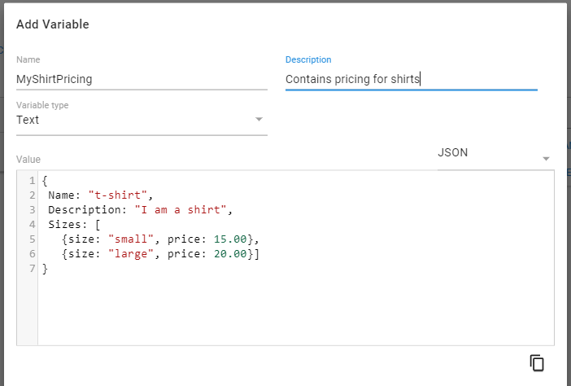
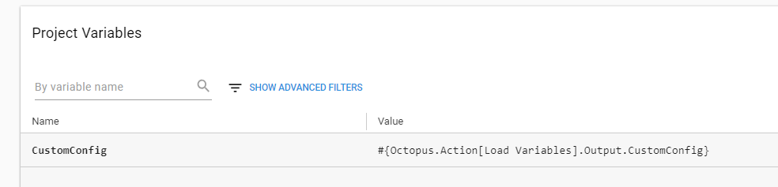

At Octopus Deploy, we pride ourselves on the level of support that we provide to our customers and always attempt to respond to tickets within a business day. Sometimes they are bug reports (not that _I_ ever write buggy code right?) but often it is just users looking for some guidance on how to help them achieve some particular deployment pattern in Octopus. An interesting question was brought to my attention last week that resulted in uncovering a useful ability that could be accomplished by combining a couple of our [variable](https://octopus.com/docs/deployment-process/variables) features. It's a question I had heard before so thought it might be a nice trick to share.

One of the questions asked in the email was:
> ...is there a way in Octopus to have variables managed from outside the tool...

As our readers are probably aware, the variables available during a deployment can be contributed through various places throughout Octopus; through Project variables, tenant variables, Library variables or even the targets themselves. But what about if you want to make use of variables in your deployment from _outside_ Octopus itself?

The first reaction might be to just encourage the use of the [API](https://octopus.com/docs/api-and-integration/api) to run a process externally that keeps Octopus variables in sync with the external source. But that feels like something that would lead to the perfect example of yak shaving. Can't we do better?

## Variables from Outside

First lets start a step that actually obtains these variables during the deployment.

In this case we will retrieve the variables from a package but it could come from anywhere, possibly scripted from an external HTTP configuration store or a third party tool or service.

### Json Variables
What we plan to do is set these variables into an output variable so that we can access it in the next set of steps. Using Octopus Deploy's built-in [JSON variable parsing](https://octopus.com/docs/deployment-process/variables/variable-substitution-syntax#VariableSubstitutionSyntax-JSONParsingjson) capability, we can refer directly to properties inside a JSON object as if it was a normal variable. So given a variable like:



We can actually reference the sub properties directly in our project
MyShirtPricing


## Output Variables
Once we have access to the variables we need, it's just a matter of exporting them from our retrieval step as an [output variable](https://octopus.com/docs/deployment-process/variables/output-variables). Output variables provide a mechanism for values from one step to be used in subsequent steps. Keep in mind that if you have steps running in parallel they will not have access to each other's variables since its not until each step ends that Octopus is able to actually combine these output variables into the variable collection of the deployment.

Setting our custom variables into an output variable is a matter of just calling a special command that is included by octopus in standard script execution:

```

```

While this step can be skipped if you only have a couple of key/value pairs that you want to use in subsequent steps, utilizing the JSON variable parsing makes things a lots simpler to retrieve and use them all as a single variable in Octopus rather than adding them individually.

Subsequent steps will be able to refer to this value using the following variable
```
Write-Host #{Octopus.Action[Load Variables].Output.CustomConfig}
```

## Simplified Variables
But that looks a little verbose right? And what about when someone renames the step or the output variable. You would need to go through all the places that use it and make sure they are updated. Lets go one better and add another project variable that is itself just a reference to this value.



Note how our new variable `CustomConfig` will itself just directly replaced with the longer `#{Octopus.Action[Load Variables].Output.CustomConfig}`. This means in our steps we can now refer to the variable as `#{CustomConfig.Foo}` and it will all "just work" (citation needed). Keep in mind that since the output variable wont be available until _after_ the `Load Variables` steps has run, if you try to use `#{CustomConfig}` in previous steps it will just return a blank value.

This ability is also why its useful to providing all the custom variables in a single JSON object, even if that is put together manually from in the `Load Variables` step before adding as an output variable. Referring to it via the `CustomConfig` variable means we can add a single variable pointer in the project variables list and no matter how many values it contains at runtime, they can all be addressed directly from the one root variable.

## Sensitive Variables
But wait, what about sensitive values like passwords? As of `2018.5.2` the output variables can now be [marked as such](https://octopus.com/docs/deployment-process/variables/output-variables#sensitive-output-variables) when being added to Octopus. If you are adding a single value as an output variable (as opposed to the JSON approach) you can go ahead and just mark it as sensitive. It will then be obfuscated in any logs generated. For our example that uses a JSON object this approach wont work since then the _whole json string_ will be considered sensitive, and if you echo out a subset of tht string, say the `MyConfig.NuclearKeys` value, then it will be printed in cleartext since obfuscation logic wont consider that a match. To get around this limitation, we just need to add those sensitive values as _additional_ output variables, but this time marked as sensitive. 

Octopus will then notice that the value printed by `#{MyConfig.NuclearKeys}` matches the value of a sensitive variable called `Octopus.Action[Load Variables].Output.NuclearKeys`. Since we are not using this additional value directly and just using the shortened one, we dont need to add a project variable shortcut, it's sufficient to just let Octopus know that the value is sensitive.