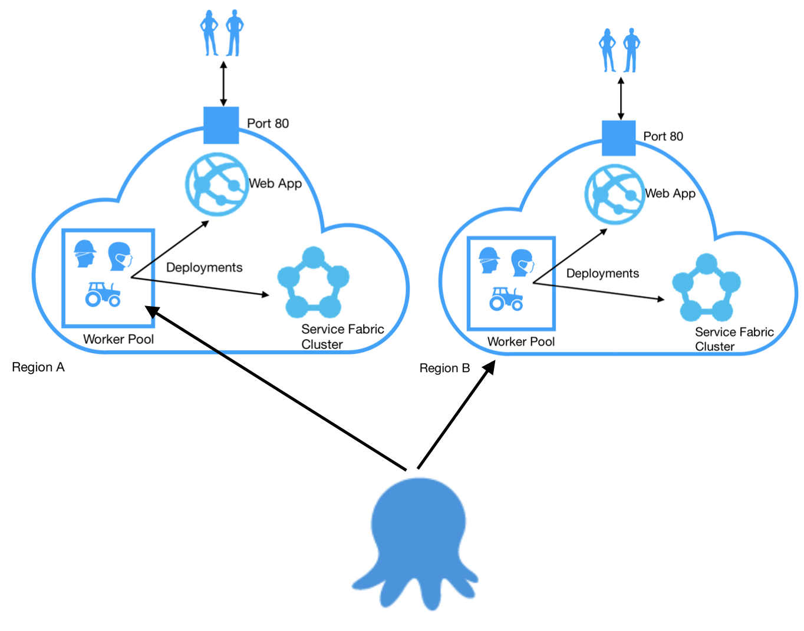

[External Workers](https://octopus.com/docs/infrastructure/workers/index.md) allow you to move deployment work off your Octopus Server and onto to other machines. In previous posts about Octopus Workers, I've looked at [how Workers works](https://octopus.com/blog/octopus-workers) and the [performance improvements](https://octopus.com/blog/workers-performance) Workers can bring to your Octopus setup.  In this post, I'm going to dig into how we've setup Workers for PaaS Cloud targets - that's Azure targets at the moment, and, real soon, Kubernetes targets.

I'm going to talk about how to set up your cloud targets to have their own default Worker pools.  This means, for example, that you can provision Worker pools to be in the same network as your Azure Service Fabric, so the machines that do the deployment are right there with the target.  Similarly, as you progress your Kubernetes project through environments, you can have Worker pools in the right places to support the deployment of your cluster.  This can reduce network costs, speed up the deployment, and means you can dial up security with polling Workers, so nothing, not even the Octopus Server, needs to be able to reach into your infrastructure.

## Cloud targets get their own default pools

First, a quick recap.  Pretty much every step in Octopus runs through [Calamari](https://github.com/OctopusDeploy/Calamari), our open-source, conventions-based deployment executable.  Calarami is invoked on either the deployment target itself, or a Worker.  All Azure (and, soon, Kubernetes) steps run on a Worker.  Octopus comes with a Worker, which you can [configure](https://octopus.com/docs/administration/workers/built-in-worker#Running-tasks-on-the-Octopus-Server-as-a-different-user) and even switch off, baked into the Octopus server.  If you don't specify otherwise, a step that needs a Worker runs on a Worker from the default Worker Pool, which starts out containing just the built-in Worker on the Octopus server.

So, all steps to Cloud targets run on a Worker.  If you don't specify, you get the default pool.  If you specify a different pool, you get a Worker from that pool.  But you can also attach a default pool to each Cloud target.  When creating or editing a Cloud target you get the following option.

If you select a pool here, then, when a step would otherwise use a Worker from the default pool for this target, Octopus will instead choose a worker from the target's default pool. 

That helps firstly with health checks, but also gives you some nice deployment options.

## Health checks and cloud targets

With health checks, there's no option to select a pool.  So we could just run them from the Octopus server, but what if you've turned off the built-in Worker, or, what if, for example, you don't want your Azure targets to expose management ports to the outside world.  

So, Octopus chooses a Worker from the default Worker Pool to run health checks for Cloud targets.  If the default pool is empty, then that will be the built-in Worker on the Octopus server.  If there are external workers in the default pool, then the health checks will run on those external workers.  If a target specifies it's own default pool, the health check for that target runs on a Worker from its default pool.  Including, for example, that you can use Linux (SSH) workers for you Kubernetes targets.

Let's look at some setups that use default pools for cloud targets.

## Workers with Cloud Targets

If you've deployed to Azure using Octopus before, or do so without Workers, then your deployment setup works like on the left of the diagram below.  You might have all sorts of virtual networks and load balancers and access options set up in Azure, but in the end, the Built-in Worker on the Octopus server is managing and deploying to your Azure infrastructure, probably through ports 19000, or 19080 - the same ports the Azure Management Portal uses if you browse your infrastructure on the Web.  In this kind of set up, Octopus calls directly into you infrastructure and any package transfers happen from the Octopus server.  

With Workers, you now have the option to provision Workers within your Azure infrastructure and attach the Worker Pool as the default pool for those targets, creating a setup like on the right above.  In this case, The Octopus server invokes a Calamari process on one of the Workers, and it's the worker that accesses the Azure targets and performs the actual deployment work.

Doing so opens up a number of benefits.  [Last time](https://octopus.com/blog/workers-performance) I looked at performance.  Where you place your Workers, your package feeds, and how your networks are configured can all affect your networking costs (though, of course, Worker VMs cost too) and deployment efficiency.  For example, colocation of Workers and targets is likely to reduce the round trip time (compared to the Octopus server to target time), and options for Workers to aqcuire their own packages reduces the amount of traffic the Octopus server has to push out.  Regardless of how you get the packages there, you'll see see some improvements in network use and CPU cost on your Octopus server. If you use the same package more than once, you'll also save becuase the Worker will already have it.

If you deploy to multiple regions, you can of course provision Worker pools for each region, match then up with your targets, and Octopus will use the right Workers when deploying to the different regions.

## Workers Scoped to Environments

Because worker pools can be attached to cloud targets and the actual targets change per environment, that means, as well as effectively being scoped by region (as in the diagram above), Workers for cloud targets can be environment scoped as well.  If you attach a pool of Dev Workers to your cloud targets in your Dev environment and a different pool of Prod Workers to the targets in your Prod environment, then your deployments will select from different pools depending on the targets being deployed to.

It's not yet possible to scope worker pools in general, so this is a little bonus for now, just for cloud targets.

This works just as well for cloud hosted Service Fabric as it does for self hosted.  Similarly, it works great for on-prem Dev and Test Kubernetes evironments with local Workers verses in Cloud Prod environments with cloud hosted Workers.

## Kubernetes

Our new Kubernetes targets also get the option of default worker pools per target.  That means you can have the Workers that provision and control you Kubernetes infrastructure whereever makes the best sense for each project and environment you deploy to.

It also means you can tweak the tools on your Workers to suit the targets.  For example, if the version of `kubectl` or `helm` is important, then you can set the Worker pools for each cluster to contain the correct tooling you need for that project.

So if across your organisation you deploy different projects with different tooling requirements, no problems: with Workers, you're not fixed to the same toolset across your whole Octopus installation; you can pick the tooling you need per target cluster.

## Workers in Secured Networks

Some customers have asked about blocking off their cloud environments or on prem Servic Fabric to external access.  Polling Tentacle Workers attached to cloud targets works great in these cases.

As well as allowing you to lock-down your deployments, it's another good reason that we hang health checks for Cloud targets of their default pools: in a setup like this, the Octopus server couldn't reach in to do the health check.

  You need only expose the ports you want your services to actually expose and the polling Workers perform the deployments, without needing to have deployment ports open to the outside world.  

## Conclusions

This has been a quick post, just to let you know some of the configuration and networking options you now have available with Octopus workers.  With default Worker Pools attached to you cloud targets you can control your networking infrastructure and package acquisitions, decrease the roundtrip time from your targets to the deployment machine, reduce the load on your Octopus server, scale up your deployment infrastructure with more Workers and set security restrictions around you cloud infrastructure, while still being able to deploy from Octopus.

Currently, default pools are attached to Azure Web App, Azure Service Fabric, Azure Cloud Service and Cloud Region deployment targets.  Our Kubernetes targets get their own default Worker pools too.

Happy Cloud Deployments!
