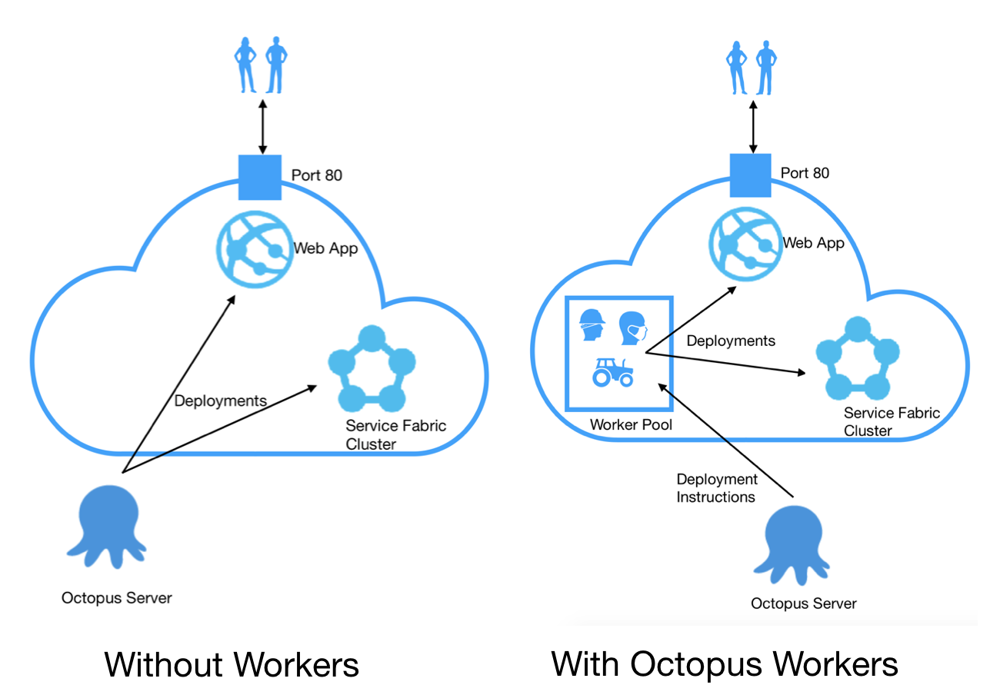
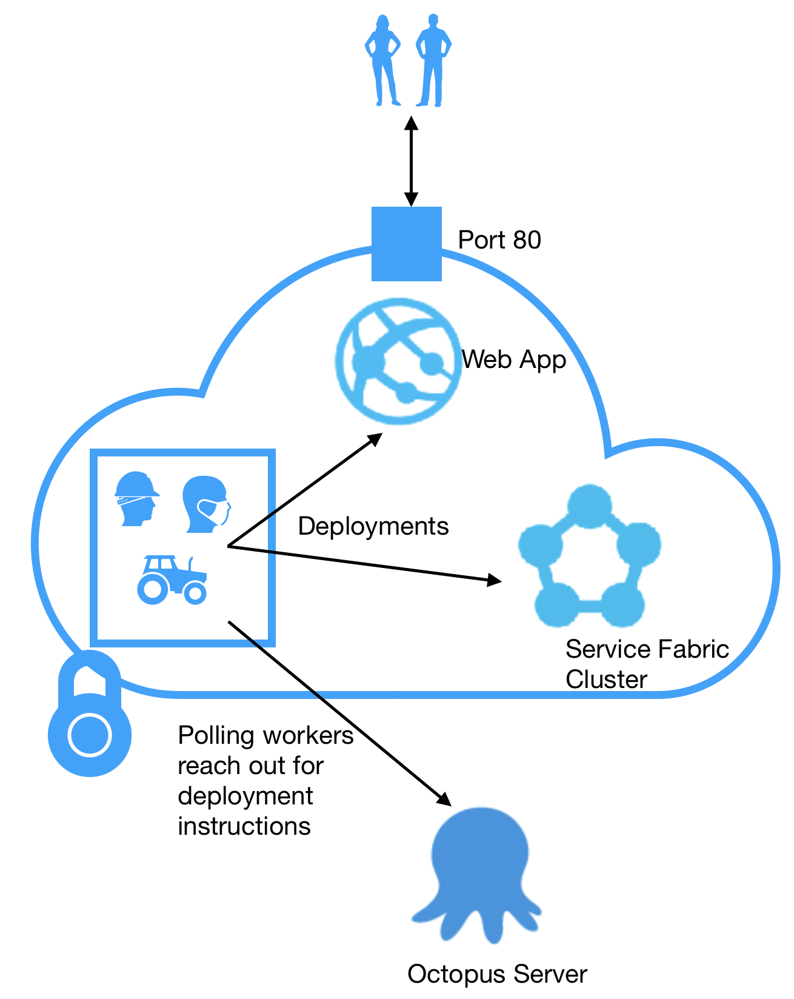

[External Workers](https://octopus.com/docs/infrastructure/workers/index.md) allow you to move deployment work off your Octopus Server and onto to other machines. In previous posts about Octopus Workers, I've looked at [how Workers works](https://octopus.com/blog/octopus-workers) and the [performance improvements](https://octopus.com/blog/workers-performance) Workers can bring to your Octopus setup.  In this post, I'm going to dig into how we've setup Workers for PaaS Cloud targets - that's Azure targets at the moment, and, real soon, Kubernetes targets.

I'm going to talk about how to set up your cloud targets to have their own default Worker pools.  This means, for example, that you can provision Worker pools to be in the same network as your Azure Service Fabric, so the machines that do the deployment are right there with the target.  This can reduce network costs, speed up the deployment, and means you can dial up security and turn off deployment access to the Azure targets, so nothing, not even the Octopus Server, needs to be able to reach into your infrastructure.

## Cloud targets get their own default pools

First, a quick recap.  Pretty much every step in Octopus runs through [Calamari](https://github.com/OctopusDeploy/Calamari), our open-source, conventions-based deployment executable.  Calarami is invoked on either the deployment target itself, or a Worker.  All Azure (and, soon, Kubernetes) steps run on a Worker.  Octopus comes with a Worker baked into the server (which you can [configure](https://octopus.com/docs/administration/workers/built-in-worker#Running-tasks-on-the-Octopus-Server-as-a-different-user) and even switch off).  If you don't specify otherwise, a step that needs a Worker runs on a Worker from the default Worker Pool, which starts out containing just the built-in Worker on the Octopus server.

So, all steps to Cloud targets run on a Worker.  If you don't specify, you get the default pool.  If you specify a different pool, you get a Worker from that pool.  But you can also attach a default pool to each Cloud target.  When creating or editing a Cloud target you get the following option.

If you select a pool here, then, when a step would otherwise use a Worker from the default pool for this target, Octopus will instead choose a worker from the target's default pool. 

That helps firstly with health checks, but also gives you some nice deployment options.

## Health checks and cloud targets

With health checks, there's no option to select a pool.  So we could just run them from the Octopus server, but what if you you've turned off the built-in Worker, or, what if, for example, you don't want your Azure targets to expose management ports to the outside world.  So health checks for Cloud targets run on a Worker from the default worker pool, or, if a target specifies it's own default, it runs on a Worker from the target's default pool.  

Let's look at some setups that use default pools for cloud targets.

## Workers with cloud targets

If you've deployed to Azure using Octopus before, or do so without Workers, then your deployment setup works like on the left of the diagram below.  You might have all sorts of virtual networks and load balancers and access options set up, but in the end, the Built-in Worker on the Octopus server is managing and deploying to your Azure infrastructure, probably through ports 19000, or 19080 - the same ports the Azure Management Portal uses if you browse your infrastructure on the Web.  In this kind of set up, Octopus calls directly into you infrastructure and any package transfers happen from the Octopus server.  

So that means you've got outside access to your infrastructure through, for example, port 80 for Web access and through 19000 or 19080 for deployments and that Octopus is always reaching in to deploy packages and manage infrastructure.

With Workers, you now have the option to provision Workers with your Azure infrastructure and attach the Worker Pool as the default pool for those targets, creating a setup like on the right above.  In this case, The Octopus server invokes a Calamari process on one of the Workers, and it's the worker that accesses the Azure targets and performs the actual deployment work.

Doing so opens up a number of benefits.  [Last time](https://octopus.com/blog/workers-performance) I looked at performance.  Where you place your Workers, your package feeds, and how your networks are configured can all affect your networking costs (though, of course, Worker VMs cost too) and deployment efficiency.  For example, colocation of Workers and targets is likely to reduce the round trip time (compared to the Octopus server to target time), and options for workers to aqcuire their own packages reduces the amount of traffic the Octopus server has to push out.  Regardless of how you get the packages there, you'll see see some improvements in network use and CPU cost on your server. If you use the same package more than once, you'll also save becuase the Worker will already have it.

If you deploy to multiple regions, you can of course provision Worker pools for each region, match then up with your targets, and Octopus will use the right Workers when deploying to the different regions.

## Workers in secured networks

One thing we certainly get asked about is cases where customers don't want to expose Azure management ports to the outside world.  Blocking off 19000 and 19080 to external traffic reduces the risk of mistakes and attack vectors.  I've seen examples that advise putting an RDP jump box into a virtual network that can access the required ports in your Cloud infrastructure, and using the jump box as a deployment machine.  Now that's all good and well, but it's pretty clumsy and still exposes extra ports to the outside world.  With Octopus you can go much better.

Octopus Polling tentacles are machines that needn't expose any ports to the outside world.  Polling tentacles reach out to the Octopus server and ask if there's work to do.  So with Polling tentacles, you can create infrastructure that's completely locked down.  You need only expose the ports you want you services to actually expose and the polling Workers perform the deployments, without needing to have deployment ports open.  Taking that route gives you a infrastructure like this.

As well as allowing you to lock-down your deployments, it's another good reason that we hang health checks for Cloud targets of their default pools: in a setup like this, the Octopus server couldn't reach in to do the health check.

## Conclusions

This has been a quick post, just to let you know some of the configuration and networking options you now have available with Octopus workers.  With default Worker Pools attached to you cloud targets you can control your networking infrastructure and package acquisitions, decrease the roundtrip time from your targets to the deployment machine, reduce the load on your Octopus server, scale up your deployment infrastructure with more Workers and set security restrictions around you cloud infrastructure, but still be able to deploy.

Currently, default pools are attached to Azure Web App, Azure Service Fabric, Azure Cloud Service and Cloud Region deployment targets.  We're adding more container support at the moment and, with that, our Kubernetes targets get their own default Worker pools too.

Happy Cloud Deployments!
