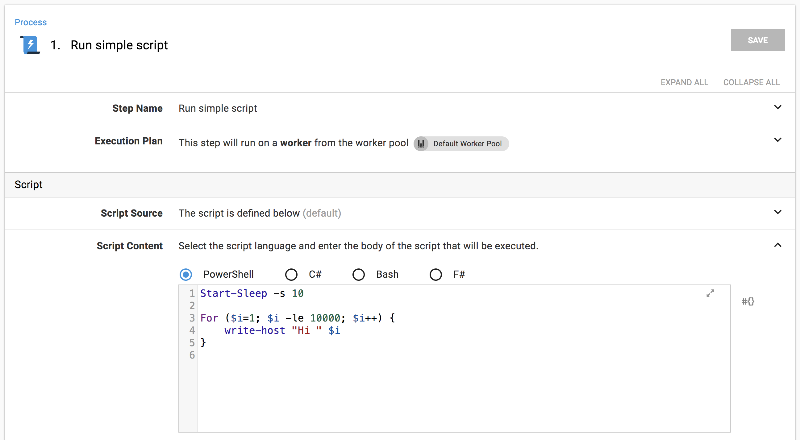
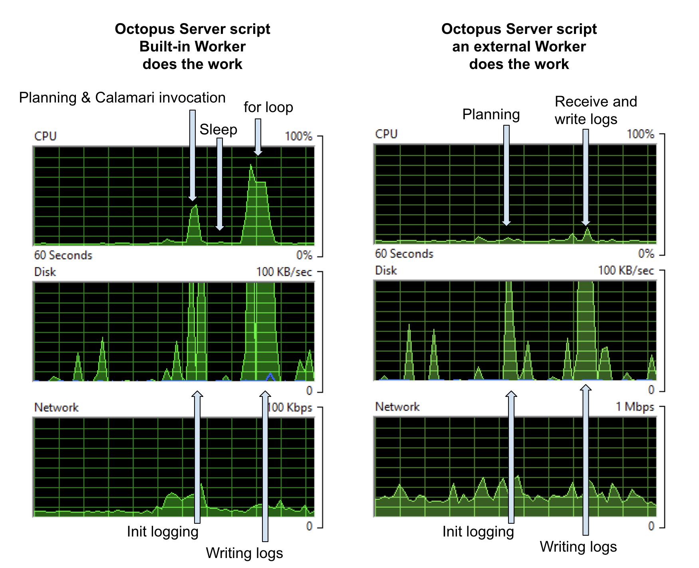
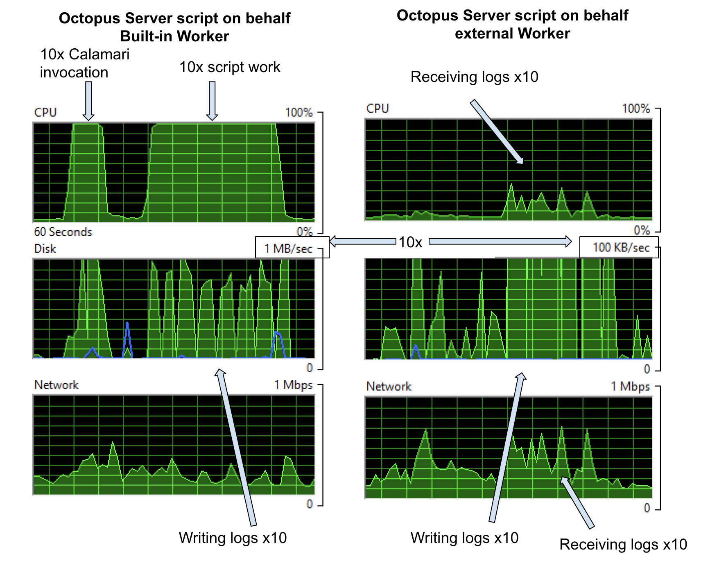
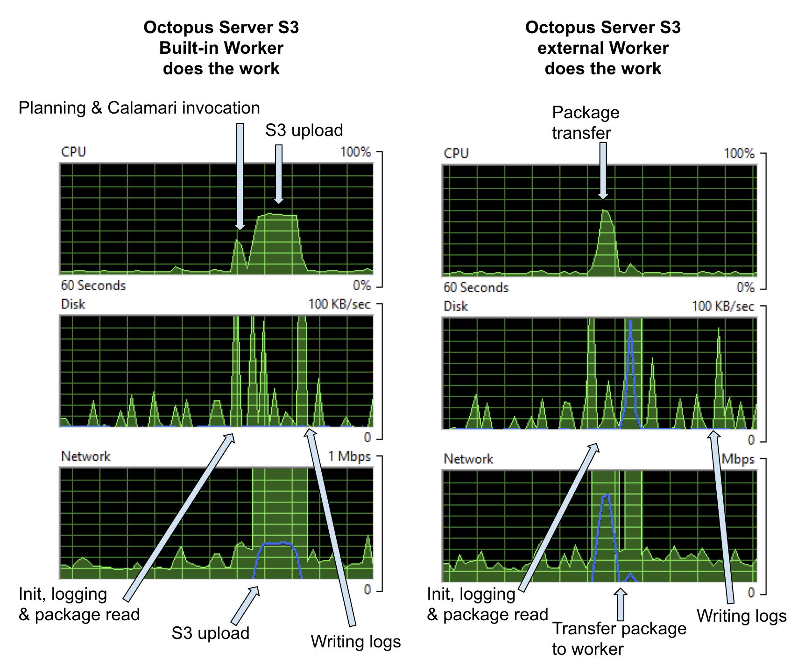
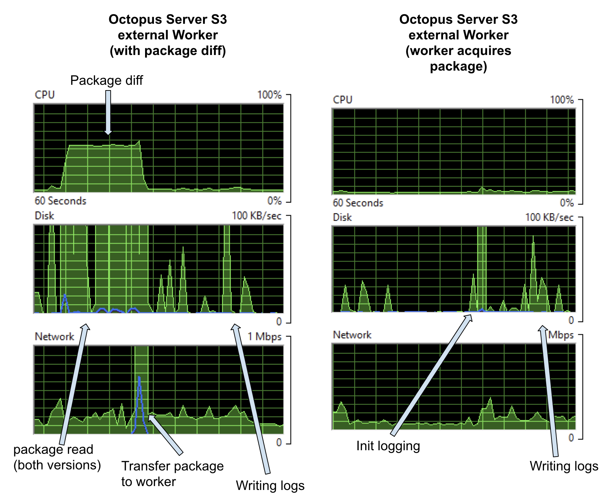
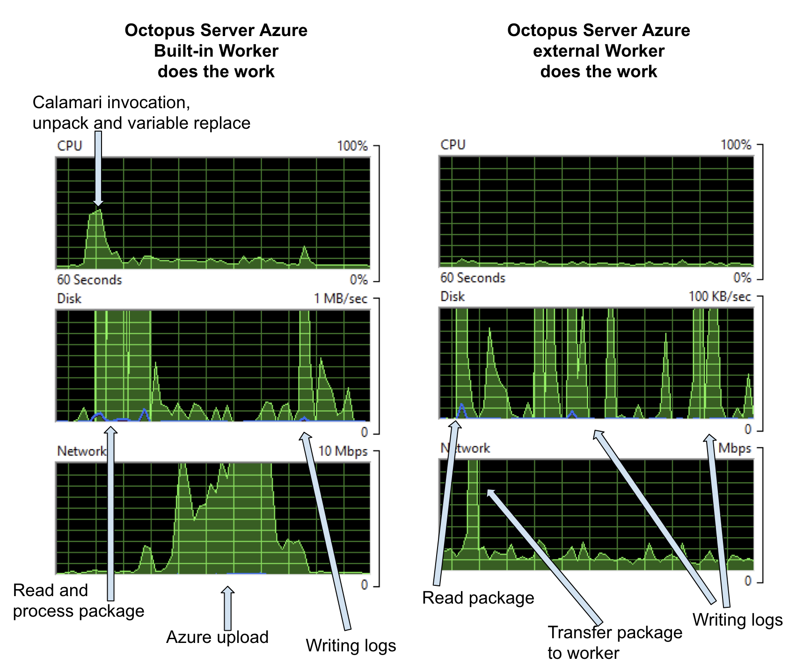
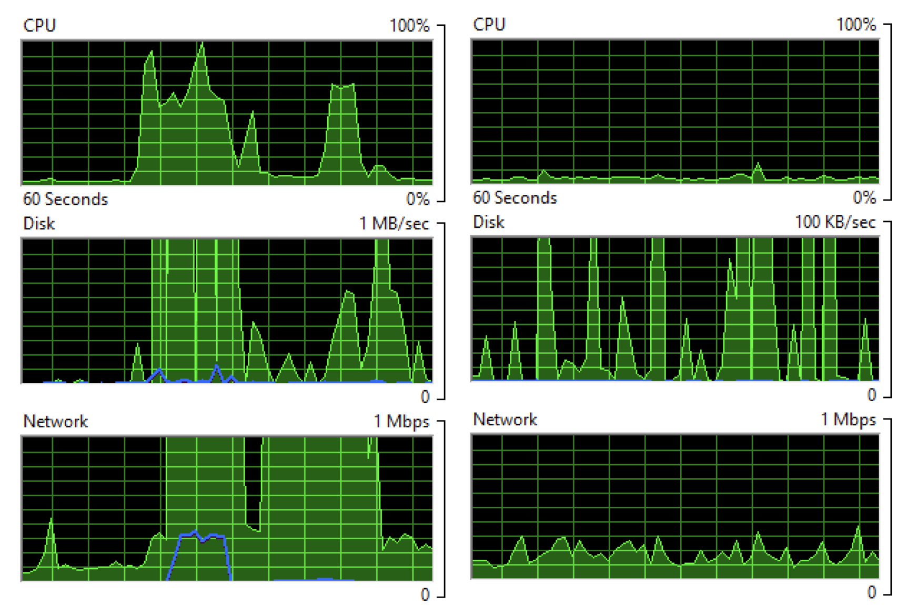

[In the last post](https://octopus.com/blog/octopus-workers), I introduced Workers and some of the things that can be done with them. I also promised to get back to you with more details. Since then, we've shipped Workers in version 2018.7.0 and Octopus customers have picked it up and started using it. Now I've got a couple more posts lined up.  

[External Workers](https://octopus.com/docs/infrastructure/workers/index.md) let you shift some of the deployment work from your Octopus Server to other machines.  You might move work over to Workers simply from a security point of view, e.g. so that scripts aren't running on your Octopus Server box.  But there are other reasons to move work off the server.  One of those is performance.  This time, I'm going to look at the effect of using Workers on you Octopus Server's performance during deployments.  

Now, this is a case where I have to start with the classic warning that your mileage may vary.  There's lots going on in your Octopus Server.  Depending on your setup, you might have the database on the same machine, you might have it elsewhere (and we [recommend you do](https://octopus.com/docs/administration/performance#tips)), you might have logs stored locally or on a share, Octopus is running systems task as well as your deployments and your [deployment patterns will greatly affect how much work the server is doing](https://octopus.com/docs/deployment-process/performance#task-logs).  In this post, I'm going to look at the CPU, disk, and network load on the server during deployments.

We're always driving pretty hard to improve the [performance](https://octopus.com/docs/administration/performance) of Octopus.  Sometimes that's database performance.  Sometimes, it's finding parts where we can optimize or cache to improve API performance.  This post isn't about those bits.  It's about when the wheels hit the road when you are running a deployment.  Octopus can't optimize around these bits.  It's the actual work of the deployment, so it has to be done.  But you can distribute the workload to get the best results for you.

Your Octopus Server is the centerpiece of your deployment infrastructure, and an overloaded Octopus Server makes deployments slow and deployers sad. However, using Workers, you can effectively shift CPU, Disk, and Network load to external machines, giving your Octopus Server a break and your deployments a boost.

In this post, I'm going to pick things apart so you can understand the working pieces and what the tradeoffs are in distributing your server's work out to Worker machines.  To do that, I'm going to run everything from a perspective you can see.  So this isn't about what I can measure internally, it's about what you can observe on your machine and how that affects your server and your deployment times.

To do that, I'm not going to talk in numbers or benchmarks, but more simply by just showing graphs from Resource Monitor.  No fancy tools, just a fresh Octopus Server in AWS, a tool everyone has, and an interpretation of what's going on as the graphs spike up and down.

The cases that follow are toy examples, designed to show concepts, not to represent real deployment patterns.  However, if I can demonstrate load shedding on these simple examples, image the load shedding you might get on your Octopus instance, and the consequent improvements in deployments and usability, and a more robust Octopus Server setup.

## Case 1: A Simple Script

OK, let's warm up with a really simple deployment.  A script to simulate a task at deployment time.  It sleeps for 10 seconds then spins to 10,000 writing log messages.



Because it's a tight loop, it'll hit the CPU; because it writes logs, it'll hit the disk.  I've targeted the script at the Default Worker Pool.  So, if the pool is empty, it will run on the Built-in Worker on the Octopus Server, if the pool contains Workers, it'll run on an external Worker machine.  

When the default pool is empty, the step runs on the Built-in Worker on the Octopus Server, and the load on the Octopus Server machine looks like the graphs on the left below.  When I put a Worker in the default pool, the step runs on that external Worker and the load on the Octopus Server machine looks like the graphs on the right below.



In my setup, both the database and log storage are on the Octopus Server machine, so the first hit on the CPU contains some database work as well as planning the deployment.  But the database is so small in my examples that I'll ignore its effects.

On the left, we see a CPU hit that turns out to be the cost of invoking a fresh [Calamari](https://github.com/OctopusDeploy/Calamari) (our open-source, conventions-based deployment executable) process for the Built-in Worker.  The sleep separates that work from the second spike, which is mostly the `for` loop.  Under 'Disk', you can see spikes for setting up logs etc and then writing the logs to disk.  The scale on the disk graph lets you know we weren't taxing anything too much with this simple log write.

On the right, when the actual work happens on an external Worker machine, the disk activity is much the same as before: because, in this example, the server is on the same box as the logs storage, those costs are always going to be seen here.  However, the CPU usage is gone,  demonstrating that the initial spike in the first graph is the Calamari invocation.  There is some network activity transferring the logs from the Worker back to the Octopus Server, but it's too small to see clearly here; you'll see network hits in a later example.

We could trade off the disk hits here with some extra infrastructure: for example, storing logs elsewhere would push those costs out to other machines (at the expense of network traffic).

A note to remember about costs, is that Calamari is invoked for every role for each step.  So if I target the script to run on behalf of a role containing ten deployment targets, we'll get 10x the Calamari invocation and 10x script cost.  On the Built-in Worker on your Octopus Server, that adds up, but if we off-load that to external Workers, it's barely noticeable.



## Case 2: An S3 File Upload

The last example showed the pretty obvious case that if there's compute work in something that can be shifted to a Worker, then doing so shifts the whole CPU expense off the Octopus Server.  But it also hints that there are other trade-offs to be made and as we'll see in this example, sometimes there's compute work generated by the server.

In this example, I'm doing an S3 upload of a 296MB file.  Again, I've targeted the step at the Default Worker Pool.  When that pool is empty, it runs on the Built-in Worker and gives the graphs on the left below, when the pool contains an external Worker it runs on that machine and the impact on the Octopus Server is given by the graphs on the right.



On the left, you see there's some CPU cost to pushing the package to AWS S3 and a network hit getting the package on the wire.  In this example, the package was already on the server.  If the server had to first acquire the package, we'd see [extra network and disk cost](https://octopus.com/docs/deployment-process/performance#package-transfer) for that.  

On the right, the whole package still has to go out over the network, so the network cost is the same, but it's interesting that the package push to S3 costs more CPU than Octopus just pushing it down Halibut to a Worker.

What about when we build the next version of that package and deploy the project again.  In that case, the cost of running on the Built-in Worker on the Octopus Server will be the same; however, on an external Worker, we have the option of not pushing the whole package and, instead, calculating a package diff and sending just the diff.  If we do that, we get a graph like on the left below.



For the nearly 300MB package there's a new CPU cost, which is the calculation of the diff, and, in this case, we can see that represented on the disk because Octopus has to access both versions of the package to calculate the diff.  In the task logs, I see

```
22:24:14   Verbose  |         Finding earlier packages that have been uploaded to this Tentacle.
22:24:15   Verbose  |         Found 1 earlier version of bigpackage on this Tentacle
22:24:15   Verbose  |         - 2018.7.6: C:\Octopus\TestInstance1\Files\bigpackage@S2018.7.6@103E651645EFF14EB4E34C8DA3AC2E6C.zip
22:24:15   Verbose  |         Process C:\Windows\system32\WindowsPowershell\v1.0\PowerShell.exe in C:\Octopus\TestInstance1\Work\20180806222409-891-383 exited with code 0
22:24:15   Info     |         Found matching version 2018.7.6: C:\Octopus\Packages\bigpackage\bigpackage.2018.7.6.zip
22:24:39   Info     |         Delta for package bigpackage v2018.7.7 successfully uploaded and applied.
                    |       
                    |         Success: Building delta for bigpackage v2018.7.7 (296.824 MB)
22:24:15   Info     |           Using package C:\Octopus\Packages\bigpackage\bigpackage.2018.7.6.zip with hash 68dc6388f3f467eeeec802c8ad6e8f207309c982 for creating delta.
22:24:15   Verbose  |           Building signature file: C:\Octopus\OctopusServer\PackageCache\bigpackage.2018.7.6.zip.octosig
22:24:15   Verbose  |           - Using nearest package: C:\Octopus\Packages\bigpackage\bigpackage.2018.7.6.zip
22:24:18   Verbose  |           Building delta file: C:\Octopus\OctopusServer\PackageCache\bigpackage.2018.7.6_68DC6388_to_2018.7.7_19AF67C0.octodelta
22:24:18   Verbose  |           - Using package: C:\Octopus\Packages\bigpackage\bigpackage.2018.7.7.zip.
22:24:18   Verbose  |           - Using signature: C:\Octopus\OctopusServer\PackageCache\bigpackage.2018.7.6.zip.octosig
22:24:32   Info     |           Original package was 296.824 MB, delta file is 109.195 MB (63.21% size reduction).
```

So, in this case, I got a nice 63.21% reduction, but the payoff for the cost of calculating the diff would have been better if the two packages had turned out more similar (interestingly, the packages were Octopus Server versions 2018.7.7 and 2018.7.8, so I had expected them to be more similar - just shows how much work we cram into each version).

There's also the option for Tentacles to acquire packages directly, rather than ever having the package on the server.  We're adding new features to allow multiple packages per step, so we're revamping how that looks in the UI, but for this test, I set the [Octopus System Variable](https://octopus.com/docs/deployment-process/variables/system-variables.md) `Octopus.Action.Package.DownloadOnTentacle`.  And with that set, our Octopus Server does very little at all (graphs on the right above) it's just the cost of asking the Worker if it’s finished and writing the logs.


## Case 3: An Azure Web App Deploy

Azure deployments all need a Worker.  All the Azure steps either use WebDeploy or the Azure CmdLets, so it's either the Built-in or external Workers.

For this test, I cloned a public ASP.NET Core project from Github, made some small changes to allow for Octopus variable replacement, built and packaged using `dotnet publish` and `octo pack` and deployed as a Web App using our built-in step.  The final package was pretty small, ending up at just over 21MB.

Once more, the step is targeted to run on the Default Worker Pool.  So when the pool is empty, it runs on the Built-in Worker on the Octopus Server and gives the graphs on the left below, when the pool contains a Worker, the step runs on that machine and the impact on the Octopus Server is shown in the graphs on the right.



On the left, the CPU cost is starting the deployment, invoking Calamari, unpacking the package, doing variable replacement, and negotiating with Azure about what files need to be uploaded.  The disk cost is for the same reasons and the network cost is negotiation with Azure and pushing the data up to the Cloud.  This was a pretty small package, so all those costs go up as the package size increases.  If you're pushing 100MB+ packages to Azure, with pre and post-deploy scripts, configuration transforms, variable substitution, etc., then you'll see a much bigger hit here.

On the right, when the step runs on an external Worker, the only costs on the Octopus Server are a small amount of network traffic and writing what turned out to be a 1.1MB log file.  Note the scale on the disk graph is 10x less in this case.  Again these costs could be further reduced by choosing to download the package directly to the Worker and external log storage.


## Case 4: All Together

I've described three pretty toy deployment examples, but each of them involves some intrinsic work that has to be done for the deployment to succeed.  So there's no case for optimizing away these costs, but the costs can be moved.  The following graphs show the cost on the Octopus Server when all three projects run simultaneously.  On the left is using the Built-in Worker, and on the right is when an external Worker does the actual deployment work.  Note the scale on the disk graphs - the left on the server is 10X on the right.



Now, the graphs on the left aren't the toughest day this server will ever see, but if that's not even close to the workload on your Octopus instance, then you can probably free up even more resources on your Octopus Server by moving the CPU work, disk hits, and network traffic off your Octopus Server.  Once the workload gets bigger, it will also start to have an impact on total deployment time as parallel deployments compete for resources, so moving to Workers might speed up your deployments as well as move work off the server box.

## Conclusion

In this post, with three simple deployments, I've picked apart the kinds of costs that deployments place on your Octopus Server machine.  The examples weren't large or real, so if I can do load shedding in even these toy examples, you should be able to do more with real workloads.  I hope they've made you a little more aware of some of the moving parts in your deployments and helped you understand how you can optimize your deployments for [steps that use Workers](https://octopus.com/docs/administration/workers#where-steps-run).  There are lots of options, for example, from deploying from the server, to only pushing package diffs, to moving the entire package handling off to the Worker - maybe the diffs are small enough that spending the CPU on the server will make a big win on network traffic, or maybe you can colocate your package feeds, Workers and Azure targets so that turn out to be the best network option.   Workers just give you options on how to set up your deployments and how to spread the work.

We've also got more docs [here](https://octopus.com/docs/administration/performance) and [here](https://octopus.com/docs/deployment-process/performance) to help you optimize your Octopus Server.

Remember that there's not much special about a Worker.  It's just a Tentacle or SSH machine, so you can harvest whatever spare computing resources you have - that could be existing Tentacle VMs that aren't worked much, it could be on-premises machines, it could be Dev or Test boxes with spare cycles - or you can provision special worker infrastructure just for deployment load.

Next time, I'm going to look closely at PaaS targets with default worker pools attached to each target, so you can have your workers near your targets and even firewall off your infrastructure so that the Workers poll the server from a secured network and only the Workers have access to deploy to the targets.

Happy Deployments!
