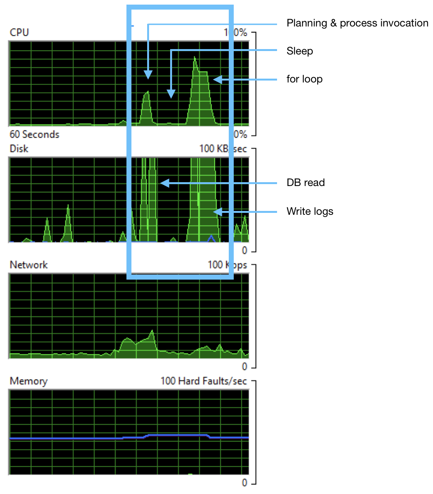
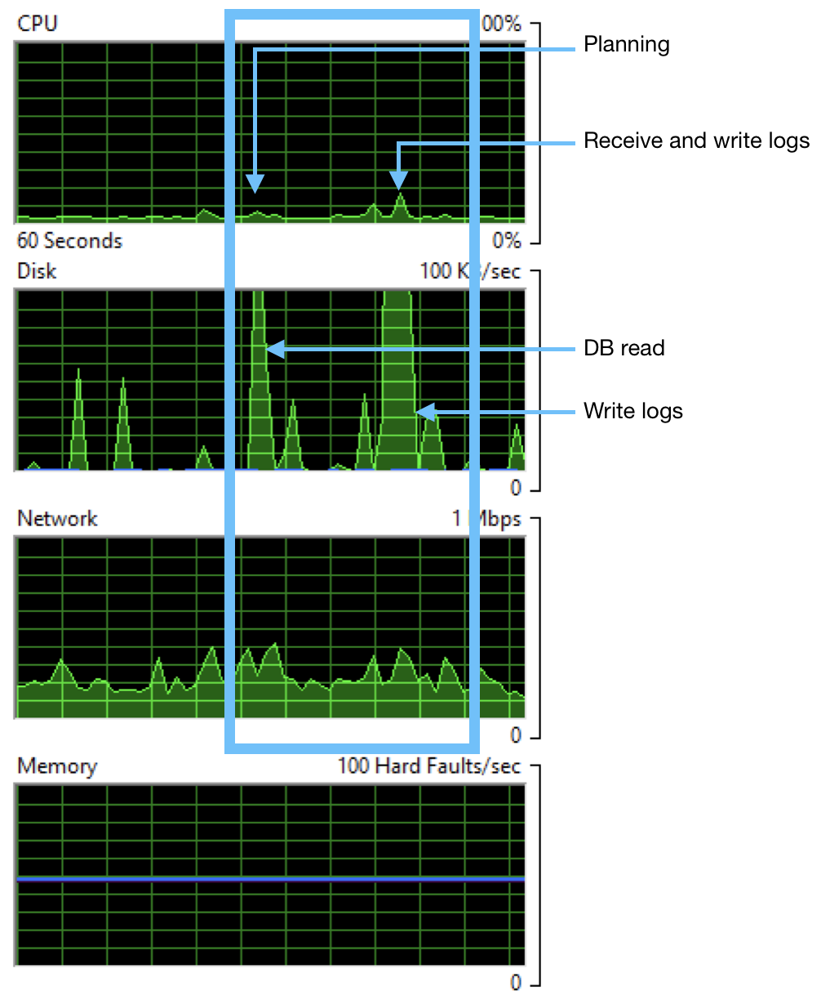
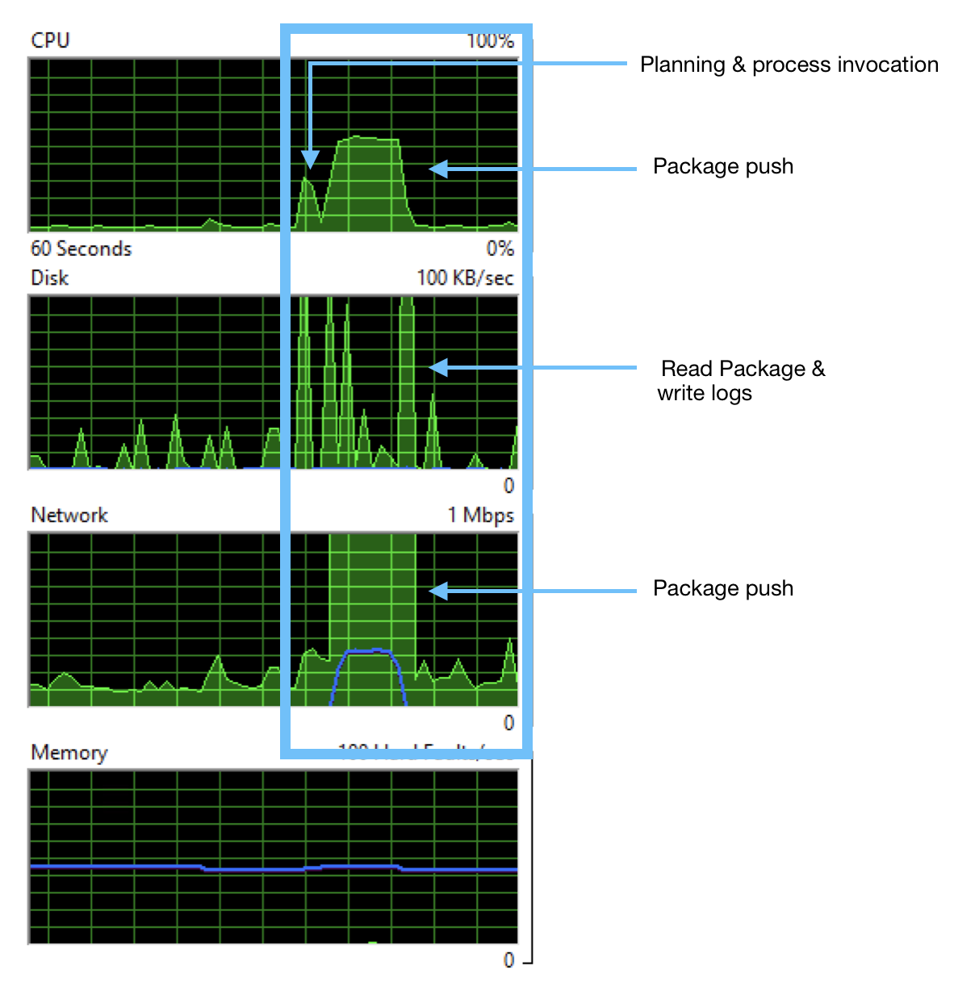
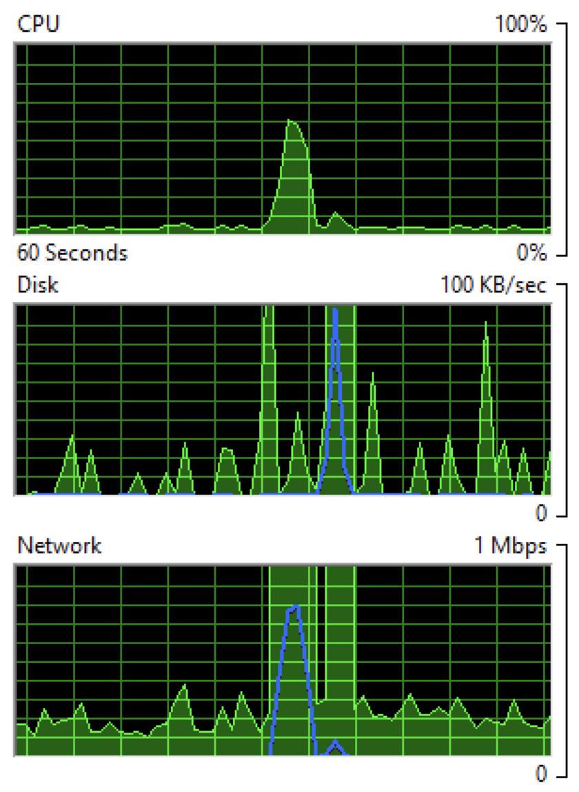
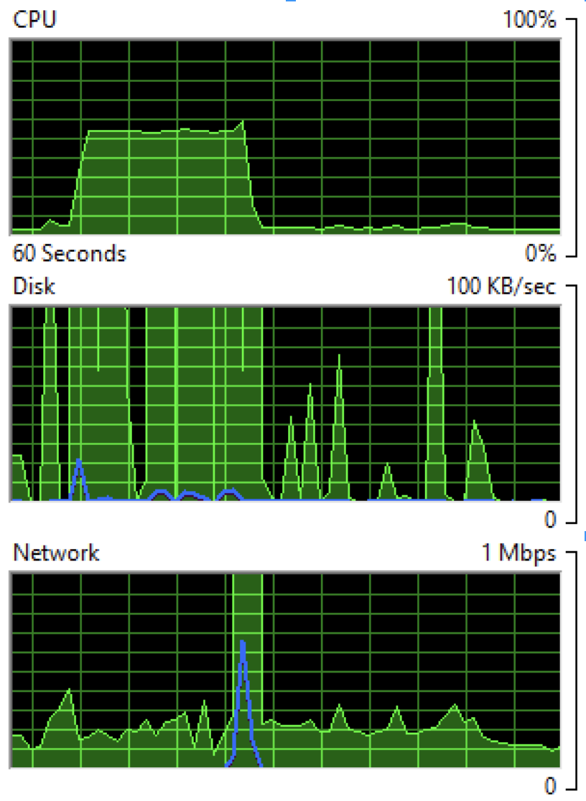
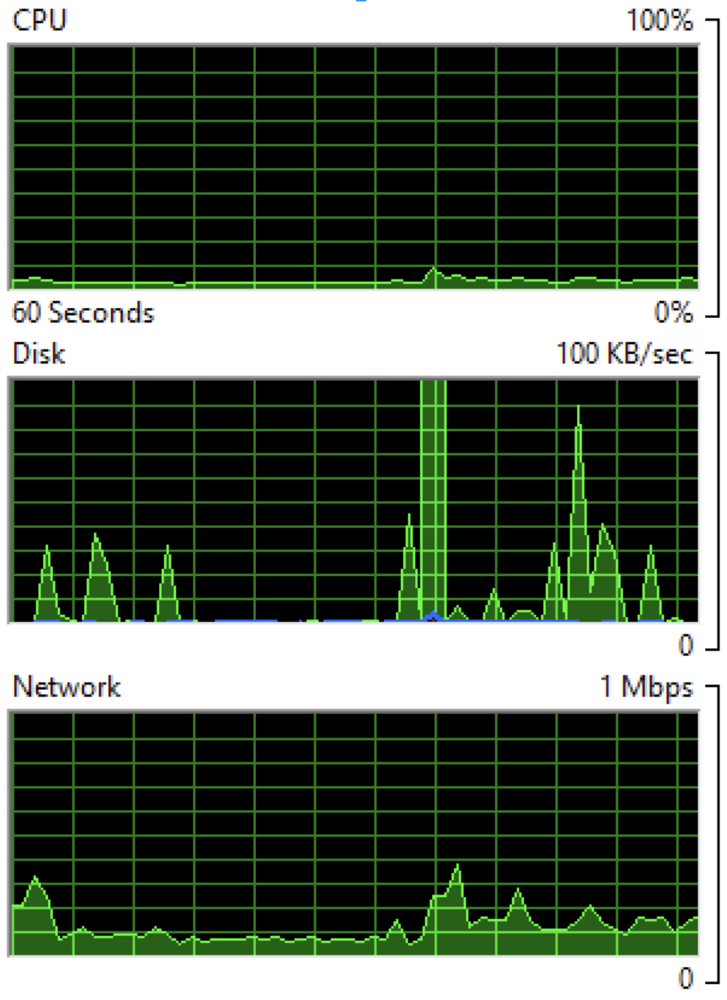
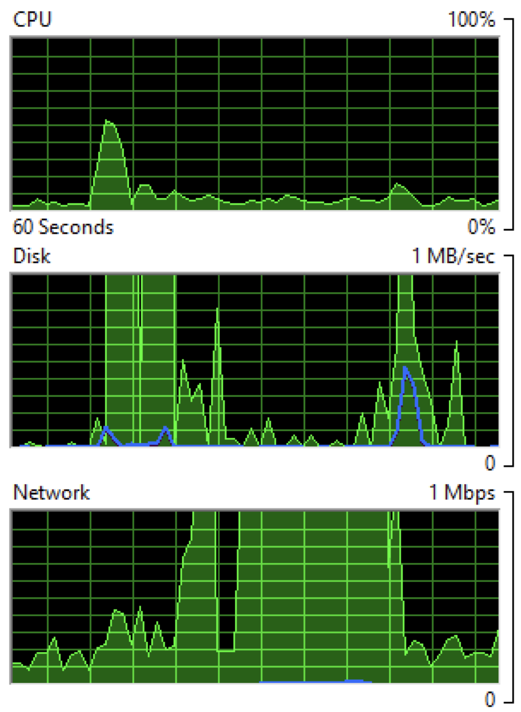
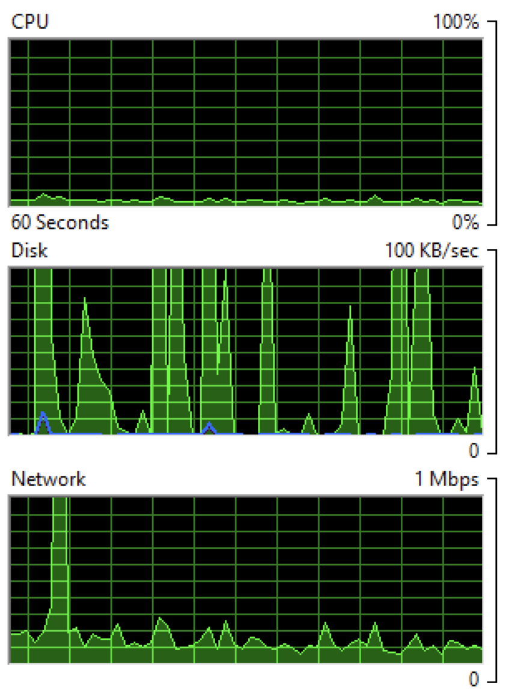

Last post, I introduced workers and some of the things that can be done with them.  I also promised to get back to you with more details.  Since then, we've shipped Workers in version 2018.7.0 and Octopus users have picked it up and started using it.  Now I've got a couple more posts lined up.  

You might move deployment tasks over to workers simply from a security point of view, e.g. so that scripts aren't running on your Octopus Server box, but there's other reasons to move work off the server.  This time, I'm going to look at the effect of using workers on you Octopus server's deployment performance.  

Now, this is a case where I have to start with the classic warning that your milage may vary.  There's lots going on in your Ocotpus server.  Depending on your setup, you might have the database on the same machine, you might have it elsewhere, you might have logs stored locally or on a share, and your deployment patterns will greatly affect how much work the server is doing.  In this post, I'm going to look at the CPU, disk, network and memory load on the server during deployments.

We're always driving pretty hard to improve the performace of Octopus.  Sometimes that's database performance.  Sometimes, it's finding parts where we can optimize or cache to improve API performance.  This post isn't about those bits.  It's about when the wheels hit the road during a deployment.  Neither us nor you can get round some of these bits.  It's the actual work of the deployment, so it has to be done.  But you can distribute the workload to get the best results for you.

In this post, I'm going to pick things apart so you can understand the working pieces and what the tradeoffs are in distributing out your server's work to Worker machines.  To do that, I'm going to run everything from a perspective you can see.  So this isn't about what I can measure internally, it's about what you can observe on your machine and how that affects your server and your deployment times.

To do that, I'm not going to talk in numbers or benchmarks, but more simply by just showing graphs from Resource Monitor.  No fancy tools, just a fresh Octopus server in AWS, a tool everyone has, and an interpretation of what's going on as the graphs spike up and down.

## Case 1: A Simple Script

OK, let's warm up with a really simple deployment, just a script that counts to 10,000 and writes some logs.  Because it's a tight loop, it'll hit the CPU; because it writes logs, it'll hit the disk.  All it is is the following simple script.


It sleeps for 10 seconds then spins to 10,000 writing log messages.  I've targeted the script at the Default Worker Pool so it will run on the Built-in worker on the Octopus server.  When it does run on the Built-in worker, we get graphs like this.



In my setup both the database and log storage are on the Octopus server machine, so the first hit on the CPU contains some database work as well as planning the deployment, but a large chunk of it turns out to be cost in invoking a fresh Calamari process.  The sleep separates that work from the second spike which is mostly the `for` loop.  Under 'Disk', you can see coincident spikes for the intial DB read and setting up logs etc, and then writing the logs to disk.  The scale on the disk graph lets you know we weren't taxing anything too much with this simple log write.

Now, let's add a worker to the default pool and run the same deployment again.



The disk activity is much the same as before: because, in this example, the server is on the same box as the database and logs storage, those costs are always going to be seen here.  However, the CPU usage is gone, letting us know that the inital spike in the first graph is the Calamari invocation.  There is some network activity transfering the logs from the Worker back to the Octopus Server, but it's too small to see clearly here; you'll see network hits in a following example.

We could trade off the disk hits here with some extra infrastructure.  Putting the DB on a separate machine (and we sugest you do) and storing logs elsewhere would push those costs out to other machines (at the expense of network traffic).


## Case 2: An S3 File Upload

The last example showed the pretty obvious case that if there's compute work in something that can be shifted to a worker, then doing so shifts the whole CPU expense off the Octopus server.  But it also hints that there's other trade offs to be made and as we'll see in this example, sometimes there's compute work generated by the server.

In this example I'm doing an S3 upload of a 296MB file.  Again, I've targeted the step at the Default Worker Pool.  I've removed all workers from that pool and, so, when it runs, it runs on the Built-in worker and gives these graphs.



There's some CPU cost to pushing the package to AWS S3 and a network hit getting the package on the wire.  In this example, the package was already on the server.  If the server had to first acquire the package, we'd see extra network and disk cost for that.  If I add a worker to the pool, the graph looks like this.



The whole package still has to go out over the network, so the network cost is the same, but it's interestng that the package push to S3 costs more CPU than Octopus just pushing it down Halibut to a worker.

What about when we build the next version of that package and deploy the project again.  In that case the cost of running on the Built-in Worker on the Octopus Server will be the same; however, on a Worker we have the option of not pushing the whole package and instead calcuating a package diff and sending the diff.  If we do that, we get a graph like this:



For the nearly 300MB package there's a new CPU cost, which is the calculation of the diff, and, in this case, we can see that represented on the disk as well as we have to access both versions of the package to calcuate the diff.  In the task logs I see

```
22:24:14   Verbose  |         Finding earlier packages that have been uploaded to this Tentacle.
22:24:15   Verbose  |         Found 1 earlier version of bigpackage on this Tentacle
22:24:15   Verbose  |         - 2018.7.6: C:\Octopus\TestInstance1\Files\bigpackage@S2018.7.6@103E651645EFF14EB4E34C8DA3AC2E6C.zip
22:24:15   Verbose  |         Process C:\Windows\system32\WindowsPowershell\v1.0\PowerShell.exe in C:\Octopus\TestInstance1\Work\20180806222409-891-383 exited with code 0
22:24:15   Info     |         Found matching version 2018.7.6: C:\Octopus\Packages\bigpackage\bigpackage.2018.7.6.zip
22:24:39   Info     |         Delta for package bigpackage v2018.7.7 successfully uploaded and applied.
                    |       
                    |         Success: Building delta for bigpackage v2018.7.7 (296.824 MB)
22:24:15   Info     |           Using package C:\Octopus\Packages\bigpackage\bigpackage.2018.7.6.zip with hash 68dc6388f3f467eeeec802c8ad6e8f207309c982 for creating delta.
22:24:15   Verbose  |           Building signature file: C:\Octopus\OctopusServer\PackageCache\bigpackage.2018.7.6.zip.octosig
22:24:15   Verbose  |           - Using nearest package: C:\Octopus\Packages\bigpackage\bigpackage.2018.7.6.zip
22:24:18   Verbose  |           Building delta file: C:\Octopus\OctopusServer\PackageCache\bigpackage.2018.7.6_68DC6388_to_2018.7.7_19AF67C0.octodelta
22:24:18   Verbose  |           - Using package: C:\Octopus\Packages\bigpackage\bigpackage.2018.7.7.zip.
22:24:18   Verbose  |           - Using signature: C:\Octopus\OctopusServer\PackageCache\bigpackage.2018.7.6.zip.octosig
22:24:32   Info     |           Original package was 296.824 MB, delta file is 109.195 MB (63.21% size reduction).
```

So, in this case, I got a nice reduction, but the payoff for the cost of calculating the diff would have been better if the two packages had turned out more similar (interestingly, the packages were Octopus Server versions 2018.7.7 and 2018.7.8, so I had expected them to be more similar - just shows how much work we cram into each version)

There's also the option for tentacles to acquire packages directly, rather than ever having the package on the server.  We're adding new features to allow multiple packages per step, so we're revamping how that looks in the UI, but for this test, I set the variable `Octopus.Action.Package.DownloadOnTentacle`.  And with that set, our server does very little at all:



Basically just the cost of asking the worker if it’s done and writing the logs.


## Case 3: An Azure WebApp deploy

Azure deployments all need a worker to run.  All the Azure steps either use WebDeploy or the Azure CmdLets, so it's either the Built-in or external Workers. 

For this test, I cloned a public ASP.NET Core project off Github, made some small changes to allow for Octopus veriable replacement, built and packaged using `dotnet publish` and `Octo.exe pack` and deployed as a WebApp using our built-in step.  The final package was pretty small ending up at just over 21MB.

When run on the Built-in worker, I get a graph shaped like this.



The CPU cost is starting the deployment, invoking Calamari, unpacking the package, doing variable replacement, and negotiating with Azure about what files need to be uploaded.  The disk cost is for the same reasons and the network cost is pushing the data up to the Cloud.  This was a pretty small package, so all those costs go up as the package size increases.

The same deployment from a worker looks like this.



In this case, the only costs are a small amount of network traffic and writing what turned out to be a 1.1MB log file.  Again these costs could be completely moved off the server by using package download directly to the worker and external log storage.


## Case 4: All together

I've described 3 pretty toy deployment examples, but each of them involves some intrinsic work that has to be done for the deployment to succeed.  So there's no case for optimising away these costs, but the costs can be moved.  The following graph shows all three projects run simultaneous.  On the left is using the Built-in worker, on the right is an external worker.  Note the scale on the disk graphs - the left on the server is 10X on the right.


Now, the graphs on the left aren't the toughest day this server will ever see, but if that's not even close to the workload on your Octopus instance then you can probably free up even more resources on your Octopus Server by moving the CPU work, disk hits and network traffic off your Octopus server.  Once the workload gets bigger, it will also start to have an impact on total deployment time as parallel deployments compete for resources, so moving to Workers might speed up your deployments as well as move work off the server box.


# Conclusion

In this post, with three simple deployments, I've picked apart the kinds of costs that deployments place on your Octopus Server machine.  The examples weren't large or real, but I hope they'll a little more aware of some of the moving parts in your deployments and help you to understand how you can optimize your deployments using workers.  There's lots of options, for example, from deploying from the server, to only pushing package diffs, to moving the entire package handling off to the worker - maybe the diffs are small enough that spending the CPU on the server will make a big win on network traffic, or maybe you can colocate your package feeds, Workers and Azure targets so that turn out to be the best network option.   Workers just gives you more options on how to set up your deployments and how to spread the work.

Remember that there's not much special about a worker.  It's just a tentacle or SSH machine, so you can harvest whatever spare computing resources you have - that could be existing tentacle VMs that aren't worked much, it could be on prem machines it could be Dev or Test boxes with spare cycles - or you can provision special worker infrastructure just for deployment load.

Next time, I'm going to look closely at PaaS targets with default worker pools attached to each target, so you can have your workers near your targets and even firewall off your infrastructure so that the workers poll the server from a secured network and only the workers have access to deploy to the targets.

Happy Deployments!

