[Octopus 2018.8](/blog/2018-09/octopus-release-2018.8/index.md) previews a number of new features that make managing Kubernetes deployments easy. These Kubernetes steps and targets have been designed to allow teams to deploy applications to Kubernetes taking advantage of Octopus environments, dashboards, security, account management, variable management and integration with other platforms and services.

At the end of this blog post you will learn how to:
* Configure Service Accounts and Namespaces with the principal of least privilege in mind
* Deploy a functioning web server in Kubernetes
* Perform blue/green updates of Kubernetes Deployments, with simulated failures
* Access applications through a public network load balancer
* Direct traffic with a multiple Nginx Ingress Controllers
* Deploy applications using Helm
* And do all of that across a development and production environment

This will be a long blog post, but it will take you from a blank Kubernetes cluster to a functional multi-environment cluster with repeatable deployments using patterns that will scale as your teams and applications grow.

:::warning
The Kubernetes functionality in Octopus 2018.8 is a preview only. The features discussed here will likely change in future versions.
:::

!toc

## Prerequisites

To follow along with this blog post, you will need to have an Octopus instance, a Kubernetes cluster already configured, and with Helm installed. This blog post will use the Kubernetes service provided by Google Cloud, but any Kubernetes cluster will do.

[Helm](https://helm.sh/) is a package manager for Kubernetes, and we'll use it to install some third party services into the Kubernetes cluster. Google Cloud provides [documentation](https://cloud.google.com/community/tutorials/nginx-ingress-gke#install-helm-in-cloud-shell) describing how to install Helm in their cloud, and other cloud providers will provide similar documentation.

**New to Octopus?** Check out our [getting started guide](https://octopus.com/docs/getting-started) to learn more.

## Preparing the Octopus Server

The Kubernetes steps in Octopus require that the `kubectl` executable be available on the path. Likewise the Helm steps require the `helm` executable to be available on the path.

If you run the Kubernetes steps from [Octopus workers](https://g.octopushq.com/OnboardingWorkersLearnMore), you can install the `kubectl` executable using the instructions on the [Kubernetes website](https://g.octopushq.com/KubernetesKubectlInstall), and the `helm` executable using the instructions on the [Helm project page](https://g.octopushq.com/KubernetesHelmInstall).

Because the Kubernetes functionality in Octopus is in a preview state, the steps discussed in this post need to be enabled in the `Features` section.


## What we Will Create

Before we dive into the specifics of deploying a Kubernetes application, it is worth understanding what we are trying to achieve with this example.

Our infrastructure has the following requirements:
* Two environments: Development and Production
* One Kubernetes cluster
* A single application (we're deploying the [HTTPD Docker image](https://hub.docker.com/_/httpd/) as an example here)
* The application is exposed by a custom URL path like http://myapp/httpd
* Zero downtime deployments

At a high level, this is what we will end up with.

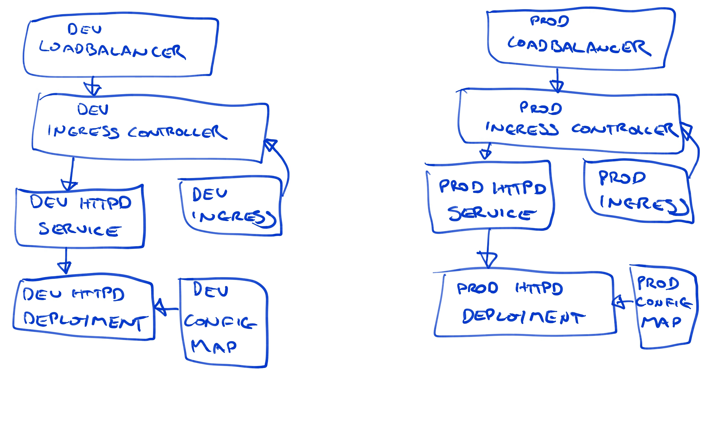

Don't worry if this diagram looks intimidating, as we'll build up each of these elements step by step.

## The Feed

The Kubernetes support in Octopus relies on having a Docker feed defined.  Because the HTTPD image we are deploying can be found in the main Docker repository, we'll create a feed against the `https://index.docker.io` URL.

Learn more about Docker feeds [here](https://octopus.com/docs/packaging-applications/package-repositories/registries).


## The Environments

Although we listed two environments as requirements, we'll actually create three. The additional environment, called `Kubernetes Admin`, will be where we run utility scripts to create user accounts.

Learn more about environments [here](https://octopus.com/docs/infrastructure/environments).


## The Lifecycles

The default lifecycle in Octopus assumes that all environments will be deployed to, one after the other. This is not the case for us. We have two distinct lifecycles: `Development` -> `Production`, and `Kubernetes Admin` as a standalone environment where utility scripts are run.

To model the progression from `Development` to `Production`, we'll create a lifecycle called `Application`. It will contain two phases, the first for deployments to the `Development` environment, and the second for deployments to the `Production` environment.


To model the scripts run against the Kubernetes cluster, we'll create a lifecycle called `Kubernetes Admin`. It will contain a single phase for deployments to the `Kubernetes Admin` environment.


Learn more about lifecycles [here](https://octopus.com/docs/deployment-process/lifecycles).

## The Kubernetes Admin Target

A Kubernetes target in Octopus is conceptually a permission boundary within a Kubernetes cluster. It defines this boundary using a Kubernetes namespace and a Kubernetes account.

As the number of environments, teams, applications and services being deployed to a Kubernetes cluster grows, it is important to keep them isolated to prevent resources from accidentally being overwritten or deleted, or to prevent resources like CPU and memory being consumed by rogue deployments. Permissions and resource limits can be enforced by applying them to Kubernetes namespaces, and those restrictions are then applied to any deployment that is placed in the namespace.

In keeping with the practise of least privilege, each namespace will have a corresponding system account that only has privileges to that single namespace.

The combination of a namespace and a service account that is limited to the namespace makes up a typical Octopus Kubernetes target.

Having said that, we need some place to start in order to create the namespaces and service accounts, and for that we will create a Kubernetes target with the administrator credentials that deploys to the `Kubernetes Admin` environment.

First, we need to create an account that holds the administrator user credentials. The Kubernetes cluster in Google Cloud provides a user called `admin` with a randomly generated password that we can use.


These credentials are saved in a username/password Octopus account.


:::hint
Other cloud providers use different authentication schemes for their administrator users. See the [documentation](https://octopus.com/docs/deployment-examples/kubernetes-deployments/kubernetes-target#accounts) for details on using account types other than a username and password.
:::

Most Kubernetes clusters expose their API over HTTPS, but will often do so using an untrusted certificate. In order to communicate with the Kubernetes cluster, we can either disable any validation of the certificate, or provide the certificate as part of the Kubernetes target. Disabling certificate validation is not considered best practise, so we will instead upload the Kubernetes cluster certificate to Octopus.

The certificate is provided by Google as a PEM file, like this (copied from the `Cluster CA certificate` field in the `Cluster credentials` dialog):

```
-----BEGIN CERTIFICATE-----
MIIDCzCCAfOgAwIBAgIQMufY5zcMoXLTKHXY2e5hDTANBgkqhkiG9w0BAQsFADAv
MS0wKwYDVQQDEyQwMjkwMTUzZS05ZGYwLTQzNjAtYmJjMC0xZTFhYjkxMzQwYTgw
HhcNMTgwNzI1MDEyMDAzWhcNMjMwNzI0MDIyMDAzWjAvMS0wKwYDVQQDEyQwMjkw
MTUzZS05ZGYwLTQzNjAtYmJjMC0xZTFhYjkxMzQwYTgwggEiMA0GCSqGSIb3DQEB
AQUAA4IBDwAwggEKAoIBAQDDyKNlRbHMvQlh2mvjdBEeIXwAI40t6MBm8K3wGqiF
D/SlY2AsKjsMq/5VR+zlKrbFJUkxQGdN0Dm7tSUpzgkr7DaPTT/FLKPidFNEcG6Z
ZpienqESWLwXT2g8O7yRIfAaFBASzZ60UeUs1VYTLSWdqNSIW96JJD1WzNj7Fwd/
ImlLiZVVlQLN4Yz2yf99wCX4Mg3jCaKLQF4/f7/e+d1PkAROSjG5tRgOpHBDkgqL
ewDBpT5p1tuIBKN6ZyQbMkLRcTU82iFpnDLJwlkXfmhVv3RXBtM/VcK/LD/VuGH+
Rko8xY9+ckrUyYlPU5CxL4WS03pbHFO5JxjPhNeEpfZPAgMBAAGjIzAhMA4GA1Ud
DwEB/wQEAwICBDAPBgNVHRMBAf8EBTADAQH/MA0GCSqGSIb3DQEBCwUAA4IBAQAd
0B9H5JuQSW/5O6hoW9bvoMAdga9mwrYjMQ1ErSkHpI94K70CFmnh3vAog6UGkGkb
RN5SOjpqaJiYwAoBuECPwV8VBotsJ17W67B5zl4w37zYDgT6wTlg0s0urdRSvA6s
EHHTTzNaHoeVBArUvFb0NprL7UH3K0QJG+VKhsxSvTYIWddptfpo+Da72OEtGRbs
F1g3GhuAICmyCQnDQ6LqxPRq5/WCCiea43c7hPs2AK3SIAsoA0DTy311gpogqKVn
Cods8yRwx6GPC6l9nmmygAjma0ai06N/oUtWZQhX2oYzAKsgdzu1P+DlQfDbmv5u
Jash2XeDyUqUFUEsH+0+
-----END CERTIFICATE-----
```

This text is then saved to a file called `k8s.pem`, and uploaded to Octopus.

Learn more about certificates [here](https://octopus.com/docs/deployment-examples/certificates).

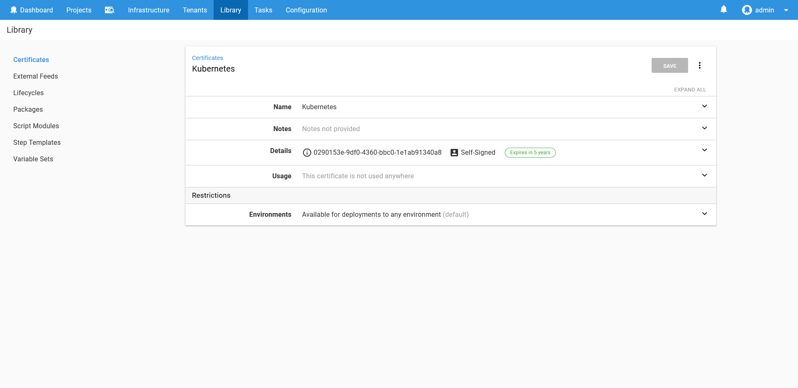

With the user account and the certificate saved, we can now create the Kubernetes target called `Kubernetes Admin`.

This target will deploy to the `Kubernetes Admin` environment, and take on a role that is called Admin. The account will be the `Kubernetes Admin` account we created above, and the cluster certificate will reference the certificate we saved above.

Because this `Kubernetes Admin` target will be used to run utility scripts, we don't want to have it target a Kubernetes namespace, so that field is left blank.


Learn more about Kubernetes targets [here](https://octopus.com/docs/deployment-examples/kubernetes-deployments/kubernetes-target).

We now have a target that we can use to prepare the service accounts for the other namespaces.

## The HTTPD Development Service Account

We now have a Kubernetes target, but this target is configured with the cluster administrator account. It is not a good idea to be running deployments with an administrator account, so what we need to do is create a namespace and service account that will allow us to deploy only the resources we need for our application in an isolated area in the Kubernetes cluster.

To do this, we need to create four resources in the Kubernetes cluster: a namespace, a service account, a role and a role binding. We've already discussed namespaces and service accounts. A role defines the actions that can be applied and the resources they can be applied to. A role binding associates a service account with the role, granting the service account the permissions that were defined in the role.

Kubernetes can represent these resources as YAML, and YAML can represent multiple documents in a single file by separating them with a triple dash. So the YAML document below defines these four resources .

```yaml
---
kind: Namespace
apiVersion: v1
metadata:
  name: httpd-development
---
apiVersion: v1
kind: ServiceAccount
metadata:
  name: httpd-deployer
  namespace: httpd-development
---
kind: Role
apiVersion: rbac.authorization.k8s.io/v1
metadata:
  namespace: httpd-development
  name: httpd-deployer-role
rules:
- apiGroups: ["", "extensions", "apps"]
  resources: ["deployments", "replicasets", "pods", "services", "ingresses", "secrets", "configmaps"]
  verbs: ["get", "list", "watch", "create", "update", "patch", "delete"]
- apiGroups: [""]
  resources: ["namespaces"]
  verbs: ["get"]  
---
kind: RoleBinding
apiVersion: rbac.authorization.k8s.io/v1
metadata:
  name: httpd-deployer-binding
  namespace: httpd-development
subjects:
- kind: ServiceAccount
  name: httpd-deployer
  apiGroup: ""
roleRef:
  kind: Role
  name: httpd-deployer-role
  apiGroup: ""
```

To create these resources, we need to save the YAML as a file, and then use `kubectl` to create them in the cluster. To do this, we use the `Run a kubectl CLI Script` step.

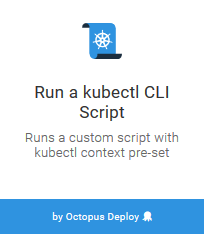

This step will then target the `Kubernetes Admin` target, and run the following script, which saves the YAML to a file and then uses `kubectl` to apply the YAML.

```PowerShell
Set-Content -Path serviceaccount.yml -Value @"
---
kind: Namespace
apiVersion: v1
metadata:
  name: httpd-development
---
apiVersion: v1
kind: ServiceAccount
metadata:
  name: httpd-deployer
  namespace: httpd-development
---
kind: Role
apiVersion: rbac.authorization.k8s.io/v1
metadata:
  namespace: httpd-development
  name: httpd-deployer-role
rules:
- apiGroups: ["", "extensions", "apps"]
  resources: ["deployments", "replicasets", "pods", "services", "ingresses", "secrets", "configmaps"]
  verbs: ["get", "list", "watch", "create", "update", "patch", "delete"]
- apiGroups: [""]
  resources: ["namespaces"]
  verbs: ["get"]    
---
kind: RoleBinding
apiVersion: rbac.authorization.k8s.io/v1
metadata:
  name: httpd-deployer-binding
  namespace: httpd-development
subjects:
- kind: ServiceAccount
  name: httpd-deployer
  apiGroup: ""
roleRef:
  kind: Role
  name: httpd-deployer-role
  apiGroup: ""
"@

kubectl apply -f serviceaccount.yml
```

The bash script is very similar.

```sh
cat >serviceaccount.yml <<EOL
---
kind: Namespace
apiVersion: v1
metadata:
  name: httpd-development
---
apiVersion: v1
kind: ServiceAccount
metadata:
  name: httpd-deployer
  namespace: httpd-development
---
kind: Role
apiVersion: rbac.authorization.k8s.io/v1
metadata:
  namespace: httpd-development
  name: httpd-deployer-role
rules:
- apiGroups: ["", "extensions", "apps"]
  resources: ["deployments", "replicasets", "pods", "services", "ingresses", "secrets", "configmaps"]
  verbs: ["get", "list", "watch", "create", "update", "patch", "delete"]
- apiGroups: [""]
  resources: ["namespaces"]
  verbs: ["get"]    
---
kind: RoleBinding
apiVersion: rbac.authorization.k8s.io/v1
metadata:
  name: httpd-deployer-binding
  namespace: httpd-development
subjects:
- kind: ServiceAccount
  name: httpd-deployer
  apiGroup: ""
roleRef:
  kind: Role
  name: httpd-deployer-role
  apiGroup: ""
EOL

kubectl apply -f serviceaccount.yml
```

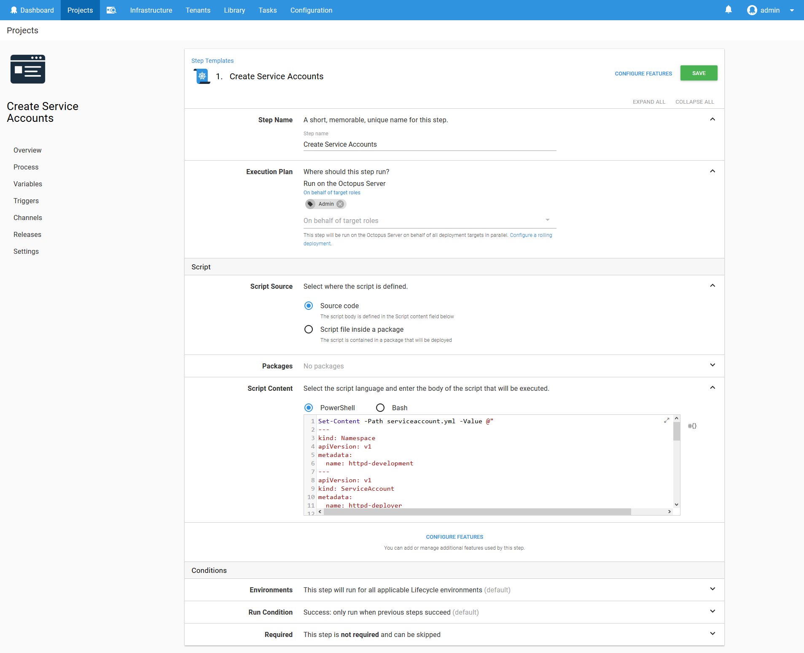

Once this script is run, a service account called `httpd-deployer` will be created. This service account is automatically assigned a token that we can use to authenticate with the Kubernetes cluster. We can run a second script to get this token.

```Powershell
$user="httpd-deployer"
$namespace="httpd-development"
$data = kubectl get secret $(kubectl get serviceaccount $user -o jsonpath="{.secrets[0].name}" --namespace=$namespace) -o jsonpath="{.data.token}" --namespace=$namespace
[System.Text.Encoding]::ASCII.GetString([System.Convert]::FromBase64String($data))
```

The same functionality can be run in bash with the following script.

```sh
user="httpd-deployer"
namespace="httpd-development"
kubectl get secret $(kubectl get serviceaccount $user -o jsonpath="{.secrets[0].name}" --namespace=$namespace) -o jsonpath="{.data.token}" --namespace=$namespace | base64 --decode
```

:::warning
We have retrieved the token as part of a script step here for demonstration purposes only. Displaying the token in the log output is a security risk, and should be done with caution. These same scripts can be run locally instead to prevent the tokens being saved in a log file.

See the section [Scripting Kubernetes Targets](#scripting-kubernetes-targets) for a solution that automates the process of creating these accounts, without leaving tokens in the log file.
:::

Before we deploy the script, we need to make sure the project is using the `Kubernetes Admin` lifecycle.

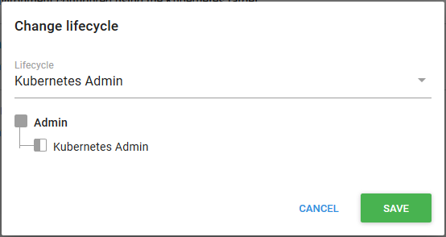

We can now run the script, which will create the service account and display the token. The token looks like this:

```
eyJhbGciOiJSUzI1NiIsInR5cCI6IkpXVCJ9.eyJpc3MiOiJrdWJlcm5ldGVzL3NlcnZpY2VhY2NvdW50Iiwia3ViZXJuZXRlcy5pby9zZXJ2aWNlYWNjb3VudC9uYW1lc3BhY2UiOiJodHRwZC1kZXZlbG9wbWVudCIsImt1YmVybmV0ZXMuaW8vc2VydmljZWFjY291bnQvc2VjcmV0Lm5hbWUiOiJodHRwZC1kZXBsb3llci10b2tlbi0ycG1ndCIsImt1YmVybmV0ZXMuaW8vc2VydmljZWFjY291bnQvc2VydmljZS1hY2NvdW50Lm5hbWUiOiJodHRwZC1kZXBsb3llciIsImt1YmVybmV0ZXMuaW8vc2VydmljZWFjY291bnQvc2VydmljZS1hY2NvdW50LnVpZCI6IjliZGQzYWQ0LTk5ZTktMTFlOC04ODdmLTQyMDEwYTgwMDA5MyIsInN1YiI6InN5c3RlbTpzZXJ2aWNlYWNjb3VudDpodHRwZC1kZXZlbG9wbWVudDpodHRwZC1kZXBsb3llciJ9.DDiMDOmznf4S8ClHO30RvSZNGHN_7WYk9-FABaLkSC-mIunWtJHiT_lEovbUToogM0fnG1ISueundAZ6tsRRY-eVwefLvhgy1Ync2QlLwaqeoUenGt1d36lH5YFb7gYmon2UD54DGEdYNzafI1TLWi3DS1apjSUc3kWh54HfZXSeQmCE7fGu4wNoJz3WU1MEQZx8KqM9__lVDxtPGmE2pyZX6OYBXoAQv9-cfs_1GP009exfkVWbVYdDFDoEko21KDAORjyKu4ow4KvVXOXzcfgCKe_UlYyuLg0A6NRyc8lDj4D34R1crIPvqWmXVy5BMK4ENchhYEC62nsInptZAg
```

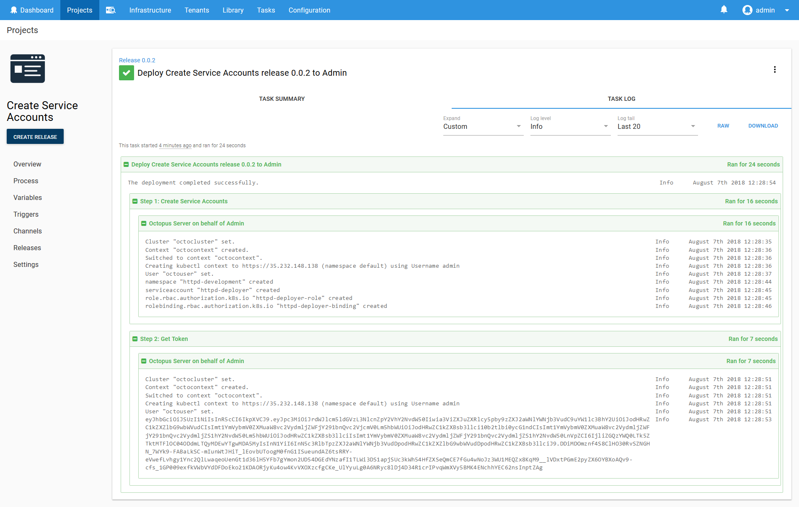

## The HTTPD Development Target

We now have everything we need to create a target that will be used to deploy the HTTPD application in the `Development` environment.

We start by creating a token account in Octopus with the token that was returned above.

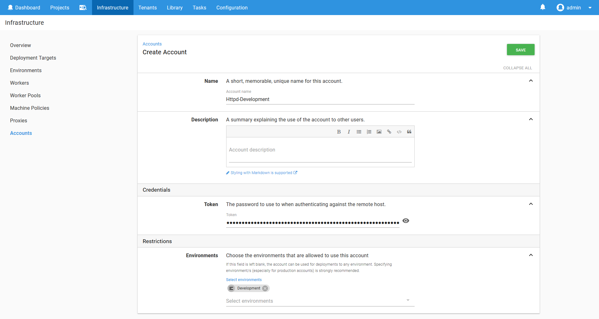

We then use this token in a new Kubernetes target called `Httpd-Development`.

Notice here that the `Target Roles` includes a role called `Httpd` that matches the name of the application being deployed, and that the `Kubernetes namespace` is set to `httpd-development`. The service account we created only has permissions to deploy into the `httpd-development` namespace, and will only be used to deploy the HTTPD application into the `Development` environment.

Therefore this target represents the intersection of an application and an environment, using a namespace and a limited service account to enforce the permission boundary. This is a pattern we'll repeat over and over with each application and environment.


Now that we have a target to deploy to, let's deploy our first application!

## The HTTPD Application

The `Deploy Kubernetes containers` step provides an opinionated process for deploying applications to a Kubernetes cluster. This step implements a standard pattern for creating a collection of Kubernetes resources that work together to provide repeatable and resilient deployments.

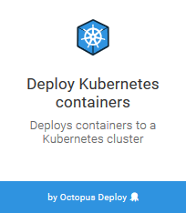

The application we'll be deploying is [HTTPD](https://hub.docker.com/_/httpd/). This is a popular web server from Apache, and while we won't be doing anything more than displaying static text as a web page with it, HTTPD is a useful example given most applications deployed to Kubernetes will expose HTTP ports just like HTTPD does.

The step is given a name, and targets a role. The role that we target here is the one that was created to match the name of the application we are deploying. In selecting the `Httpd` role, we ensure that the step will use our Kubernetes target that was configured to deploy the HTTPD application.


The `Deployment` section is used to configure the details of the Deployment resource that will be created in Kubernetes.

I'll use the term "resource" (e.g. Deployment resource or Pod resource) from now on to distinguish between the resources that are created in the Kubernetes cluster (which is to say the resources that you would work with if you used the `kubectl` tool directly) and Octopus concepts or general actions like deploying things. This may lead to sentences like "Click the Deploy button to deploy the Deployment resource", but please don't hold that against me.

The `Deployment name` field defines the name that is assigned to the Deployment resource. These names are the unique identifies for Kubernetes resources within a Namespace resource. This is significant, because it means that to create a new and distinct resource in Kubernetes, it must have a unique name. This will be important when we select a deployment strategy later on, so keep this in the back of your mind.

The `Replicas` field defines how many copies of the Pod resources this Deployment resource will create. We'll keep this at `1` for this example.

The `Progression deadline in seconds` field configures how long Kubernetes will wait for the Deployment resource to complete. If the Deployment resource has not completed in this time (this could be because of slow Docker image downloads, failed readiness checks on the Pod resources, insufficient resources in the cluster etc) then the deployment of the Deployment resource will be considered to be a failure.

The `Labels` field allows general key/value pairs to be assigned to the resources created by the step. Behind the scene these labels will be applied to the Deployment, Pod, Service, Ingress, ConfigMap, Secret and Container resources created by the step. As we mentioned earlier, this step is opinionated, and one of those opinions is that labels should be defined once and applied to all resources created as part of the deployment.


## The Deployment Strategy

Kubernetes provides a powerful declarative model for the resources that it manages. When using the `kubectl` command directly, it is possible to describe the desired state of a resource (usually in YAML) and "apply" that resource into the Kubernetes cluster. Kubernetes will then compare the desired state of the resource to the current state of the resource in the cluster, and make the necessary changes to update the cluster resources to the desired state.

Sometimes this change is as simple as updating a property like a label. But in other cases the desired state requires redeploying entire applications.

Kubernetes natively provides two deployment strategies to make redeploying applications as smooth as possible: recreate and rolling updates.

The recreate strategy will remove any existing Pod resources before creating the new ones. The rolling update strategy will incrementally replace Pods resources. You can read more about these deployment strategies in the [Octopus documentation](https://octopus.com/docs/deployment-examples/kubernetes-deployments/deploy-container#deployment-strategy).

Octopus provides a third deployment strategy called blue/green. This strategy will create entirely new Deployment resources with each deployment, and when the Deployment resource has succeeded, traffic is switched over.

The blue/green deployment strategy provides some interesting possibilities for those tasked with managing Kubernetes deployments, so we'll select this strategy.


## Volumes and ConfigMaps

Volumes provide a way for Container resources to access external data. [Kubernetes provides a lot of flexibility with volumes](https://g.octopushq.com/KubernetesVolumes), and they could be disks, network shares, directories on nodes, GIT repositories and more.

For this example, we want to take the data stored in a ConfigMap resource, and expose it as a file within our Container resource. ConfigMap resources are convenient because Kubernetes ensures they are highly available, they can be shared across Container resources, and they are easy to create.

Because they are so convenient, the step can treat a ConfigMap resource as part of the deployment. This ensures that the Container resources that make up a deployment always have access to the ConfigMap resource that was associated with them. This is important, because you don't want to be in a position where version 1 of your application is referencing version 2 of your ConfigMap resource while version 2 of your application is in the process of being rolled out. Don't worry if that doesn't make much sense though, we'll see this in action later on.

And this is exactly what we will configure for this demo. The `Volume type` is set to `Config Map`, it is given a `Name`, and we select the `Reference the config map created as port of this step` option to indicate that the ConfigMap resource that will be defined later on in the step is what the volume is pointing to.

The ConfigMap Volume items provide a way to map a ConfigMap resource value to a filename. In this example we have set the `Key` to `index` and the path to `index.html`, meaning that we want to expose the ConfigMap resource value called `index` as a file with the name `index.html` when this volume is mounted in a Container resource.


## The Container

The next step is to configure the Container resources. This is where we will configure the HTTPD application.

We start by configuring the Docker image that will be used by the Container resource. Here we have selected the `httpd` image from the Docker feed we created previously.


In order to access HTTPD we need to expose a port. Being a web server, HTTPD accepts traffic on port 80. Ports can be named to make them easier to work with, and so we'll call this port `web`.


The last piece of configuration is to mount the ConfigMap volume we defined earlier in a directory. The HTTPD Docker image has been built to serve content from the `/usr/local/apache2/htdocs` directory. If you recall, we configured the ConfigMap Volume to expose the value of the ConfigMap resource called `index` as a file called `index.html`. So by mounting the volume under the `/usr/local/apache2/htdocs` directory, this Container resource will have a file called `/usr/local/apache2/htdocs/index.html` with the contents of the value in the ConfigMap resource.

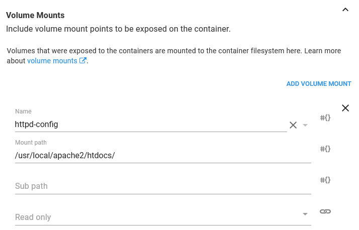

The configuration of each container is summarized in the main step UI, so you can review it at a glance.


## The ConfigMap

We have talked a lot about the ConfigMap resource that is created by the step, so now it is time to configure it.

The `Config Map Name` section defines the name (or, technically, part of the name - more on that later) of the ConfigMap resource. The `Config Map Items` defines the key/value pairs that make up the ConfigMap resource.

If you remember, we exposed this ConfigMap resource as a volume, and that volume defined an item that mapped the ConfigMap resource value called `index` to the file called `index.html`. So here we create an item called `index`, and the value of the item is what will eventually become the contents of the `index.html` file.

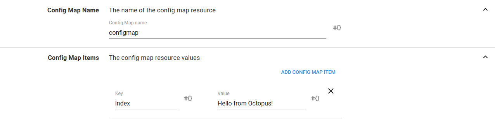

## The Service

We're close now to having an application deployed and accessible. Because it is nice to see some progress, we'll take a little shortcut here and expose our application to the world with the quickest option available to us.

To communicate with the HTTPD application, we need to take the port that we exposed on the Container resource (port 80, which we called `web`) through a Service resource. And to access that Service resource from the outside world, we'll create a Load balancer Service resource.

By deploying a Load balancer Service resource, our cloud provider will create a network load balancer for us. What kind of network load balancer is created and how it is configured differs from one cloud provider to the next, but generally speaking the default is to create a network load balancer with a public IP address.

:::warning
Whenever you expose applications to the outside world, you must consider adding security like firewalls.
:::

The `Service Name` section defines the name of the Service resource.


The `Service Type` section is where we configure the Service resource as a `Load balancer`. The other fields can be left blank in this section.


The `Service Ports` section is where incoming ports are mapped to the Container resource ports. In this case we are exposing port 80 on the Service resource, and directing that to the `web` port (also port 80, but those values are not required to match) on the Container resource.


The ports are summarized in the main UI so they can be quickly reviewed.


At this point, all the groundwork has been laid, and we can deploy the application.


## The First Deployment

When you create a deployment of this project, Octopus allows you to define the version of the Docker image that will be included. If you look back at the configuration of the Container resource, you will notice that we never specified a version, just the image name. This is by design, as Octopus expects that most deployments will involve new Docker image versions, whereas the configuration of the Kubernetes resources will remain mostly static.

This means the only decision to make with day to day deployments is the version of the Docker images, and you can take advantage of Octopus features like [channels](https://octopus.com/docs/deployment-process/channels) to further customize how image versions are selected during deployment.


And with that our deployment has succeeded.


Jumping into the Google Cloud console we can see that a Deployment resource called `httpd-deployments-841` has been created. The name is a combination of the Deployment resource name we defined in the step of `httpd` and a unique identifier for the Octopus deployment of `deployments-841`. This name was created because the blue/green deployment strategy requires that the Deployment resource created with each deployment be unique.


The deployment also created a Service resource called `httpd`. Notice that it is of type `Load balancer`, and that it has a public IP address.

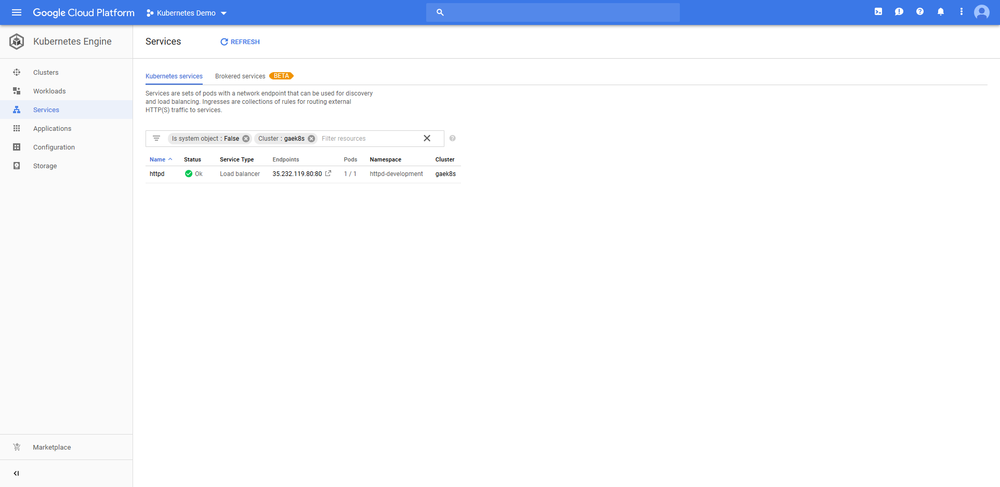

The ConfigMap resource called `configmap-deployments-841` was also created. Like the Deployment resource, the name of the ConfigMap resource is a combination of the name we defined in the step and the unique deployment name added by Octopus. Unlike the Deployment resource, ConfigMaps created by the step will always have unique names like this (the Deployment resource only has the unique deployment name appended for blue/green deployments).


All of which results in HTTPD serving the contents of the ConfigMap resource as a web page under the public IP address of the Service resource.


If you have made it this far - congratulations! But you may be wondering why we had to configure so many things just to get to the point of displaying a static web page. Reading any other Kubernetes tutorial on the internet would have had you at this point 1000 words ago...

In developing these Kubernetes steps for Octopus we found that everyone loves to show how quickly you can spin up a single application deployed to a single environment using the admin account and exposing everything on a dedicated load balancer. Which is great, but doesn't represent that kind of challenges that real world deployments face.

What we have achieved here is to lay the groundwork for deployments of multiple applications across multiple environments separating concerns with namespaces and service accounts with limited permissions.

So, take a breath, because we're only half done. Having reached the point of deploying a single application to a single environment with a single load balancer, we're going to take the next step and make this a multi-environment deployment.

## So What Happens When Things go Wrong?

Deployments will sometimes fail. This is not only to be expected, but celebrated, as long as it happens in the `Development` environment. Failing quickly is a key component to a robust CD pipeline.

Let's review what we have got deployed now. We have a load balancer pointing to a Service resource, which in turn is pointing to the Deployment resource.

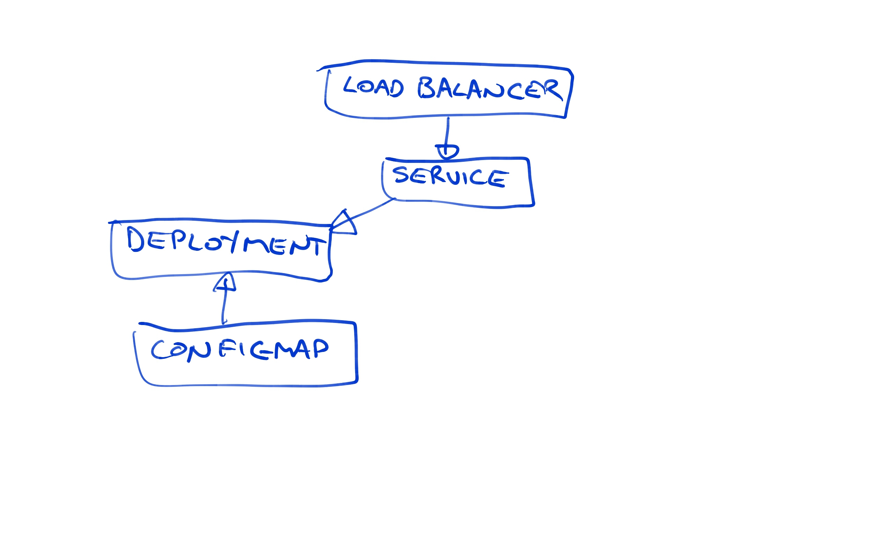

Let's simulate a failed deployment. We can do this by configuring the Container resource readiness probe to run a command that does not exist. Readiness probes are used by Kubernetes to determine when a Container resource is ready to start accepting traffic, and by deliberately configuring a test that can not pass, we can simulate a failed deployment.

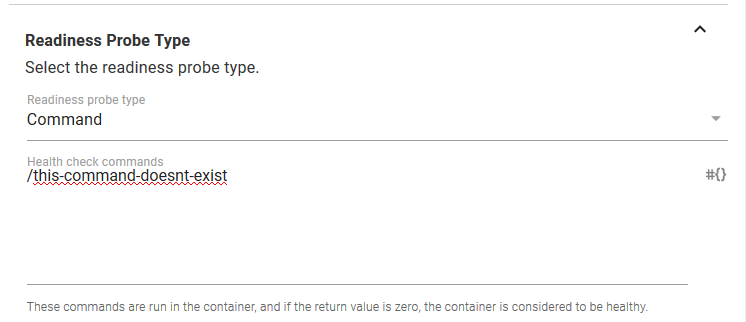

As part of this failed deployment, we'll also change the value of the ConfigMap. Remember that this value is what is displayed in the web page.


As expected, the deployment fails.


So what does it mean to have a failed deployment?


Because we are using the blue/green deployment strategy, we now have two Deployment resources. Because the latest one called `httpd-deployments-842` has failed, the previous one called `httpd-deployments-841` has not been removed.

We also have two ConfigMap resources. Again, because the last deployment failed, the previous ConfigMap resource has not been removed.

In essence the failed deployment resource and its associated ConfigMap resource are orphaned. They are not accessible from the Service resource, meaning to the outside world the new deployment is invisible.

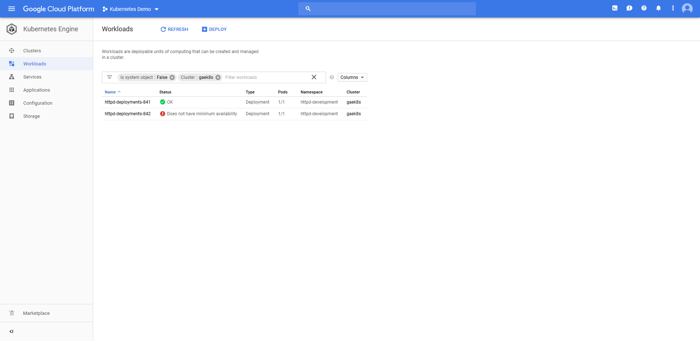


Because the old resources were not edited during deployment and were not removed due the deployment failed, our last deployment is still live, accessible, and displays the same text that was defined with the last successful deployment.

This again is one of the opinions that this step has about what a Kubernetes deployment should be. Failed deployments should not take down an environment, but instead give you the opportunity to resolve the issue while leaving the previous deployment in place.


Go ahead and remove the bad readiness check from the Container resource. Also change the value of the ConfigMap resource to display a new message.


This time the deployment succeeds. Because the deployment succeeded, the previous Deployment and ConfigMap resources have been cleaned up, and the new message is displayed on the webpage.


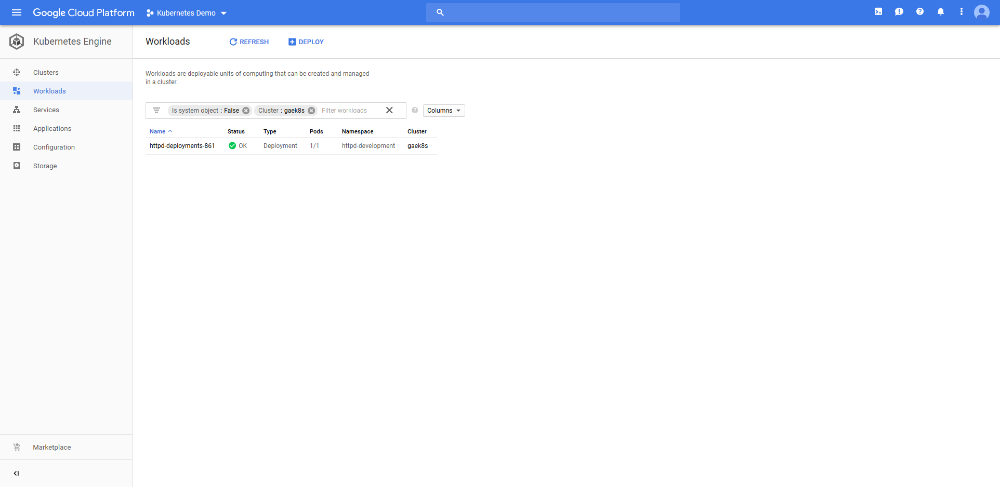


By creating new Deployment resources with each blue/green deployment, and by creating new ConfigMap resources with each deployment, we can be sure that our Kubernetes cluster is not left in an undefined state during an update or after a failed deployment.

## Promoting to Production

I promised you an example of a multi-environment deployment, so let's go ahead and configure our `Production` environment.

First, create a service account for the production environment. This YAML is the same code we used to create the service account for the `Development` environment, only with the text `development` replaced with `production`.

```yaml
---
kind: Namespace
apiVersion: v1
metadata:
  name: httpd-production
---
apiVersion: v1
kind: ServiceAccount
metadata:
  name: httpd-deployer
  namespace: httpd-production
---
kind: Role
apiVersion: rbac.authorization.k8s.io/v1
metadata:
  namespace: httpd-production
  name: httpd-deployer-role
rules:
- apiGroups: ["", "extensions", "apps"]
  resources: ["deployments", "replicasets", "pods", "services", "ingresses", "secrets", "configmaps"]
  verbs: ["get", "list", "watch", "create", "update", "patch", "delete"]
- apiGroups: [""]
  resources: ["namespaces"]
  verbs: ["get"]     
---
kind: RoleBinding
apiVersion: rbac.authorization.k8s.io/v1
metadata:
  name: httpd-deployer-binding
  namespace: httpd-production
subjects:
- kind: ServiceAccount
  name: httpd-deployer
  apiGroup: ""
roleRef:
  kind: Role
  name: httpd-deployer-role
  apiGroup: ""
```

Likewise the Powershell to get the token is the same except `development` is now `production`.

```Powershell
$user="httpd-deployer"
$namespace="httpd-production"
$data = kubectl get secret $(kubectl get serviceaccount $user -o jsonpath="{.secrets[0].name}" --namespace=$namespace) -o jsonpath="{.data.token}" --namespace=$namespace
[System.Text.Encoding]::ASCII.GetString([System.Convert]::FromBase64String($data))
```

The same is true of the bash script.

```sh
user="httpd-deployer"
namespace="httpd-production"
kubectl get secret $(kubectl get serviceaccount $user -o jsonpath="{.secrets[0].name}" --namespace=$namespace) -o jsonpath="{.data.token}" --namespace=$namespace | base64 --decode
```

I won't repeat the details of running these scripts, creating the token account or creating the target, so refer back to [The HTTPD Development Service Account](#the-httpd-development-service-account) for more details.

You want to end up with a target like the one shown below configured.

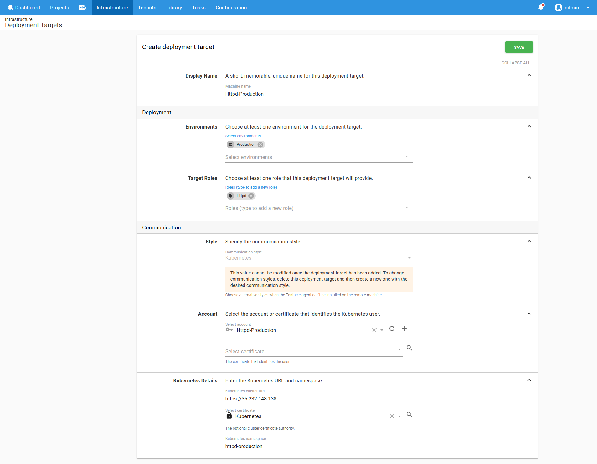

Now go ahead and promote the Octopus deployment to the `Production` environment.

This will result in a second Load balancer Service resource being created with a new public IP address.

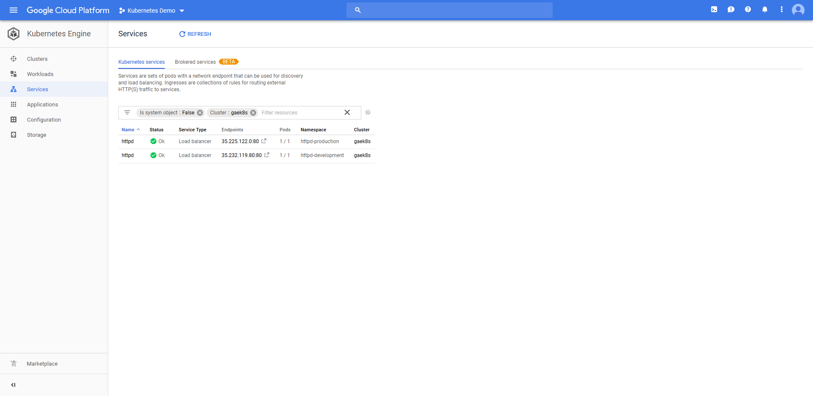

And our production instance can be viewed in a web browser.


Let's have some fun and use a variable for the value of the ConfigMap resource. By setting the value to the variable `#{Octopus.Environment.Name}`, we will display the environment name in the web page.

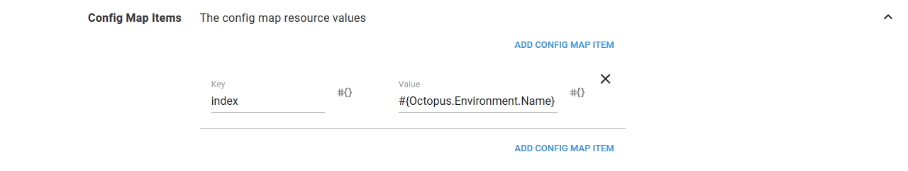

Pushing this change through to production results in the environment name being displayed on the page.


That was a trivial example, but does highlight the power that is available by configuring multi-environment deployments. Once your accounts, targets and environments are configured, moving applications through environments is easy, secure and highly configurable.

## Migrating to Ingress

For convenience we have exposed our HTTPD application via a Load balancer Service resource. This was the quick solution, because Google Cloud took care of building a network load balancer with a public IP address.

Unfortunately this solution will not scale with more applications. Each of those network load balancers costs money, and keeping track of multiple public IP addresses can be a pain when it comes to security and auditing.

The solution is to have a single Load balancer Service that accepts all incoming requests and then directs the traffic to the appropriate Pod resources based on the request. For example https://myapp/userservice traffic would be directed to the user microservice, and https://myapp/cartservice traffic would be directed to the cart microservice.

This is exactly what the Ingress resource does for us. A single Load balancer Service resource will direct traffic to an Ingress Controller resource, which in turn will direct traffic to other internal Service resources that don't incur any additional infrastructure costs.

Unlike most Kubernetes resources, Ingress Controllers are provided by a third party. Some cloud providers have their own Ingress Controllers, but we'll use the Nginx Ingress controller as it is the most popular and can be ported between cloud providers.

But to configure the Nginx Ingress Controller, we first need to set up Helm.

## Configuring Helm

Helm is to Kubernetes what Chocolatey is to Windows or Apt/Yum is to Linux. Helm provides a way to deploy both simple and complex applications to a Kubernetes cluster, taking care of all the dependencies and exposing the available options, and providing commands for upgrading and removing existing deployments.

The great thing about Helm is that there is a huge catalogue of applications already packaged into what Helm calls charts. We will use one of those charts to install the Nginx Ingress Controller.

## Install Helm in the Kubernetes Cluster

Helm has a server side component that must first be installed on the Kubernetes cluster itself. Cloud providers have instructions for setting up the server side component, so hit up those docs to get the instructions for preparing your Kubernetes cluster with Helm.

## Helm Feed

To make use of Helm we need to configure a Helm feed. Since we will use the standard public Helm repository, we configure the feed to access https://kubernetes-charts.storage.googleapis.com/.

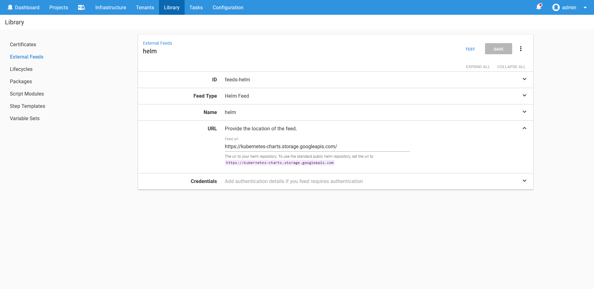

## Ingress Controllers and Multiple Environments

At this point we have a decision to make about how to deploy the Ingress Controllers resources.

We can have one Load Balancer Service resource directing traffic to one Ingress Controller resource, which in turn can direct traffic across environments. Ingress Controller resources can direct traffic based on the hostname of the request, so traffic sent to https://myproductionapp/userservice can be sent to the `Production` environment, while https://mydevelopmentapp/userservice can be sent to the `Development` environment.

The other option is to have an Ingress Controller resource per environment. In this case, an Ingress Controller resource in the `Development` environment would only send traffic to other services in the `Development` environment, and a Ingress Controller resource in the `Production` environment would send traffic to `Production` services.

Either approach is valid, with its own pros and cons. For this example though we'll deploy an Ingress Controller resource to each environment.

We will treat the Nginx Ingress Controller resource as an application deployment. This means, like we did with the HTTPD deployment, a service account and target will be created for each environment.

The Service Account, Role and RoleBinding resources need to be tweaked when deploying Helm charts. Deploying a Helm chart involves listing and creating resources in the `kube-system` namespace. To support this, we create an additional Role resource with the permissions that are required in the `kube-system` namespace, and bind that Role resource to the Service account resource with another RoleBinding resource.

This is the YAML that creates the `nginx-deployer` Service Account resource in the `nginx-development` namespace.

```yaml
---
kind: Namespace
apiVersion: v1
metadata:
  name: nginx-development
---
apiVersion: v1
kind: ServiceAccount
metadata:
  name: nginx-deployer
  namespace: nginx-development
---
kind: Role
apiVersion: rbac.authorization.k8s.io/v1
metadata:
  namespace: nginx-development
  name: nginx-deployer-role
rules:
- apiGroups: ["", "extensions", "apps"]
  resources: ["deployments", "replicasets", "pods", "services", "ingresses", "secrets", "configmaps"]
  verbs: ["get", "list", "watch", "create", "update", "patch", "delete"]
- apiGroups: [""]
  resources: ["namespaces"]
  verbs: ["get"]   
---
kind: RoleBinding
apiVersion: rbac.authorization.k8s.io/v1
metadata:
  name: nginx-deployer-binding
  namespace: nginx-development
subjects:
- kind: ServiceAccount
  name: nginx-deployer
  apiGroup: ""
roleRef:
  kind: Role
  name: nginx-deployer-role
  apiGroup: ""
---
kind: Role
apiVersion: rbac.authorization.k8s.io/v1
metadata:
  namespace: kube-system
  name: nginx-deployer-role
rules:
- apiGroups: [""]
  resources: ["pods", "pods/portforward"]
  verbs: ["list", "create"]
---
kind: RoleBinding
apiVersion: rbac.authorization.k8s.io/v1
metadata:
  name: nginx-deployer-development-binding
  namespace: kube-system
subjects:
- kind: ServiceAccount
  name: nginx-deployer
  apiGroup: ""
  namespace: nginx-development
roleRef:
  kind: Role
  name: nginx-deployer-role
  apiGroup: ""
```

This is the YAML for creating the `nginx-deployer` Service Account resource in the `nginx-production` namespace.

```yaml
---
kind: Namespace
apiVersion: v1
metadata:
  name: nginx-production
---
apiVersion: v1
kind: ServiceAccount
metadata:
  name: nginx-deployer
  namespace: nginx-production
---
kind: Role
apiVersion: rbac.authorization.k8s.io/v1
metadata:
  namespace: nginx-production
  name: nginx-deployer-role
rules:
- apiGroups: ["", "extensions", "apps"]
  resources: ["deployments", "replicasets", "pods", "services", "ingresses", "secrets", "configmaps"]
  verbs: ["get", "list", "watch", "create", "update", "patch", "delete"]
- apiGroups: [""]
  resources: ["namespaces"]
  verbs: ["get"]     
---
kind: RoleBinding
apiVersion: rbac.authorization.k8s.io/v1
metadata:
  name: nginx-deployer-binding
  namespace: nginx-production
subjects:
- kind: ServiceAccount
  name: nginx-deployer
  apiGroup: ""
roleRef:
  kind: Role
  name: nginx-deployer-role
  apiGroup: ""
---
kind: Role
apiVersion: rbac.authorization.k8s.io/v1
metadata:
  namespace: kube-system
  name: nginx-deployer-role
rules:
- apiGroups: [""]
  resources: ["pods", "pods/portforward"]
  verbs: ["list", "create"]
---
kind: RoleBinding
apiVersion: rbac.authorization.k8s.io/v1
metadata:
  name: nginx-deployer-production-binding
  namespace: kube-system
subjects:
- kind: ServiceAccount
  name: nginx-deployer
  apiGroup: ""
  namespace: nginx-production
roleRef:
  kind: Role
  name: nginx-deployer-role
  apiGroup: ""
```

The process of getting the token for the service account is the same, as is creating the token Octopus account and target.

After creating the accounts, namespaces and targets, we'll have the following list of targets configured in Octopus.


## Configuring Helm Variables

We can deploy the Nginx Helm chart with the `Run a Helm Update` step.

Select the `nginx-ingress` chart from the helm feed.


Set the `Kubernetes Release Name` to `nginx-#{Octopus.Environment.Name | ToLower}`. We have taken advantage of the Octopus variable substitution to ensure that the Helm release has a unique name in each environment.


Helm charts can be customized with parameters. The Nginx Helm chart has documented the parameters that it supports [here](https://github.com/helm/charts/tree/master/stable/nginx-ingress#configuration). In particular, we want to define the `controller.ingressClass` parameter, and change it for each environment. The Ingress class is used as a way of determining which Ingress Controller will be configured with which rule, and we'll use this to distinguish between Ingress resource rules for traffic in the `Development` environment from those in the `Production` environment.

In the `Raw Values YAML` section, add the following YAML. Note that we have again used variable substitution to ensure each environment has a unique value applied to it.

```YAML
controller:
  ingressClass: "nginx-#{Octopus.Environment.Name | ToLower}"
```


Save those change, and remember to change the lifecycle to `Application`.


Now deploy the Helm chart to the `Development` environment.

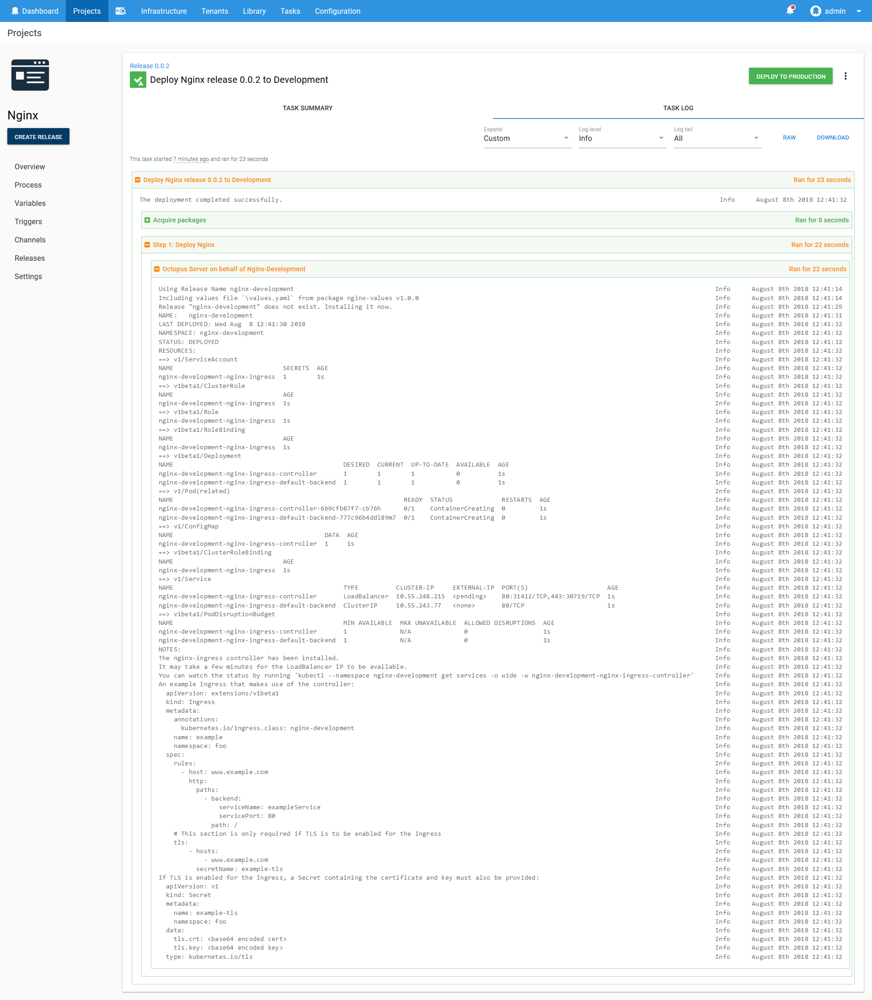

Helm helpfully gives us an example of how to create Ingress resources that work with the newly deployed Ingress Controller resource.

```yaml
The nginx-ingress controller has been installed.
It may take a few minutes for the LoadBalancer IP to be available.
You can watch the status by running 'kubectl --namespace nginx-development get services -o wide -w nginx-development-nginx-ingress-controller'
An example Ingress that makes use of the controller:
  apiVersion: extensions/v1beta1
  kind: Ingress
  metadata:
    annotations:
      kubernetes.io/ingress.class: nginx-development
    name: example
    namespace: foo
  spec:
    rules:
      - host: www.example.com
        http:
          paths:
            - backend:
                serviceName: exampleService
                servicePort: 80
              path: /
    # This section is only required if TLS is to be enabled for the Ingress
    tls:
        - hosts:
            - www.example.com
          secretName: example-tls
```

In particular, the annotations are important.

```yaml
annotations:
  kubernetes.io/ingress.class: nginx-development
```

Remember how we set the `controller.ingressClass` parameter when deploying the Helm chart? This annotation is what that property controls. It means that an Ingress resource must specifically set the `kubernetes.io/ingress.class: nginx-development` annotation to be considered by this Ingress Controller resource. This is how we distinguish between rules for the development and production Ingress Controller resources.

Go ahead and push the deployment to the `Production` environment.

We can now see the Nginx Deployment resources in the Kubernetes cluster.


Those Nginx Deployment resources are accessible from new Load balancer Service resources.


We're now ready to connect to the HTTPD application through the Ingress Controllers instead of through their own network load balancers.

## Configuring Ingress

Back in the HTTPD Container Deployment step, we need to change the `Service Type` from `Load balancer` to `Cluster IP`. This is because an Ingress Controller resource can direct traffic to the HTTPD Service resource internally. There is no longer a need for the HTTPD Service resource to be publicly accessible, and a Cluster IP Service resource provides everything we need.

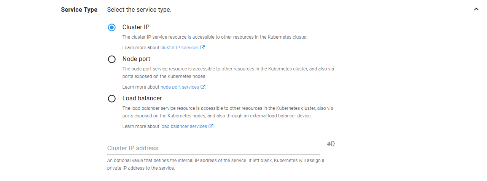

We now need to configure the Ingress resource.

Start by defining the `Ingress Name`.


The Ingress resources support the many different Ingress Controllers that are available via annotations. These are key/value pairs that often contain implementation specific values. Because we have deployed the Nginx ingress controller, a number of the annotations we are defining are specific to Nginx.

The first annotation is shared across Ingress Controller resource implementations though. It is the `kubernetes.io/ingress.class` annotation that we talked about earlier. We set this annotation to `nginx-#{Octopus.Environment.Name | ToLower}`. This means that when deploying in the `Development` environment, this annotation will be set to `nginx-development`, and when deploying to the `Production` environment it will be set to `nginx-production`. This is how we target the environment specific Ingress Controller resources.

The `kubernetes.io/ingress.allow-http` annotation is set to `true` to allow unsecure HTTP traffic, and `nginx.ingress.kubernetes.io/ssl-redirect` is set to `false` to prevent Nginx from redirecting HTTP traffic to HTTPS.

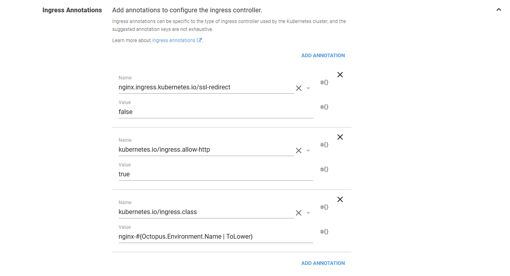

:::warning
Enabling HTTP traffic is a security risk and is shown here for demonstration purposes only.
:::

The last section to configure is the `Ingress Host Rules`. This is where we map incoming requests to the Service resource that exposes our Container resources. In our case we want to expose the `/httpd` path to the Service resource port that maps to port 80 on our Container resource.

The `Host` field is left blank, which means it will capture requests for all hosts.


Go ahead and deploy this to the `Development` environment. You will get an error like this.

```
The Service "httpd" is invalid: spec.ports[0].nodePort: Invalid value: 30245: may not be used when `type` is 'ClusterIP'
```

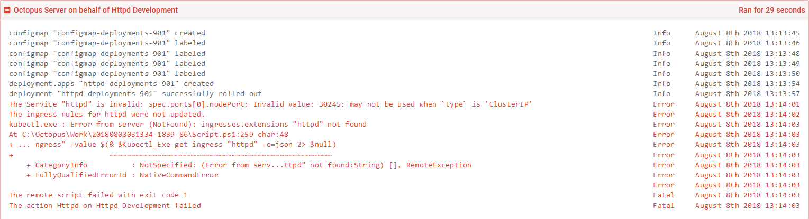

This error is thrown because we changed a Load balancer Service resource, which defined a `nodePort` property, to a Cluster IP Service resource, which does not support the `nodePort` property. Kubernetes is pretty good at knowing how to update an existing resource to match a new configuration, but in this case it doesn't know how to perform this change.

The easiest solution is to delete the Service resource and rerun the deployment. Because we have completely defined the deployment process in Octopus, we can delete and recreate these resources safe in the knowledge that there are no undocumented settings that have been applied to the cluster that we might be removing.


This time the deployment succeeds, and we have successfully deployed the Ingress resource.

Let's open up the URL that we exposed via the Ingress Controller resource.


And we get a 404. What is wrong here?

## Managing URL Mappings

The issue here is that we opened a URL like http://35.193.149.6/httpd, and then passed that same path down to the HTTPD service. Our HTTPD service has no content to serve under the `httpd` path. It only has the `index.html` file in the root path the mapped from a ConfigMap resource.

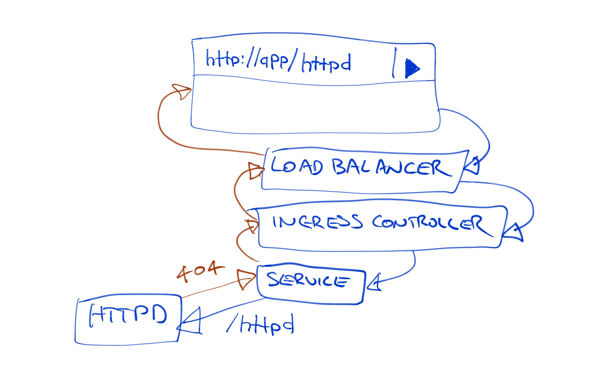

Fortunately this path mismatch is quite easy to solve. By setting the `nginx.ingress.kubernetes.io/rewrite-target` annotation to `/`, we can configure Nginx to pass the request that it receives on path `/httpd` along to the path `/`. So while we access the URL http://35.193.149.6/httpd in the browser, the HTTPD service sees a request to the root path.


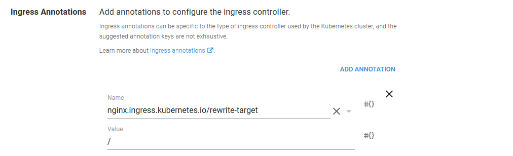

Redeploy the project to the `Development` environment. Once the deployment is finished, the URL http://35.193.149.6/httpd will return our custom web page displaying the name of the environment.

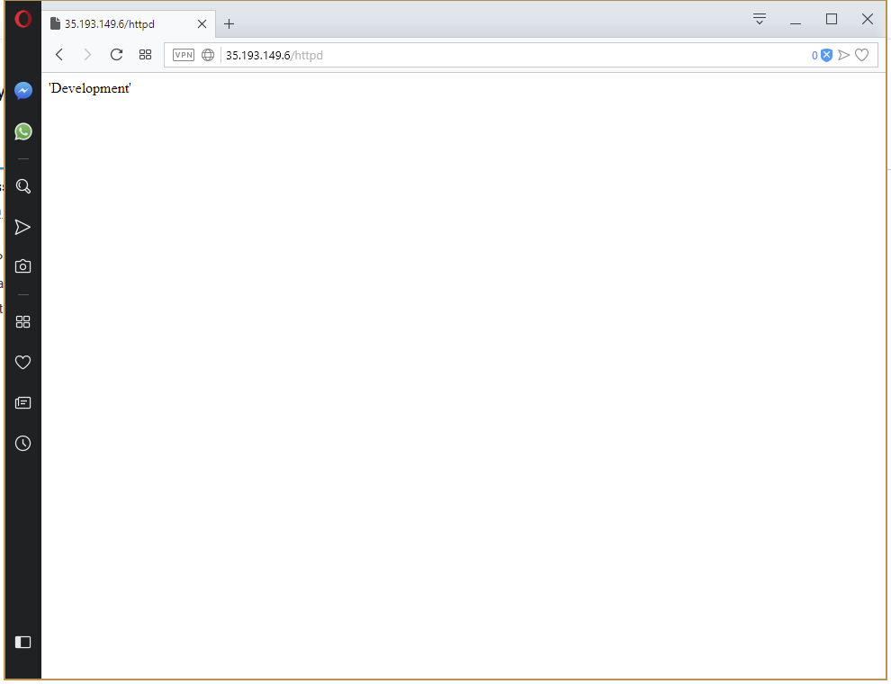

Now that we have the `Development` environment working as we expect, push the deployment to the `Production` environment (remembering to delete the old Service resource, otherwise the `nodePort` error will be thrown again). This time the deployment works straight away.


:::hint
The `nginx.ingress.kubernetes.io/rewrite-target` annotation works in simple cases, but when the returned content is a HTML page that has links to CSS and JavaScript file, those links may be relative to the base path, because the application serving the content has no idea about the original path that was used.

In some cases this can be rectified with the `nginx.ingress.kubernetes.io/add-base-url: true` annotation. This will insert a `<base>` element into the header of the HTML being returned. [See the Nginx documentation](https://kubernetes.github.io/ingress-nginx/user-guide/nginx-configuration/annotations/#rewrite) for more information.
:::

## Output Variables

One of the benefits of using Octopus to perform Kubernetes deployments is that your deployment process can integrate with a much wider ecosystem. This is done by accessing the output variables that are generated for each resource created by this step. These parameters can then be consumed in later steps.

:::hint
By setting the `OctopusPrintEvaluatedVariables` variable to `True` in the Octopus project, it is possible to see all the variables that are available during deployment. See the [documentation](https://octopus.com/docs/support/debug-problems-with-octopus-variables#DebugproblemswithOctopusvariables-Writethevariablestothedeploymentlog) for more details.
:::

In our case, the output variables are (replace `step name`, with the name of the step):
* Octopus.Action[step name].Output.Ingress
* Octopus.Action[step name].Output.ConfigMap
* Octopus.Action[step name].Output.Deployment
* Octopus.Action[step name].Output.Service

These variables contain the JSON representation of the Kubernetes resources that were created. By parsing these JSON strings in a script step, we can for example display a link to the network load balancer that is exposing our Kubernetes services.

```PowerShell
$IngressParsed = ConvertFrom-Json -InputObject $OctopusParameters["Octopus.Action[Deploy Httpd].Output.Ingress"]
Write-Host "Access the ingress load balancer at http://$($IngressParsed.status.loadBalancer.ingress.ip)"
```

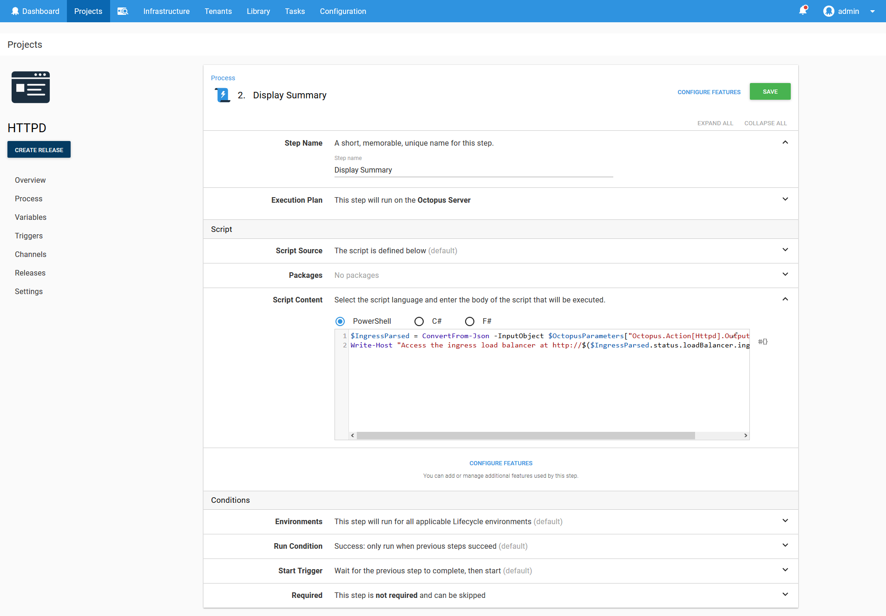

## Some Useful Tips and Tricks

### Viewing the Resource YAML

You may have noticed that the Octopus step does expose every possible option that can be defined on a Deployment resource.

If you need a level of customization that the step does not provide, you can find the YAML for the resources that are created in the log files. These YAML files can be copied out, edited and deployed manually through the `Run a kubectl CLI script` step.


### Adhoc Scripts

One of the challenges with managing multiple Kubernetes accounts and clusters is constantly switching between them when running quick queries and one off maintenance scripts. It is always best practise not to run scripts with an admin user, but I think we have all run that sneaky command as admin just to get the job done. And more than a few have been burned with a delete command that was just a bit too broad...

Fortunately, once targets have been configured in Octopus as described in this blog post, it becomes easy to run these adhoc scripts limited to a single namespace using the `Script Console`.

You can access the `Script Console` through `Tasks -> Script Console`. Select the Kubernetes target that reflects the namespace that you are working with, and write a script in the supplied editor.

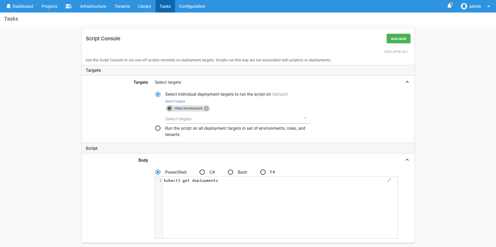

The script will be run in the same kubectl context that is created when running the `Run a kubectl CLI Script` step. This means you adhoc scripts will be contained to the namespace of the target (assuming if course the service account has the correct permissions), limiting the potential damage of a wayward command.

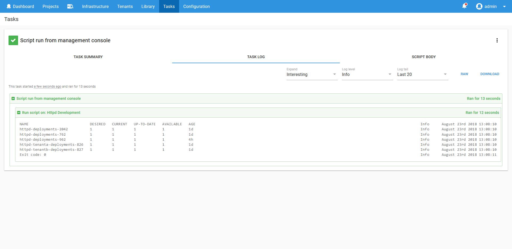

The script console also has the advantage of saving a history of what commands were run by whom, providing an audit trail for mission critical systems.

### Scripting Kubernetes Targets

Creating accounts and targets can be time consuming if you are managing a large Kubernetes cluster. Fortunately the process can be automated so the Kubernetes Namespace and Service Account resources along with the Octopus Account and Targets are created with a single script.

Create a `Run a kubectl CLI Script` step that targets an existing Kubernetes admin target (i.e. a target that was set up with the Kubernetes admin credentials).

Define the following project variables:

* KubernetesUrl - The Kubernetes cluster URL.

Paste the following code as the script body.

```PowerShell
# The account name is the project, environment and tenant
$projectNameSafe = $($OctopusParameters["Octopus.Project.Name"].ToLower() -replace "[^A-Za-z0-9]","")
$accountName = if (![string]::IsNullOrEmpty($OctopusParameters["Octopus.Deployment.Tenant.Id"])) {
    $($OctopusParameters["Octopus.Project.Name"] -replace "[^A-Za-z0-9]","") + "-" + `
    $($OctopusParameters["Octopus.Deployment.Tenant.Name"] -replace "[^A-Za-z0-9]","") + "-" + `
    $($OctopusParameters["Octopus.Environment.Name"] -replace "[^A-Za-z0-9]","")
} else {
    $($OctopusParameters["Octopus.Project.Name"] -replace "[^A-Za-z0-9]","") + "-" + `
    $($OctopusParameters["Octopus.Environment.Name"] -replace "[^A-Za-z0-9]","")
}

# The namespace is the acocunt name, but lowercase
$namespace = $accountName.ToLower()
#Save the namespace for other steps
Set-OctopusVariable -name "Namespace" -value $namespace
Set-OctopusVariable -name "AccountName" -value $accountName

Set-Content -Path serviceaccount.yml -Value @"
---
kind: Namespace
apiVersion: v1
metadata:
  name: $namespace
---
apiVersion: v1
kind: ServiceAccount
metadata:
  name: $projectNameSafe-deployer
  namespace: $namespace
---
kind: Role
apiVersion: rbac.authorization.k8s.io/v1
metadata:
  namespace: $namespace
  name: $projectNameSafe-deployer-role
rules:
- apiGroups: ["", "extensions", "apps"]
  resources: ["deployments", "replicasets", "pods", "services", "ingresses", "secrets", "configmaps", "namespaces"]
  verbs: ["get", "list", "watch", "create", "update", "patch", "delete"]   
---
kind: RoleBinding
apiVersion: rbac.authorization.k8s.io/v1
metadata:
  name: $projectNameSafe-deployer-binding
  namespace: $namespace
subjects:
- kind: ServiceAccount
  name: $projectNameSafe-deployer
  apiGroup: ""
roleRef:
  kind: Role
  name: $projectNameSafe-deployer-role
  apiGroup: ""
"@

kubectl apply -f serviceaccount.yml

$data = kubectl get secret $(kubectl get serviceaccount "$projectNameSafe-deployer" -o jsonpath="{.secrets[0].name}" --namespace=$namespace) -o jsonpath="{.data.token}" --namespace=$namespace
$Token = [System.Text.Encoding]::ASCII.GetString([System.Convert]::FromBase64String($data))

New-OctopusTokenAccount `
	-name $accountName `
    -token $Token `
    -updateIfExisting

New-OctopusKubernetesTarget `
    -name $accountName `
    -clusterUrl $KubernetesUrl `
    -octopusRoles "Target Role" `
    -octopusAccountIdOrName $accountName `
    -namespace $namespace `
    -updateIfExisting `
    -skipTlsVerification True
```

This script will then create the Kubernetes resources, get the token, and create the Octopus token account and Kubernetes target.

You could also allow the project variables to be supplied during deployment, or save this script as a [step template](https://octopus.com/docs/deployment-process/steps/custom-step-templates) to make it easier to reuse.

## Summary

In this post we have seen how to manage multi-environment deployments within a Kubernetes cluster using Octopus. Each application and environment was configured in as a separate namespace, with a matching service account that had permissions only to that single namespace. The namespaces and service accounts were then configured as Kubernetes targets, which represent a permission boundary in a Kubernetes cluster.

The deployments were then performed using the blue/green strategy, and we saw how failed deployments leave the last successful deployment in place while the failed resources can be debugged.

We also looked at how to deploy applications with Helm across environments, which we implemented by deploying the nginx-ingress chart.

The end result was a repeatable deployment process that emphasises testing changes in a `Development` environment, and pushing the changes to a `Production` environment when ready.

I hope you have enjoyed this blog post, and if you have any suggestions or comments about the Kubernetes functionality please leave a comment. These steps are in a preview state, so your feedback is appreciated.
