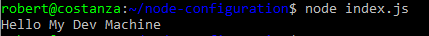
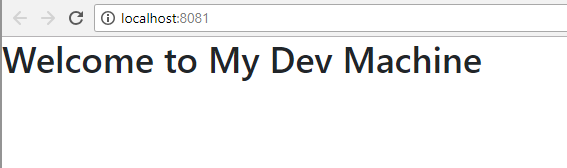

- Configuration in javascript - problems with environment variable approach
- 12 factor app

- Load config.json
- load 


It is common to develop a single page application (SPA) as a standalone Javascript app, hoeever a ommon quesion .

Create a simple `config.json` file that contains the configuration needed for your application. The values in this configuration should just be the configuration you use for development time. There is no need to create a `config.staging.json` or `config.prod.json`, the environmental configuration will be provided by octopus at deploy time. Avoiding these "environmental" configuration files makes our CD process much more flexible and avoids leaking

## NodeJs Application
Node is really simple. So long as we include the config file in the distributed application, we can pull load it directly as if it were any other module.


```javascript
const config = require("./config");
console.log(`Hello ${config.message}`);
```

You couldnt get easier configuration than that if you tried.



No need to muck around with detecting environments (where for testing you may have more than one on one machine), loading `config.prod.json` and combine with defaults in `config.json`!

### React Single Page App
Using react we want to minify and combine all our application files into a single javascript file to optimize the run-time experience. We dont want to embed the configuration file into that single application file since that makes it more difficult for us to update at deploy-time with our environment specific values. Instead we have decided that we want to show a splash screen while the config file is loading (dont worry, since this is a statically served file it should be fairly quick) and which can be done with just a few files.


Starting with a simple `config.json` file in our application we provide a value that we can use during development and local testing. This file will be copied to our distribution directory when we build our application as-is.

#### `config/config.js`
```json
{ "message": "My Dev Machine" }
```

In this scenario we are using webpack to develop our code, and as such include a line to copy our `config.json` file to the output directory.

#### `webpack.config.js`
```javascript
const HtmlWebPackPlugin = require("html-webpack-plugin");
const CopyWebpackPlugin = require('copy-webpack-plugin');

module.exports = {
  module: {
    rules: [
      { test: /\.js$/, exclude: /node_modules/, use: { } },
      { test: /\.html$/, use: [ { loader: "html-loader" }] }
    ]
  },
  plugins: [
    new HtmlWebPackPlugin({ template: "./src/index.html", filename: "./index.html" }),
	new CopyWebpackPlugin([ { from: 'src/config/config.json', to: 'config.json', toType: 'file' } ], { })
  ]
};
```

Our entrypoint `index.js` file will use a `ConfigLoader` component to load the configuration file at run time and display the `Home` component when it completes.

#### `index.js`
```javascript
import React, { Component } from 'react';
import ReactDOM from 'react-dom';
import ConfigLoader from './components/ConfigLoader';
import Home from './components/Home';

class App extends Component {
  render() {
    // When the configuration is loaded, render the Home module
	return <ConfigLoader ready={() => <Home />} />;
  }
}

ReactDOM.render(<App />, document.getElementById('root'));
```

the `Home` component simply displays the message provided via configuration

#### `components/Home.js`
```javascript
import React, { Component } from 'react';
import config from './config';

export default class Home extends Component {
	render() {		return <div className="App">		
        <header className="App-header">
          <h1 className="App-title">Welcome to {config.message}</h1>
        </header>
      </div>;
	}
}
```

As you can see we are importing a `config` module. This is not the raw json file created above, this is a special module I will show below. Since this component wont render until the `ConfigLoader` component has loaded the `config.json` file we can assume that the config object has all the properties we need, in this case just `message`.

The `ConfigLoader` component. simply calls a `load` method on our config object and renders the module provided via its props when the configuration has loaded.

#### `components/ConfigLoader.js`
```javascript
import { Component } from 'react';
import {load} from "./config";

export default class ConfigLoader extends Component {
	constructor(props){
		super(props);
		this.state = {isLoaded: false};
	}
  
  componentDidMount() {
     // Once the configuration is loaded set `isLoaded` to true so we know to render our component
	 load().then(config =>  this.setState({isLoaded: true, config}));
  }
  
  render() {	  
    // If we haven't yet loaded the config, show either a "splash" component provided via a `loading` props or return nothing.
	if(!this.state.isLoaded) {
		return this.props.loading ? this.props.loading() : null;
	}

    // The config is loaded so show the component set on the `ready()` props
    return this.props.ready(this.state.config);
  }
}
```

The real magic happens in our `config.json` component. We initially provide an empty object in place of our configuration. This is so that when we load the config via the HTTP fetch command, we effectively _copy_ the properties from the loaded object onto the exported object. This is because the exported object is effectively cached the first time this module is loaded.

#### `components/config.js`
```javascript
const config = {};
export default config;

function load() {
	return fetch('config.json')
	.then(result => result.json())
	.then((newconfig) => {
		for(let prop in config) {
			delete config[prop]
		}
		for(let prop in newconfig) {
			config[prop] = newconfig[prop]
		}
		return config;
	});
}
export {load}
```

The great this about this is that as we are developing we can modify the config file and webpack will trigger a refresh as if I were updating any other file. 



_...and who said i wasn't a great designer_

Everywhere in our app that we want to use the configuration (like the `Home` component above), we can load and simply use the `config.js`  module and access the properties directly since all modules are only rendered once the `ConfigLoader` component has retrieved the configuration. This is a fairly simple demonstration but depending on your use case you may want to dispatch the config into a redux store or you may also want to deal with more complex scenario's like cache busting etc. Hopefully the sample above gives some idea on how you can load a simple json file that Octopus performs replacements on into your application.


npx create-react-app react-versioning
cd react-versioning
yarn start