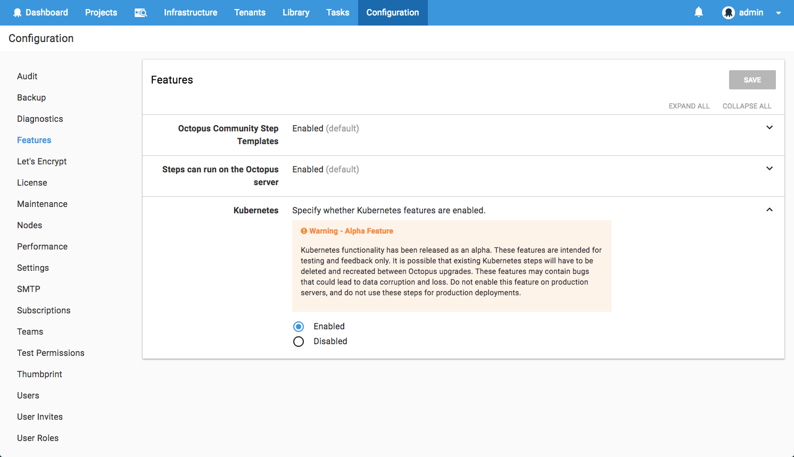
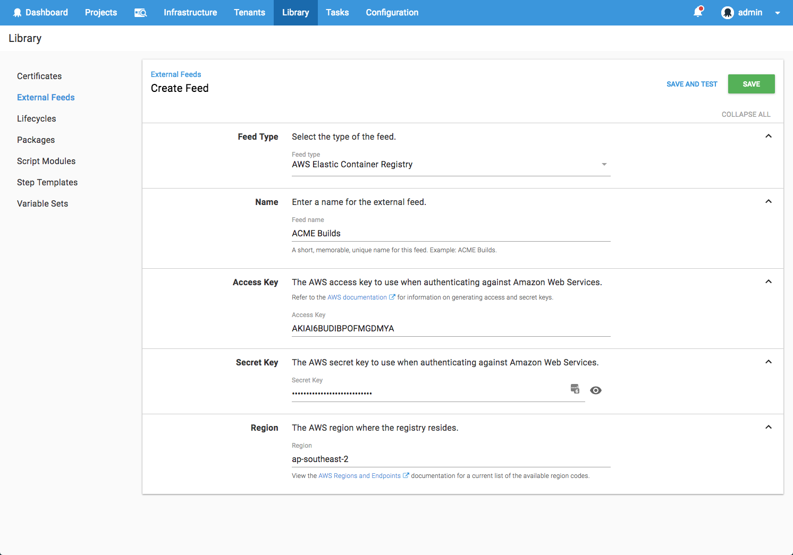

## In This Post

!toc

## Release Tour

<iframe width="560" height="315" src="https://www.youtube.com/embed/luv-qSbla_k" frameborder="0" allowfullscreen></iframe>

## Script Step Packages++

In Octopus 2018.8, the family of script steps (_Run a Script_, _Run an Azure PowerShell Script_, _Run an AWS CLI Script_) gain some new super-powers.   

We are making consuming packages from script steps much easier and more powerful. Multiple package references can now be added, and each package can be optionally extracted.  Container images can also be referenced. We also added support for variable substitution so any files contained within a referenced package can be updated.

We have an entire [post on these enhancements](https://octopus.com/blog/script-step-packages), so please have a read.

## Kubernetes Alpha

We are very excited to be including the first-draft of Kubernetes support in Octopus! This functionality is being released behind a feature-flag, and is designed to enable us to receive feedback from some real users. Although we don't currently recommend using this for production work-loads, we would encourage anyone interested to take a peek and all feedback is very welcome. 

## AWS ECR Feed

A new `AWS Elastic Container Registry` feed type has been added. This makes configuring AWS credentials to access container images from ECR much more convenient. 

## Upgrading

As usual [steps for upgrading Octopus Deploy](https://octopus.com/docs/administration/upgrading) apply. Please see the [release notes](https://octopus.com/downloads/compare?to=2018.8.0) for further information.
