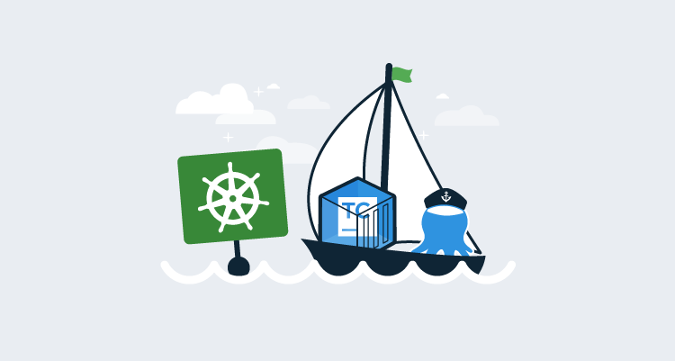

Hi!  My name is Bob Walker and I am a solution architect here at Octopus Deploy.  

My primary focus is making sure our customers are successful using Octopus Deploy.  That simple sentence covers a wide range of duties.  One day I could be reviewing configuration.  While the next, I might be working on a custom implementation using the API.  Or I might provide demos showing off all the new functionality we've been adding.  At Octopus Deploy we don't have a preference for which build server our customers use, and that flexibility is great for our customers because they can continue using their build tool of choice.  A side effect of that is I get to learn how to use every build server by creating builds to demo.  Speaking of which, if you'd like a demo please [click here](https://octopus.appointlet.com/s/sales-60/bob-ryan) to schedule one!

A the time of this writing, we have two more solution architects focused on customer's success, Ryan Rousseau and Derek Campbell.  Whenever possible we share the demos we've set up.  Our backgrounds are in development or infrastructure, which means we really dislike it anytime we have to reinvent the wheel.  The easiest way we found to share demo resources is to use SaaS or IaaS whenever possible.  We use [Octopus Cloud](https://octopus.com/pricing/cloud) for our Demo Octopus instance.  In fact, we were one of the alpha users of Octopus Cloud and are one of the bleeding edge users.  We help dogfood Octopus Cloud every day.  

Our first two build servers, VSTS (now Azure DevOps) and AppVeyor, were rather easy to set up.  They are already SaaS.  But many of our users are using TeamCity.  All three of us have a local TeamCity instance.  It's time to move that to the cloud.

The other reason I chose TeamCity is because of it's "real-world" potential.  A lot of containers I've had a chance to work with are rather simple.  An ASP.NET Core WebApi which only connects to an external SQL Server.  With TeamCity there are a lot of considerations, there is a main server, an agent which needs to talk to the server, and the need to persist data between deployments.  

**Side Note:** at times in this article I am going to use Kubernetes and K8s interchangeably.  They mean the same thing.  It really depends how I feel when I was writing the sentence.

!toc

## Requirements

We want our build server to support many technologies.  This list includes, but is not limited to:

1. .NET Framework 4.7.x applications (ASP.NET, Windows Services, etc)
2. .NET Core applications
3. Windows Container applications
4. Linux Container applications (for my .NET core apps!)
5. Java
6. Web Frameworks (Angular, React, etc)

## Platform

I can go the easy way out and run TeamCity on a Linux VM with Windows build agent on another VM.  JetBrains provides AWS and Azure templates to make setup as easy as possible.  But I don't want to have to maintain VMs.  

JetBrains provides a [server docker container](https://hub.docker.com/r/jetbrains/teamcity-server/) and an [agent docker container](https://hub.docker.com/r/jetbrains/teamcity-agent/).  If you look closely at the agent docker container you can see it can either be run as a Linux container or a Windows container.  They also include a number of build tools, such as .NET and Git.  And, Octopus Deploy recently added Kubernetes support.  The challenge today is to get TeamCity running in a Kubernetes cluster.  

For fun, I am going to be using Octopus Deploy to deploy TeamCity to Kubernetes which will in turn push packages back to the same Octopus Deploy instance.  That is some snake eating the tail, but why not?  YOLO, right?

## Step 1: Create K8s Cluster and Connect Octopus Deploy to it

First, we need to setup Octopus Deploy to deploy to the K8s cluster.  In order for that to happen, I need to create a K8s cluster first.  For the purposes of this article I will be using the Google Cloud Platform, or GCP, to host my K8s cluster.  

Let's go to [Google Console Login](https://console.cloud.google.com).

### Creating the Cluster
Once you create your account and login you will be sent to the dashboard.  On the left menu select Kubernetes.

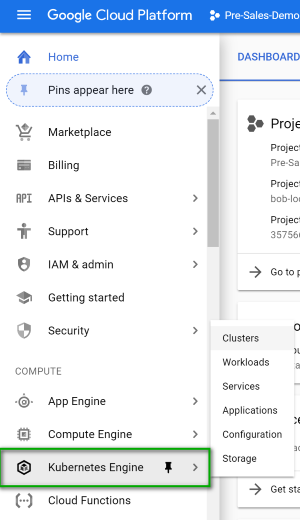

Click on the create cluster button.

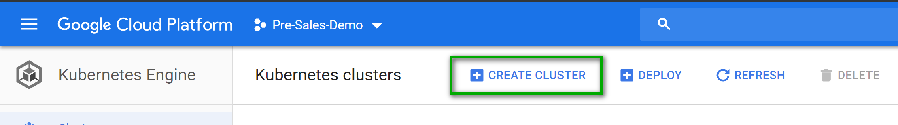

You will be presented with a wizard.  You can leave the defaults as is.  All I did was enter in a name and click on create.  I left the size (1 vCPU and 3.75 GB of memory) and the location (us-central1-a) alone.  Fun fact, that data center is only 15ish miles from my house.  If there is any latency I have a few questions and couple of follow up questions.

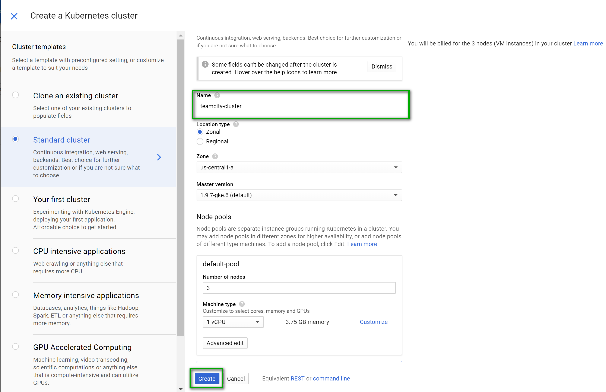

### Setup Octopus to Connect to Kubernetes Cluster

It takes anywhere from 5 to 20 minutes for the cluster to be created.  While we are waiting, let's get Octopus Deploy ready to connect to it.  I will be using my team's hosted Octopus instance for this.  Because I am using the hosted instance, I know I am on the latest version, which at the time of this writing is 2018.8.6.  You need to use at least 2018.8.0 for this to work.

Currently, K8s is disabled by a feature flag.  First things first, go to {{configuration,features}} and enable it.  

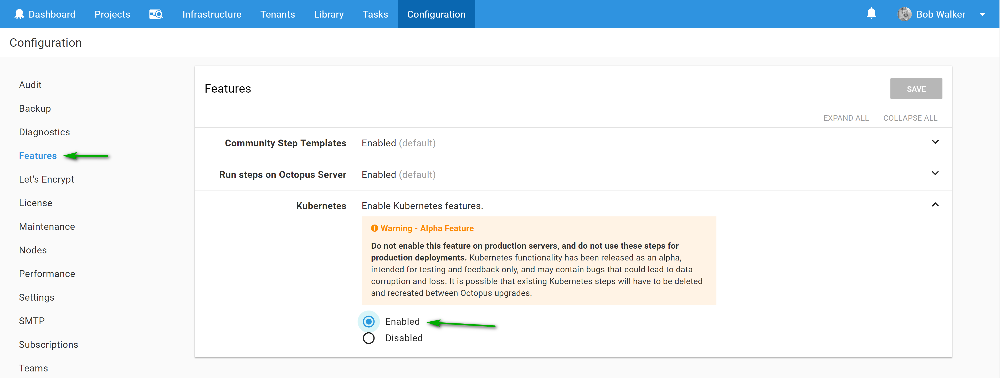

Next up, it is time to create a worker.  Workers are a new type of targets.  This [feature was added in 2018.7.0](https://octopus.com/blog/octopus-release-2018.7).  It allows you to create a pool of machines to perform work.  Previously this work was performed directly on the Octopus Server.  

The worker will have Kubectl installed on it.  I want these machines partitioned off from the rest of my targets because they will have admin access to my cluster.  To do this, I first created a worker pool called "Kubernetes Worker Pool."

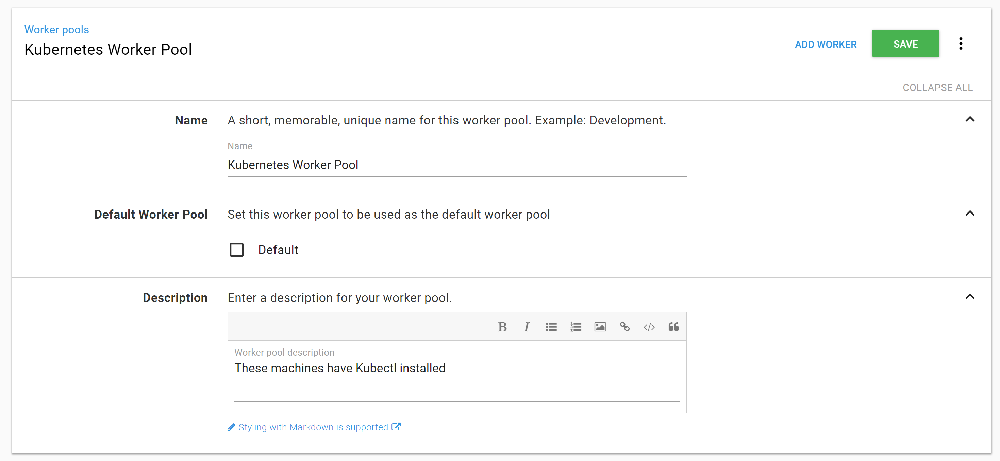

The worker is nothing fancy, a listening tentacle assigned to a specific worker pool.  


Don't forget to add KubeCtl on the machine.  I'm using Windows, so I'll let chocolatey handle the heavy lifting.

```
Set-ExecutionPolicy Bypass -Scope Process -Force; iex ((New-Object System.Net.WebClient).DownloadString('https://chocolatey.org/install.ps1'))

choco install kubernetes-cli -y
```

### Connecting to GCP

All right, we've killed enough time.  Let's check on GCP and see where my cluster is at.  Nice, it's finished.  Click on the pencil icon.

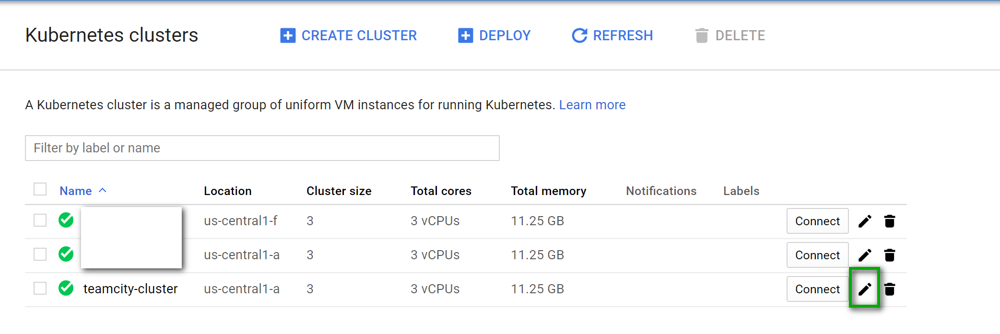

This next page shows us the overview of the cluster.  Make note of the IP Address.  That is how Octopus will communicate with this cluster.  And before you wonder, "hey isn't showing your IP address and other sensitive information dangerous?"  Yes, it is.  I deleted everything in GCP before this went live.

**Side Note:** I actually did these steps a couple of times while writing this article.  I was trying out a few options.  These screenshots are from the original instance that was deleted long ago.

In order to connect to the cluster we need to get the username and password.

#### Getting Admin Credentials to Connect Octopus to Google Cloud
Kubernetes on Google Cloud provides two ways to connect to it.  At the time of this writing Google Cloud will create a admin account for you.  However, in future versions that will be optional.  

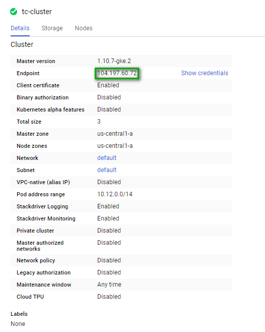

If you click the "show credentials" link, that will show the username and password.  

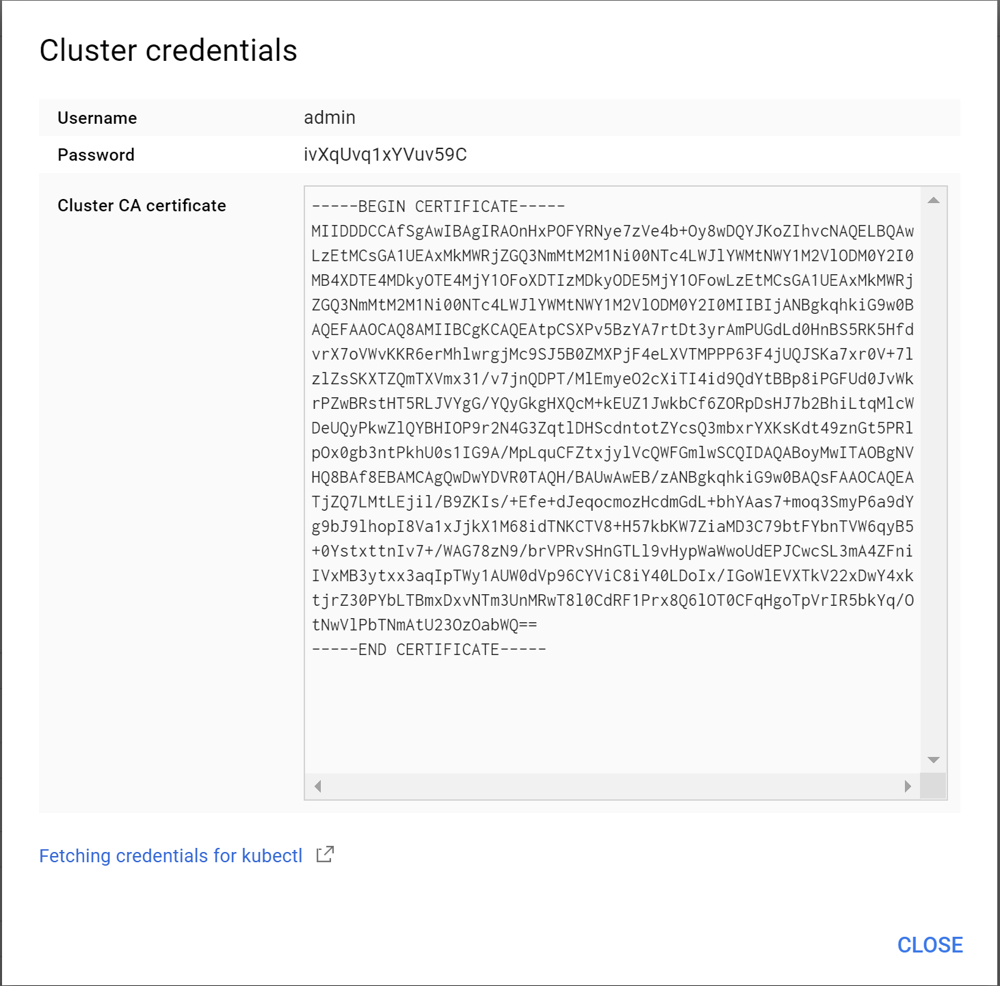

**Side Note:** In upcoming versions of Kubernetes (v1.12) on Google Cloud the default admin and password will be disabled.  You will need to create a service account.  Please follow [these instructions](https://kubernetes.io/docs/tasks/configure-pod-container/configure-service-account/) on how to do this.  As v1.12 is not out yet anything I post here could be out of date. 

#### Saving Credentials
Now we have a username and password, we're going to save those credentials in Octopus.  Go to {{Infrastructure,Accounts}}.  On the top right, click on add account and select username/password.

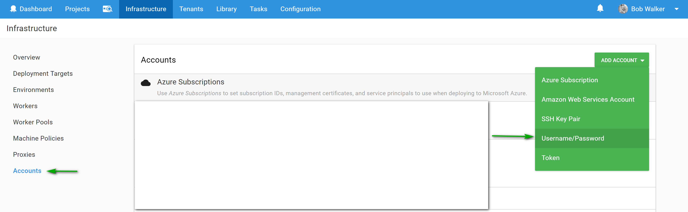

All you need to do here is enter in the username and password from GCP.

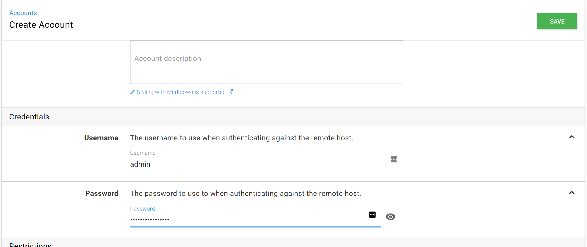

#### Saving the Certificate

The certificate provided by GCP will be used so we can use TLS verifications.  We will need to save that certificate in Octopus Deploy so it can be used.  To start out, save the certificate to your desktop as a .pem file.  Then go to {{Library,Certificates}} and click the add certificate.


Fill out the form and select the certificate file you created on your desktop.


If successful you will see a screen similar to this.  You'll notice the certificate is self-signed and set to expire in 5 years.  If I wanted to, I could set up a subscription to notify me when this expires.  But not now, that is future Bob's problem.


### Add Kubernetes Target
Now it is time to add the Kubernetes deployment target.  Go to add deployment target

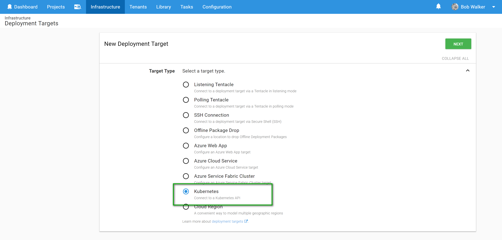

First, create a name, assign it to environments and a role.

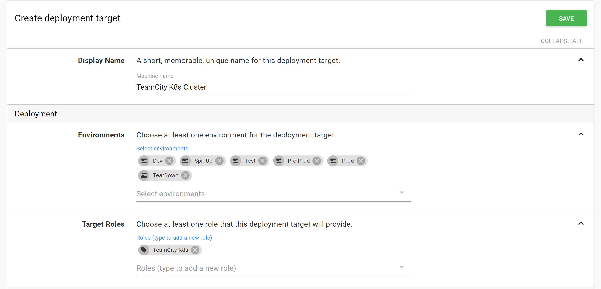

Next, select the username/password account, enter in the IP Address, and select the certificate.  

**Please note:** it is important to have https:// before your [Ip Address] for the URL.  If you don't, Octopus won't be able to connect to your K8s cluster and you will spend a lot of time wondering why.  I know this because I forgot and I kept scratching my head wondering why it wasn't working.

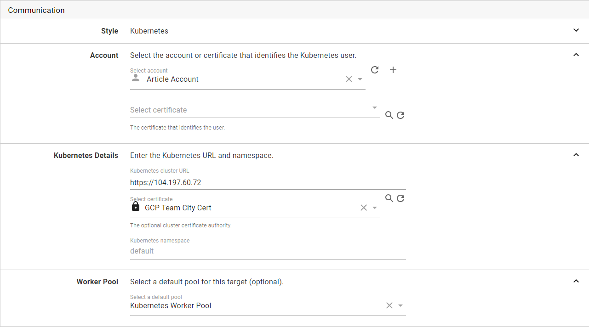

I like to perform a health check right away to make sure I didn't screw anything up.

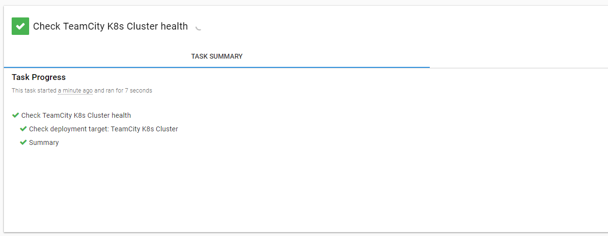

### Add External Docker Feed

Finally, we need to add Docker Hub as a feed.  This is where the TeamCity container will be pulled from.  Go to {{Library,external feeds}} and click the "Add Feed" button on the top right.  

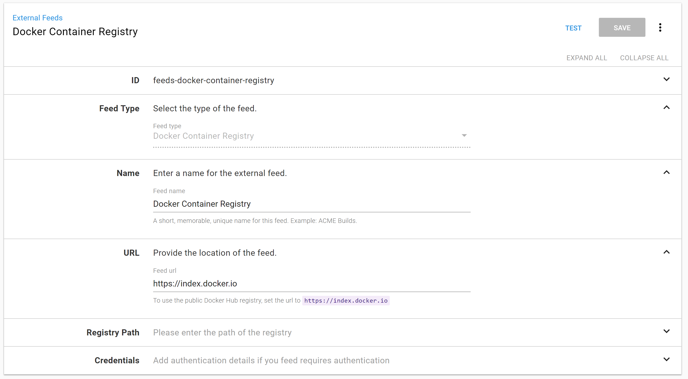

## Step 2: Deploy Team City Server

I want to start simple and go complex.  It is possible to configure TeamCity to use external storage and an external database.  But it's also possible to configure it to use local storage and a local database.  I know if I configure it to use the local resources that they will be destroyed each time I do a deployment.  For right now, that is fine.  I just want to get it running.  I won't set up any users or projects.  

### Create Project and Add First Step
In Octopus Deploy, create a new project.  I created a new environment called "SpinUp" and lifecycle called "SpinUp Only."  Feel free to configure your environment and lifecycle however you want.  This is just what I did.

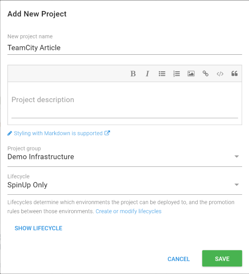

The process will consist of a single Deploy Kubernetes Containers step.  Please note, this step has a lot of options.  For the sake of brevity, I will only include screenshots of items I changed.  If you don't see something in the screenshot, assume I left it alone.


### Deploy Kubernetes Containers Step
First, enter in the basic information for this step.  

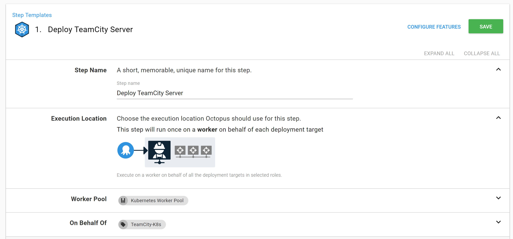

Next, click on the "configure resources" and disable "secret" and "configure map."  This is to keep the step a little easier to walk through.

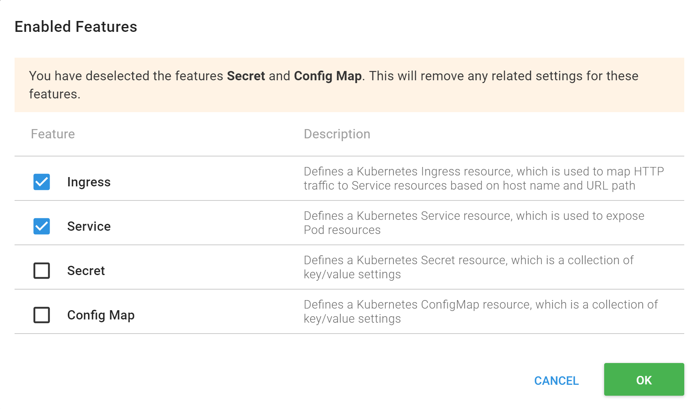

Enter a deployment name.  The name can only contain lowercase alphanumeric characters plus "-".


For the deployment strategy, I am leaving it at recreate deployment.

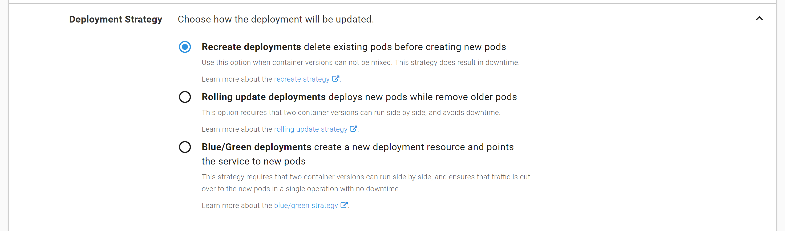

Now it is time to specify the container.  Click on Add Container.

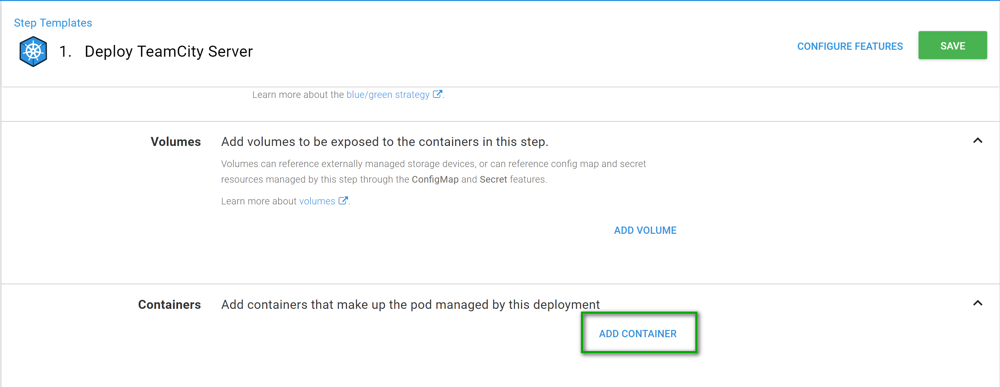

The full container name is jetbrains/teamcity-server.  JetBrains is the username who created the container and teamcity-server is the name of the container.  Enter all that information into the start of the "Add Container" screen.


Now it is time to specify the port number.  The default port number exposed by TeamCity is 8111.

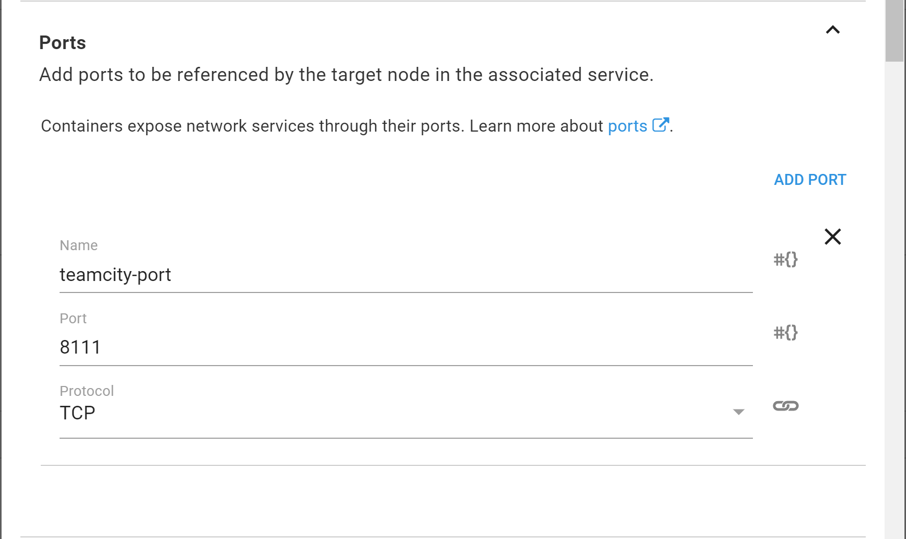

That is all we're going to specify for now.  Go ahead and click on the ok button.  

After the modal window closes, in the features selection enter in the name of the service and select the option of Load Balancer.

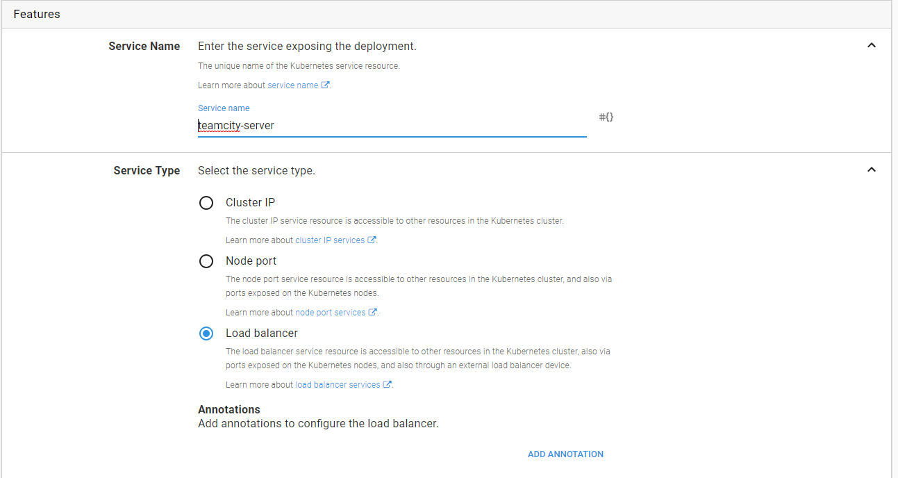

We need a way to access the server.  Click the add port button to get the service port modal window to open.

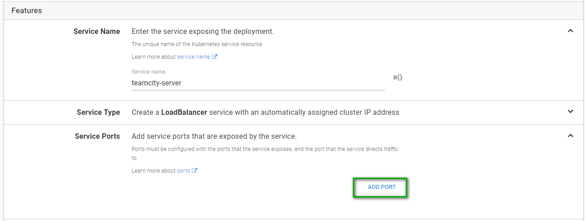

For this, we will be using port 80.  Give it a name, use port 80 and have it point back to the named port defined when we selected the container.

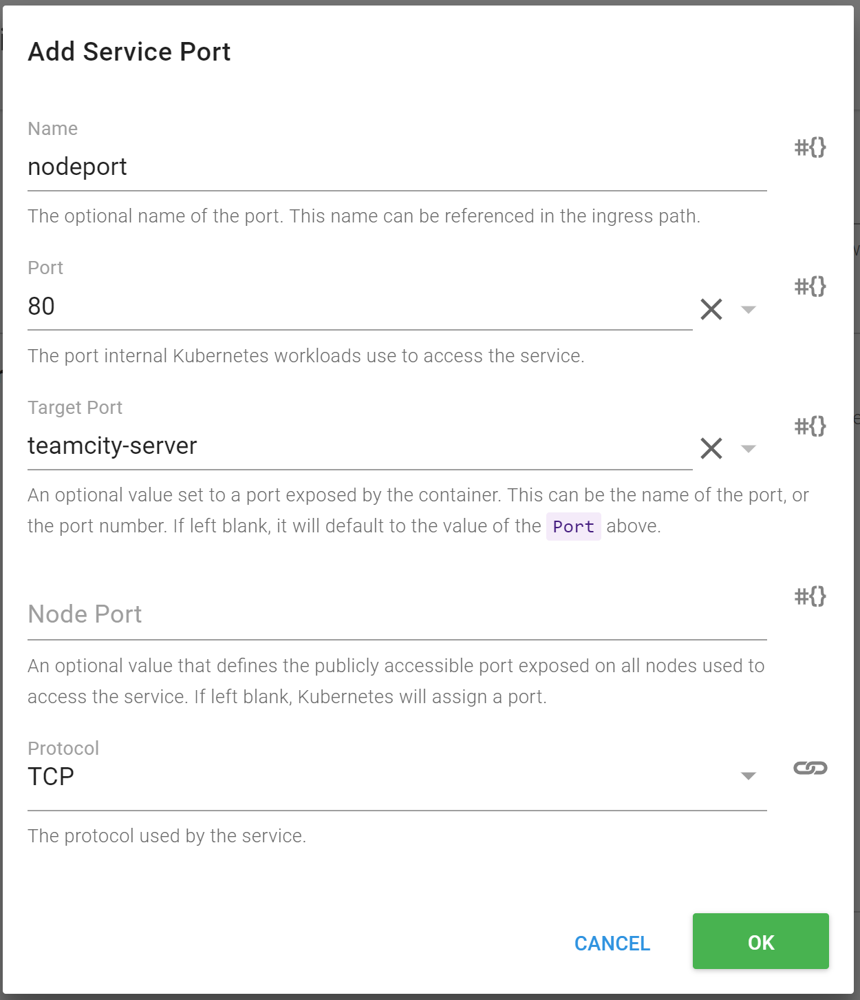

When you're done the summary screen should look similar to this:

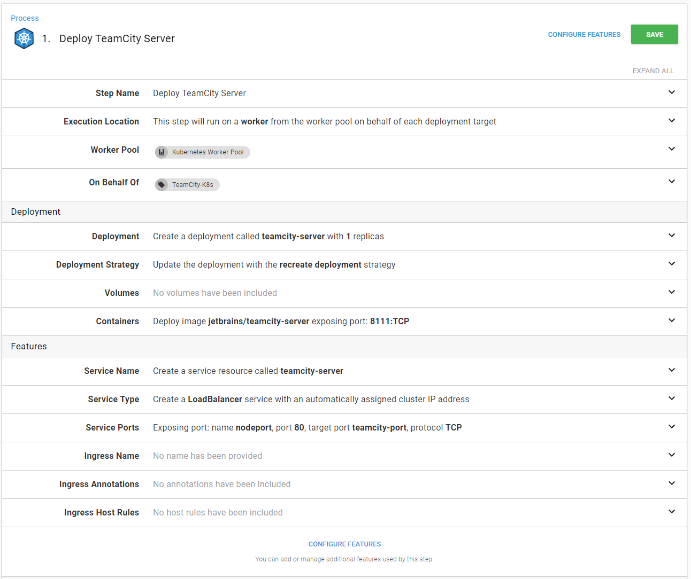

### First Deployment
That is it!  Now it's time to save and we can create our first deployment!


The deployment itself does not take very long.  

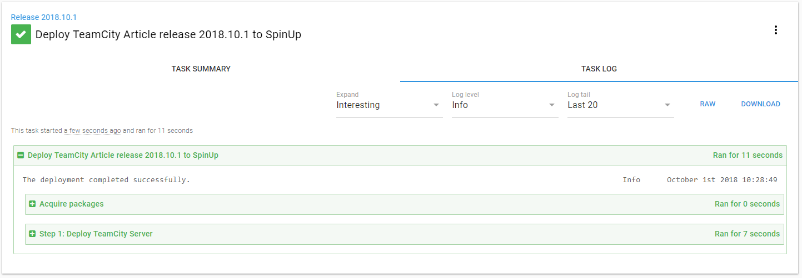

But go back to GCP's interface and click on the services link on the left.  You can see GCP will take a minute to create the load balancer.

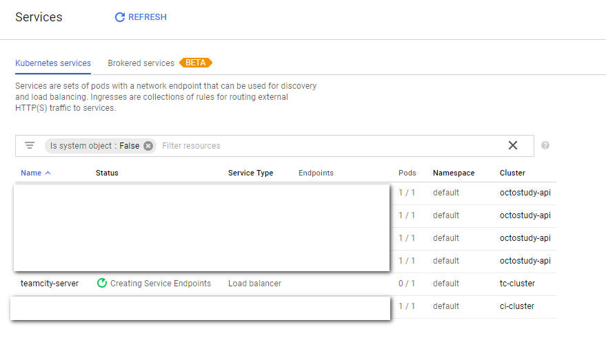

After the load balancer is complete lets click on the URL.  If all goes well we should be presented with this screen!

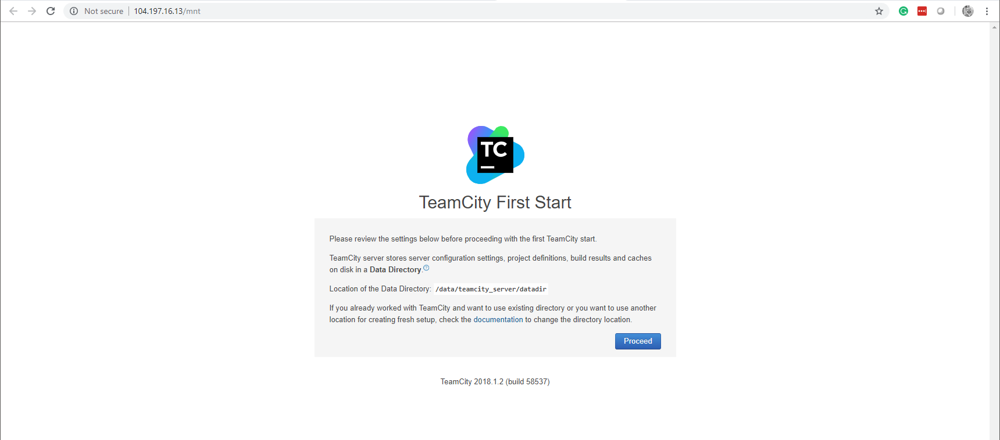

## Step 3: Persistent Volume

Alright, things are coming along.  However, we have a slight problem.  Each time Octopus Deploy does a deployment it will destroy the node and recreate it.  That means the data directory in the above screenshot will be cleared out.  The end result is we have to recreate the TeamCity configuration each time.  That is...just awful.  What kind of build server is that?  

**Please Note:** This is not caused by Octopus Deploy, it is a feature of Kubernetes.  By default, it assumes pods can be destroyed and recreated whenever needed.

What we need is to persist that data between deployments.  Thankfully, Kubernetes already has that functionality.  We just need to tap into it.  

To keep things simple, I will be using a simple persistent volume.  This uses the storage which is backing the Kubernetes cluster.  It is possible to make use of other storage options.  There are [many options](https://kubernetes.io/docs/concepts/storage/persistent-volumes/).  Pick the best one which works for your company/needs.  

### Add Create Persistent Volume Step to Process
To do this we need to learn a little bit about the K8s CLI which is called kubectl.  The command we are interested in is the [apply command](https://kubernetes.io/docs/reference/generated/kubectl/kubectl-commands#apply).  This command will create a resource if it doesn't already exist.  Which is perfect, that means we can use it in our deployment process.

Now a quirk with the apply command is you have to supply it a YAML or JSON file.  The file can be a URL or right on the hard drive.  I created a GitHub repo to store these types of files.  Then I referenced the file from Github.

The file.  It is creating a 30 GB hard drive for me to use as my data drive.  
```
apiVersion: v1
kind: PersistentVolumeClaim
metadata:
  name: dt-pm-claim
  labels:
    app: data
spec:
  accessModes:
    - ReadWriteOnce
  resources:
    requests:
      storage: 30Gi
```

Octopus Deploy can run kubectl commands.  Let's go ahead and find that step to add to our process.

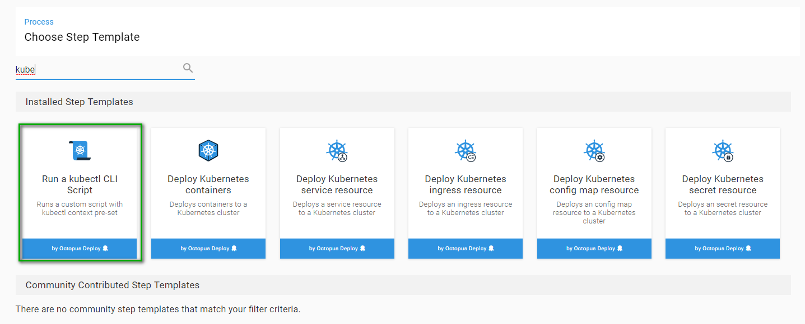

The script I need to run is:

```
kubectl apply -f [URL of file]
```

Let's go ahead and add that to the step.  Don't forget to set the worker and the role!

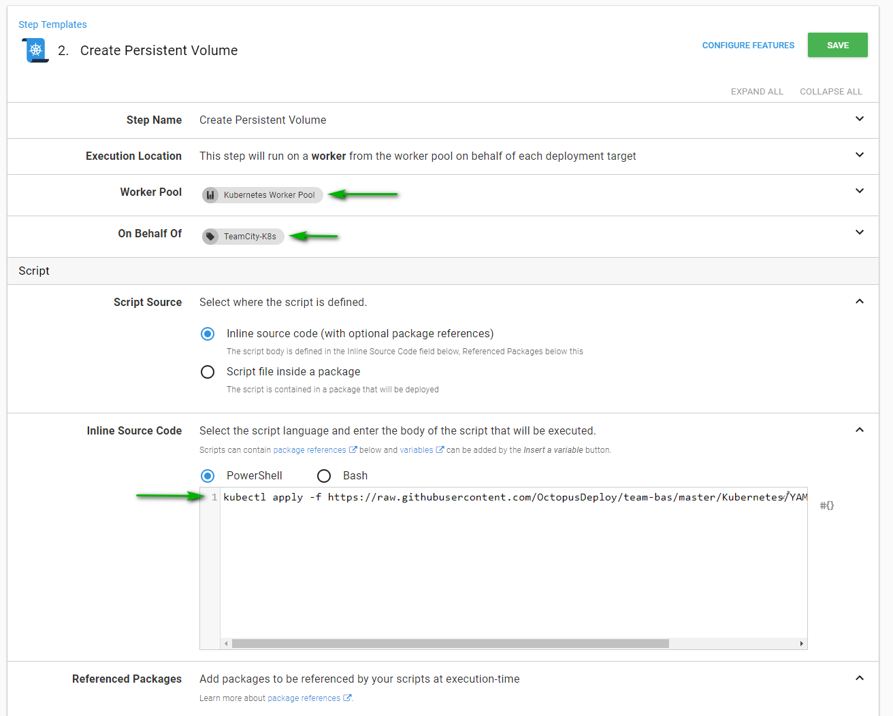

After saving, my process looks like this.  


That doesn't look right, we want to create the volume for the server.  Let's reorder that.

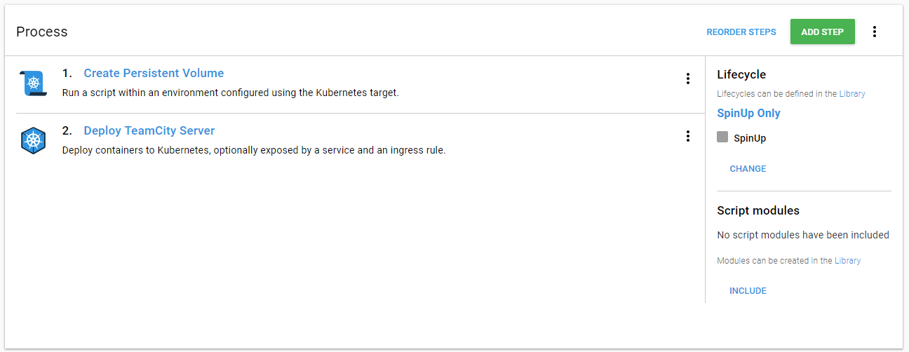

### Add Persistent Volume To Deploy TeamCity Server Step
Now we need to tell the TeamCity Server about that storage we are about to create.  Go back to the deploy TeamCity server step.  Find the volumes section and click on add volume.

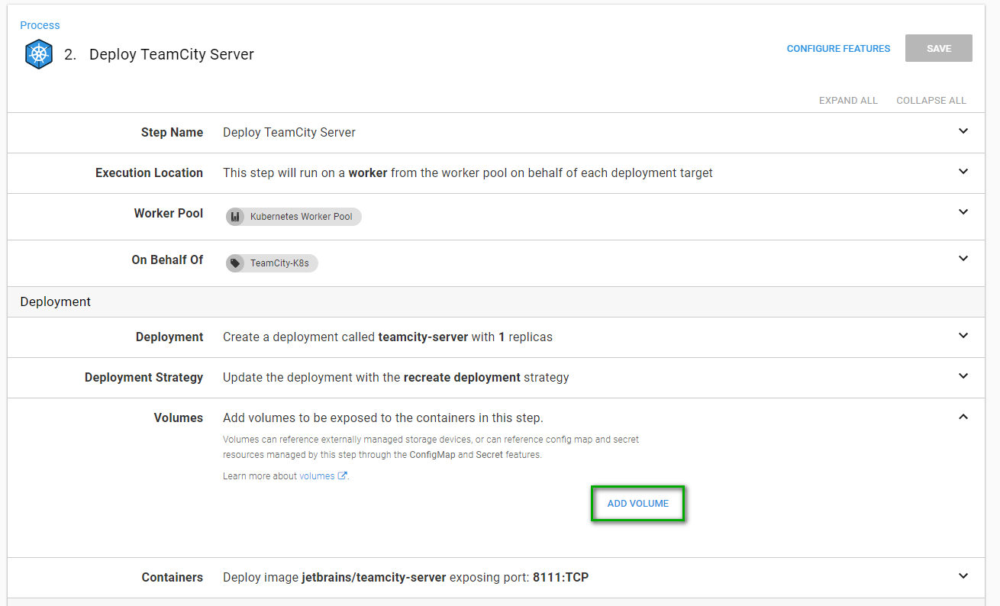

Choose Persistent Volume Claim from the drop-down list.  For the next two text boxes enter in the name you created in the YAML file.


Now, this deployment is aware of this claim.  We need to tell the container about it.  Click on the container definition.

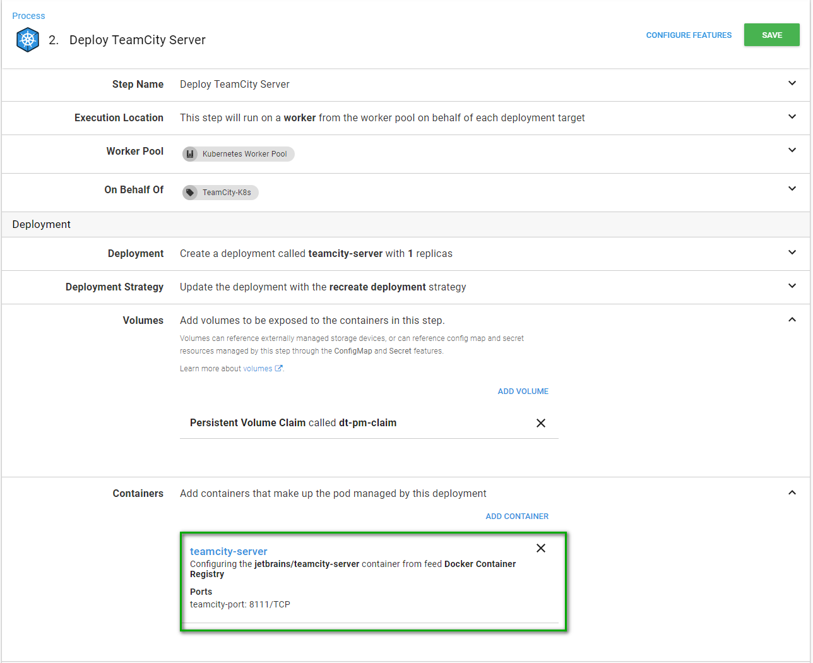

We need to add a volume mount into this container.  That is done by expanding volume mounts and clicking on the "Add Volume Mount" link.

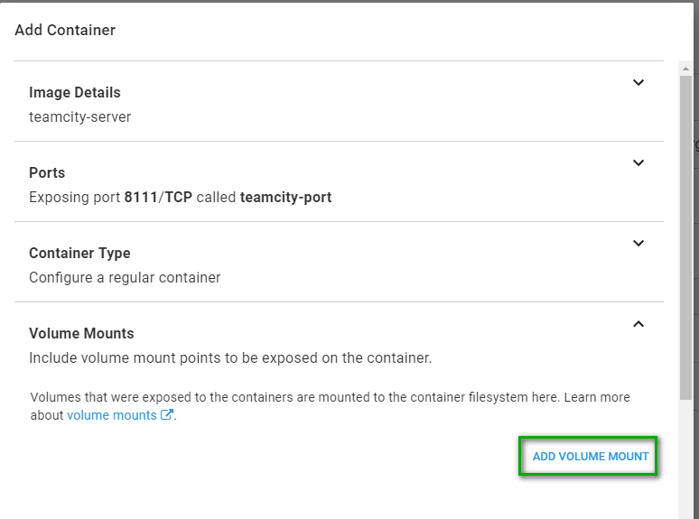

Supply the details for the volume mount.  I chose the path /mnt/teamcity/data for no other reason than "why not."

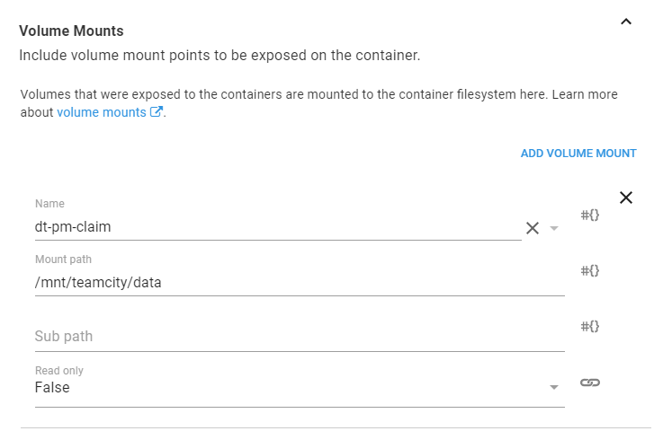

The volume is all mounted.  Now we need to tell TeamCity to use that volume mount by default.

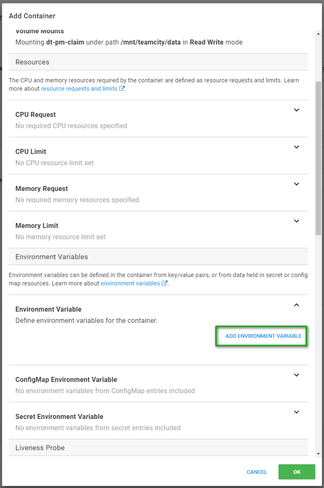

What is the name of the environment variable to set?  Well thanks to some GoogleFu and a couple of random articles I was able to determine it needs to be "TEAMCITY_DATA_PATH."  So let's set that.

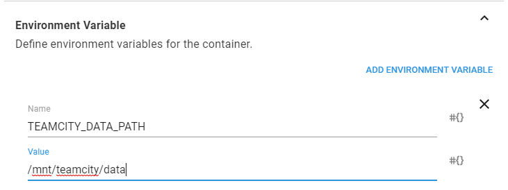

After you click okay your deployment summary should look something like this.

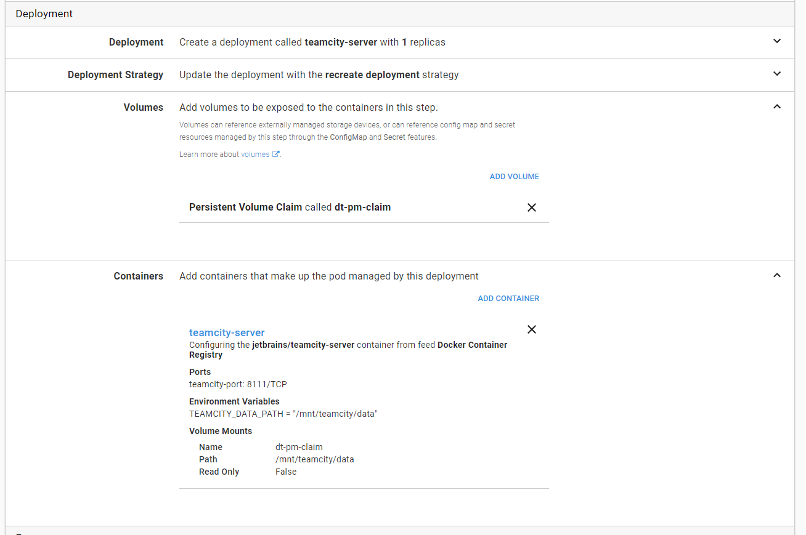

### Deployment
All right, time for another deployment!  It doesn't take too long to create the volume.  And it should show the deployment was successful.

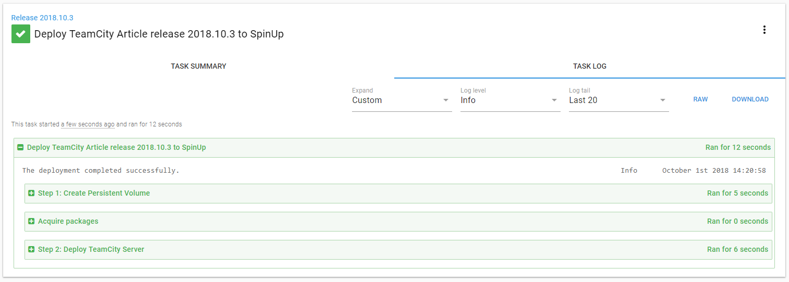

When I go to my TeamCity instance in Kubernetes I see the path has now been changed to "/mnt/teamcity/data."  Success!

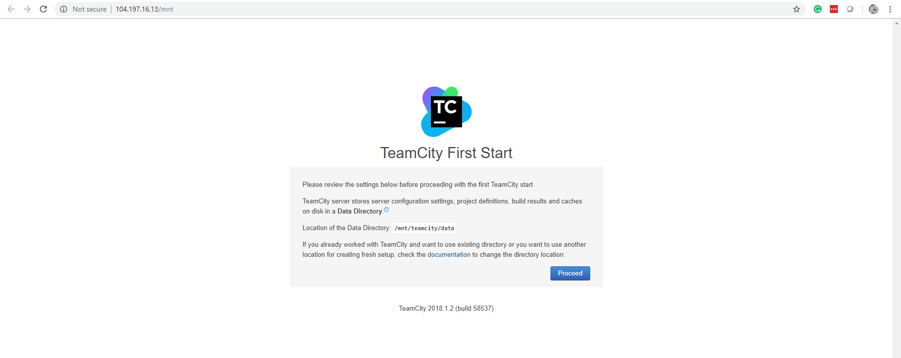

## Step 4: Configure TeamCity

TeamCity is running with a data volume which will persist between deployments.  It's now safe to configure TeamCity.  My recommendation is to do some minor configuration.  Such as setting the data volume, setting the database, and creating an admin user.  Just get to the main TeamCity dashboard screen.  Then do another release with Octopus Deploy.  All of your settings should remain.  If they don't then you know something isn't configured right.  Do not configure any projects until you are sure the data will persist between Kubernetes deployments.  That will suck all the fun out of your day.

## Step 5: Add Build Agent

What good is a build server without a build agent?  The nice thing is JetBrains provides a nice [build agent image](https://hub.docker.com/r/jetbrains/teamcity-agent/) we can leverage.  It provides quite a bit of built-in functionality.

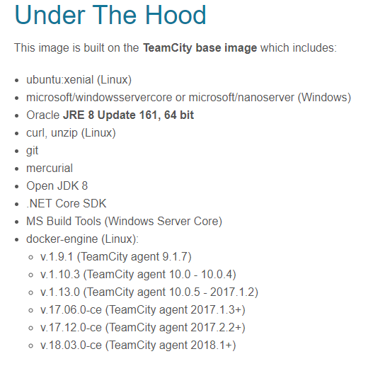

### Add Deploy Build Agent Step to Process
Now it is a simple matter of adding a Windows build agent and getting started! I am creating a new step in my process to install the build agent.  I am doing this for a couple of reasons.  One, it will help with debugging in the event anything goes sideways.  Two, I have the freedom to move this to another cluster or another node within the same cluster.

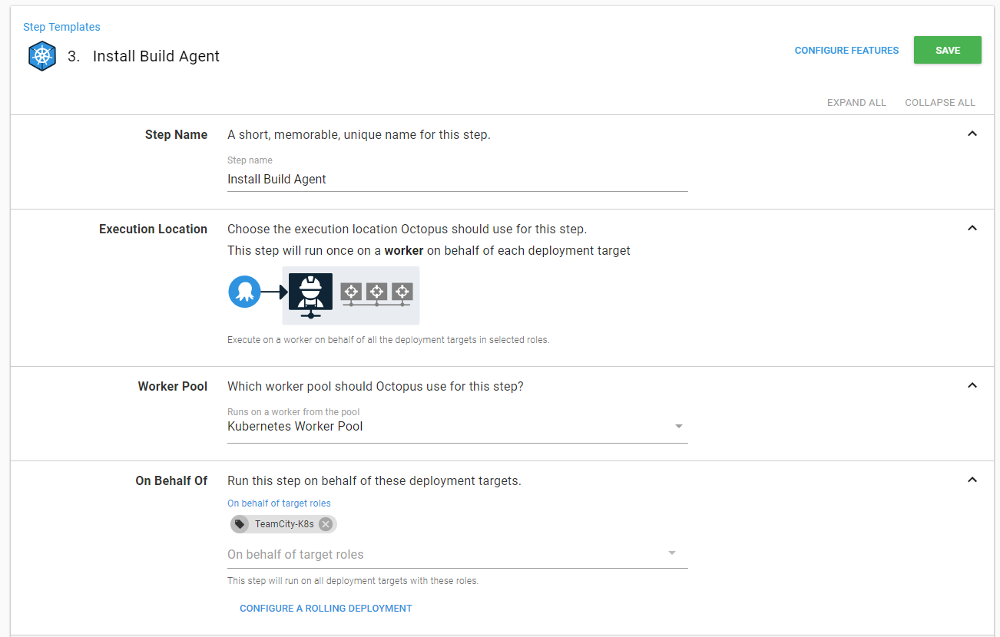

I am going to use the defaults for pretty much everything.  I give the deployment a name.  But I am keeping it on recreate deployment.

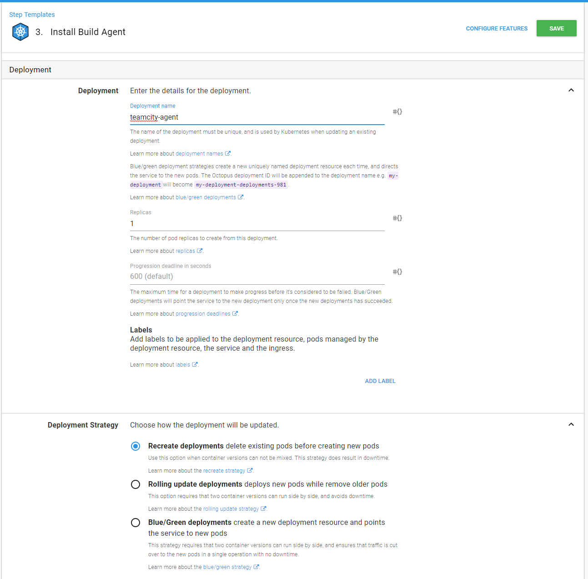

The container is fairly simple, just point it to the jetbrains/teamcity-agent image.  Because this is an internal build agent, there is no need to expose a port.

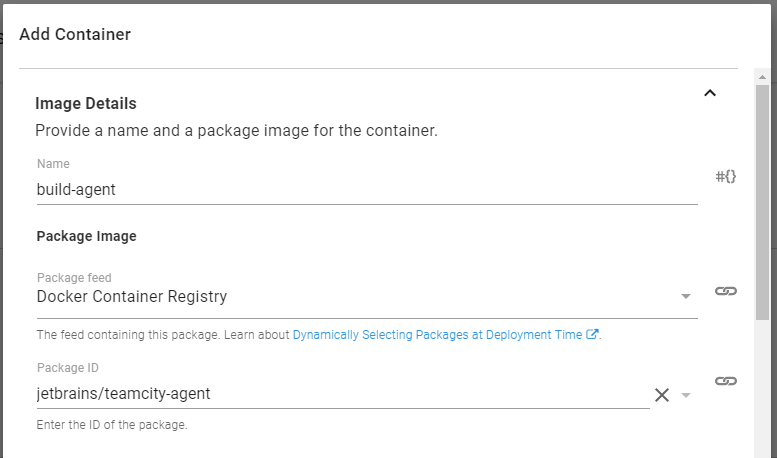

The environment variables for the agent will tell it what server to point to and what name it should use.  A neat little trick about Kubernetes is you can reference the name of the service of the TeamCity server and Kubernetes will handle the rest.

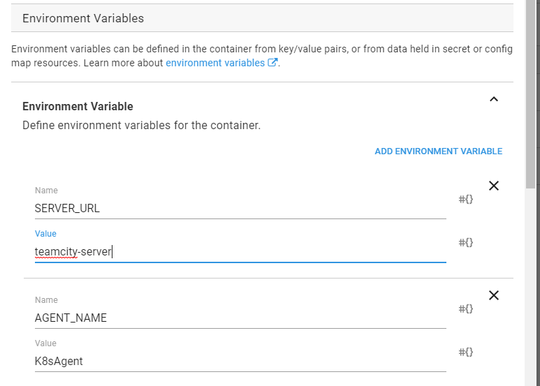

Because this is an internal build server (meaning we don't want people connecting to it from the outside), I don't need to set any service names or ports.

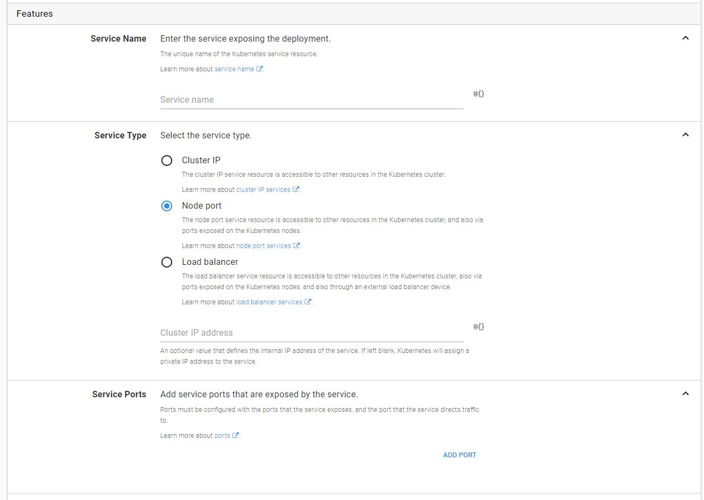

Now my process has three steps, one to create the volume (if it isn't there), another to create the server, and finally, one to create the agent.

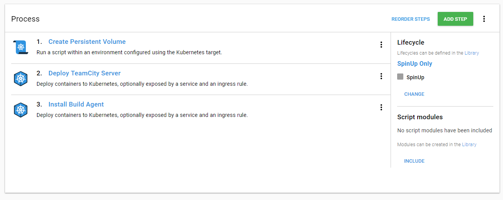

### Redeploy to TeamCity Cluster
Time to create another release.  One bummer is you have to tell Octopus to tell Kubernetes to deploy the Windows image of the agent, not the Linux image of the agent.

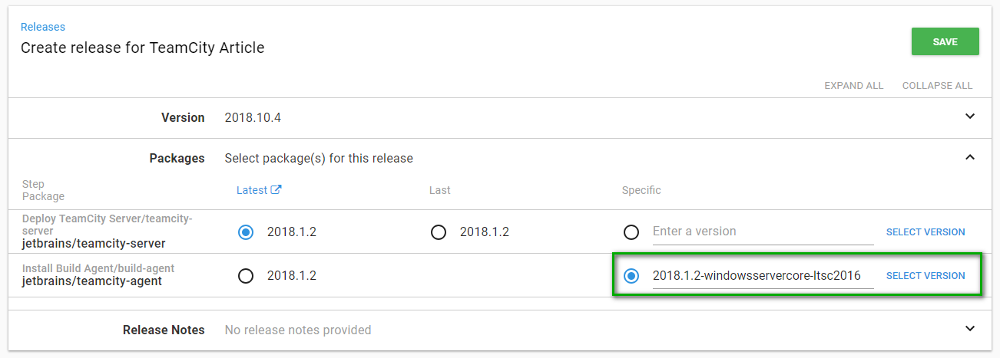

Again, the deployment doesn't take too long.  Everything shows green across the board.


If you have TeamCity open during deployment you will see a message like this appear.

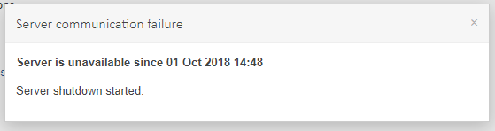

### Missing Build Agent
After waiting several minutes for TeamCity to boot up I don't see the agent.  The agent still doesn't appear after waiting 10 minutes.


Well, let's check on the nodes in Kubernetes.  Make sure everything deployed correctly.  The nodes are showing green across the board.


Time to dig a little deeper.  Let's check out the pods for each node.  Clicking on the first node shows the issue.  The TeamCity agent is showing the ImagePullBackOff error.  Whatever that means.


If I click on show details I see the full error message.  Kubernetes cannot pull the image.  What?  Why?


I will spare you the details.  Here is the TL;DR; version of it.  The nodes are running a container optimized OS.


Clicking on the change link shows what limited options I have.


### Changing to Linux Build Agent Container
In order to deploy and run Windows containers, the underlying OS has to be Windows.  Isn't that a fun little quirk?  For extra fun let's try redoing that deployment but just using the default image, which is Linux.


Octopus Deploy says it is successful.  


After waiting for TeamCity to finish starting I now see an agent that needs to be authorized.    


## Conclusion

At the time of this writing, Kubernetes Windows support is still in the beta stage.  In fact, none of the major cloud providers support running Windows containers in their Kubernetes implementation.  Not even [Azure](https://docs.microsoft.com/en-us/azure/aks/faq#can-i-run-windows-server-containers-on-aks).  Which, if Azure doesn't support it, the chances of Google Cloud or AWS supporting it are very slim.

After getting this all working and configured I ran into another issue.  Building a container image inside a container.  I need access to the docker daemon for this.  The documentation to do this is very nice.  The issue was I kept banging my head against the wall trying to get everything configured right.  


What does this mean?  Well, my goal was to run an entire build server on a Kubernetes Cluster.  That is not possible at this time.  Right now here is what I can build with my existing TeamCity cluster.

1. ~~.NET Framework 4.7.x applications (ASP.NET, Windows Services, etc)~~
2. .NET Core applications
3. ~~Windows Container applications~~
4. ~~Linux Container applications (for my .NET core apps!)~~
5. Java
6. Web Frameworks (Angular, React, etc)

All things considered, it is not the end of the world.  That is still quite a lot of functionality.  It didn't meet all my requirements.  But that is okay.  It was a good learning experience.  And it is important to me to get this knowledge out there.  Kubernetes and Docker are great.  They can solve a lot of problems.  However, they are not a magic bullet.  It is important to know the limitations of the tooling at this time.  By no means, I am I trying to bash the platform.  Every platform has limitations.  Once you know those limitations the easier it is to use them.

You can run TeamCity in a Kubernetes Cluster.  In fact, it was rather easy to set up.  But you won't get the full functionality like you would if you ran TeamCity on VMs.  And depending on your use case, that may or may not be okay.  

Well, I hope you learned a little more about Kubernetes and Octopus Deploy.  Happy Deployments!

## Learn more

* Integration 101: [Octopus and Build Servers](https://hubs.ly/H0gBMBp0)
* [Deploying applications to Kubernetes with Octopus Deploy](https://hubs.ly/H0gBMBN0)
* Guide: [How to dynamically set TeamCity version numbers based on the current branch](https://hubs.ly/H0gBN6B0)
* [Octopus vs. Build Servers - Why should I use Octopus when I already have a CI Server?](https://hubs.ly/H0gBMC00)
* Documentation: [Kubernetes](https://hubs.ly/H0gBN6F0)
* Documentation: [TeamCity](https://hubs.ly/H0gBMCk0)
* [2018.9 release blog post](https://hubs.ly/H0gBN6H0)
