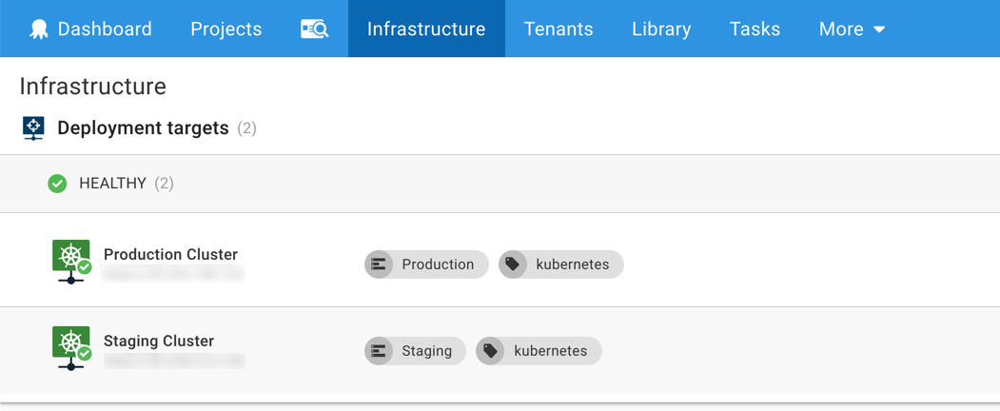
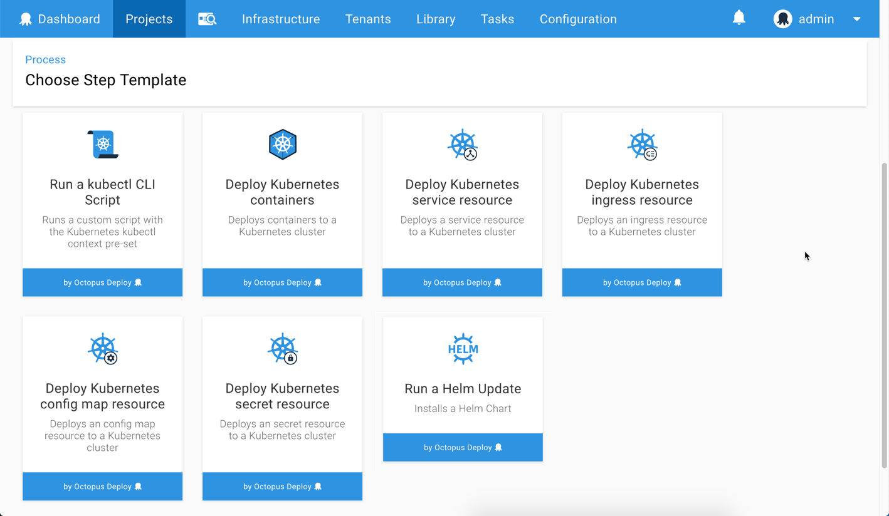

<iframe width="560" height="315" src="https://www.youtube.com/embed/FZ8U5OuDyOw" frameborder="0" allowfullscreen></iframe>

## Kubernetes Deployments Made Easy

Octopus Deploy is proud to ship our first-class support for [Kubernetes deployments](https://octopus.com/docs/deployment-examples/kubernetes-deployments)!  Our goal was to [make Kubernetes easy for teams](https://octopus.com/use-case/kubernetes) to adopt and migrate their projects to this popular platform.

Kubernetes (or K8s) is a flexible, powerful platform for running applications and services in a reliable and scalable manner. With that power comes great complexity, and it can be overwhelming and difficult to learn the configuration options and deployment YAML.

We took the approach to balance power and ease-of-use to give you the best of both worlds. This takes shape in the form of infrastructure support for Kubernetes Clusters and rich deployment steps to simplify your deployment process.  Teams can pick the right balance for them, from zero YAML configuration to full control over with `kubectl` and deployment YAML.

## In this post

!toc

## Infrastructure for Kubernetes

Octopus Deploy now supports adding Kubernetes Clusters as deployment targets and the associated configuration options. We also added support for Helm Chart feeds.

## Deployment Processes for Kubernetes 

Octopus Deploy ships with numerous new deployment step templates enabling teams to deploy Docker containers to Kubernetes, execute scripts directly with `kubectl`, and a Helm Update step.

## Offline Drop Artifacts

[Offline Package Drop targets](https://octopus.com/docs/infrastructure/offline-package-drop) can now be configured to persist the bundle as an Octopus Artifact.

Offline Package Drop targets could previously only persist the bundle to a file-system directory, which wasn't suitable for Octopus Cloud instances. Artifacts are a perfect fit for this; the deployment bundle is persisted as a zip file stored against the deployment in Octopus.

## Updated Cloud SDKs

We've updated all the Cloud dependencies that ship with Octopus:

* Azure PowerShell modules upgraded from `5.7.0` to `6.8.1`. This update fixes some known issues with the `5.7.0` release of Azure PowerShell.
* Azure CLI upgraded from `2.0.42` to `2.0.45`.
* AWS PowerShell modules upgraded from `3.3.225.1` to `3.3.343.0`.
* AWS CLI upgraded from `1.16.6` to `1.16.15`.
* Terraform CLI upgraded from `0.11.5` to `0.11.81`.
* Terraform AzureRm plugin version `1.16.0`.
* Terraform AWS plugin version `1.39.0`.

## Breaking Changes

This release includes a major bump of Azure PowerShell  modules to `6.8.1` to fix a [known issue](https://github.com/OctopusDeploy/Issues/issues/4574) with the previous `5.7.0` bundled version. Please see [Azure PowerShell release notes](https://docs.microsoft.com/en-us/powershell/azure/release-notes-azureps?view=azurermps-6.11.0) for more information.

## Upgrading

As usual [steps for upgrading Octopus Deploy](https://octopus.com/docs/administration/upgrading) apply. Please see the [release notes](https://octopus.com/downloads/compare?to=2018.9.0) for further information. Self-Hosted Octopus customers can [download](https://octopus.com/downloads/2018.9.0) the latest release now. For Octopus Cloud, you will start receiving the latest bits next week during their maintenance window.

That’s it for this month. Feel free to leave us a comment and let us know what you think! Go forth and deploy!
