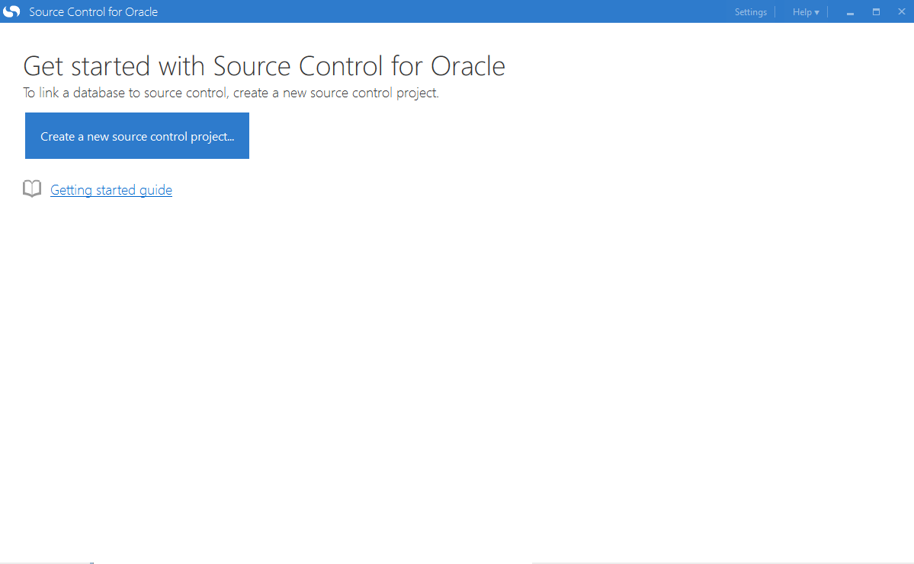
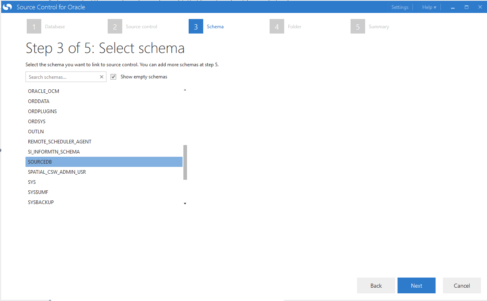
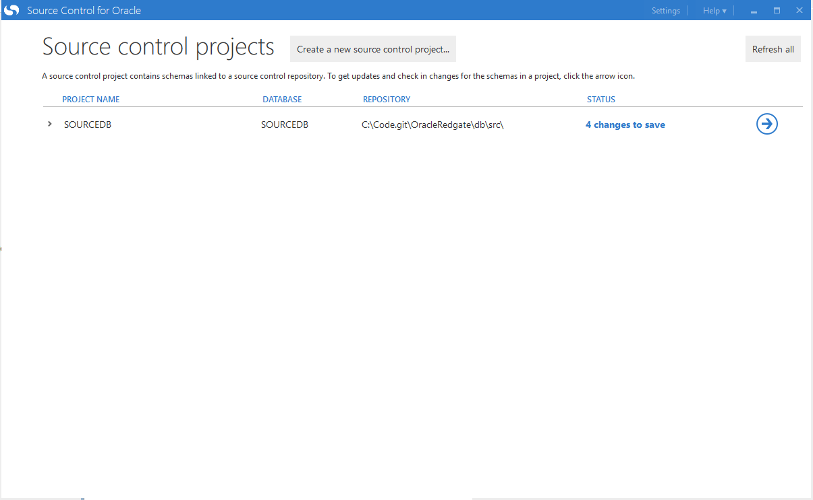
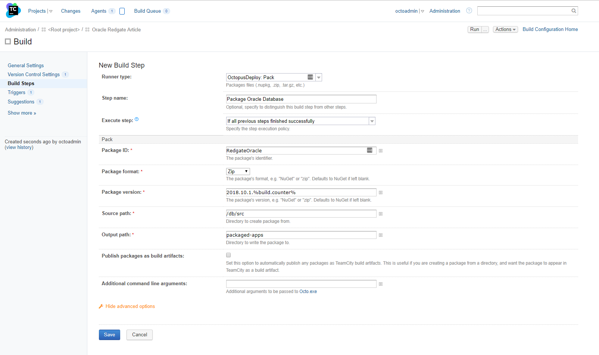

Many years prior to joining Octopus Deploy, I worked on an .NET application with Oracle as its database for about 30ish months.  I started working there a couple of years before Octopus Deploy version 1.0 was released.  Those were tough deployments.  Everything was manual.  And we could only deploy on Saturday mornings at 2 AM.

Thankfully those days are over.  The tooling available today is light-years ahead of where it was.  Today we are going to cover deploying to changes to Oracle databases.  The goal of this article is to build up entire CI/CD pipeline using TeamCity as the build server, Octopus Deploy as the deployment tool (of course), with the Redgate Oracle toolset handling the heavy lifting on the database side.  

**Side Note:** I chose TeamCity for no other reason other than I like it and I had the build server already running.  The core concepts from this article will transfer over to Jenkins, Bamboo, TFS/VSTS/Azure DevOps.  

!toc

## Getting Started 

If you wish to follow along, you will need to download and install the following tools.

- [Oracle 12g Personal Edition](https://www.oracle.com/technetwork/database/enterprise-edition/downloads/index.html)
- [TeamCity](https://www.jetbrains.com/teamcity/download/)
- [Redgate Oracle Toolset](https://www.red-gate.com/dynamic/products/oracle-development/deployment-suite-for-oracle/download)
- [Octopus Deploy](https://octopus.com/downloads)

One note, in order to download anything from Oracle you have to create an account.  The form to do that...requires a lot of information.  Prepare yourself for that.  I opted for personal edition because just like SQL Server Developer Edition, it is fully featured, just limited in what you can do with the license.  I am not using this for anything production related, just demos.  

For the purposes of this article I am going to be deploying to the same Oracle database running on a Windows machine.  Yes...this is cheating.  In a real-world environment you should follow a setup similar to this.

With this setup you would install a tentacle on a [worker](https://octopus.com/docs/infrastructure/workers) or a [jumpbox running tentacle](https://octopus.com/docs/infrastructure/windows-targets) which sits between Octopus Deploy and the VIP in front of the Oracle Database.  

## Creating a Source Database

Redgate's Oracle Toolset is a state based tool.  For those of you who didn't read my previous articles, a state based tool is one where you save the desired state of the database into source control.  During the deployment a unique delta script is generated to run against the Oracle database.  That delta script will be only used for that database for that environment.  The next environment will get a new delta script.

I am starting this all from scratch.  I set up a VM and installed Oracle on it.  I now am going to create a source database.  This database will represent the desired state I want all the other databases to be in.  I am going to set up my database and then check that into source control using [Redgate's Source Control for Oracle](https://www.red-gate.com/products/oracle-development/source-control-for-oracle/).  

It's been a while since I had to create a database in Oracle.  I'm using the [database creation assistant](https://docs.oracle.com/cd/B16254_01/doc/server.102/b14196/install003.htm) provided by Oracle.  I know it is possible to script all this out.  But I'd rather focus on deployments than setting this all up.

I have an empty source database setup.  

I am going to add a new table to it.  Nothing super fancy.  Just a small table with two columns.

I'm also going to add in a sequence.  For those of you not familiar with Oracle, a sequence is needed when you want to use an auto-incrementing number for your Id field.  Well, in old-school Oracle anyway.  It looks like things have changed a bit.  But I'm still going to create one...just because.

Now I can assign that sequence to column Id.  Probably is a better way to do this.  But I haven't used Oracle in over 7 years.  

## Tying Oracle To Source Control

The table is in place we want to create.  It is time to put that table and sequence definition into source control.  For this I will be using [Redgate's Source Control for Oracle](https://www.red-gate.com/products/oracle-development/source-control-for-oracle/).  One thing you will notice is that application isn't a plug-in like [Redgate's SQL Source Control](https://www.red-gate.com/products/sql-development/sql-source-control/).  If I had to venture a guess it is because there unlike SQL Server with its SQL Server Management Studio, there isn't one main UI to access an Oracle database.  There is SQL Developer, Benthic, Toad, etc.

When we first launch the application we are presented with a single option, "Create a new source control project..."

After hitting that massive button you will be sent to a wizard.  First you will need to configure the database connection.  Don't forget to test your connection so you know that it works!

The database connection is good to go.  Next up is configuring the source control system to use.  This repository will be a git repository.  But rather than using the built-in git functionality, I prefer to use working folder.  This is so I can use my git GUI of choice and get the full functionality of git.  As you can see I have an empty working folder.

I can now enter the directory of that working folder into Redgate's Source Control for Oracle.  

Now I need to choose the schema I wish to use.  I put the tables in the SourceDB schema so that is the one I will be selecting.

What's really nice is it will show all the folders it is about to create and the directory it will create them in.  Helpful to see I didn't screw anything up.

Finally, we reach the end.  This tool will monitor this database and schema for any changes.  I'm going to keep the name as is so I don't get confused later on.

When it is finished hooking up all the bail and twine behinds the scenes we can see there are four changes to check in.

When I click on the big arrow I am presented with a summary screen.  Those of you who have used Redgate's SQL Source Control, this should look very familiar.

Clicking on the save button will show you everything has been saved successfully.

Cracking open Git Extensions and you can see all those files which have been created.

I'm going to go ahead and commit those changes.  Now it is time to set up a build and bundle those changes into a zip file for Octopus Deploy to use.

## Setting up a build server

In my TeamCity instance I have created a new project.  The project is going to be very simple, package up the database, publish the package to Octopus Deploy, create new release in Octopus Deploy.  First up is the package database.  For this build step I will package up the entire db/src folder (which includes any additional schemas).  Right now it only contains the "SourceDB" schema.

Pushing the package should be pretty straight-forward.  

In Octopus Deploy I've setup a very simple deployment process.  The goal at this point is to just make sure everything packages, pushes and deploys successfully.  I'm not too worried at this stage about the deployment process (that will come in a couple of minutes).

Back in TeamCity I will use that new project in my create a release step.

Now the moment of truth, running the build for the first time.  And...I messed it up.  Of course I did.  Nothing works perfectly the first time.

It took a couple of tries but I got the build working.

The issue was I put a / in start of the packaging path.  It should've been db/src, like so.

If I download the package from Octopus and examine it I can see all the files that were created are there.

We have the build server packaging, publishing and triggering a deployment.  Now it is time to go to Octopus and get the process worked out.

