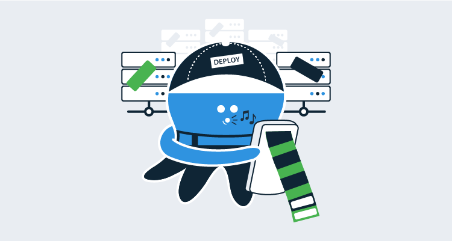
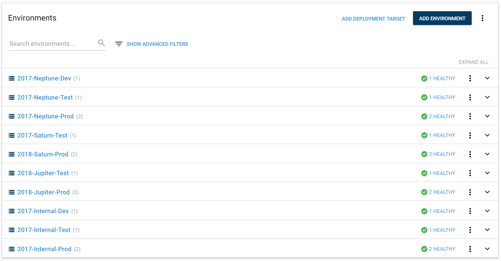
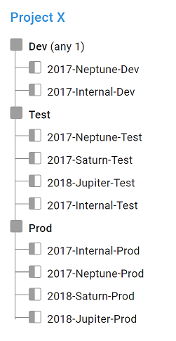
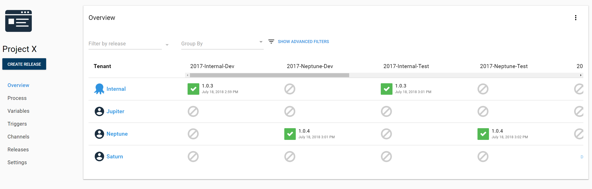
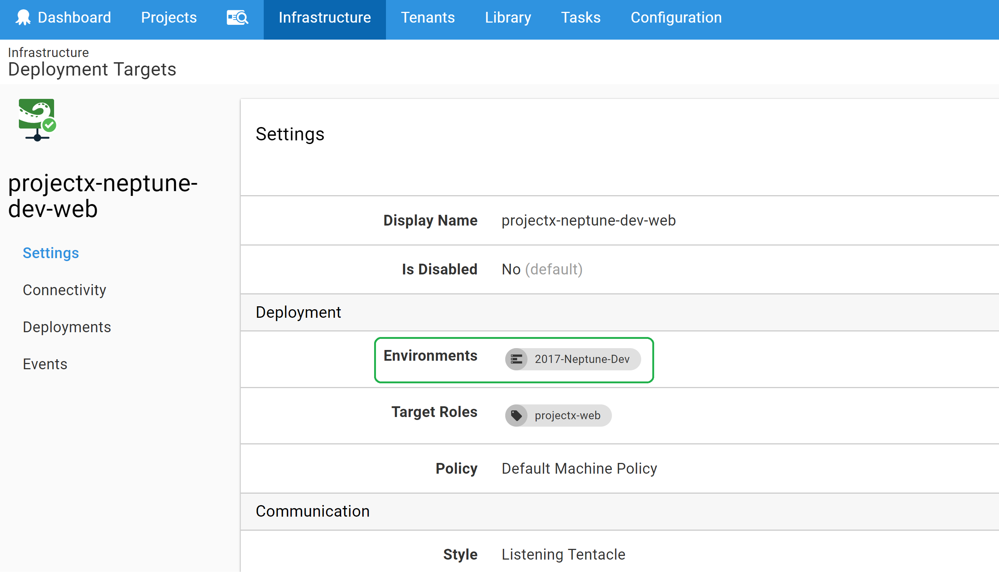
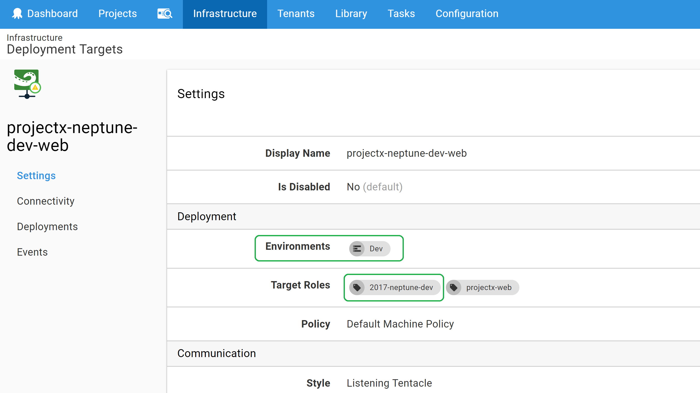
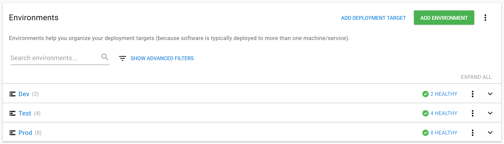
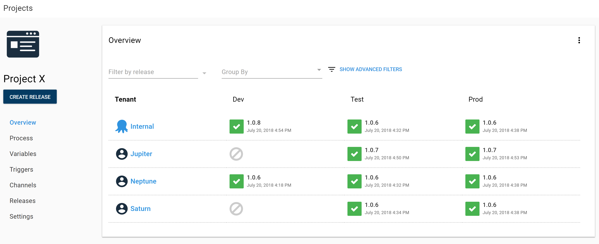
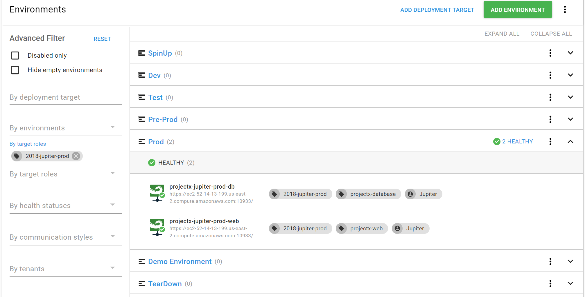

Hello! I'm Ryan, a Solution Architect with Octopus. I frequently work with customers to find solutions for their workflows and issues they've come across adopting Octopus.

Today, we'll look at a scenarios that is centered around Octopus's multi-tenancy feature. With multi-tenant projects, you can deploy different versions of the same applications to multiple tenants (customers, data-centers, regions, etc) at different times with different configurations. This is common in a SaaS environment where each customer has their own instance of your software. When you have a new version of your software ready for deployment, you can roll it out to a few alpha customers first, then to a beta group, and then continue rolling it out to each customer/tenant until they are all updated. You can read more about multi-tenant deployments on our [multi-tenant docs](https://octopus.com/docs/deployment-patterns/multi-tenant-deployments). If you have questions, you can reach out through one of our [support channels](https://octopus.com/support) or [request a demo](https://octopus.com/demo). I'd love to walk through multi-tenancy with you.

## The Scenario

Alright, let's dive into it!

In this scenario, we have a set of customer tenants (Neptune, Jupiter, Saturn). Internally, our infrastructure team has named the environments that the customer servers belong to with a special convention. That convention is "_yearCreated_-_customerName_-_environmentName_". So the test machines for Neptune are in an environment named 2017-Neptune-Test. The infrastructure team would also like these internal environment names represented in Octopus.

Let's look at some options and some of the side effects they entail.

## The Pain Points

### Environments View

The most obvious way to model tenant specific environments in Octopus is by creating each one as an environment in the Infrastructure section. The targets in each environment are still associated with the tenant since that is required for multi-tenancy to work.

The Environments page looks nice in this scenario. We can visualize our environments, which tenants they belong to, and see our internal names. All of the boxes are checked!

However, we've found that having lots of environments modeled in Octopus leads to friction with some processes and pages. Because of this, we recommend having a small number of environments to represent your infrastructure.

### Lifecycle

Setting up the lifecycle introduces the first problem. To have only one lifecycle for all of these environments, we have made the phases only require a deployment to one of the environments before promoting to the next phase. These means that we can deploy to 2017-Neptune-Test and then promote to 2018-Saturn-Prod. This is not an ideal scenario as it means that we could accidentally deploy a release to a customer's production environment prior to testing.

To solve that problem, we could create one lifecycle per tenant and then create a channel per tenant to select the lifecycle. You can see where this is headed. Adding a new tenant becomes a lot of work. We will have to add new environments, lifecycles, and channels to make sure that we can deploy our application safely.

### Project Overview

This also creates a sparse table for our Project Overview. We end up with too many environments for this page to be useful and the problem gets worse with every new Tenant that we add. A good rule of thumb is that if you find yourself scrolling horizontally in Octopus, it's probably a good idea to reach out and see if there's another way to do things.

So the question is, can we configure our instance to have a more standard Dev, Test, and Prod environment setup while still tracking these internal environment names? The answer is, hopefully unsurprisingly, yes!

## Enter Target Roles

We can model this with Target Roles. You may only use roles to determine what steps execute against which targets. But you can also use roles to tag machines with metadata. In this case, we are tagging the machine with its internal environment name.

Instead of putting our deployment targets in tenant-specific environments, we'll place them in generic environments (Dev, Test, Prod). We'll add the internal environment name as a role to the deployment targets and then fix up the lifecycle for our project. After that, we'll have a clean project overview and we'll still be able to see our internal environment names on the infrastructure pages.

### Update the Deployment Target

Let's look at one of the deployment targets in the 2017-Neptune-Dev environment.

Since this is really just a Dev machine, we will move it from 2017-Neptune-Dev to the Dev environment. Then we will give it  a role of "2017-neptune-dev" to represent our internal environment name. Not included in the picture is that the tenant is still connected to the target. This doesn't change throughout the configuration.

Now we will rinse and repeat for all of our deployment targets.

### Cleaner Environments View

We've updated all our targets and deleted the unused environments. Now the environments view is nice and tidy.

### Cleaner Project Overview

Likewise, after updating the project lifecycle to use our default conventions, the project overview is much more manageable. No more horizontal scrolling!

One more thing to mention at the project level. Because the new roles are for conveying information only, we did not change the role used to deploy to our targets. Our deployment steps continue to target "projectx-web".

### Viewing Targets by Internal Environment Name

And we can use the advanced filters on the infrastructure page to search for these roles to see the machines that belong to the internal environment name.

## Wrapping Up

All of our boxes are checked, our project is clean, and we don't have any friction when adding a new tenant to our project!

We tackled a very specific case that involved tenants but you can use this approach to model what project a target belongs to without creating separate environments per project. Have you used roles to model information in Octopus? Drop a comment below and tell us about it!
