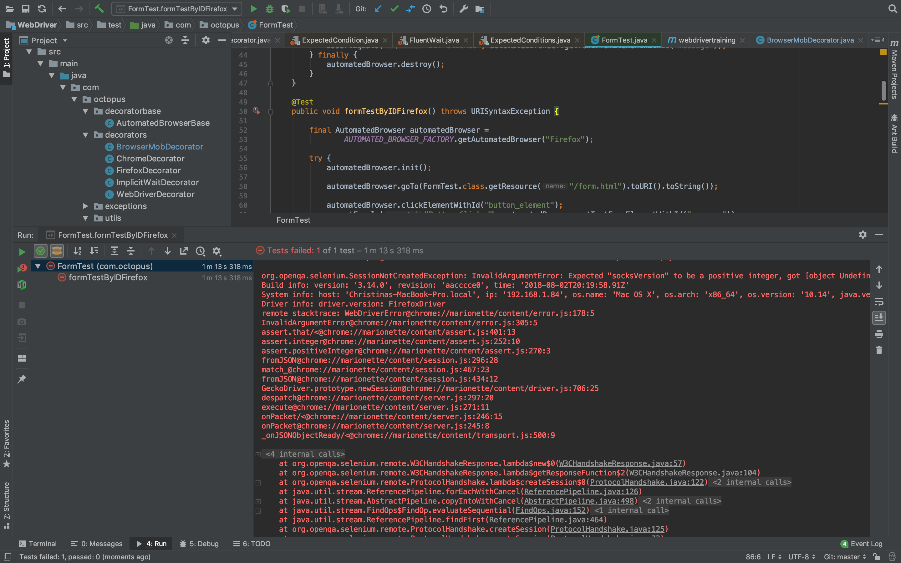
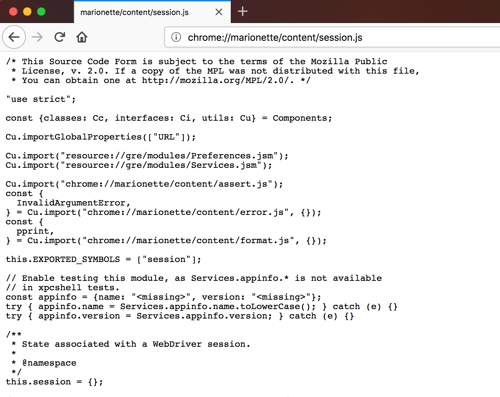
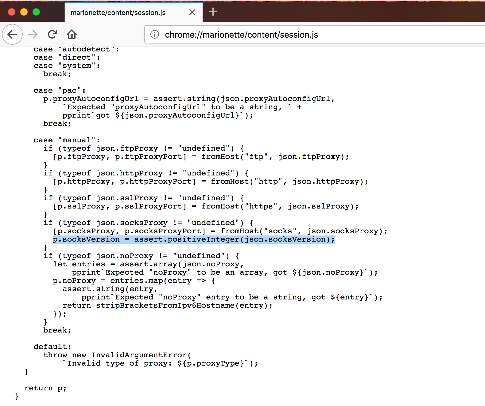

Return to the [table of contents](../0-toc/webdriver-toc.md).

A common issue that I have run into on multiple occasions when using proxies is a subtle misconfiguration in Firefox that results in errors being thrown.

To simulate this error lets attempt to configure the SOCKS proxy in the `BrowserMobDecorator` class.

SOCKS proxies are used to proxy TCP packets, meaning they can be used with HTTP, HTTPS, FTP and a whole range of other higher level protocols. We won't be using BrowserMob as a SOCKS proxy, but configuring it here is a useful way to demonstrate the misconfiguration error. 

We configure the SOCKS proxy by calling `seleniumProxy.setSocksProxy(proxyStr)`:

```java
@Override
public DesiredCapabilities getDesiredCapabilities() {

  proxy = new BrowserMobProxyServer();

  proxy.start(0);

  final Proxy seleniumProxy = new Proxy();
  final String proxyStr = "localhost:" + proxy.getPort();
  seleniumProxy.setHttpProxy(proxyStr);
  seleniumProxy.setSslProxy(proxyStr);
  seleniumProxy.setSocksProxy(proxyStr);

  final DesiredCapabilities desiredCapabilities =
    getAutomatedBrowser().getDesiredCapabilities();

  desiredCapabilities.setCapability(CapabilityType.PROXY, seleniumProxy);

  return desiredCapabilities;
}
```

Running a test in Firefox with this configuration will result in the exception below being thrown:

```
org.openqa.selenium.SessionNotCreatedException: InvalidArgumentError: Expected [object Undefined] undefined to be an integer
Build info: version: '3.12.0', revision: '7c6e0b3', time: '2018-05-08T14:04:26.12Z'
System info: host: 'Christinas-MBP', ip: '192.168.1.84', os.name:
'Mac OS X', os.arch: 'x86_64', os.version: '10.13.5', java.version: '1.8.0_144'
Driver info: driver.version: FirefoxDriver
remote stacktrace: WebDriverError@chrome://marionette/content/error.js:178:5
InvalidArgumentError@chrome://marionette/content/error.js:305:5
assert.that/<@chrome://marionette/content/assert.js:405:13
assert.integer@chrome://marionette/content/assert.js:256:10
assert.positiveInteger@chrome://marionette/content/assert.js:274:3
fromJSON@chrome://marionette/content/session.js:291:28
match_@chrome://marionette/content/session.js:458:23
fromJSON@chrome://marionette/content/session.js:427:12
GeckoDriver.prototype.newSession@chrome://marionette/content/driver.js:693:25
despatch@chrome://marionette/content/server.js:293:20
execute@chrome://marionette/content/server.js:267:11
onPacket/<@chrome://marionette/content/server.js:242:15
onPacket@chrome://marionette/content/server.js:241:8
_onJSONObjectReady/<@chrome://marionette/content/transport.js:500:9
```



From the message in the exception it appears that some remote JavaScript code resulted in an error. But where is this JavaScript code, and how can we debug the error?

Looking at the JavaScript stack trace, it appears that the source of the error lays in these two lines of code. A method called `fromJSON()` is making an asserting that an integer is positive, and this assertion is failing:

```
assert.positiveInteger@chrome://marionette/content/assert.js:274:3
fromJSON@chrome://marionette/content/session.js:291:28
```

The key to debugging this error is to understand that the file `chrome://marionette/content/session.js` is bundled with Firefox. If you enter that URL into Firefox, you can see the source of the file.



In this case the offending line of code is:

```
p.socksVersion = assert.positiveInteger(json.socksVersion);
```



From this code we can deduce that we need to define the version of the SOCKS proxy.

In theory you can define the SOCKS proxy version with the following code in the `BrowserMobDecorator` class:

```java
@Override
public DesiredCapabilities getDesiredCapabilities() {
  // ...
  seleniumProxy.setSocksVersion(5);
  // ...
}
```

In practice there are bugs in WebDriver library that will still cause this code to fail. However, the important thing to take away from this post is that when you see Firefox stack traces with URLs that start with `chrome://marionette/`, you can access the source of those files by entering the URL into Firefox directly in order to debug the root cause.

Return to the [table of contents](../0-toc/webdriver-toc.md).
