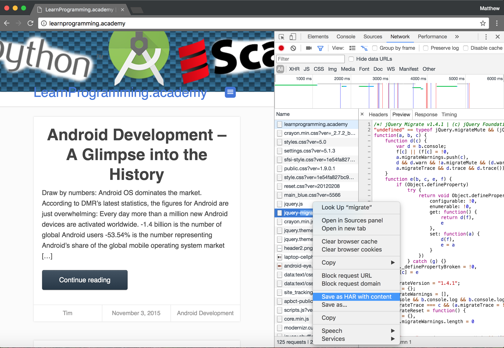
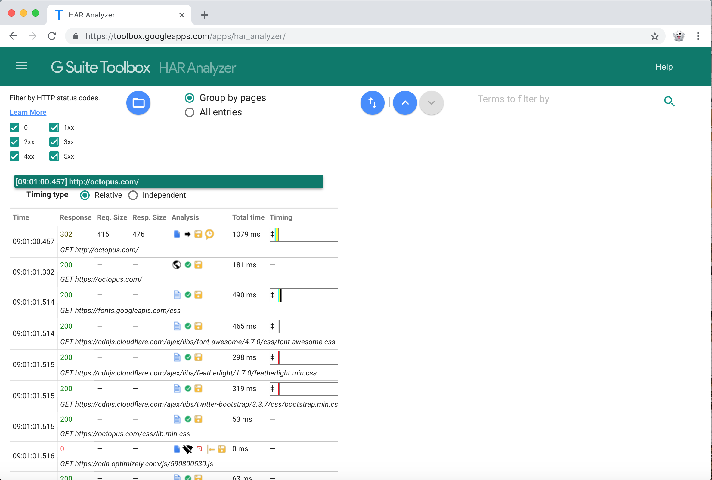
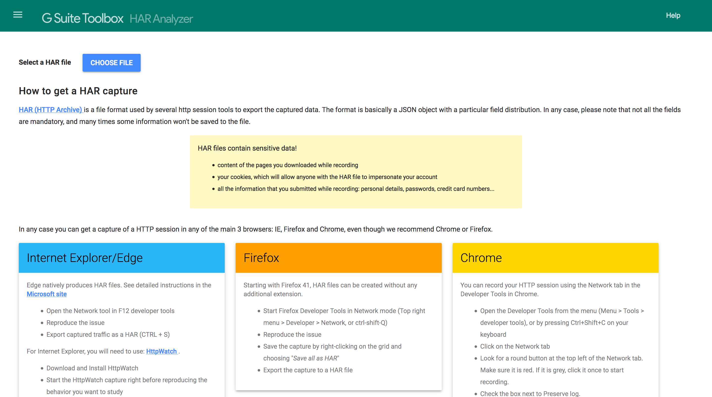
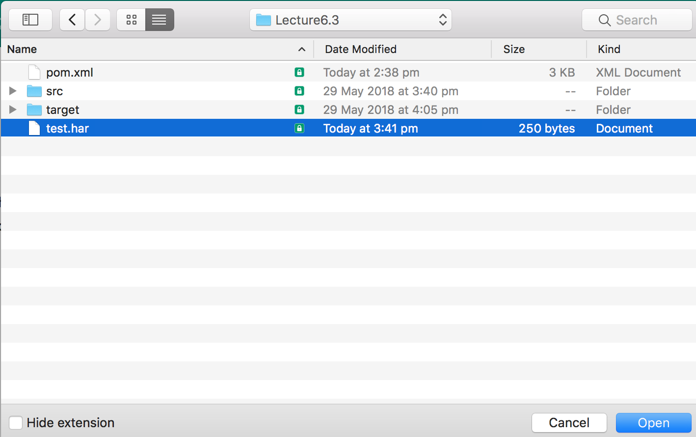
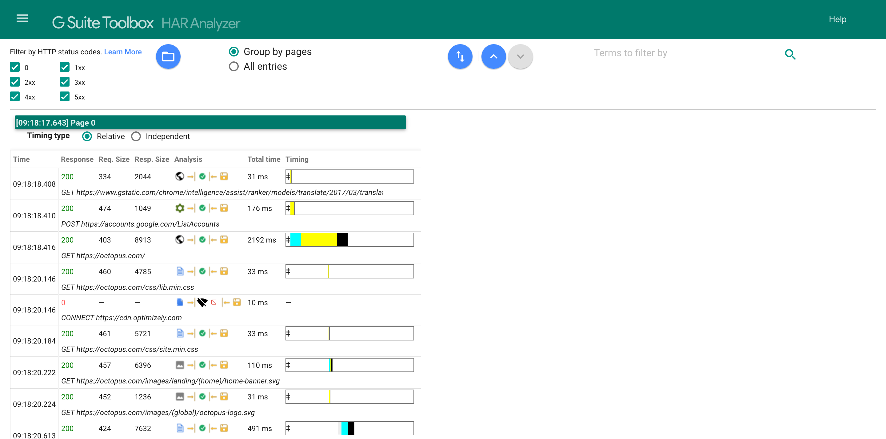
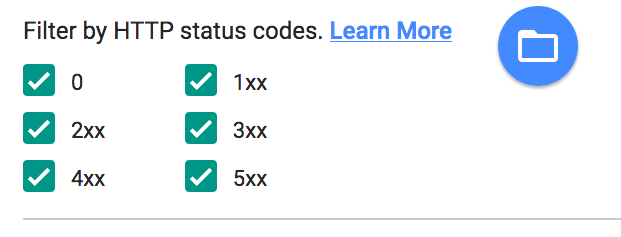
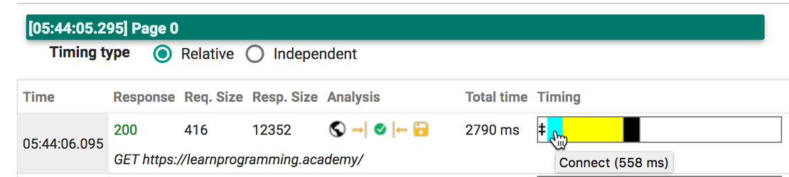
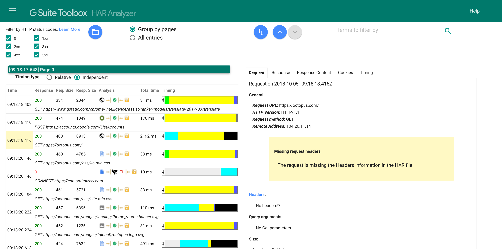
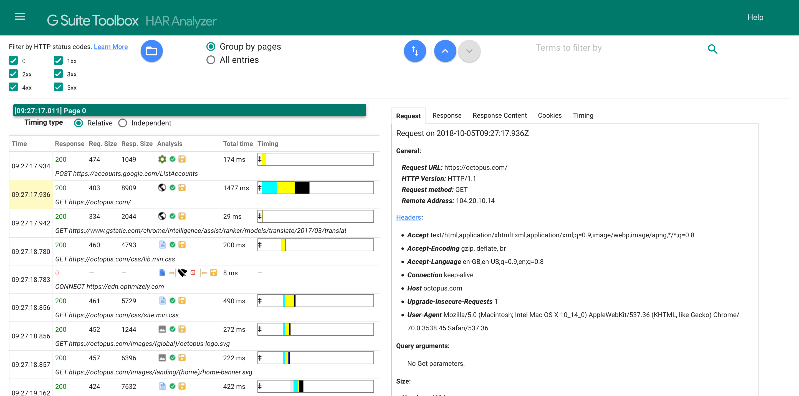

HTTP Archive (HAR) files are a standard JSON formatted log of a browsers interaction with an external web application.

You can generate a HAR file by opening the Chrome developer tools, clicking the `Network` tab, opening a web site, and then right clicking in the list of network calls and selecting `Save as HAR with content`.



This will generate a HAR file that contains the details of all the network calls captured by the developer tools.

Because HAR files have an open format, there are a number of tools online that you can use to inspect their contents. One such tool is the [HAR Analyser](https://toolbox.googleapps.com/apps/har_analyzer/). This tool allows you to upload a HAR file and then filter by HTTP response code, inspect the content associated with a request, and view the timing of each network call. This kind of information is invaluable when debugging an error with a web application, or to understand how well the site is responding.



One of the useful features in BrowserMob is the ability to generate HAR files based on the network requests that pass through it.

To allow tests to capture HAR files, we will add two methods to the `AutomatedBrowser` interface.

```java
void captureHarFile();

void saveHarFile(String file);
```

The `captureHarFile()` method is used to instruct BrowserMob to begin capturing network traffic, while the `saveHarFile()` method will take any captured traffic and save it to the specified file.

Default methods are then added to `AutomatedBrowserBase`.

```java
@Override
public void captureHarFile() {
  if (getAutomatedBrowser() != null) {
    getAutomatedBrowser().captureHarFile();
  }
}

@Override
public void saveHarFile(final String file) {
  if (getAutomatedBrowser() != null) {
    getAutomatedBrowser().saveHarFile(file);
  }
}
```

And the methods are implemented in the `BrowserMobDecorator` class.

To start capturing network traffic, we make a call to `newHar()` on the BrowserMob proxy object.

```java
@Override
public void captureHarFile() {
  proxy.newHar();
}
```

To save the captured traffic by calling `getHar().writeTo()`.

```java
@Override
public void saveHarFile(final String file) {
  try {
    proxy.getHar().writeTo(new File(file));
  } catch (final IOException ex) {
    throw new SaveException(ex);
  }
}
```

The checked exception `IOException` is caught and rethrown as the unchecked exception `SaveException`. This allows us to match the interface method signature, which does not specify any checked exceptions.

Here is the code for `SaveException`. It extends the `RuntimeException` class, meaning it is an unchecked exception.

```java
package com.octopus.exceptions;

public class SaveException extends RuntimeException {

  public SaveException() {

  }

  public SaveException(final String message) {
    super(message);
  }

  public SaveException(final Throwable cause) {
    super(cause);
  }

  public SaveException(final String message, final Throwable cause) {
    super(message, cause);
  }
}
```

Now all that is left is to use these methods as part of a test.

```java
@Test
public void captureHarFile() throws URISyntaxException {
final AutomatedBrowser automatedBrowser =
  AUTOMATED_BROWSER_FACTORY.getAutomatedBrowser("Chrome");

  try {
    automatedBrowser.init();
    automatedBrowser.captureHarFile();
    automatedBrowser.goTo("https://octopus.com/");
  } finally {
    try {
      automatedBrowser.saveHarFile("test.har");
    } finally {
      automatedBrowser.destroy();
    }
  }
}
```

Here we have made a call to `automatedBrowser.captureHarFile()` before we open the web page. This ensures that we are capturing all network traffic as part of this test.

In the `finally` block we then nest an additional `try`/`finally` block. Inside the nested `try` block we call `automatedBrowser.saveHarFile("test.har")`, which will write any captured traffic to the file `test.har`. This call is made in the `finally` block because we want to save this network traffic even if the test fails. The HAR file will often contain information that can be used to debug a failed test, so we want to make sure we save this file regardless of an errors during the tests.

Inside the nested finally block we then call `automatedBrowser.destroy()`. Because the call to `destroy()` frees resources, we need to ensure that it runs if the test fails and if the attempt to save the HAR file fails. Nesting `try`/`finally` blocks in this way guarantees that the `destroy()` method is called regardless of any other failure.

The resulting `test.har` file captures the network traffic made as a result to opening <https://octopus.com/>. This file can then be reviewed with tools like the HAR Analyzer to quickly identify any failed requests (i.e. any HTTP response codes in the 4xx or 5xx range), as well as providing a visual timeline of the calls. This information can be invaluable for debugging errors with web applications and understanding performance bottlenecks.

To open file the with HAR Analyzer, open up
<https://toolbox.googleapps.com/apps/har_analyzer/> and click the `CHOOSE FILE` button.



Select the `test.har` file.



You will then get a table showing all the network requests made as part of the test.



You can filter the results by the HTTP response codes with these checkboxes.



These codes are numbers between 100 and 599, and are grouped in blocks of 100. The 0 response code is a special case, and indicates that no response was returned.

The table below shows the general meaning of the response codes.

| Code range |	Meaning |
|-|-|
|1xx|	Informational responses|
|2xx|	Success|
|3xx|	Redirection |
|4xx|	Client errors |
|5xx|	Server errors |


The table then shows 7 columns.

|Column|	Value|
|-|-|
|Time|	The UTC time when the request was made.|
|Response|	The HTTP response code. This is the code that is filtered using the checkboxes above.|
|Req. Size|	The number of bytes that were sent by the browser.|
|Resp. Size|	The number of bytes that were received by the browser.|
|Analysis|	Shows icons representing the data that was associated with the request, the status of the request, and whether the request was served from the browsers cache or not.|
|Timing|	Displays a graph showing the events that made up the request and how long they took.|


The timings of the responses are shown in a graph in the final column. Hovering the cursor over each of the colored columns shows what kind of even was taking place, and how long it took.

If the Relative timing type is selected, the graph represents the total time taken by all requests, with the colored columns showing how much time the individual request took relative to the total.



If the Independent timing type is selected, the graph shows only the amount of time each event took relative to the single request.

Clicking any of the rows shows more details about the request on the right hand side of the page.



You'll notice that when a request is selected, a lot of the data is missing. This is because by default BrowserMob only captures a small subset of the data that can be saved in a HAR file. To capture all the information available, we create a new method called `captureCompleteHarFile()` in the `AutomatedBrowser` interface.

```java
void captureCompleteHarFile();
```

We add the default implementation to the `AutomatedBrowserBase` class.

```java
@Override
public void captureCompleteHarFile() {
  if (getAutomatedBrowser() != null) {
    getAutomatedBrowser().captureCompleteHarFile();
  }
}
```

Then we implement the method in the `BrowserMobDecorator` class.

```java
@Override
public void captureCompleteHarFile() {
  final EnumSet<CaptureType> captureTypes =
    CaptureType.getAllContentCaptureTypes();
  captureTypes.addAll(CaptureType.getHeaderCaptureTypes());
  captureTypes.addAll(CaptureType.getCookieCaptureTypes());
  proxy.setHarCaptureTypes(captureTypes);
  proxy.newHar();
}
```

The change here is to instruct BrowserMob to capture certain additional pieces of data that was sent and received. BrowserMob exposes an enum called `CaptureType` that defines all the kinds of details that can be saved in a HAR file. In addition, the `CaptureType` enum has some static methods that provide convenient groups of enums that represent collections of related kinds of details.

We start with the predefined group of `CaptureType` enums that represent the content.

```java
final EnumSet<CaptureType> captureTypes =
  CaptureType.getAllContentCaptureTypes();
```

Then we add to that the predefined group of `CaptureType` enums that represent the headers.

```java
captureTypes.addAll(CaptureType.getHeaderCaptureTypes());
```

Finally we add the predefined group of `CaptureType` enums that represent the cookies.

```java
captureTypes.addAll(CaptureType.getCookieCaptureTypes());
```

These `CaptureType` enums are then passed to the `setHarCaptureTypes()` method to configure BrowserMob to save all these details into the resulting HAR file.

```java
proxy.setHarCaptureTypes(captureTypes);
```

Update the test to call the `captureCompleteHarFile()` method, and run it again.

```java
@Test
public void captureCompleteHarFile() throws URISyntaxException {

  final AutomatedBrowser automatedBrowser =
    AUTOMATED_BROWSER_FACTORY.getAutomatedBrowser("Chrome");

  try {
    automatedBrowser.init();
    automatedBrowser.captureCompleteHarFile();
    automatedBrowser.goTo("https://octopus.com/");
  } finally {
    try {
      automatedBrowser.saveHarFile("test.har");
    } finally {
      automatedBrowser.destroy();
    }
  }
}
```

You will notice that the HAR file is now several megabytes in size, and that was for one relatively simple page request. More complete tests could generate quite large HAR files, so use the `captureCompleteHarFile()` method sparingly.

When we analyze the new HAR file we can see that there are no longer any warnings about missing information.



HAR files are an incredibly useful way to record and analyze the network iterations made during a test, and thanks to the BrowserMob proxy generating HAR files is quite easy to do. But BrowserMob can do more than just record the traffic that flows through it, and in the next lecture we'll see how BrowserMob can block or modify requests.
