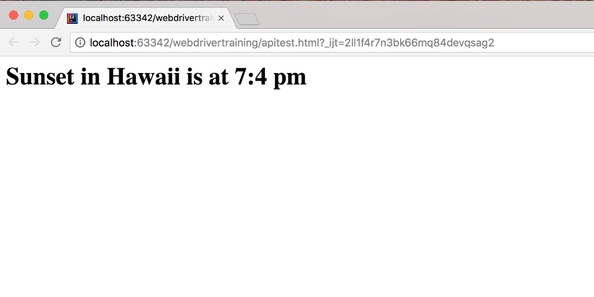

Return to the [table of contents](../0-toc/webdriver-toc.md).

In the last post we looked at how BrowserMob could be used to intercept requests and immediately return an empty response. This is a useful solution when you wish to block certain resources from being downloaded, which can speed up tests by preventing network requests for optional assets like images.

Another useful feature provided by BrowserMob is the ability to alter the response from a website. This can be used to mock responses to ensure that tests are deterministic, or to allow tests to target particular edge cases.

When modifying responses, the network requests and responses follow the flow shown in this diagram.

1.  The browser makes a request.
2.  The request is directed to the proxy.
3.  The proxy forwards the request to the external URL.
4.  The response from the external URL is passed through a response filter.
5.  The response filter alters the response.
6.  The altered response is passed back to the browser.


To demonstrate this we'll create a very simple web page that queries the Yahoo weather API to get the sunset time in Hawaii. This data is retrieved from a request to
[https://query.yahooapis.com/v1/public/yql?q=select%20astronomy.sunset%20from%20weather.forecast%20where%20woeid%20in%20(select%20woeid%20from%20geo.places(1)%20where%20text%3D%22maui%2C%20hi%22)&format=json&env=store%3A%2F%2Fdatatables.org%2Falltableswithkeys](https://query.yahooapis.com/v1/public/yql?q=select%20astronomy.sunset%20from%20weather.forecast%20where%20woeid%20in%20(select%20woeid%20from%20geo.places(1)%20where%20text%3D%22maui%2C%20hi%22)&format=json&env=store%3A%2F%2Fdatatables.org%2Falltableswithkeys), which returns a JSON response like the following:

```json
{
  "query": {
    "count": 1,
    "created": "2018-04-28T07:15:45Z",
    "lang": "en-US",
    "results": {
      "channel": {
        "astronomy": {
          "sunset": "6:49 pm"
        }
      }
    }
  }
}
```

To display this response in a web page, we have the following HTML:

```html
<html>
<head>
    <meta charset="UTF-8">
</head>
<body>
    <script>
        var xhr = new XMLHttpRequest();
        xhr.open(
            "GET",
            "https://query.yahooapis.com/v1/public/yql?q=select%20astronomy.sunset%20from%20weather.forecast%20where%20woeid%20in%20(select%20woeid%20from%20geo.places(1)%20where%20text%3D%22maui%2C%20hi%22)&format=json&env=store%3A%2F%2Fdatatables.org%2Falltableswithkeys",
            true);

        xhr.onload = function(e) {
            if (xhr.readyState === 4) {
                if (xhr.status === 200) {
                    var sunset =
                        JSON.parse(xhr.responseText).query.results.channel.astronomy.sunset;
                    var newHeading = document.createElement("h1");
                    newHeading.setAttribute("id", "sunset");
                    newHeading.textContent = "Sunset in Hawaii is at " + sunset;
                    document.body.appendChild(newHeading);
                } else {
                    console.error(xhr.statusText);
                }
            }
        };

        xhr.onerror = function(e) {
            console.error(e);
        };
        xhr.send(null);
    </script>
</body>
</html>
```

Save this HTML to the file `src/test/resources/apitest.html.`

This web page makes a query to the Yahoo API, and upon a successful response will create a `<h1>` element with the text `Sunset in Hawaii is at x:xx pm` (where the time is sourced from the API response).

Here is a screenshot of the page when opened in Chrome. The output highlights an interesting bug in the Yahoo service in that it returned the literal string `7:4 pm`. I assume this means that the sun sets at 7:40 pm. This won't be an issue for us though, because we are going to replace this buggy response with a known good value.



Even without the bug in the time being returned, the sunset time is not a fixed value. Obviously throughout the year we can expect this time to change. But what if we needed our test to always have a sunset time of 7:00 pm? This is possible with BrowserMob response filters.

We start by adding a new method to the `AutomatedBrowser` interface:

```java
void alterResponseFrom(String url, int responseCode, String  responseBody);
```

The usual default method is added to `the AutomatedBrowserBase` class:

```java
@Override
public void alterResponseFrom(final String url, final int responseCode, final String responseBody) {
  if (getAutomatedBrowser() != null) {
    getAutomatedBrowser().alterResponseFrom(url, responseCode, responseBody);
  }
}
```

Then in the `BrowserMobDecorator` class we implement this method:

```java
@Override
public void alterResponseFrom(final String url, final int responseCode, final String responseBody) {
  proxy.addResponseFilter((response, contents, messageInfo) -> {
    if (Pattern.compile(url).matcher(messageInfo.getOriginalUrl()).matches()) {
      contents.setTextContents(responseBody);
      response.setStatus(HttpResponseStatus.valueOf(responseCode));
    }
  });

  getAutomatedBrowser().alterResponseFrom(url, responseCode, responseBody);
}
```

Like the `alterRequestTo()` method, the `alterResponseFrom()` method adds a BrowserMob filter. However, this time we add a response filter, which allows us to take an existing response and tweak it to suit our needs.

We start by making a call to `addResponseFilter()`:

```java
proxy.addResponseFilter((response, contents, messageInfo) -> {
```

As before we check to see if the URL regular expression matches the parameter passed to the `alterResponseFrom()` method:

```java
if (Pattern.compile(url).matcher(messageInfo.getOriginalUrl()).matches()) {
```

If the URL does match, we replace the response body, and change the response HTTP code:

```java
contents.setTextContents(responseBody);
response.setStatus(HttpResponseStatus.valueOf(responseCode));
```

To demonstrate this new functionality we will create a new test:

```java
@Test
public void mockRequests() throws URISyntaxException {
  final AutomatedBrowser automatedBrowser = AUTOMATED_BROWSER_FACTORY.getAutomatedBrowser("Firefox");

  try {
    automatedBrowser.init();

    automatedBrowser.alterResponseFrom(
      ".*?query\\.yahooapis\\.com.*",
      200,
      "{\"query\":{\"count\":1,\"created\":\"2018-04-28T05:20:30Z\",\"lang\":\"en-US\",\"results\":{\"channel\":{\"astronomy\":{\"sunset\":\"7:00 pm\"}}}}}");

    automatedBrowser.goTo(FormTest.class.getResource("/apitest.html").toURI().toString());

    final String sunset = automatedBrowser.getTextFromElementWithId("sunset", 60);
    Assert.assertTrue(sunset, sunset.contains("7:00 pm"));
  } finally {
    automatedBrowser.destroy();
  }
}
```

The important part of this test is the call to the `alterResponeFrom()` method. It is here that we match the URL to the call to `query.yahooapis.com`, and replace the response with our own custom JSON. In this example the custom JSON defines the sunset time to be `7:00 pm`:

```java
automatedBrowser.alterResponseFrom(
  ".*?query\\.yahooapis\\.com.*",
  200,
  "{\"query\":{\"count\":1,\"created\":\"2018-04-28T05:20:30Z\",\"lang\":\"en-US\",\"results\":{\"channel\":{\"astronomy\":{\"sunset\":\"7:00 pm\"}}}}}");
```

After opening the web page, we then check that the message printed to the page reflects this hardcoded sunset time:

```java
final String sunset = automatedBrowser.getTextFromElementWithId("sunset", 60);
Assert.assertTrue(sunset, sunset.contains("7:00 pm"));
```

The fact that this test passes proves that we have modified the response from the API to include our own custom JSON response.

Knowing that the Yahoo API can return times like `7:4 pm`, it would be prudent to create a test that simulates this edge case. But given that the time returned by the API is not something we control, it would be quite difficult to test the scenario when an invalid time is sent back, because calling the API tomorrow may result in a perfectly valid time being returned.

Here is another test, but this time one that returns the invalid sunset time. In this example our simple webpage displays this time as is, which may not be desirable, but by modifying the response with BrowserMob we can as testers ensure that this edge case is reliably captured in our tests:

```java
@Test
public void mockRequests2() throws URISyntaxException {
  final AutomatedBrowser automatedBrowser = AUTOMATED_BROWSER_FACTORY.getAutomatedBrowser("Firefox");

  try {
    automatedBrowser.init();

    automatedBrowser.alterResponseFrom(
      ".*?query\\.yahooapis\\.com.*",
      200,
      "{\"query\":{\"count\":1,\"created\":\"2018-04-28T05:20:30Z\",\"lang\":\"en-US\",\"results\":{\"channel\":{\"astronomy\":{\"sunset\":\"7:4 pm\"}}}}}");

    automatedBrowser.goTo(FormTest.class.getResource("/apitest.html").toURI().toString());

    final String sunset = automatedBrowser.getTextFromElementWithId("sunset", 60);
    Assert.assertTrue(sunset, sunset.contains("7:4 pm"));
  } finally {
    automatedBrowser.destroy();
  }
}
```

Modifying the response from an external service is an effective way of ensuring the response has the expected values, providing your test with reliable inputs, or allowing the test to simulate conditions that would otherwise be difficult to recreate. By making these changes in the proxy before the responses are received by the browser, we can accurately test how a web application would respond to the same responses if they were returned by live services.

Return to the [table of contents](../0-toc/webdriver-toc.md).
