We have gotten by this far testing web pages loaded from the local disk, and with a few simple tests to public web sites. However, as we start looking at the advanced features of WebDriver, we need the ability to host real public web sites that we can interact with.

There are a million ways to host a web site, but given that we'll be using Amazon Web Services (AWS) in later posts, hosting a web site using the S3 service is a logical choice for us.

For those not familiar with it, AWS is a collection of services and platforms provided by Amazon that allow you to do things like create hosted virtual machines (via the EC2 service), create hosted database servers (via the RDS service), store files (via the S3 service), run functions (via the Lambda service) and much, much more. AWS has over 100 different services to take advantage of, although we will only be using a small number as part of this blog series.

One of the nice things about AWS is that it offers quite a generous [free tier](https://aws.amazon.com/free/), which means you can get started with AWS without spending any money. The small web pages that we'll be hosting in AWS will easily sit within the limits of the free tier.

AWS S3 is a file hosting service that allows us to save data in the cloud and make it publicly accessible. S3 is often used to host the kind of content you might find on a typical network drive, like log files and documents, but it can also be used to host public websites. By uploading a HTML file and any other resources like images or CSS files and configuring S3 to host the files as a website, we can quickly and easily create a publicly available, highly reliable web site. This is exactly what we will do with our test website.

To access the S3 console, click {{Services,S3}} from the AWS console.

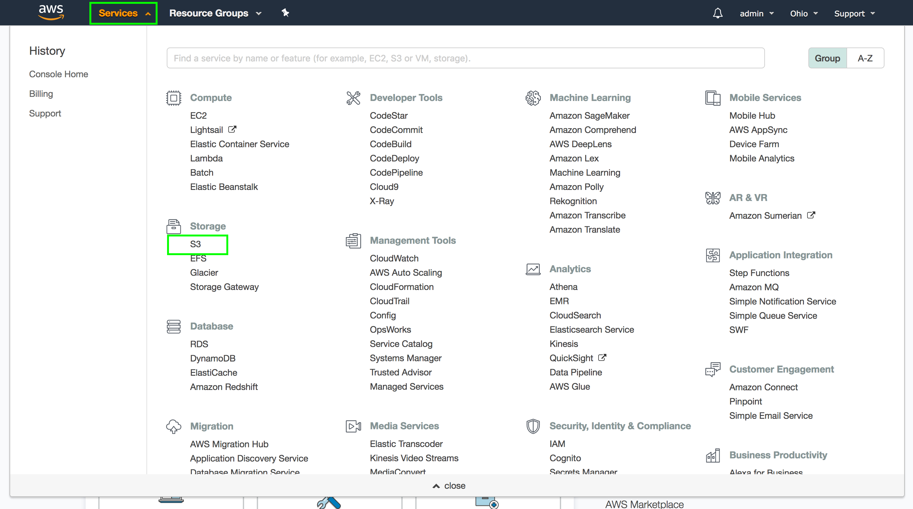

First, we need to create a bucket. A bucket is roughly analogous to a directory, but with the important caveat that the name of the bucket must be globally unique. This means the name of your bucket can not have been used by any other AWS customer.

:::hint
If you see S3 bucket names that are seemingly randomly generated, this is because all the common bucket names have long since been used by other AWS customers.
:::

To create a new bucket, click the `Create bucket` button.

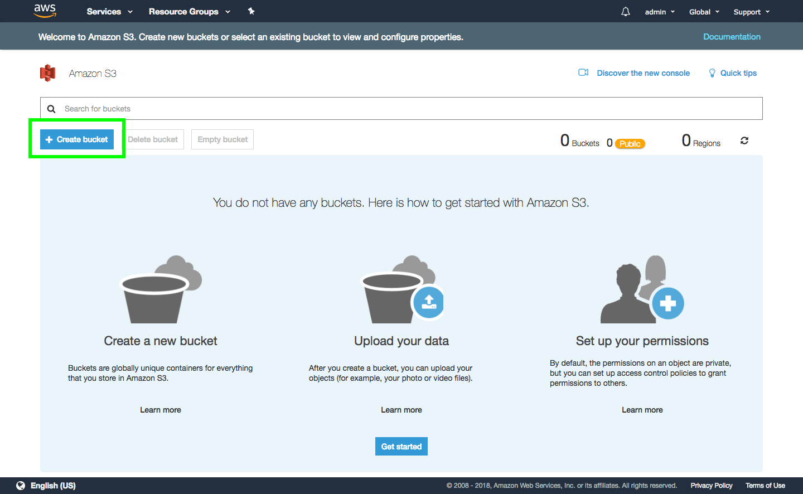

Give your bucket a name (remembering that it has to be globally unique, and so the name I have used here is now unavailable), and click the `Next` button.

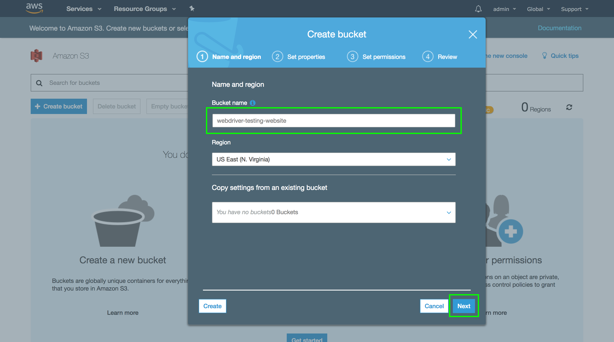

We don't need to enable any of the additional properties shown in this section of the wizard, so click the `Next` button.

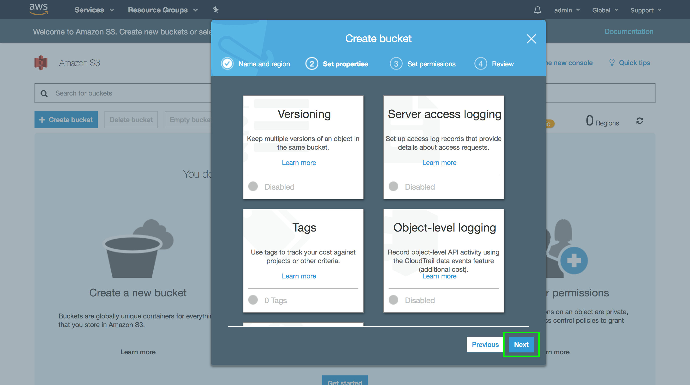

The default permissions are OK, so click the `Next` button.

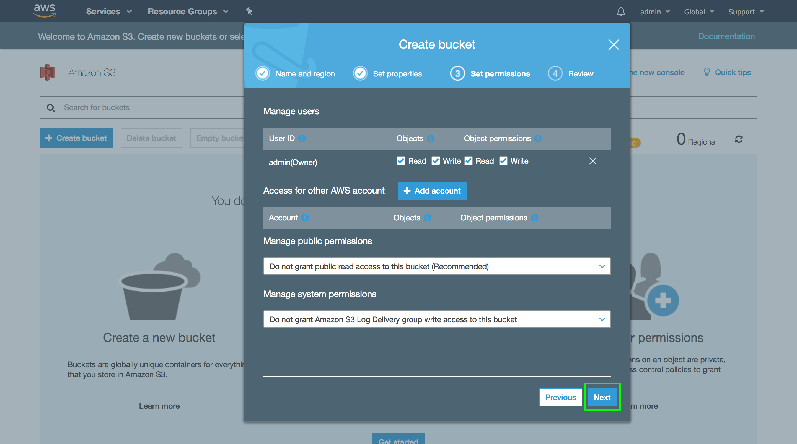

The review screen shows us a summary of our selections. Click the `Create bucket` button to finish.

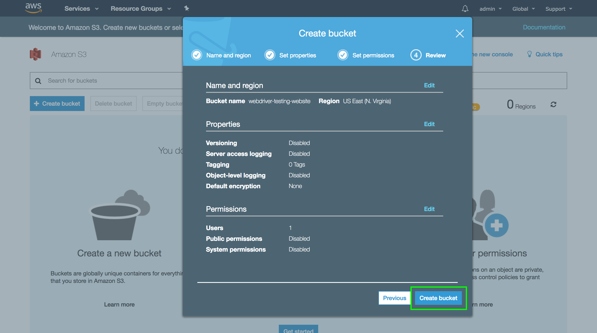

Our newly created bucket is then displayed. Click on it to open the bucket up.

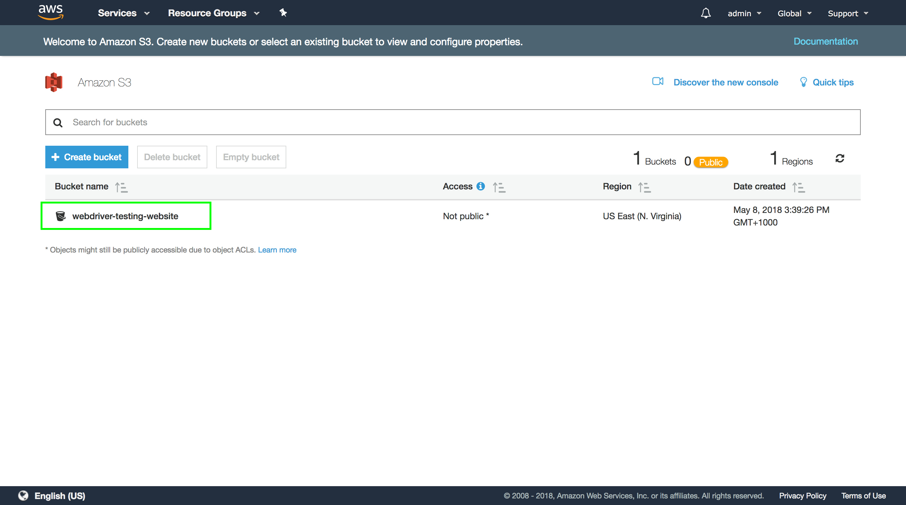

The bucket is currently empty. Click the `Upload` button.

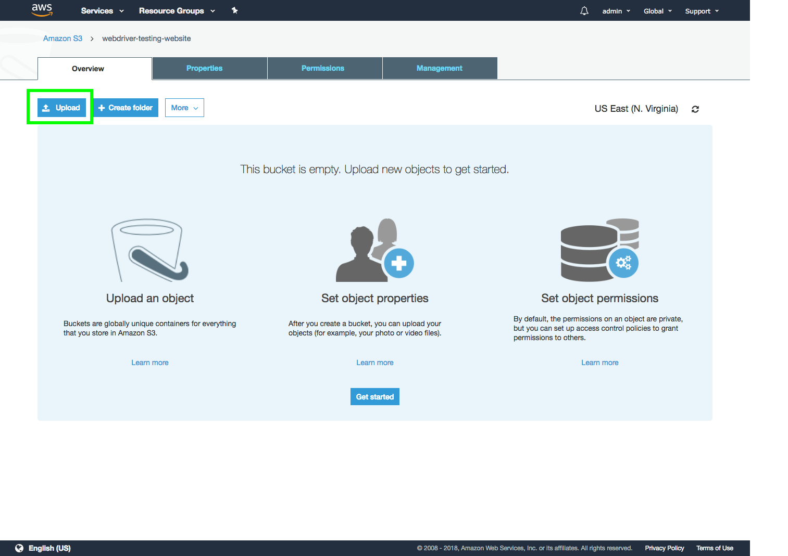

Click the Add files button. This will display a file selection dialog
box.

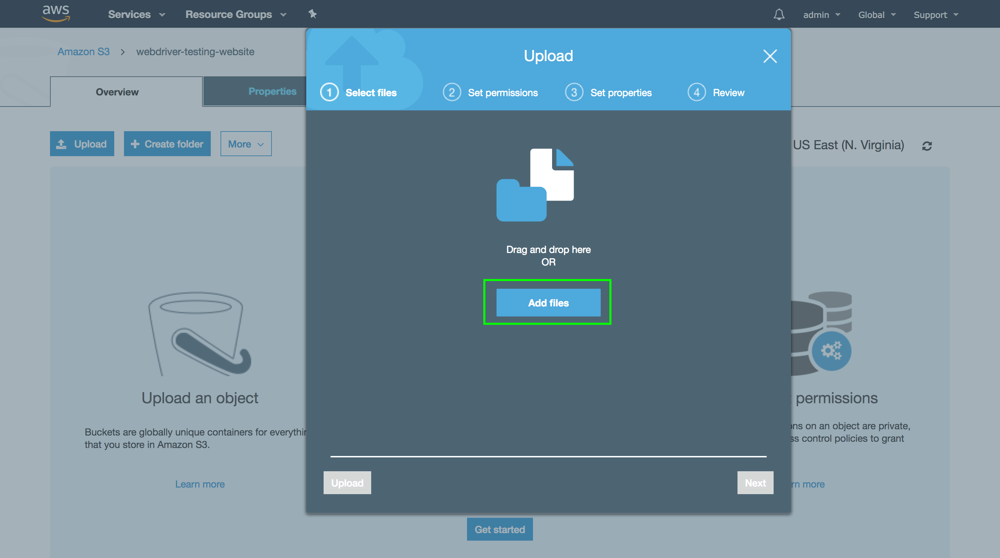

Here we upload the files for the various test web pages that we have been loading off the local disk during tests. These files will be under the `src/test/resources` directory.

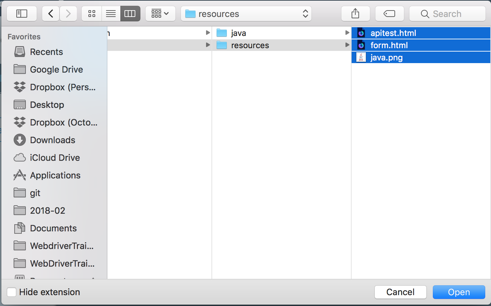

The files will then be listed in the wizard. Click the `Next` button to continue.

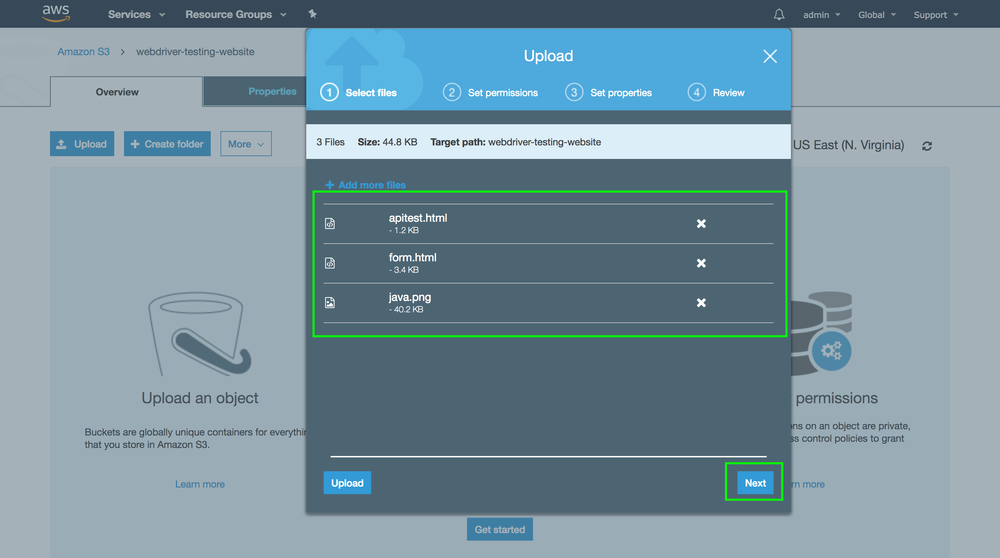

We'll accept the default permissions for now, so click the `Next` button.

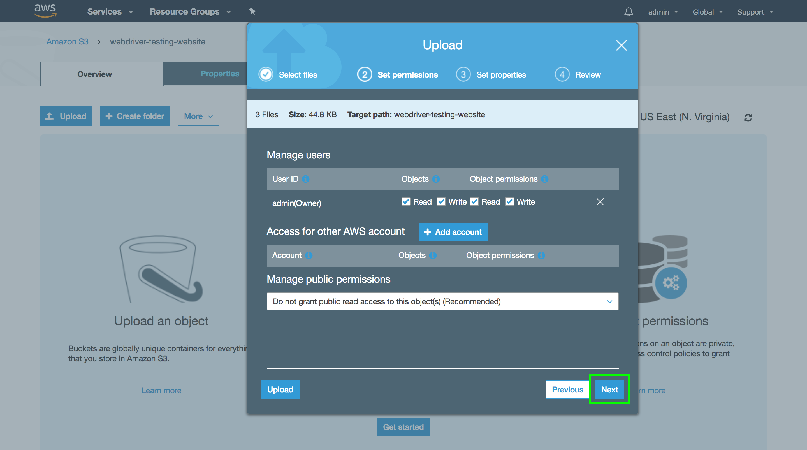

The default properties are OK, so click the `Next` button.

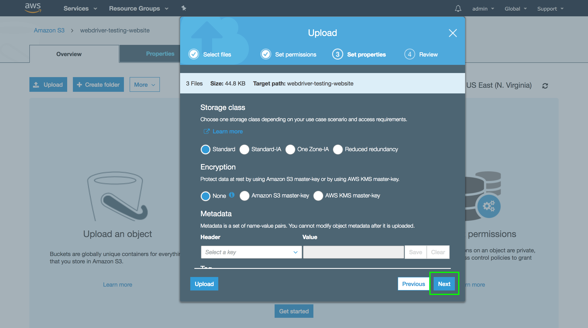

The review screen shows a summary of the options. Click the `Upload` button to upload the selected files to the S3 bucket.

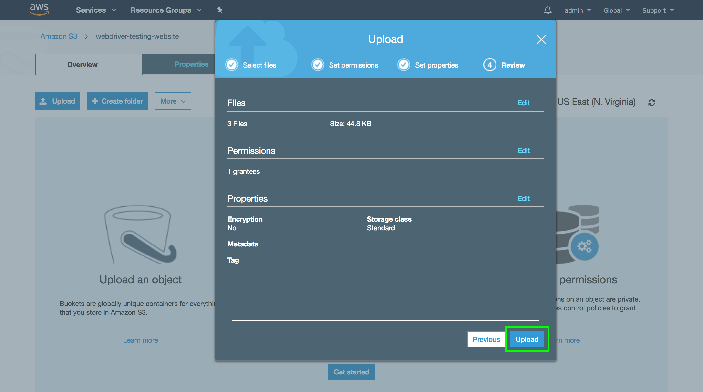

After a few seconds (the files are quite small, and so should be uploaded quickly) the files will be shown in the bucket.

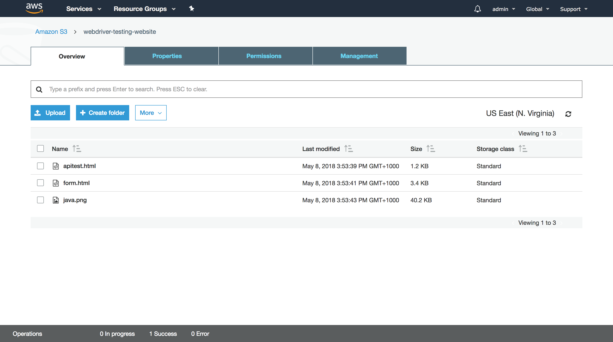

To allow these files to be viewed as public web pages, we need to change the permissions to allow anonymous public access to them. To do this select all the files, click the `More` button, and then select the `Make public` option.

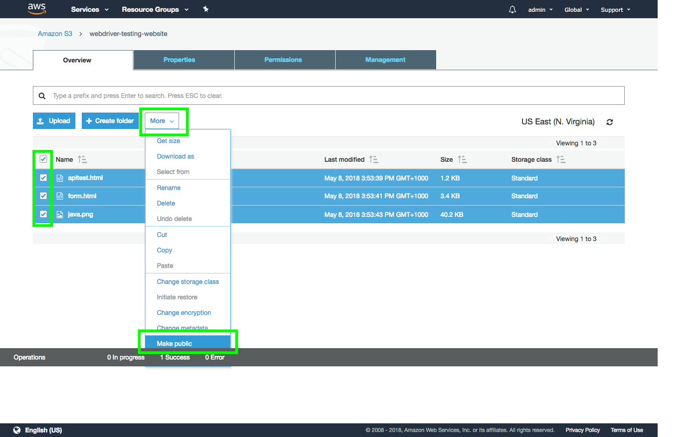

Click the `Make public` button to publicly expose the files.

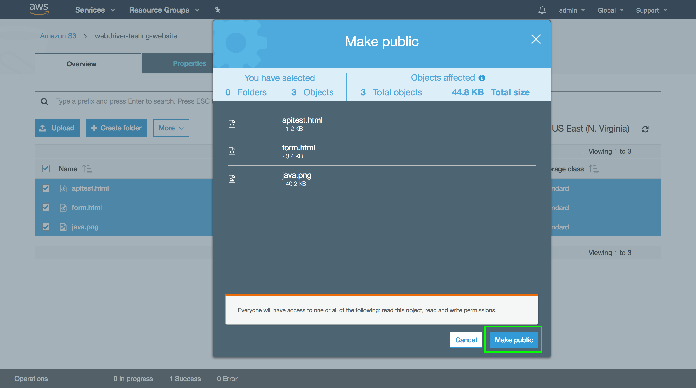

Now that the files are publicly available, we need to find the URL that we can use to open then in a browser. Click the `form.html` file.

The link to open this file is shown in the Overview tab, and in this case the URL is [https://s3.amazonaws.com/webdriver-testing-website/form.html](https://s3.amazonaws.com/webdriver-testing-website/form.html). You can click this link to open the page in the browser.

By uploading the files to S3 and making them public, we have effectively used S3 as a web host. This gives us a public URL that we can load as part of our tests, and means that we can start writing tests on platforms that do not have access to the local HTML files in our Java project. We will take advantage of this web site hosting in the next post where we run tests on BrowserStack, which will allow us to run tests across multiple browsers and mobile devices.

Return to the [table of contents](../0-toc/webdriver-toc.md).
