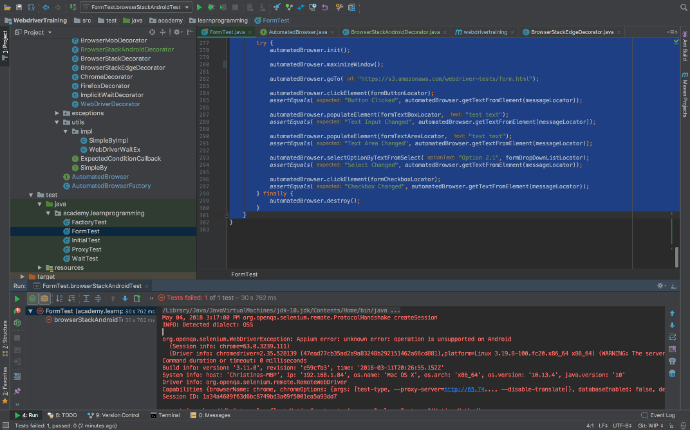

Return to the [table of contents](../0-toc/webdriver-toc.md). 

You may have noticed when running tests against the Edge browser in BrowserStack that the window was not maximized.  It usually makes sense to run tests in a maximized window to ensure that the tests are run with web pages displayed with a consistent resolution, so let's add a new method to maximize the window.

First, we add the method `maximizeWindow()` to the `AutomatedBrowser` class:

```java
package com.octopus;

import org.openqa.selenium.WebDriver;
import org.openqa.selenium.remote.DesiredCapabilities;

public interface AutomatedBrowser {

  // ...

  void maximizeWindow();
}
```

Then we add the default implementation to the `AutomatedBrowserBase` class:

```java
package com.octopus.decoratorbase;

import com.octopus.AutomatedBrowser;
import org.openqa.selenium.WebDriver;
import org.openqa.selenium.remote.DesiredCapabilities;

public class AutomatedBrowserBase implements AutomatedBrowser {

  // ...

  @Override
  public void maximizeWindow() {
    if (getAutomatedBrowser() != null) {
      getAutomatedBrowser().maximizeWindow();
    }
  }
}
```

And then in the `WebDriverDecorator` class we add the code to maximize the browser window:

```java
package com.octopus.decorators;

import com.octopus.AutomatedBrowser;
import com.octopus.decoratorbase.AutomatedBrowserBase;
import com.octopus.utils.SimpleBy;
import com.octopus.utils.impl.SimpleByImpl;
import org.openqa.selenium.By;
import org.openqa.selenium.WebDriver;
import org.openqa.selenium.support.ui.ExpectedConditions;
import org.openqa.selenium.support.ui.Select;
import org.openqa.selenium.support.ui.WebDriverWait;

public class WebDriverDecorator extends AutomatedBrowserBase {

  // ...

  @Override
  public void maximizeWindow() {
    webDriver.manage().window().maximize();
  }
}
```

Now, in our test we can maximize the window before the URL is opened with a call to `automatedBrowser.maximizeWindow()`:

```java
@Test
public void browserStackEdgeTest() {
    final AutomatedBrowser automatedBrowser =
            AUTOMATED_BROWSER_FACTORY.getAutomatedBrowser("BrowserStackEdge");

    final String formButtonLocator = "button_element";
    final String formTextBoxLocator = "text_element";
    final String formTextAreaLocator = "textarea_element";
    final String formDropDownListLocator = "[name=select_element]";
    final String formCheckboxLocator = "//*[@name=\"checkbox1_element\"]";

    final String messageLocator = "message";

    try {
        automatedBrowser.init();

        automatedBrowser.maximizeWindow();

        automatedBrowser.goTo("https://s3.amazonaws.com/webdriver-testing-website/form.html");

        automatedBrowser.clickElement(formButtonLocator);
        assertEquals("Button Clicked", automatedBrowser.getTextFromElement(messageLocator));

        automatedBrowser.populateElement(formTextBoxLocator, "test text");

        assertEquals("Text Input Changed", automatedBrowser.getTextFromElement(messageLocator));

        automatedBrowser.populateElement(formTextAreaLocator, "test text");

        assertEquals("Text Area Changed", automatedBrowser.getTextFromElement(messageLocator));

        automatedBrowser.selectOptionByTextFromSelect("Option 2.1", formDropDownListLocator);
        assertEquals("Select Changed", automatedBrowser.getTextFromElement(messageLocator));

        automatedBrowser.clickElement(formCheckboxLocator);
        assertEquals("Checkbox Changed", automatedBrowser.getTextFromElement(messageLocator));
    } finally {
        automatedBrowser.destroy();
    }
}
```

This test will now run and, as expected, the Edge browser window will be maximized before the URL is opened.

But what happens if we run this same test against a mobile browser? Let's add the call to `automatedBrowser.maximizeWindow()` in a test that makes use of the `AutomatedBrowser` instance generated when we pass the string `BrowserStackAndroid` to the factory class:

```java
@Test
public void browserStackAndroidTest() {

    final AutomatedBrowser automatedBrowser =
            AUTOMATED_BROWSER_FACTORY.getAutomatedBrowser("BrowserStackAndroid");

    final String formButtonLocator = "button_element";
    final String formTextBoxLocator = "text_element";
    final String formTextAreaLocator = "textarea_element";
    final String formDropDownListLocator = "[name=select_element]";
    final String formCheckboxLocator =  "//*[@name=\"checkbox1_element\"]";
    final String messageLocator = "message";

    try {
        automatedBrowser.init();

        automatedBrowser.maximizeWindow();

        automatedBrowser.goTo("https://s3.amazonaws.com/webdriver-tests/form.html");

        automatedBrowser.clickElement(formButtonLocator);
        assertEquals("Button Clicked", automatedBrowser.getTextFromElement(messageLocator));

        automatedBrowser.populateElement(formTextBoxLocator, "test text");
        assertEquals("Text Input Changed", automatedBrowser.getTextFromElement(messageLocator));

        automatedBrowser.populateElement(formTextAreaLocator, "test text");
        assertEquals("Text Area Changed", automatedBrowser.getTextFromElement(messageLocator));

        automatedBrowser.selectOptionByTextFromSelect("Option 2.1", formDropDownListLocator);
        assertEquals("Select Changed", automatedBrowser.getTextFromElement(messageLocator));

        automatedBrowser.clickElement(formCheckboxLocator);
        assertEquals("Checkbox Changed", automatedBrowser.getTextFromElement(messageLocator));
    } finally {
        automatedBrowser.destroy();
    }
}
```

This time we get an exception saying:

```
org.openqa.selenium.WebDriverException: Appium error: unknown error:
operation is unsupported on Android.

May 04, 2018 3:17:00 PM org.openqa.selenium.remote.ProtocolHandshake
createSession

INFO: Detected dialect: OSS

org.openqa.selenium.WebDriverException: Appium error: unknown error:
operation is unsupported on Android

(Session info: chrome=63.0.3239.111)

(Driver info: chromedriver=2.35.528139
(47ead77cb35ad2a9a83248b292151462a66cd881),platform=Linux
3.19.8-100.fc20.x86_64 x86_64) (WARNING: The server did not provide
any stacktrace information)

Command duration or timeout: 0 milliseconds

Build info: version: '3.11.0', revision: 'e59cfb3', time:
'2018-03-11T20:26:55.152Z'

System info: host: 'Christinas-MBP', ip: '192.168.1.84', os.name:
'Mac OS X', os.arch: 'x86_64', os.version: '10.13.4',
java.version: '10'

Driver info: org.openqa.selenium.remote.RemoteWebDriver

Capabilities {browserName: chrome, chromeOptions: {args: [test-type,
--proxy-server=http://65.74..., --disable-translate]},
databaseEnabled: false, deviceManufacturer: samsung, deviceModel:
SM-N950F, deviceName: ce051715d1a6a708017e, deviceScreenSize: 1440x2960,
deviceUDID: ce051715d1a6a708017e, enablePerformanceLogging: false,
javascriptEnabled: true, locationContextEnabled: false, loggingPrefs:
org.openqa.selenium.logging..., networkConnectionEnabled: true,
newCommandTimeout: 300, platform: LINUX, platformName: LINUX,
platformVersion: 7.1.1, realMobile: true, systemPort: 8203,
takesScreenshot: true, udid: ce051715d1a6a708017e, warnings: {},
webStorageEnabled: false}

Session ID: 1a34a4609f63d6bc8749bd3a09f5001ea5a93dd7
```



This exception makes sense, because mobile browsers do not have the concept of resizable windows. They are always full screen, and therefor it is invalid to try and modify the size of the window.

This does leave us with a problem though. Ideally we would like to be able to run our test code against any browser. Although we have been creating new test methods to demonstrate new browsers throughout these posts, in practice it is desirable to have a single test method that is called multiple times for different browsers. Running a single test method reduces the amount of duplicated code, making the tests easier to maintain.

We could try to detect the device that the test is being run on inside the test, and wrap up the call to maximize the window in an `if` statement. The code below extracts the name of the device manufacturer, and if it is not `samsung`, we assume that the test is being run on a desktop device, and the call to `automatedBrowser.maximizeWindow()` is made:

```java
String manufacturer = ((RemoteWebDriver) automatedBrowser.getWebDriver()).getCapabilities().getCapability("deviceManufacturer").toString();

if (!manufacturer.equalsIgnoreCase("samsung")) {
  automatedBrowser.maximizeWindow();
}
```

This solution works, but it is not very elegant. The code only works if the only mobile devices we test against are manufactured by Samsung, meaning each new device we test against requires new code in our tests to see if it is a mobile device. It also clutters up our test with a lot of code that distracts from the interactions that we are actually interested in.

A much more elegant solution is to override the `maximizeWindow()` method in the `BrowserStackAndroidDecorator` decorator class:

```java
package com.octopus.decorators;

import com.octopus.AutomatedBrowser;
import com.octopus.decoratorbase.AutomatedBrowserBase;
import org.openqa.selenium.remote.DesiredCapabilities;

public class BrowserStackAndroidDecorator extends AutomatedBrowserBase {

  // ...

  @Override
  public void maximizeWindow() {
    // do nothing
  }
}
```

Here we have added an implementation of the `maximizeWindow()` method that does nothing. We know that any time we use the `BrowserStackAndroidDecorator` class, we must be working with a mobile browser, and so we simply ignore any request to maximize the window.

This solution means our test code does not need to change when run on a desktop browser or a mobile one. Those writing and maintaining the tests are no longer required to account for the kinds of device that will be running the final test, which makes the test much more robust and easier to maintain.

Return to the [table of contents](../0-toc/webdriver-toc.md).
