Return to the [table of contents](../0-toc/webdriver-toc.md).

We've talked about the idea of a code repository, and in this post we'll sign up to GitHub, which is a free service that provides us with hosted Git code repositories we can use to manage our code.

To start, open up [https://github.com](https://github.com). On the main page you will see a form that allows you to sign up for a free account.

Enter a username, email address, and password, and click the `Sign up for GitHub` button.

Select the `Unlimited public repositories for free` option, and click the `Continue` button.

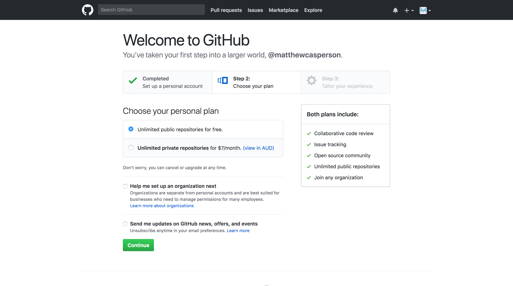

We do not need to personalize GitHub now, so click the `skip this step` link.

Now we have created a new GitHub account. You will have received an email to the address that you signed up with. Inside the email is a link that you need to click to validate your email address.

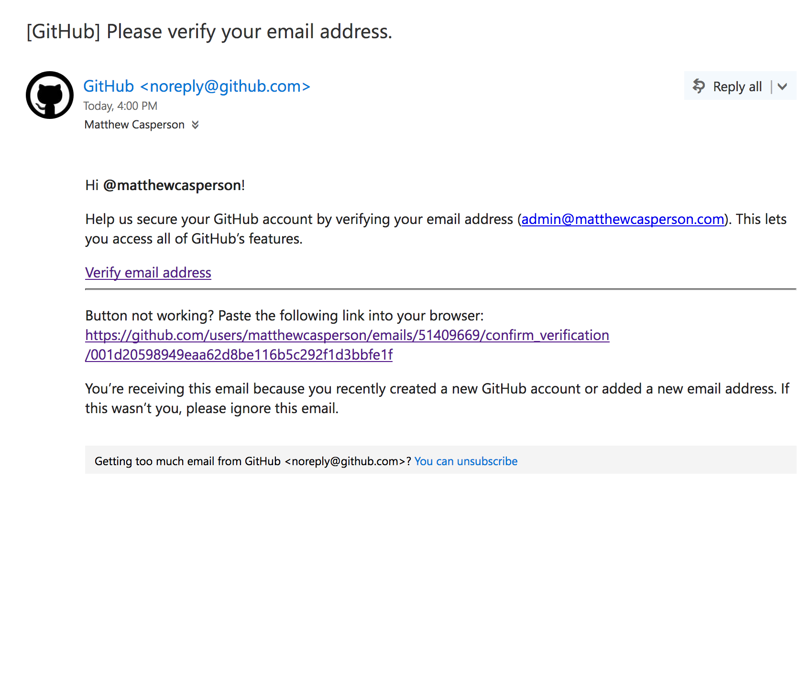

Once you click the link, you will be able to create a new Git repository by clicking the `Start a project` button.

Give your repository a name (I've used the name `WebDriver` here), select the `Public` option, and click the `Create repository` button.

It is important that we create a public repository, because both GitHub and Travis CI offer free plans for public repositories. This means we can create a CI pipeline at no cost.

With the repository created, we now have a URL that we can use to check-in code through. In my case the URL is
[https://github.com/matthewcasperson/WebDriver.git](https://github.com/matthewcasperson/WebDriver.git).

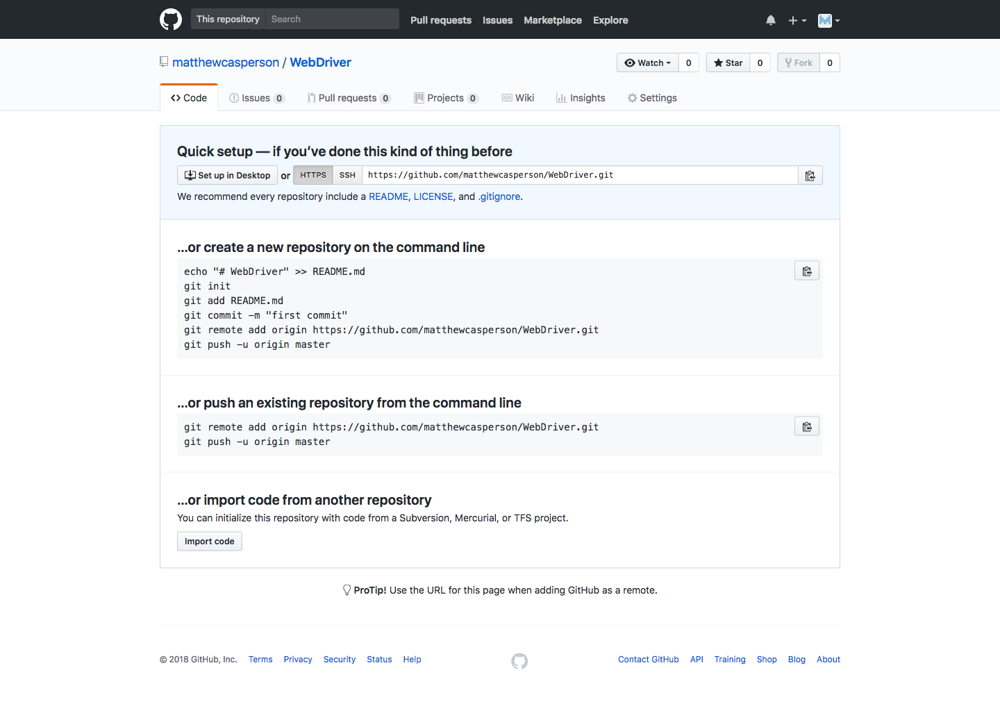

We now have an empty Git repository, ready to fill with our code. IntelliJ has excellent support for working with code in Git repositories, so we'll use IntelliJ create a local Git repository and link it to the one we just created in GitHub.

Open Intellj with the WebDriver project loaded. Then click {{VCS,Enable Version Control Integration...}}

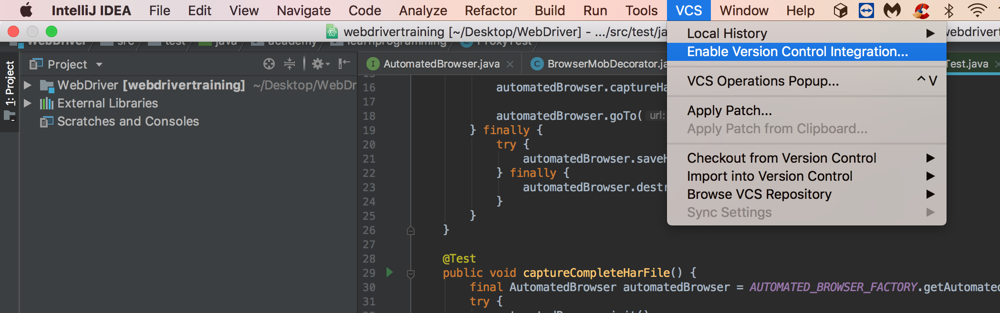

Select `Git` as the version control system to use, and click the `OK` button.

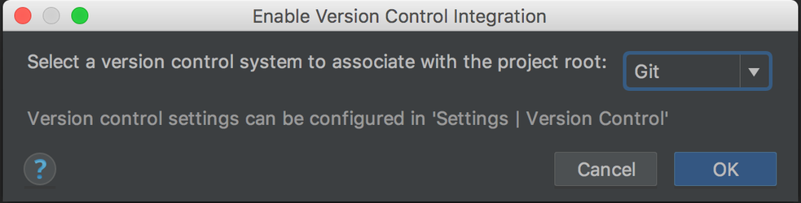

This will create a local Git repository in the directory the holds the currently loaded project. This Git repository can function completely independently of a remote repository like the one we created in GitHub, but in order to use a CI tool like Travis CI we need to link our local Git repository and the remote one hosted in GitHub together. This is done by configuring GitHub as a remote repository.

To add a remote repository, click {{VCS,Git,Remotes...}}

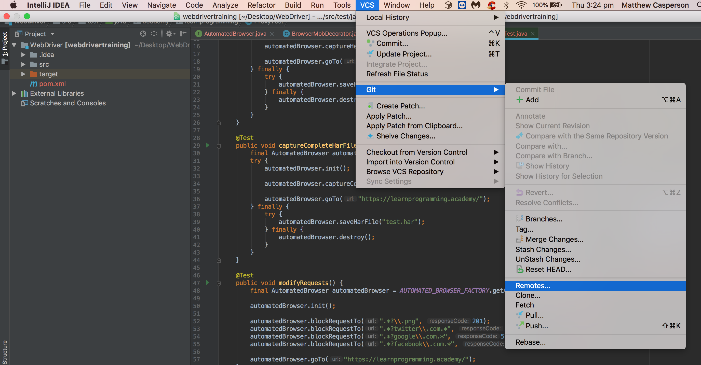

Click the plus icon to add a new remote repository.

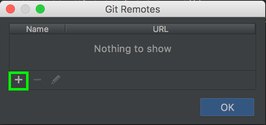

Leave the default name of `origin`.

For the URL we need to use a slightly modified version of the URL that was supplied to us by GitHub. If you recall from when we created the Git repository in GitHub we were given a URL of `https://github.com/matthewcasperson/WebDriver.git`. This is the URL that we need to enter here, but modified to include the GitHub username in the URL. This is done by adding the username and the at symbol after the `https://`. So in my case the URL being entered is `https://matthewcasperson@github.com/matthewcasperson/WebDriver.git`.

Adding the username here means that we can push code to the remote repository. Without the username, this repository would be read only, and we could not use IntelliJ to check in any changes.

Click the `OK` button to save the changes.

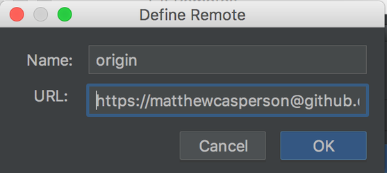

Click the `OK` button to close the `Git Remotes` dialog.

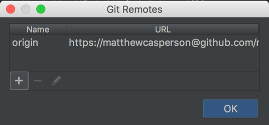

You will notice now that the files that make up our project are shown in red. This indicates that these files have not been added to the Git repository.

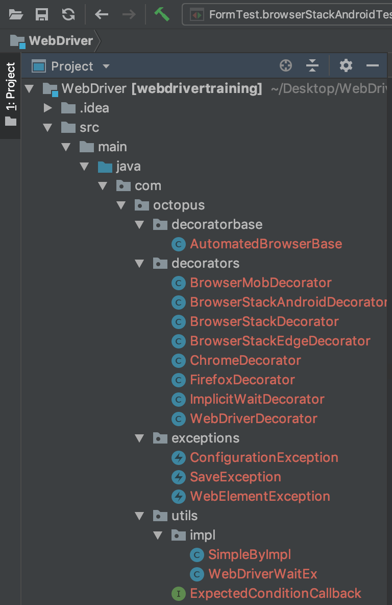

Generally speaking we want to add all our source code files to the Git repository. In addition though our project directory also has a number of files created by IntelliJ for its own configuration. IntelliJ offer some advice on which files to check-in to the repository at <https://intellij-support.jetbrains.com/hc/en-us/articles/206544839>:

- All the files under `.idea` directory in the project root **except** the `workspace.xml` and `tasks.xml` files which store user specific settings.
- All the `.iml` module files that can be located in different module directories (applies to IntelliJ IDEA).

To prevent some files from ever being added to the Git repository, we need to create a file called `.gitignore`. This file lists those files in our directory that Git should not try to add to the repository.

Right click the top level project folder and select {{New,File}}.

Enter the filename `.gitignore` and click the `OK` button.

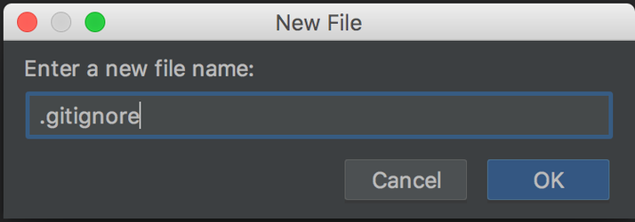

IntelliJ detects that we are creating a new file, and asks us if we want to add it to the repository. We want to have any new files added by default, so click the `Remember, don't ask again` option, and then click the `Yes` button.

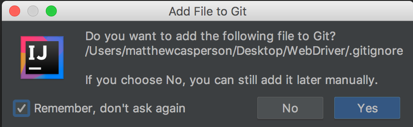

In the `.gitignore` file we list the two files that should not be added to the Git repository. Make sure to save the changes.

You may not have either of these files present in your directory yet. It is OK to list files in the `.gitignore` file that do not exist.

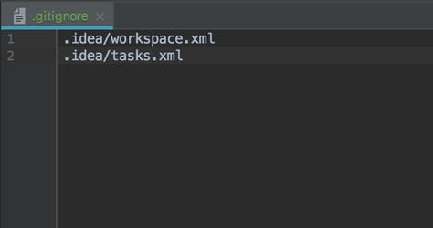

Right click the top level project folder, and select {{Git,Add}}. This will add all files, except for those in the `.gitignore` file, to the repository.

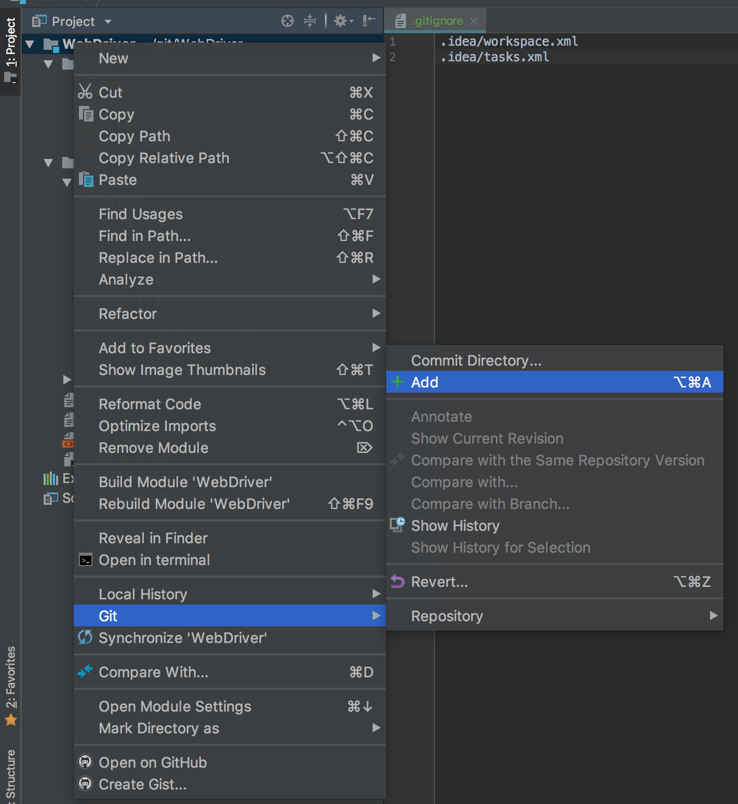

Now all the files are green, except for `.idea/workspace.xml`. This file was one of those that we added to the `.gitignore` file, and so has not been added to the repository.

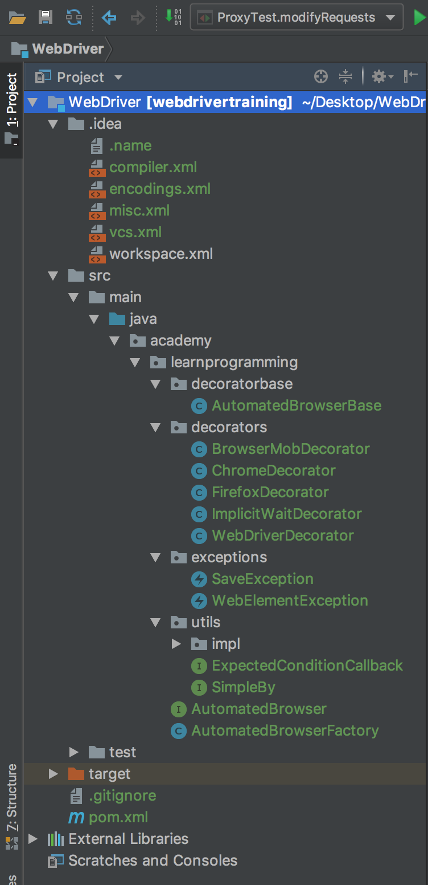

Now that we have added to the files to the repository, we want to check them in. To do this we right click the top level project folder and select {{Git,Commit Directory}}.

In the `Commit Changes` dialog, select all the files. Then add a commit message. This message can be used later on to understand what changes were made with the commit, which can be useful for auditing purposes. Finally click arrow to the right of the `Commit` button and click the `Commit and Push` button.

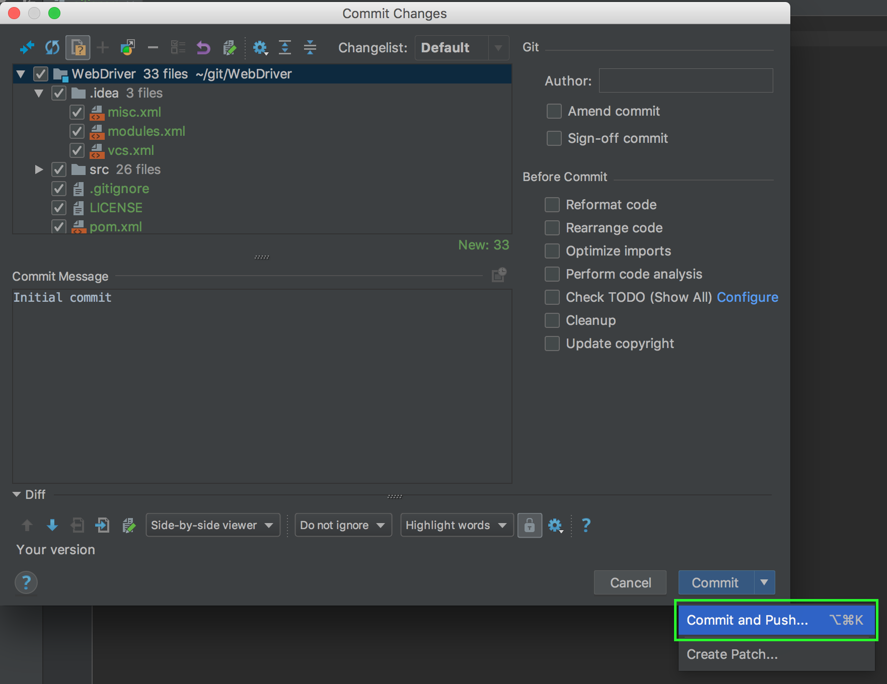

The `Push Commits` dialog will show a list of the changes that we wish to push to the remote repository on GitHub. Click the `Push` button to make the changes.

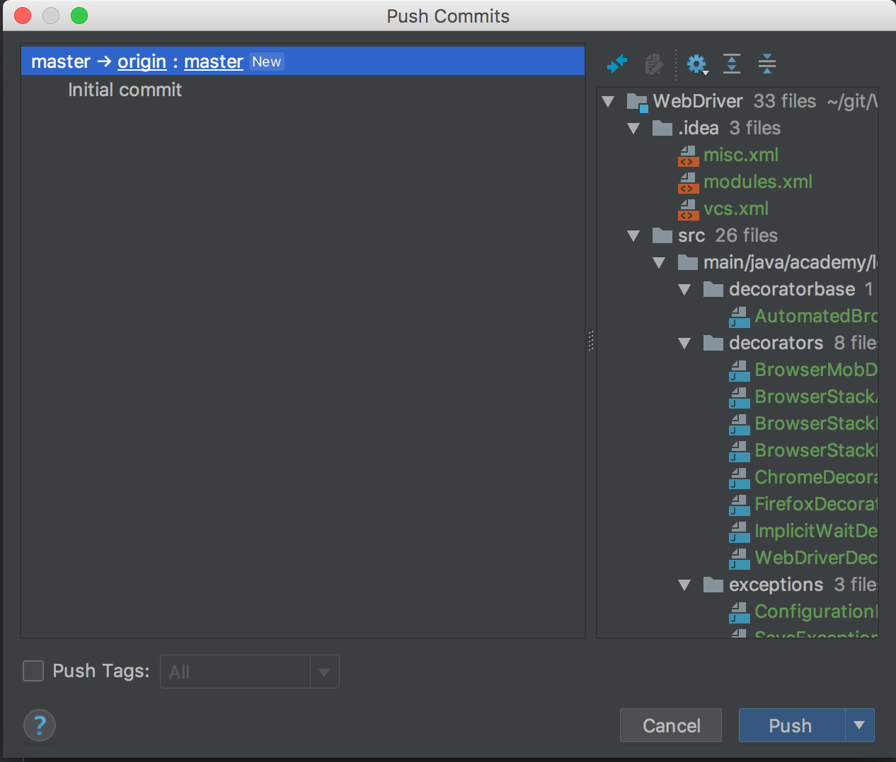

You'll be prompted to supply the GitHub password. Enter the password and click the `OK` button.

If you get an error at this point saying that the push failed, it may be because the URL you entered when adding the remote repository did not embed the GitHub username.

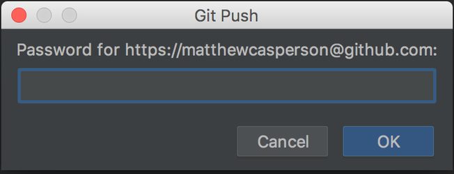

Once the push operation has completed, you will see a message.

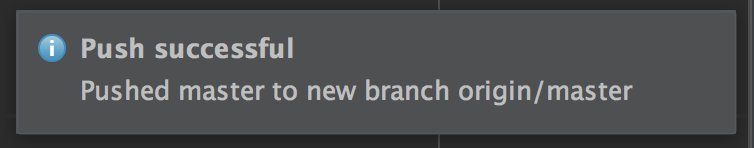

Returning back to the repository in GitHub, we can see that the files were pushed up to the remote repository.

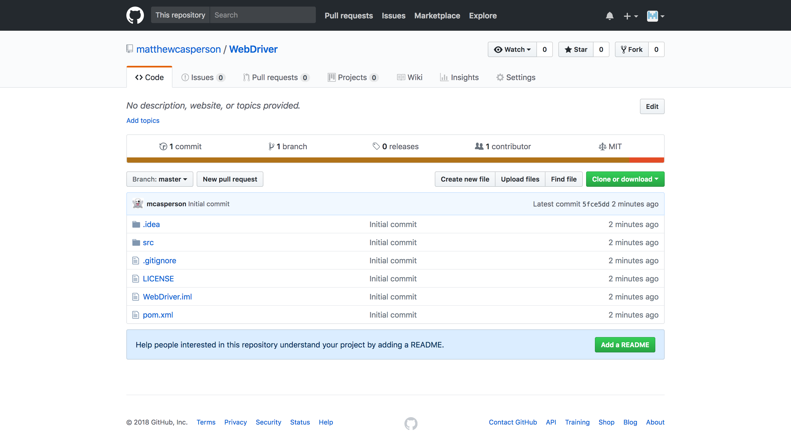

Using a source control repository is generally considered good practice, as it allows changes to be tracked and audited, giving you the ability to identify code that caused an issue and undo those changes if need be. Hosted git repositories like those provided by GitHub means that your code is also backed up in a second location, and can be shared with a team of developers who may all be working on the same project. And storing code in GitHub makes it easy to integrate with other services, which we'll see in the next post when we link GitHub and Travis CI to build our code and run our tests automatically with each check-in.

Return to the [table of contents](../0-toc/webdriver-toc.md).
