This post is part of a series about [creating a Selenium WebDriver test framework](../0-toc/webdriver-toc.md).

TicketMonster is a sample application created by RedHat to demonstrate a number of Java web technologies. The nice thing about TicketMonster (from the point of view of a WebDriver tutorial anyway) is that it has not been optimized for automated tests, meaning that to successfully test a typical journey through the application we can’t rely on consistent network requests or all elements having convenient `id` attributes we can use to locate them.

But in order to write tests for TicketMonster,  we need to have it deployed somewhere. The source code for the TicketMonster application is freely available, and you can find detailed instructions on how to run TicketMonster locally at [https://developers.redhat.com/ticket-monster/whatisticketmonster/](https://developers.redhat.com/ticket-monster/whatisticketmonster/). 

The scenario we’ll test is purchasing a ticket for an event. Let’s first run through the process of buying a ticket manually.

Starting at the home page, we click the `Buy tickets now` button.

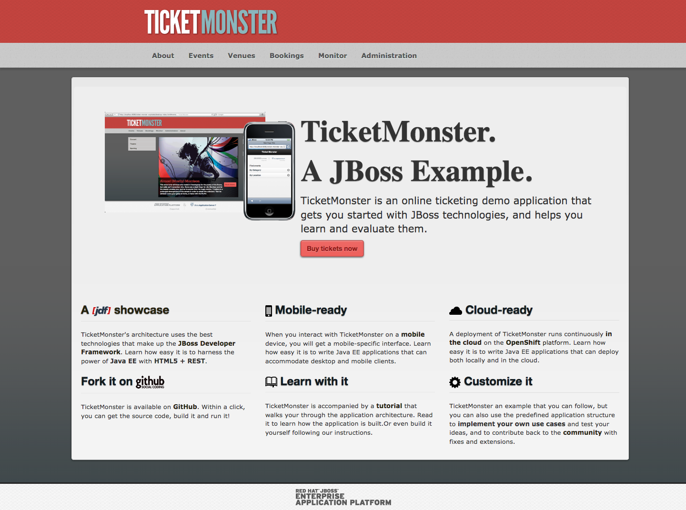

This presents us with a list of events. From here we click the `Concert` link to expand the menu, and then click the `Rock concert of the decade` link.

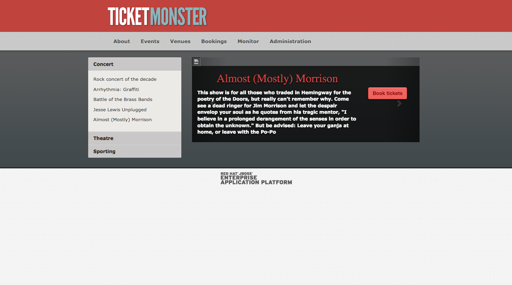

We select `Toronto : Roy Thomson Hall` as the venue and leave the default time. Then click the `Order tickets` button.

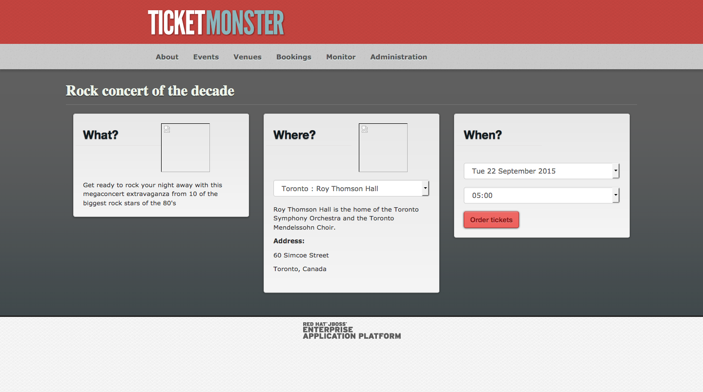

Select the `A - Premier platinum reserve` section, and enter `2` for the number of tickets. Enter an email address in the `Order Summary` section, and click the `Add tickets` button to confirm these choices.

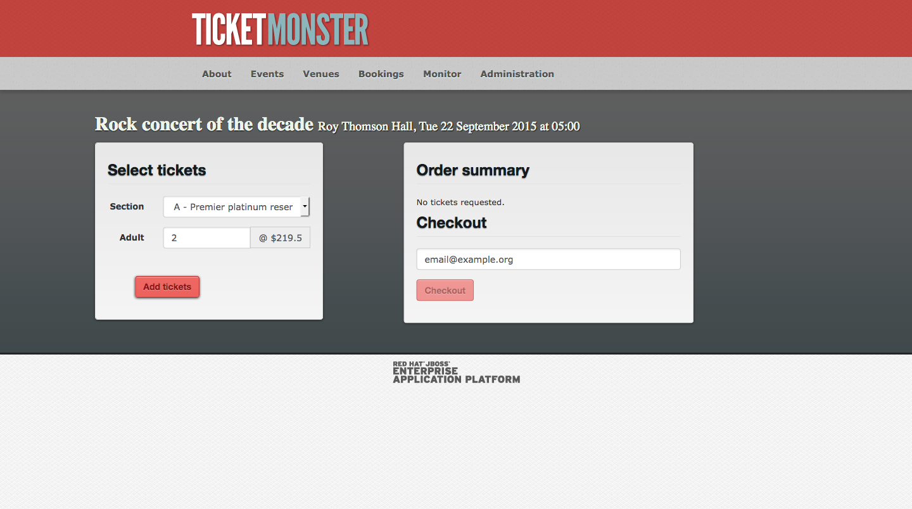

With the ticket selection done click the `Checkout` button.

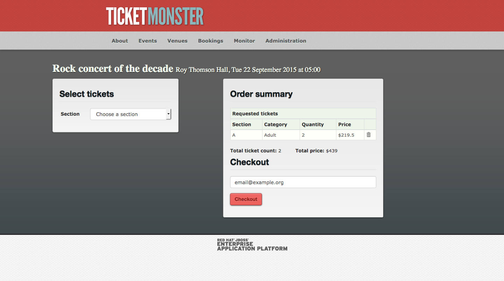

The transaction is completed, and we have bought our pretend tickets to a fictional show.

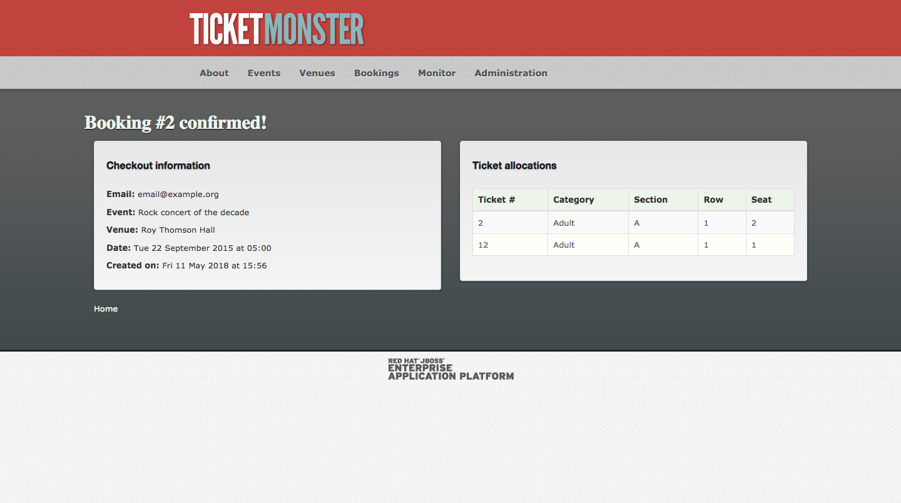

Although this scenario of buying tickets is not complex, testing it with WebDriver requires a number of techniques that we have implemented in our library so far. We click elements like links and buttons, populate text boxes, select items from drop-down lists, and interact with elements that are dynamically added to the page.

Here is the test that completes this ticket purchasing scenario with WebDriver:

```java
package com.octopus;

import org.junit.Assert;
import org.junit.Test;

public class TicketMonsterTest {

    private static final AutomatedBrowserFactory AUTOMATED_BROWSER_FACTORY =
            new AutomatedBrowserFactory();

    private static final int WAIT_TIME = 30;

    @Test
    public void purchaseTickets() {

        final AutomatedBrowser automatedBrowser =
                AUTOMATED_BROWSER_FACTORY.getAutomatedBrowser("ChromeNoImplicitWait");

        try {

            automatedBrowser.init();

            automatedBrowser.goTo("https://ticket-monster.herokuapp.com");

            automatedBrowser.clickElement("Buy tickets now", WAIT_TIME);

            automatedBrowser.clickElement("Concert", WAIT_TIME);

            automatedBrowser.clickElement("Rock concert of the decade", WAIT_TIME);

            automatedBrowser.selectOptionByTextFromSelect("Toronto : Roy Thomson Hall", "venueSelector", WAIT_TIME);

            automatedBrowser.clickElement("bookButton", WAIT_TIME);

            automatedBrowser.selectOptionByTextFromSelect("A - Premier platinum reserve", "sectionSelect", WAIT_TIME);

            automatedBrowser.populateElement("tickets-1", "2", WAIT_TIME);

            automatedBrowser.clickElement("add", WAIT_TIME);

            automatedBrowser.populateElement("email", "email@example.org", WAIT_TIME);

            automatedBrowser.clickElement("submit", WAIT_TIME);

            final String email = automatedBrowser.getTextFromElement("div.col-md-6:nth-child(1) > div:nth-child(1) > p:nth-child(2)", WAIT_TIME);
            Assert.assertTrue(email.contains("email@example.org"));

            final String event = automatedBrowser.getTextFromElement("div.col-md-6:nth-child(1) > div:nth-child(1) > p:nth-child(3)", WAIT_TIME);
            Assert.assertTrue(event.contains("Rock concert of the decade"));

            final String venue = automatedBrowser.getTextFromElement("div.col-md-6:nth-child(1) > div:nth-child(1) > p:nth-child(4)", WAIT_TIME);
            Assert.assertTrue(venue.contains("Roy Thomson Hall"));
        } finally {
            automatedBrowser.destroy();
        }
    }
}
```

Let’s break this code down line by line.

We have a static instance of the `AutomatedBrowserFactory` class, which we will use to generate instances of the `AutomatedBrowser` class:

```java
private static final AutomatedBrowserFactory AUTOMATED_BROWSER_FACTORY
  = new AutomatedBrowserFactory();
```

Because we will take advantage of explicit waits when interacting with elements, we need to have a duration in which to wait for elements to be available. The constant `WAIT_TIME` will be used as the default duration for explicit wait times.

We have quite a generous wait time here because the application has been deployed to quite a small Heroku instance, and sometimes pages can take some time to load:

```java
private static final int WAIT_TIME = 30;
```

For this test we’ll use explicit waits and take advantage of the simple element selection methods. For both of these to work as expected, we need to have an instance of `AutomatedBrowser` that does not implement implicit waits. By passing the `ChromeNoImplicitWait` option to the `AutomatedBrowserFactory` instance, we will receive a `AutomatedBrowser` instance that does not implement implicit waits:

```java
@Test
public void purchaseTickets() {
  final AutomatedBrowser automatedBrowser =
    AUTOMATED_BROWSER_FACTORY.getAutomatedBrowser("ChromeNoImplicitWait");
```

We then initialize the `AutomatedBrowser` instance, and open the TicketMonster URL:

```java
try {
  automatedBrowser.init();
  automatedBrowser.goTo("https://ticket-monster.herokuapp.com");
```

From the main page we click the `Buy tickets now` link. Even though this element looks like a button, it is actually a link, or an `<a>` element.

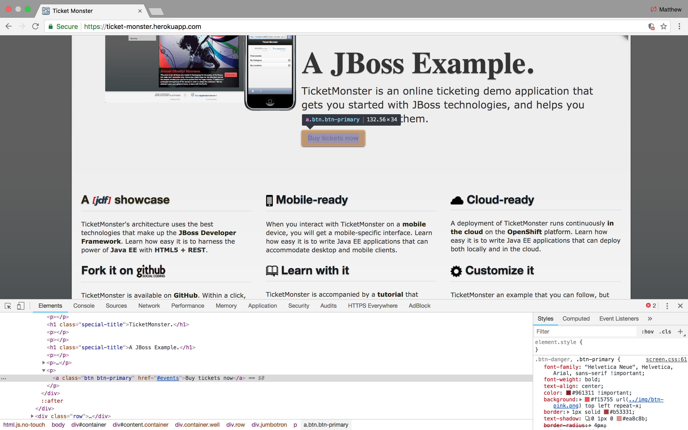

This means that we can identify this element by its text. If you remember back to when we implemented the `SimpleBy` class, one of the methods we used to identify an element was the `By.ByLinkText` class:

```java
final By[] byInstances = new By[] {
  By.id(locator),
  By.xpath(locator),
  By.cssSelector(locator),
  By.className(locator),
  By.linkText(locator),
  By.name(locator)
};
```

The `By.linkText()` method means we can use the text that makes up the link, which is `Buy tickets now`:

```java
automatedBrowser.clickElement("Buy tickets now", WAIT_TIME);
```

The `Concert and Rock concert of the decade` elements are also links, and so we identify them by their text:

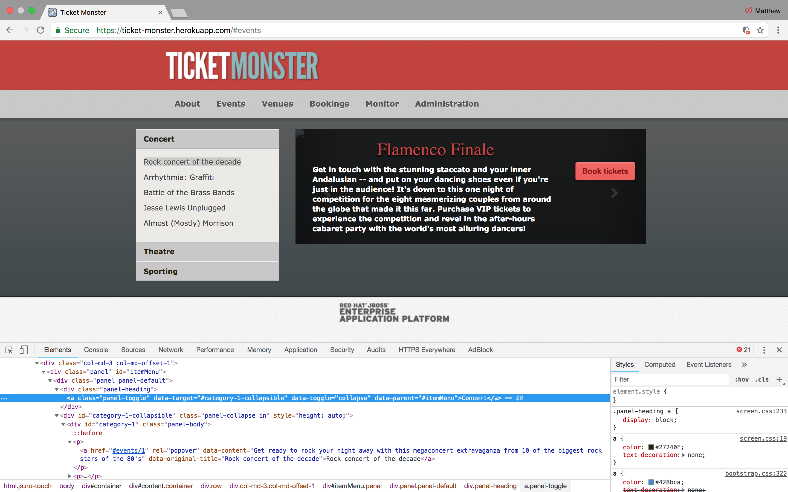

```java
automatedBrowser.clickElement("Concert", WAIT_TIME);
automatedBrowser.clickElement("Rock concert of the decade", WAIT_TIME);
```

The venue selection drop-down list has an ID of `venueSelector`, so we use this to identify it. From this list we select the `Toronto : Roy Thomson Hall` option:

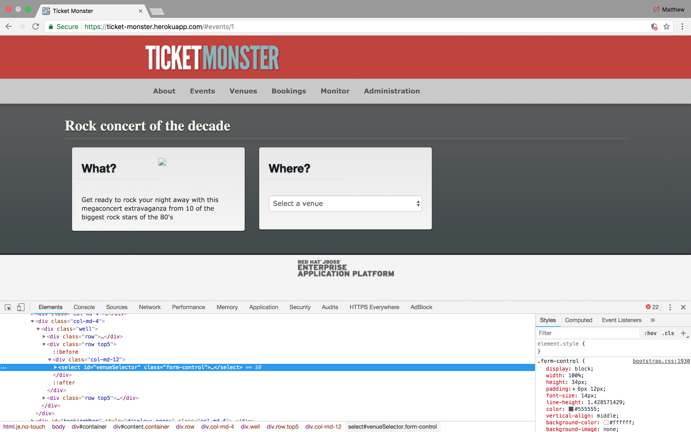

```java
automatedBrowser.selectOptionByTextFromSelect("Toronto : Roy Thomson Hall", "venueSelector", WAIT_TIME);
```

After we make a venue selection, a new panel is displayed that provides some default dates and times. We accept these defaults, and do not need to interact with the new drop-down lists.

We do need to click the `Order tickets` button. Unlike the other button like element we have been clicking, this element is an actual form button. This means we can’t use the text in the element as a way of identifying it. This element has a name of `bookButton`, and since the `By.name()` method is one of the ways `SimpleBy` identifies element, we can use this attribute to identify the button.

This step is a good example of where explicit waits are valuable, as the elements we are interacting with are dynamically displayed, and we can not assume that the element is immediately available to be clicked. Because we are using explicit waits, we can be assured that the test will only proceed when the elements are in the desired state, which in this case means that they can be clicked:

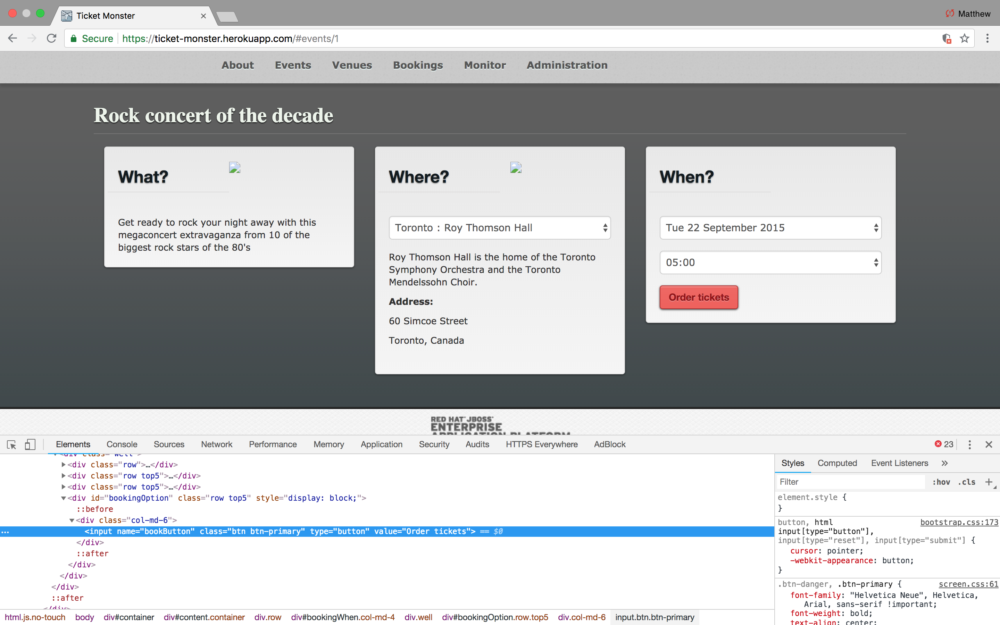

```java
automatedBrowser.clickElement("bookButton", WAIT_TIME);
```

The section is selected from a drop-down list with an ID of `sectionSelect`:

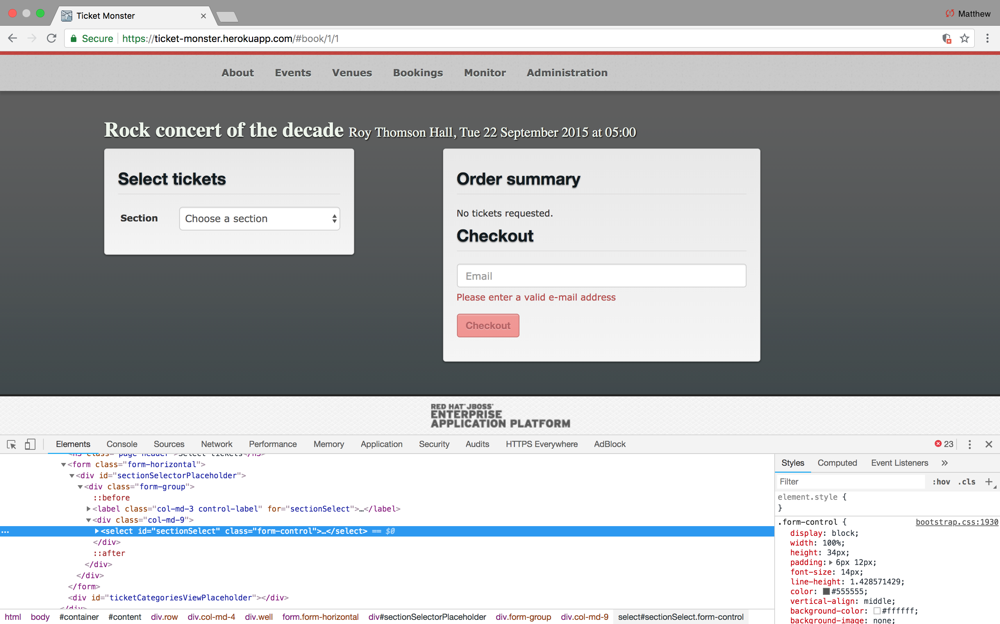

```java
automatedBrowser.selectOptionByTextFromSelect("A - Premier platinum reserve", "sectionSelect", WAIT_TIME);
```

The text box defining the number of tickets to be purchased has a `name` of `tickets-1`. We use this to identify the element, and populate it with the text `2`:

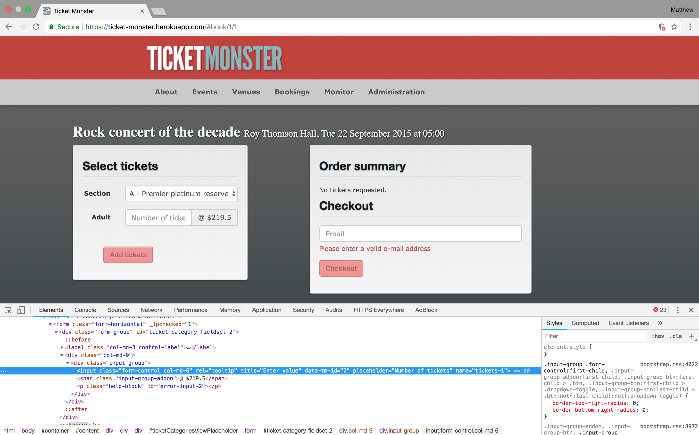

```java
automatedBrowser.populateElement("tickets-1", "2", WAIT_TIME);
```

The `Add tickets` button is another example of a form button. We use its `name` of `add` to identify and click it:

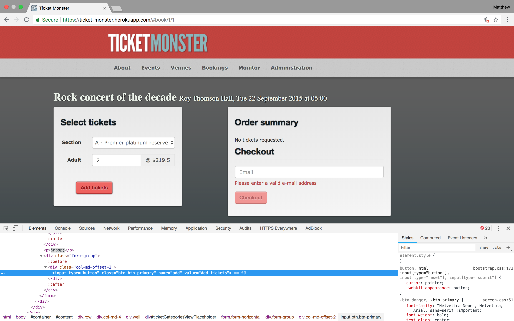

```java
automatedBrowser.clickElement("add", WAIT_TIME);
```

The email text box has a ID of `email`, which we use to identify it and populate it with the dummy email address `email@example.org`:

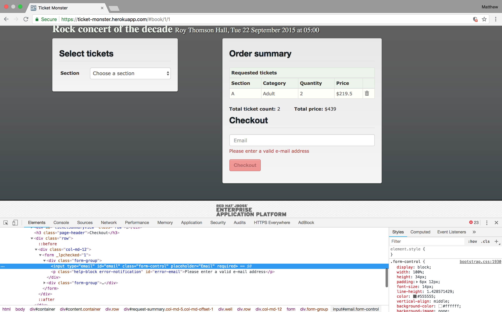

```java
automatedBrowser.populateElement("email", "email@example.org", WAIT_TIME);
```

The `Checkout` button is yet another form button. It has a `name` of `submit`:

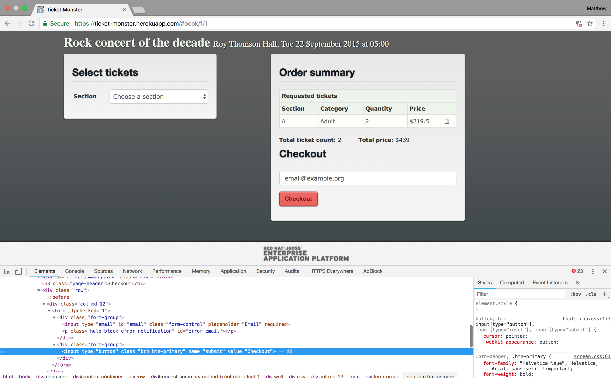

```java
automatedBrowser.clickElement("submit", WAIT_TIME);
```

On the final screen we don’t interact with any elements, but instead, we capture the text to validate that it matches our expectations.

The text we are interested in is found in a number of paragraph, or `<p>`, elements. We can see from the developer tools window that these elements don’t have any useful attributes we can use to identify them. In fact, they don’t have any attributes at all.

In these situations you have to use either an XPath or a CSS selector to identify the elements. Because CSS selectors tend to be more familiar to web developers, this is the style that we will use:

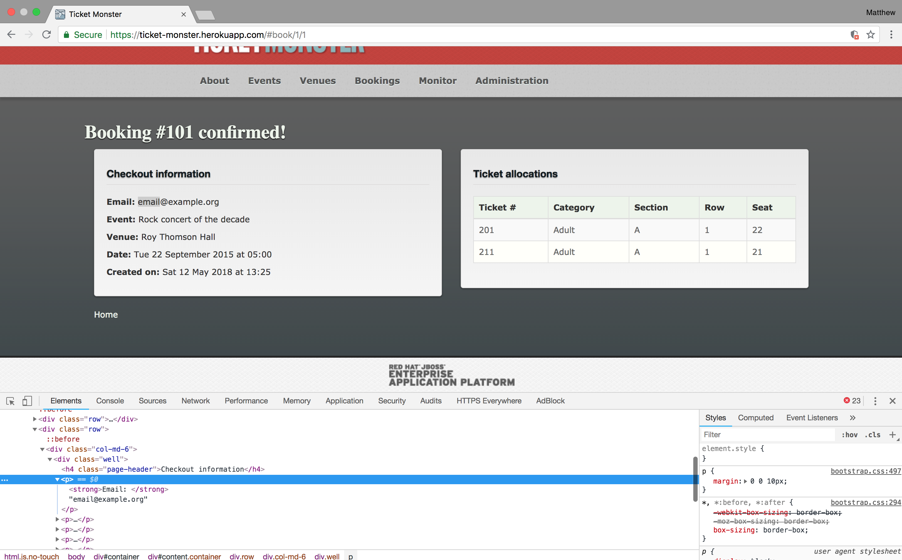

Right clicking on the element and selecting {{Copy,Copy selector}} to let Chrome generate a CSS selector that uniquely identities the element:

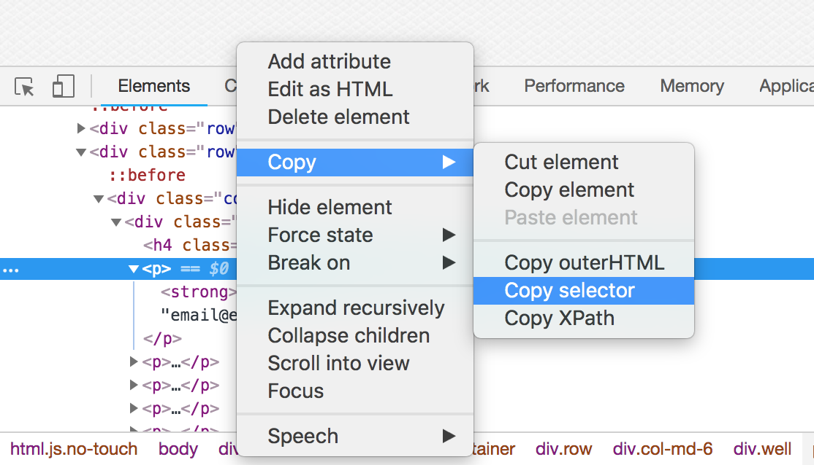

In this case, the element holding the email address can be found with the CSS selector `div.col-md-6:nth-child(1) > div:nth-child(1) > p:nth-child(2)`. We use this to identify the element and get its text content, which is then checked to ensure that it does hold the email address we entered earlier:

```java
final String email = automatedBrowser.getTextFromElement("div.col-md-6:nth-child(1) > div:nth-child(1) > p:nth-child(2)", WAIT_TIME);
Assert.assertTrue(email.contains("email@example.org"));
```

We follow the same process for identifying the paragraphs holding the venue and event and to verify the text those elements hold:

```java
final String event = automatedBrowser.getTextFromElement("div.col-md-6:nth-child(1) > div:nth-child(1) > p:nth-child(3)", WAIT_TIME);
Assert.assertTrue(event.contains("Rock concert of the decade"));

final String venue = automatedBrowser.getTextFromElement("div.col-md-6:nth-child(1) > div:nth-child(1) > p:nth-child(4)", WAIT_TIME);
Assert.assertTrue(venue.contains("Roy Thomson Hall"));
```

The test is then finished, and resources are cleaned up in the `finally` block:

```java
  } finally {
      automatedBrowser.destroy();
    }
}
```

In testing a real world application like TicketMonster, we can observe three important aspects of writing WebDriver tests.

The first is that dynamic elements are everywhere in today’s web applications. Whether these are elements that we need to interact with after a new page is loaded, or they are elements that are being manipulated by JavaScript, testing modern web applications means dealing with elements that are not always immediately available.

Second, we have seen in this test just how rare it is to have unique IDs for the elements we want to interact with. Quite often we had to rely on the `name` attribute, and we even had to use CSS selectors to identify some paragraph elements for our final validations.

Third, we saw that just because two elements look the same on the screen, they can be based on completely different HTML elements. In TicketMonster, links using the `<a>` element and form buttons using the `<input>` element are visually identical. But these two elements have an impact on how we can write the tests. Namely, that links can be identified by their text content, and form buttons can not.

To run the test locally click the green icon next to the test, and select the `Run purchaseTickets()` option:

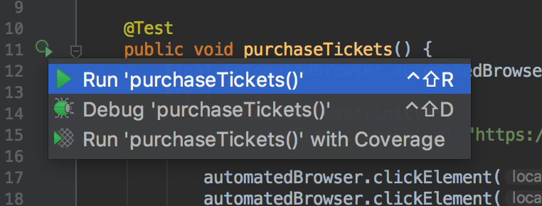

You will see Chrome open up, complete the purchase, and then the test will pass and finish:

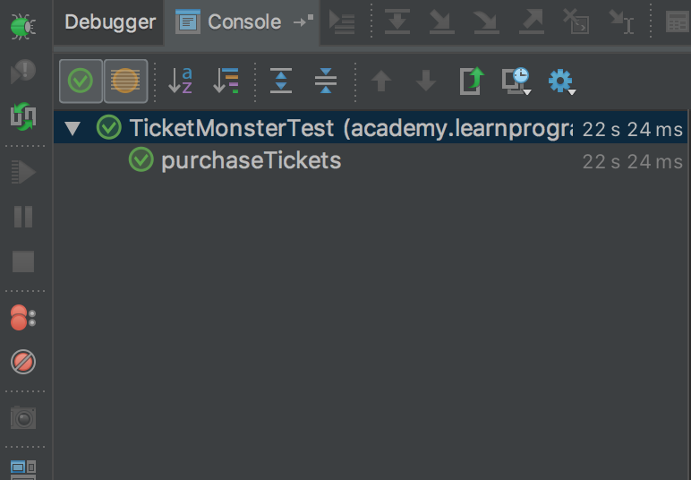

This is a good opportunity to push the code changes to GitHub. Right click the root project directory and select {{Git,Commit directory...}};

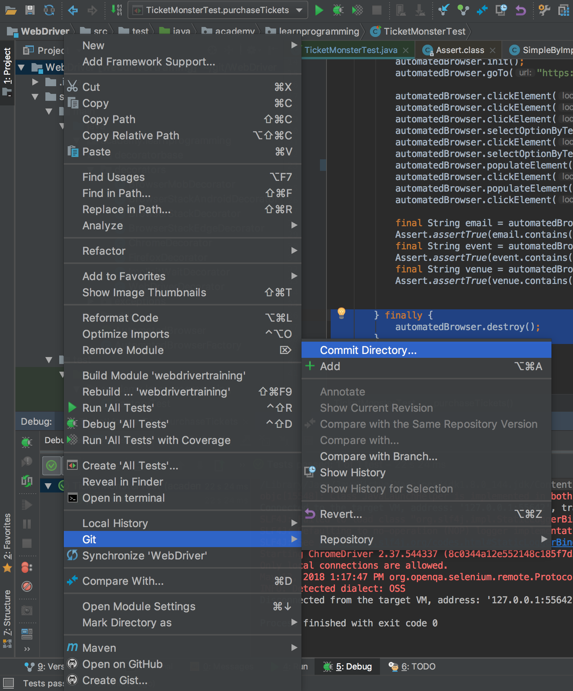

Enter a commit message, and click `Commit and Push`:

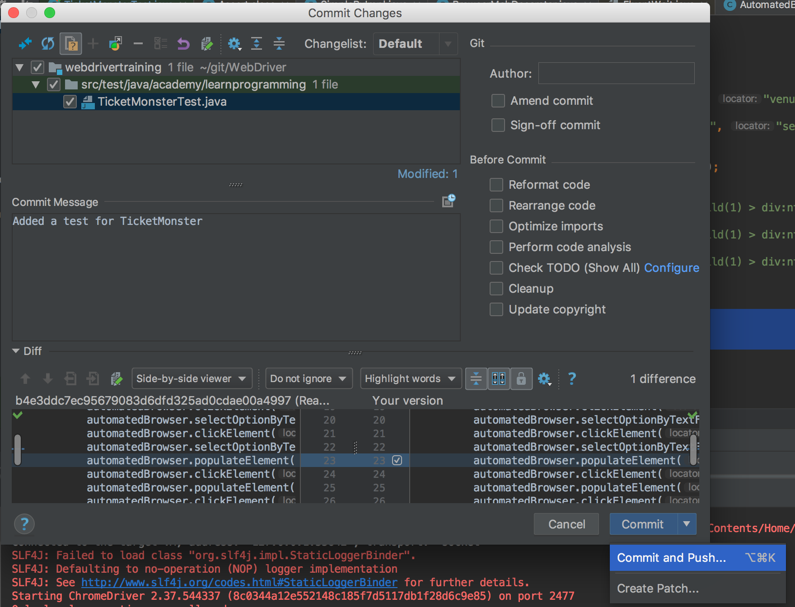

Then click the `Push` button to update the GitHub repository:

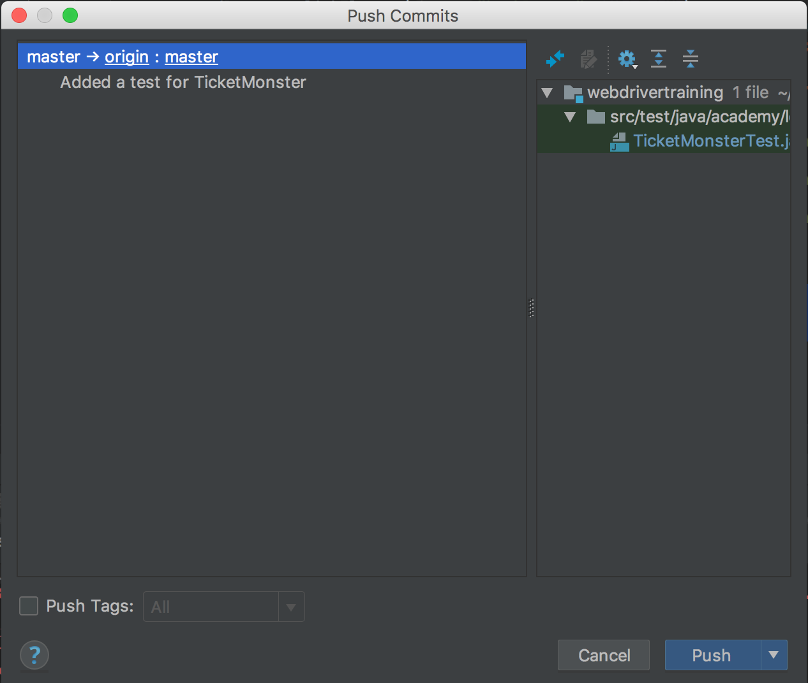

In a few moments, Travis CI will detect the changes and run the tests. In the logs you will see the new test being executed:

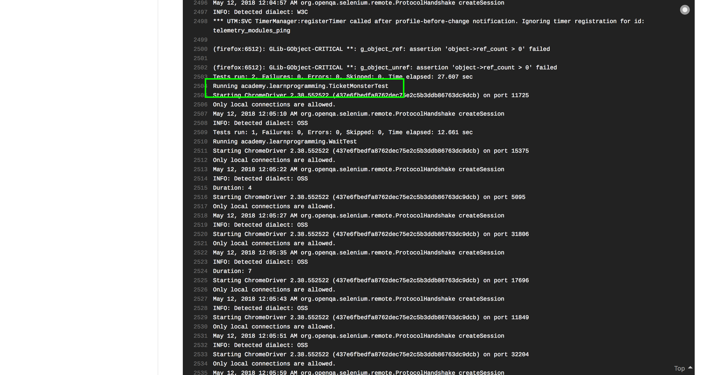

This cycle of writing code, adding tests, checking-in the changes and having a central server build the code, run the tests, and record the results is crucial to the idea of continuous integration. If you are part of a team, the current state of the code base can be quickly determined by whether or not the Travis CI build is passing, and because we are running tests with each check-in, we can have a high degree of confidence that a passing build represents a code base that is valid and can be deployed.

If you have a keen eye, you may have noticed some of the images didn’t load correctly when the tickets were purchased. This can happen if the site hosting the placeholder images is experiencing performance issues. As you can see in the screenshot below, the event and location images have not loaded correctly.


Issues like this should be considered a bug and is something we can detect as part of our test. Let’s update the test to capture a HAR file, which we implemented when we added support for the BrowserMob proxy:

```java
@Test
public void purchaseTickets() {

  final AutomatedBrowser automatedBrowser =
  AUTOMATED_BROWSER_FACTORY.getAutomatedBrowser("ChromeNoImplicitWait");

  try {

    automatedBrowser.init();

    automatedBrowser.captureHarFile();

    automatedBrowser.goTo("https://ticket-monster.herokuapp.com");

    automatedBrowser.clickElement("Buy tickets now", WAIT_TIME);

    automatedBrowser.clickElement("Concert", WAIT_TIME);

    automatedBrowser.clickElement("Rock concert of the decade", WAIT_TIME);

    automatedBrowser.selectOptionByTextFromSelect("Toronto : Roy Thomson Hall", "venueSelector", WAIT_TIME);

    automatedBrowser.clickElement("bookButton", WAIT_TIME);

    automatedBrowser.selectOptionByTextFromSelect("A - Premier platinum reserve", "sectionSelect", WAIT_TIME);

    automatedBrowser.populateElement("tickets-1", "2", WAIT_TIME);

    automatedBrowser.clickElement("add", WAIT_TIME);

    automatedBrowser.populateElement("email", "email@example.org", WAIT_TIME);

    automatedBrowser.clickElement("submit", WAIT_TIME);

    final String email = automatedBrowser.getTextFromElement("div.col-md-6:nth-child(1) > div:nth-child(1) > p:nth-child(2)", WAIT_TIME);
    Assert.assertTrue(email.contains("email@example.org"));

    final String event = automatedBrowser.getTextFromElement("div.col-md-6:nth-child(1) > div:nth-child(1) > p:nth-child(3)", WAIT_TIME);
    Assert.assertTrue(event.contains("Rock concert of the decade"));

    final String venue = automatedBrowser.getTextFromElement("div.col-md-6:nth-child(1) > div:nth-child(1) > p:nth-child(4)", WAIT_TIME);
    Assert.assertTrue(venue.contains("Roy Thomson Hall"));
  } finally {
    try {
      automatedBrowser.saveHarFile("ticketmonster.har");
    } finally {
      automatedBrowser.destroy();
    }
  }
}
```

We can then load the resulting HAR file into [HAR Analyzer](https://toolbox.googleapps.com/apps/har_analyzer/) and look for network errors by filtering the HTTP response codes to 0, 4xx, and 5xx. Responses in these ranges indicate an error.

Sure enough, we see some requests for images have a response code of `0`, meaning they did not complete successfully. So even though our test successfully completed the process of purchasing tickets, the HAR file can be used to identify other issues that may impact the user experience:

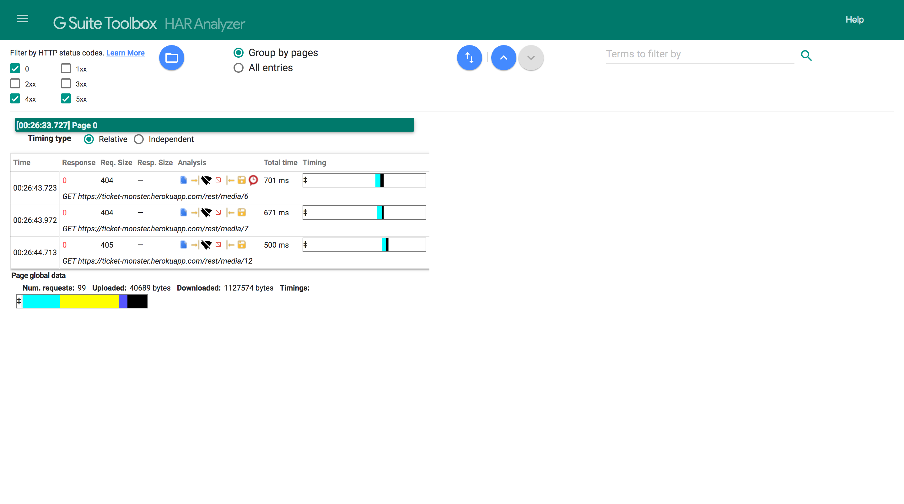

This test of TicketMonster represents a real world example of how you can write end to end tests using WebDriver. The library we have created makes it quite easy to interact with the web application; however, having a test that directly lists every click, select and populate operation is quite low level. In the next post, we’ll look at a design pattern that abstracts away the interactions with a web application to produce more reusable and maintainable code.

This post is part of a series about [creating a Selenium WebDriver test framework](../0-toc/webdriver-toc.md).
