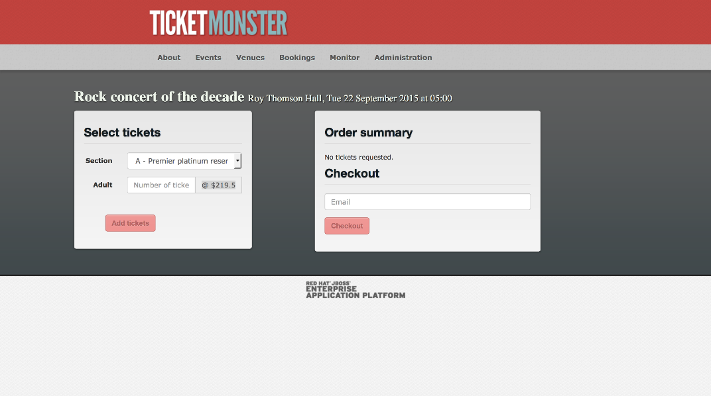

Return to the [table of contents](../0-toc/webdriver-toc.md). 

Now that we have rewritten our tests to use the POM design pattern, let's go ahead and add the second test that we alluded to earlier of verifying the prices for different sections.

For this test we need to get to the checkout screen, but not actually
proceed with the checkout. Instead we want to loop over each of the
section options and get the ticket prices for them.



To support this new test we need to add some additional methods to the `CheckoutPage` class:

```java
public class CheckoutPage extends BasePage {
  private static final Pattern TICKET_PRICE_REGEX = Pattern.compile("@ \\$(\\d+\\.\\d+)");
  private static final String ADULT_TICKET_PRICE = ".input-group-addon";

  // ...

  public CheckoutPage selectSection(final String section) {
      automatedBrowser.selectOptionByTextFromSelect(section, SECTION_DROP_DOWN_LIST, WAIT_TIME);
      return this;
  }

  public float getSectionAdultPrices() {
      final String price = automatedBrowser.getTextFromElement(ADULT_TICKET_PRICE);
      return getPriceFromTicketPriceString(price);
  }

  // ...

  private float getPriceFromTicketPriceString(final String input) {
    final Matcher matcher = TICKET_PRICE_REGEX.matcher(input);
    if (matcher.matches()) {
      final String priceString = matcher.group(1);
      return Float.parseFloat(priceString);
    }

    throw new IllegalArgumentException("String " + input + " does not match the regex");
  }
}
```

First we define a regular expression `Pattern` that matches the price strings displayed by the application. The prices are displayed as strings like `@ $219.5`, `@ $149.5` (the missing zero on the end is probably a bug in Ticketmonster, but we'll ignore that for now). We want to be able to isolate the dollar amount from the at and dollar symbols, so we capture that part of the string in a group:

```java
private static final Pattern TICKET_PRICE_REGEX = Pattern.compile("@ \\$(\\d+\\.\\d+)");
```

The new method `selectSection()` allows us to select an event section from the drop down list. This will update the element that displays the ticket price.

```java
public CheckoutPage selectSection(final String section) {
  automatedBrowser.selectOptionByTextFromSelect(section, SECTION_DROP_DOWN_LIST, WAIT_TIME);
  return this;
}
```

The new `getSectionAdultPrices()` method first gets the raw text from the element that displays the price. This raw text looks like `@ $219.5` or `@ $149.5`.

It then passes that text to the method `getPriceFromTicketPriceString()`, which will convert it into a `float` value:

```java
public float getSectionAdultPrices() {
  final String price = automatedBrowser.getTextFromElement(ADULT_TICKET_PRICE);
  return getPriceFromTicketPriceString(price);
}
```

The final addition is the `getPriceFromTicketPriceString()` method. This method exists to support the `getSectionAdultPrices()` method, so it is `private`.

In this method we attempt to match the input to the regular expression `Pattern` that was defined earlier. If the match was successful, we extract group 1, which will contain strings like `219.5` or `149.5`. These strings are then converted to `float` values and returned.

If the input did not match the regular expression, an exception is thrown:

```java
  private float getPriceFromTicketPriceString(String input) {
    final Matcher matcher = TICKET_PRICE_REGEX.matcher(input);
    if (matcher.matches()) {
      final String priceString = matcher.group(1);
      return Float.parseFloat(priceString);
  }

  throw new IllegalArgumentException("String " + input + " does not match the regex");
}
```

With these changes to `CheckoutPage` in place we can now write the test:

```java
@Test
public void verifyPricesPageObjectModel() {

  final AutomatedBrowser automatedBrowser =
    AUTOMATED_BROWSER_FACTORY.getAutomatedBrowser("ChromeNoImplicitWait");

  try {
    automatedBrowser.init();

    final EventsPage eventsPage = new MainPage(automatedBrowser)
      .openPage()
      .buyTickets();

    final VenuePage venuePage = eventsPage
      .selectEvent("Theatre", "Shane's Sock Puppets");

    final CheckoutPage checkoutPage = venuePage
      .selectVenue("Toronto : Roy Thomson Hall")
      .book();

    checkoutPage.selectSection("A - Premier platinum reserve");

    final float platinumAdultPrices = checkoutPage.getSectionAdultPrices();
    Assert.assertTrue(platinumAdultPrices > 10);
    Assert.assertTrue(platinumAdultPrices < 1000);

    checkoutPage.selectSection("B - Premier gold reserve");

    final float goldAdultPrices = checkoutPage.getSectionAdultPrices();
    Assert.assertTrue(goldAdultPrices > 10);
    Assert.assertTrue(goldAdultPrices < 1000);

    checkoutPage.selectSection("C - Premier silver reserve");

    final float silverAdultPrices = checkoutPage.getSectionAdultPrices();
    Assert.assertTrue(silverAdultPrices > 10);
    Assert.assertTrue(silverAdultPrices < 1000);

    checkoutPage.selectSection("D - General");

    final float generalAdultPrices = checkoutPage.getSectionAdultPrices();
    Assert.assertTrue(generalAdultPrices > 10);
    Assert.assertTrue(generalAdultPrices < 1000);
  } finally {
    automatedBrowser.destroy();
  }
}
```

To get the web application to the point where the ticket prices can be found, we reuse the `MainPage`, `EventsPage` and `VenuePage` POM classes. The code here is almost identical to the previous test, but in this example though we have chosen a different event called `Shane's Sock Puppets`:

```java
@Test
public void verifyPricesPageObjectModel() {
final AutomatedBrowser automatedBrowser =
  AUTOMATED_BROWSER_FACTORY.getAutomatedBrowser("ChromeNoImplicitWait");

try {

  automatedBrowser.init();

  final EventsPage eventsPage = new MainPage(automatedBrowser)
    .openPage()
    .buyTickets();

  final VenuePage venuePage = eventsPage
    .selectEvent("Theatre", "Shane's Sock Puppets");

  final CheckoutPage checkoutPage = venuePage
    .selectVenue("Toronto : Roy Thomson Hall")
    .book();
```

Now we start cycling through the sections to get their ticket prices.

We make a call to `selectSection()` to change the currently selected section. A call to `getSectionAdultPrices()` then gets the displayed ticket price as a `float`. The two `Assert` statements then verify that the price is between a lower and upper bound.

```java
checkoutPage.selectSection("A - Premier platinum reserve");

final float platinumAdultPrices = checkoutPage.getSectionAdultPrices();

Assert.assertTrue(platinumAdultPrices > 10);
Assert.assertTrue(platinumAdultPrices < 1000);
```

These checks are repeated for the other 3 sections.

```java
checkoutPage.selectSection("B - Premier gold reserve");

final float goldAdultPrices = checkoutPage.getSectionAdultPrices();

Assert.assertTrue(goldAdultPrices > 10);
Assert.assertTrue(goldAdultPrices < 1000);

checkoutPage.selectSection("C - Premier silver reserve");

final float silverAdultPrices = checkoutPage.getSectionAdultPrices();

Assert.assertTrue(silverAdultPrices > 10);
Assert.assertTrue(silverAdultPrices < 1000);

checkoutPage.selectSection("D - General");

final float generalAdultPrices = checkoutPage.getSectionAdultPrices();

Assert.assertTrue(generalAdultPrices > 10);
Assert.assertTrue(generalAdultPrices < 1000);
```

We then finish the test cleaning up resources in the `finally` block.

```java
  } finally {
    automatedBrowser.destroy();
    }
}
```

The public API we have created with the POM classes `MainPage`, `EventsPage` and `VenuePage` made writing this test quick and easy. Most of the logic required to get the web application to the point of displaying the ticket prices was already implemented, leaving us with just a few new methods to add to the `CheckoutPage` class.

This is the power of the POM design pattern. It encapsulates implementation details into Java objects, leaving tests free to describe what they are testing rather than how it is tested. And should TicketMonster be updated in future with new element IDs, name attributes or rearranged screens, we have one central and reused API where the updates can be made rather than multiple tests with copy and paste code.

Return to the [table of contents](../0-toc/webdriver-toc.md).
