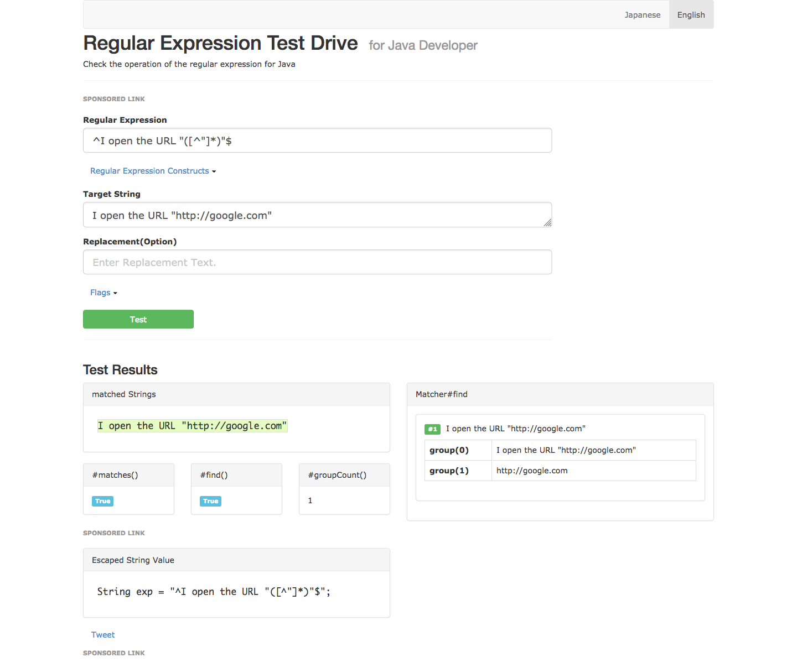
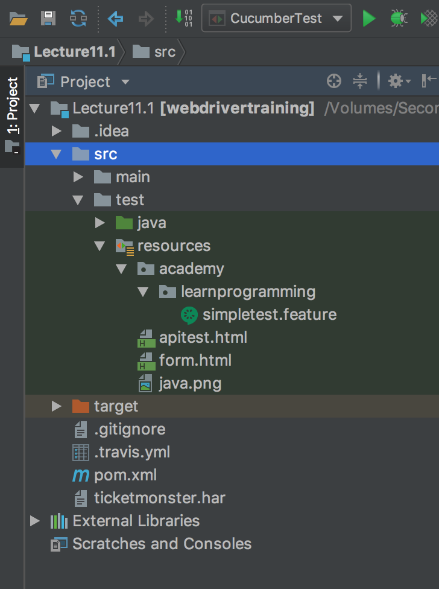
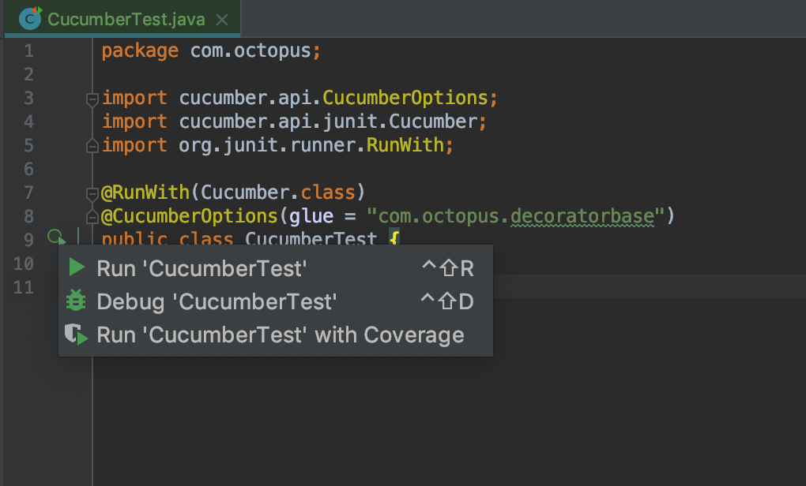
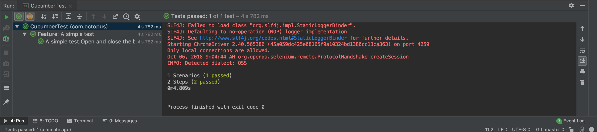

All of our code so far has been written in Java, and we have implemented design patterns like Page Object Model to increase the readability and maintainability of our code.

But, at the end of the day, this code is still written in Java, and few of the stakeholders who are interested in designing, testing and maintaining web applications will be Java experts. This means that no matter how clean and well designed our code is, it will never be something that non-developers can read and understand.

Integrating the Cucumber library is one solution to make testing more approachable for non-developers. We can use the Cucumber library as the glue between our Java code and a language called Gherkin, which we'll do in this post.

## The Gherkin Language
The Gherkin language has been designed to provide a natural dialect that describes the requirements, behaviors and interactions with a system. Gherkin uses a convention where all steps start with the words `Given`, `When`, `Then` and `And`. An example of this would be the steps:

```
Given an employee named Bob making $12 per hour.
When Bob works 40 hours in one week;
Then Bob will be paid $480 on Friday evening.
```

This style is very readable, even without any special understanding of the Gherkin language.

We want to take this ability to describe a system using natural language and apply it to WebDriver tests. This would allow us to write tests like:

```
Given I open the URL "https://ticket-monster.herokuapp.com"
When I click the "Buy tickets now" button
And I click the "Concert" link
And I click the "Rock concert of the decade" link
And I select the option "Toronto : Roy Thomson Hall" from the "Venues" drop down list
And I click the "Book" button
And I select the option "A - Premier platinum reserve" from the "Sections" drop down list
Then I verify the text from the "Adult Price" label equals "@ $167.75"
```

These steps test a very similar scenario to those we have been testing in Java. Unlike Java code though, anyone can read this test and understand what it means. Better yet, with just a small amount of training anyone can write these tests as well.

To start we need to add two dependencies: `cucumber-java` and
`cucumber-junit`. The `cucumber-java` library provides a number of annotations we will use to link Gherkin steps to Java methods. The `cucumber-junit` library allows us to execute Gherkin features and scenarios as part of a JUnit test. We'll learn more about features and scenarios later on when we start writing the tests.

```xml
<project xmlns="http://maven.apache.org/POM/4.0.0"
xmlns:xsi="http://www.w3.org/2001/XMLSchema-instance"
xsi:schemaLocation="http://maven.apache.org/POM/4.0.0
http://maven.apache.org/xsd/maven-4.0.0.xsd">
  <modelVersion>4.0.0</modelVersion>

  <!-- ... -->

  <properties>
    <!-- ... -->
    <cucumber.version>2.3.1</cucumber.version>
  </properties>

  <!-- ... -->

  <dependencies>
    <!-- ... -->
    <dependency>
      <groupId>io.cucumber</groupId>
      <artifactId>cucumber-java</artifactId>
      <version>${cucumber.version}</version>
    </dependency>
    <dependency>
      <groupId>io.cucumber</groupId>
      <artifactId>cucumber-junit</artifactId>
      <version>${cucumber.version}</version>
      <scope>test</scope>
    </dependency>
  </dependencies>
</project>
```

Cucumber works by attaching annotations to methods to match Gherkin steps to regular expressions, and then match the groups from those regular expression to parameters on the method.

The annotations are called `@Given`, `@When`, `@And` and `@Then`. As with the Gherkin language itself, these annotations are interchangeable, and there is no requirement to match the annotation to the corresponding prefix used in a Gherkin step.

For example, we may annotate a method to open up a given URL with the `@And` annotation:

```java
@And("^I open the URL \"([^\"]*)\"$")
public void goTo(String url) {

}
```

But then reference it in a Gherkin step with the step prefix `Given`, like so:

```
Given I open the URL "http://google.com"
```

Let's break the regular expression assigned to the annotation down.

| Pattern | Pattern	Meaning |
|-|-|
| `^` |	Match the start of the string |
| `I open the URL \"` |	Matches the literal string `I open the URL "` |
| `(` |	Start a capture group |
| `[^"]*` |	Match any character except the double quote zero or more times |
| `)` |	End a capture group|
| `\"` |	Match the literal string `"` |
| `$` |	Match the end of the string |


To understand these regular expressions we can use an online tool like [http://regex-testdrive.com/en/](http://regex-testdrive.com/en/). Here we have entered the regular expression and a target string that we want to match to the regular expression. Clicking the `Test` button then shows us the results of this
match.

You can see that this match returned two groups. Group 0 in a regular expression always returns the complete string that was matched, which in our case is the full sentence `I open the URL "http://google.com"`. Group 1 returns only the characters that were between the parentheses, which in this case was the URL [http://google.com](http://google.com).



These regular expression groups are how Cucumber extracts data from a string and passes it to the associated method. In our case the method takes a single string parameter. Cucumber will pass the value of group 1 to this first parameter.

So our task is to add the annotations `@Given`, `@When`, `@And` and `@Then` to methods that will perform some useful work. The regular expressions assigned to the annotations define the Gherkin dialect that we can use to write tests with.

There are some important considerations when selecting a class to apply these annotations to.

The first is that the annotations must be placed on concrete methods. This means we can not apply the annotations to methods defined in an interface.

The second is that the class that the annotations are applied to can not be extended. Cucumber does not support inheritance of classes that have the annotations attached to them.

The third is that when executing a method with a Cucumber annotation, Cucumber will manage the life-cycle of the class containing the method. This means that factories like `AutomatedBrowserFactory` will be bypassed when creating new instances of classes.

This leaves us in something of a bind. Given these restrictions, where can we apply the annotations?

We can't place the annotations on the `AutomatedBrowser` interface, because we need to add the annotations to a concrete class.

At first glance we might be able to place the annotations on the `WebDriverDecorator` class, as this is where the majority of our functionality is defined. However decorators are only useful when they are built in specific combinations. We have used the `AutomatedBrowserFactory` class to build these decorator combinations for us, but because Cucumber will take control of the lifecycle of annotated classes, it will bypass `AutomatedBrowserFactory` making our decorators useless.

The only other option is the `AutomatedBrowserBase` class, but this has been inherited by every decorator class, which is not supported by Cucumber.

Fortunately, there is a work around to the limitation Cucumber places on extending classes with annotations. You may have noticed that we placed the `AutomatedBrowserBase` class alone in its own package called `com.octopus.decoratorbase`. It may have seemed odd to have a package for a single class, but this was done quite deliberately. By isolating the `AutomatedBrowserBase` class in a package away from all the decorator classes that extend it, we can work around Cucumber's limitations.

To see how this workaround works, let's start by creating a test class that makes use of the code we included with the `cucumber-junit` Maven dependency.

```java
package com.octopus;

import cucumber.api.CucumberOptions;
import cucumber.api.junit.Cucumber;
import org.junit.runner.RunWith;

@RunWith(Cucumber.class)
@CucumberOptions(glue = "com.octopus.decoratorbase")
public class CucumberTest {

}
```

This test class has two annotations that integrate it with the Cucumber library.

The first is the `@RunWith` annotation. This JUnit annotation accepts a class that can be used to modify how the test is run. In this case the Cucumber class modifies the test to look for any `*.feature` files in the
same package as the test class and execute them:

```java
@RunWith(Cucumber.class)
```

The second annotation is `@CucumberOptions`. This annotation is used to customize how Cucumber will run the `*.feature` files it finds. Here we have passed the package `com.octopus.decoratorbase` as containing "glue" classes. Glue classes are simply classes with the annotations `@Given`, `@When`, `@And` or `@Then`.

Cucumber will catalogue the classes in this package, as well as any sub-packages. Glue classes found in and underneath this package must not extend one another.

What this means is that because the `AutomatedBrowserBase` class is the only class found in this package, Cucumber is satisfied that no illegal class hierarchies exist. It doesn't matter that all the decorator classes under the `com.octopus.decorators` package extend the `AutomatedBrowserBase` class, because Cucumber is unaware of these decorator classes.

So by isolating the `AutomatedBrowserBase` class in its own package, we can then use it as a Cucumber glue class:

```java
@CucumberOptions(glue = "com.octopus.decoratorbase")
```

Other than these two annotations, the `CucumberTest` class is expected to be empty. Unlike traditional JUnit test classes, where the tests are defined in methods, all Cucumber tests are defined in external `*.feature` files.

Because the methods in the `AutomatedBrowserBase` class are the only way a Gherkin test can execute a test, we need to expose some methods to create and destroy `AutomatedBrowser` instances. Normally we would perform this logic as part of a JUnit test by calling `AutomatedBrowserFactory.getAutomatedBrowser() `at the start of the test and `automatedBrowser.destroy()` at the end. To expose this functionality to Cucumber, we create the methods `openBrowser()` and `closeBrowser()`:

```java
public class AutomatedBrowserBase implements AutomatedBrowser {

  static private final AutomatedBrowserFactory AUTOMATED_BROWSER_FACTORY
    = new AutomatedBrowserFactory();

  // ...

  @Given("^I open the browser \"([^\"]*)\"$")
  public void openBrowser(String browser) {
    automatedBrowser =
      AUTOMATED_BROWSER_FACTORY.getAutomatedBrowser(browser);
    automatedBrowser.init();
  }

  @Given("^I close the browser$")
  public void closeBrowser() {
    if (automatedBrowser != null) {
      automatedBrowser.destroy();
      automatedBrowser = null;
  }
}

// ...

}
```

Let's take a look at these two methods in more detail:

```java
@Given("^I open the browser \"([^\"]*)\"$")
```

The annotation `@Given("^I open the browser \"([^\"]*)\"$")` attached to the `openBrowser()` method works the same way as the previous example of `@And("^I open the URL \"([^\"]*)\"$")`. The annotations `@Given` and `@And` are interchangeable. Typically `@Given` is used on methods that perform some kind of initialization or management functionality, but this is just a convention rather than a rule.

The regular expression assigned to the `@Given` annotation follows the same pattern of using the caret (`^`) and dollar (`$`) characters to bookend the expression, a literal match of the string `I open the browser`, and a non-greedy capture group inside quotes.

The value of the capture group is then passed to the parameter called `browser`:

```java
public void openBrowser(String browser) {
```

From this point the method works like any other method. In this case we call `AutomatedBrowserFactory.getAutomatedBrowser()` to construct the specified `AutomatedBrowser` configuration, and then call the `init()` function to initialize it:

```java
automatedBrowser = AUTOMATED_BROWSER_FACTORY.getAutomatedBrowser(browser);
automatedBrowser.init();
```

The annotation `@Given("^I close the browser$")` attached to the `closeBrowser()` method has no capture groups, which means the method it is attached to has no parameters. The regular expression here can only match the literal string `I close the browser`:

```java
@Given("^I close the browser$")
public void closeBrowser() {
```

This method is then responsible for calling the `destroy()` method on the `AutomatedBrowser` instance created by the `openBrowser()` method:

```java
  if (automatedBrowser != null) {
    automatedBrowser.destroy();
    automatedBrowser = null;
  }
}
```

We now have enough to run a very simple Cucumber test. Create the following file under the `src/test/resources/com/octopus` directory called `simpletest.feature`.

The directory `src/test/resources/com/octopus` is where Maven places resources for the `com.octopus` package by default. Remember that we need to place this file in the same package as the test class for it to be found. The name of the file can be anything we want, but it must have the `.feature` extension to be recognized by Cucumber.



```gherkin
Feature: A simple test
  Scenario: Open and close the browser
    Given I open the browser "ChromeNoImplicitWait"
    Then I close the browser
```

Let's break this file down.

All Gherkin feature files start with a `Feature:` section. A feature is a group of related Scenarios.

```gherkin
Feature: A simple test
```

Next we have the `Scenario:`. A scenario is like a method in a traditional unit test class, in that it is self contained and demonstrates some aspect of the system being tested.

```gherkin
Scenario: Open and close the browser
```

Finally we have the two steps that we defined in the
`AutomatedBrowserBase` class.

Notice that the step prefixes used here don't exactly match the names of the annotations. While it would be nice if these step matched up with the annotation names, this is not a requirement.

Also notice that the regular expressions we defined do not capture the words `Given`, `When`, `Then` or `And`, even though the complete step always start with a word like this. The regular expressions we define starts by matching the content of the step after this initial word.

```gherkin
Given I open the browser "ChromeNoImplicitWait"
Then I close the browser
```

To run the test click on the icon next to the test class and select `Run 'CucumberTest'`.



Running the test will find the `simpletest.feature` file and execute it. The feature file in turn will open Chrome and then close it straight away. In the test results we can see that we successfully ran 1 Scenario, resulting in 2 steps being run.



We now have laid the foundation for creating a Gherkin dialect that will allow us to write natural language tests that can be verified using WebDriver. However we still have a lot of work to do to create end to end tests. In the next post we will expose more of the `AutomatedBrowser` class to Cucumber, and work towards creating a readable end to end test.

Return to the [table of contents](../0-toc/webdriver-toc.md).
