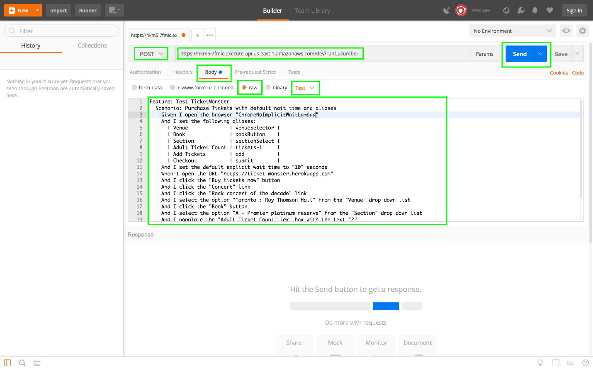
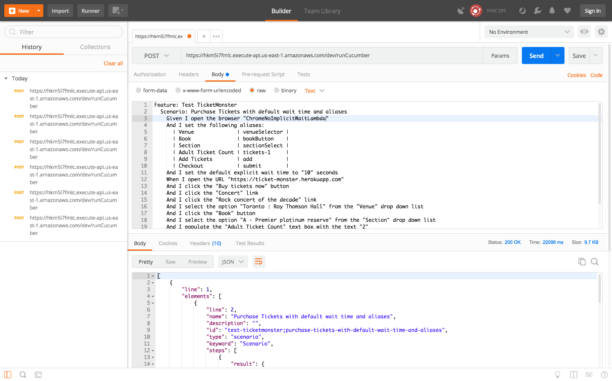
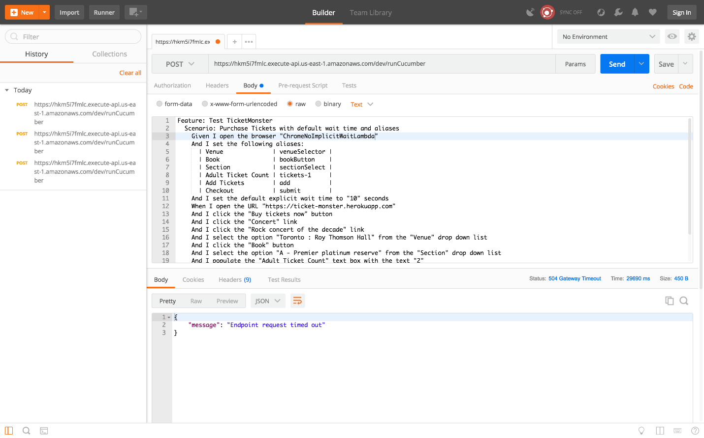
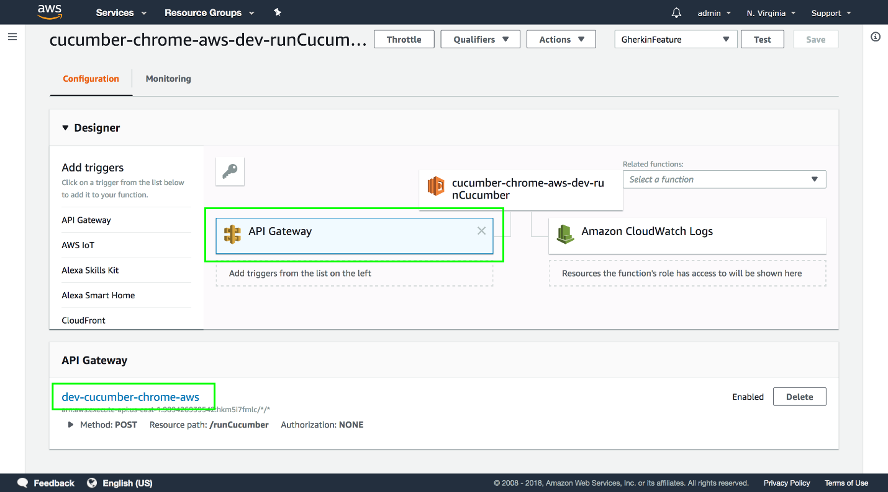
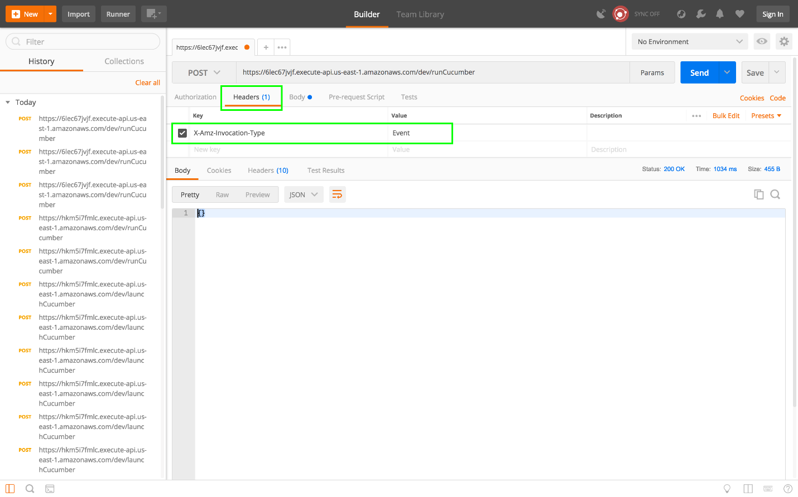

Return to the [table of contents](../0-toc/webdriver-toc.md).

We now have the ability to run Gherkin features with an AWS Lambda function. But so far we have had to trigger the tests from the AWS console. This is fine while we test that the Lambda works, but it not a very convenient way to run tests.

To allow tests to be executed without using the AWS Lambda console, we will configure a HTTP event in our Serverless configuration file. This event allows us to execute the Lambda function from a HTTP POST request, which in turn allows us to trigger tests using any standard HTTP tools or libraries.

To configure the HTTP event we update the `serverless.yml` file:

```yaml
service:
  name: cucumber-chrome-aws

provider:
  name: aws
  runtime: java8
  region: us-east-1

package:
  artifact: target/webdrivertraining-1.0-SNAPSHOT.jar

functions:
  runCucumber:
    handler: com.octopus.LambdaEntry::runCucumber
    timeout: 300
    memorySize: 512
    events:
      - http:
          method: post
          path: runCucumber
          integration: lambda
          request:
            parameters:
              headers:
                'X-Amz-Invocation-Type': true
            template:
              text/plain: "\"$util.escapeJavaScript($input.body).replaceAll(\"\\'\",\"'\")\""
          response:
            headers:
              Content-Type: "'application/json'"
            template: $util.parseJson($input.body)
```            

The new `events` section adds a `http` event. The HTTP `method` is `post`, the `path` that we can access is called `runCucumber`, and because this event triggers a Lambda function the `integration` is set to `lambda`:

```yaml
events:
  - http:
      method: post
      path: runCucumber
      integration: lambda
```

When we perform a HTTP POST, we pass in the Gherkin feature file to be run in the body of the request. But, as we saw before, Lambda functions expect all inputs to be JSON data. We worked around this requirement while testing the Lambda from the console by using a simple web page to convert plain text into a JSON string. We can achieve the same conversion here using request templates.

Here we have configured a request template that is used when a request containing `text/plain` content is made. The key `text/plain` is a Multipurpose Internet Mail Extensions (MIME) type, which is a standardized way to indicate the nature and format of a document.

```yaml
request:
  template:
    text/plain: "\"$util.escapeJavaScript($input.body).replaceAll(\"\\'\",\"'\")\""
```

The template that will process plain text requests, without the outermost quotes and the escaped quotes inside, is this:

```
"$util.escapeJavaScript($input.body).replaceAll("\'","'")"
```

The purpose of this template is the same as the web page we wrote to convert plain text into a JSON string. However, this template is written using the Velocity Template Language, which is the template library used by AWS. The logic of this template is as follows:

| Pattern |	Meaning |
|-|-|
| `"` |	Print a literal double quote |
| `$util.escapeJavaScript($input.body)` |	Take the raw text from the request held in `$input.body` (i.e. the text that was sent as the HTTP POST body), and pass to the `$util.escapeJavaScript()` function. |
| `.replaceAll("\'","'")` |	The `escapeJavaScript()` function will escape single quotes, which is not valid JSON. So replace all escaped quotes with single quotes. |
| `"` |	Print a literal double quote |

As a response, we would like to pass back the JSON returned by the Lambda function. We identify that the response returns JSON by setting the `Content-Type` header to the MIME type `application/json`.

Again we use a template to convert the response. This template takes the JSON string returned by the Lambda function, which is exposed as `$input.body`, and passes it to the `$util.parseJson()` function, which parses the JSON into an object to return to the sender:

```yaml
response:
  headers:
    Content-Type: "'application/json'"
  template: $util.parseJson($input.body)
```

With these changes to the `serverless.yml` file, we can once again republish the Lambda function with the serverless deploy command. The output of this command will be something like the following:

```
Serverless: Packaging service...
Serverless: WARNING: Function runCucumber has timeout of 300 seconds, however, it's attached to API Gateway so it's automatically limited to 30 seconds.
Serverless: Uploading CloudFormation file to S3...
Serverless: Uploading artifacts...
Serverless: Uploading service .zip file to S3 (22.67 MB)...
Serverless: Validating template...
Serverless: Updating Stack...
Serverless: Checking Stack update progress...
........................
Serverless: Stack update finished...
Service Information
service: cucumber-chrome-aws
stage: dev
region: us-east-1
stack: cucumber-chrome-aws-dev
api keys:
None
endpoints:
POST - https://hkm5i7fmlc.execute-api.us-east-1.amazonaws.com/dev/runCucumber
functions:
runCucumber: cucumber-chrome-aws-dev-runCucumber
```

Notice that the log file shows the URL of the endpoint that we can use to trigger the HTTP events. In the example above the URL [https://hkm5i7fmlc.execute-api.us-east-1.amazonaws.com/dev/runCucumber](https://hkm5i7fmlc.execute-api.us-east-1.amazonaws.com/dev/runCucumber) is what we will call with HTTP POST requests to execute a Gherkin feature.

To make a HTTP request, we'll use a tool called Postman, which you can download from [https://www.getpostman.com/](https://www.getpostman.com/). Postman provides a simple interface that we can use to craft custom HTTP requests, and in this case we will make a POST request to the URL we found above.

The screenshot below shows the important fields that need to be populated to make this POST request.

- Select `POST` from the drop down list at the top of the tab
- Enter the URL into the textbox at the top of the tab
- Select the `Body` tab
- Select the `raw` option
- Select `Text` from the content type drop down list
- Paste in the Gherkin feature into the text area at the bottom of the tab
- Click the `Send` button



If you are lucky, you might see this response.



I say lucky, because you may have seen the `Endpoint request timed out` error message instead.



So what does the `Endpoint request timed out` error message mean?

This error is a result of different limitations of the services that were implemented to provide a HTTP endpoint in front of the Lambda function.

If you open up the Lambda console and view the function, you can now see that a service called API Gateway is sitting in front of the Lambda function.



API Gateway is another AWS service that is used to build HTTP APIs, and it is the service that the serverless application built when we added HTTP events. It is API Gateway that is taking our HTTP requests, transforming them with the templates we defined, passing them to the Lambda function, transforming the response from the Lambda function, and passing the results back to the caller.

However, while a Lambda function can run for up to 5 minutes, a request made through the API Gateway can only stay open for 29 seconds. These are the limits imposed by AWS on these services, and we do not have the option of extending them.

The `Endpoint request timed out` error message is generated by the API Gateway when the Lambda function it called took longer than 29 seconds to complete.

This is something of a problem for us, as we are unlikely to write WebDriver tests that can reliably complete in 29 seconds. Usually we are writing tests that complete entire journeys through a web application, and these can take several minutes. So how can we overcome the 29 second time limit imposed by API Gateway?

The solution is to run our Lambda asynchronously. This means API Gateway initiates the Lambda, but does not wait for the return value, and instead returns an empty result to the caller straight away. This means we are no longer constrained by how long the Lambda takes to run, because it is run in the background.

To instruct API Gateway to call the Lambda asynchronously, we need to pass the `X-Amz-Invocation-Type` header with the value of `Event`.

Here is the new `serverless.yml` file:

```yaml
service:
  name: cucumber-chrome-aws

provider:
  name: aws
  runtime: java8
  region: us-east-1

package:
  artifact: target/webdrivertraining-1.0-SNAPSHOT.jar

functions:
  runCucumber:
    handler: com.octopus.LambdaEntry::runCucumber
    timeout: 300
    memorySize: 512
    events:
      - http:
          method: post
          path: runCucumber
          integration: lambda
          request:
            parameters:
              headers:
                'X-Amz-Invocation-Type': true
              template:
                text/plain: "\"$util.escapeJavaScript($input.body).replaceAll(\"\\'\",\"'\")\""
          response:
            headers:
              Content-Type: "'application/json'"
            template: $util.parseJson($input.body)
```            

The following configuration is where we define that the `X-Amz-Invocation-Type` header is required (setting the value to `true` means it is required):

```yaml
request:
  parameters:
    headers:
      'X-Amz-Invocation-Type': true
```      

Redeploy the function with serverless. Once it has been updated, add the `X-Amz-Invocation-Type` header to the HTTP request in Postman by clicking on the `Headers` tab and adding a header with the key `X-Amz-Invocation-Type` and the value `Event`. This header and value pair is how we instruct API Gateway to execute the associated Lambda function in an asynchronous manner.

:::hint
Setting the `X-Amz-Invocation-Type` header value to `RequestResponse` restores the previous default synchronous behavior, which might be useful if you are sure that your test will complete in 29 seconds.
:::

The `X-Amz-Invocation-Type` header is documented in more detail at [https://docs.aws.amazon.com/apigateway/latest/developerguide/integrating-api-with-aws-services-lambda.html.](https://docs.aws.amazon.com/apigateway/latest/developerguide/integrating-api-with-aws-services-lambda.html).



This request will return almost immediately, with an empty object as the response.

Great, we now have a way to run Gherkin scripts by making a HTTP call, and without needing to worry about the time limits of requests made through the API Gateway. But now we have no way of knowing if the tests passed or failed. Running Lambda asynchronously means we get an empty response. Since the response from the `runCucumber` function is never captured, we no longer know what the result was.

The final piece to this puzzle is to provide a way for the `runCumumber` function to return the results of the test now that it is being called in an asynchronous manner.

Return to the [table of contents](../0-toc/webdriver-toc.md).
