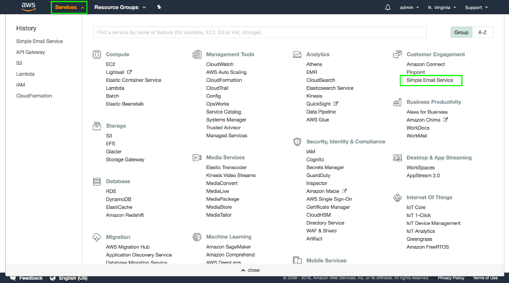
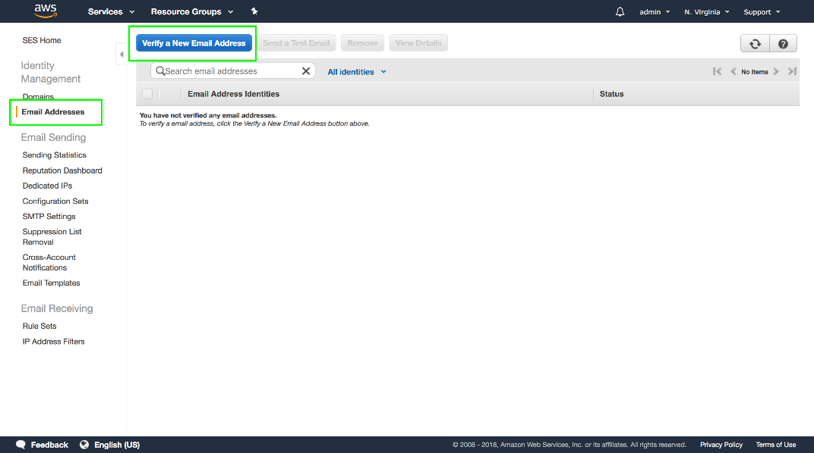
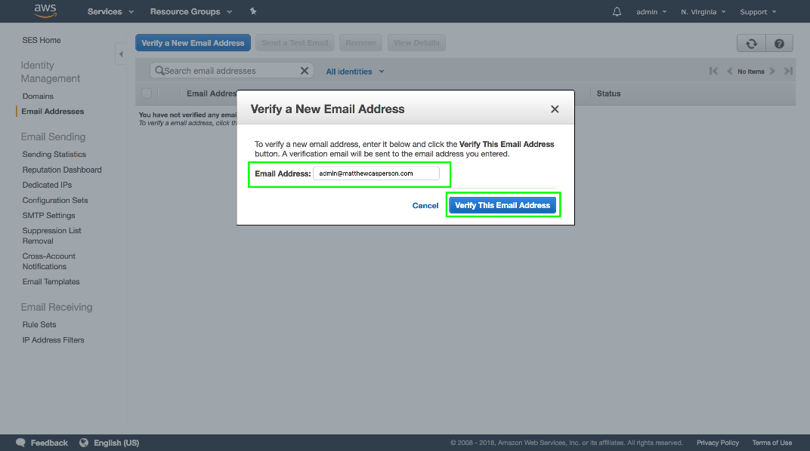
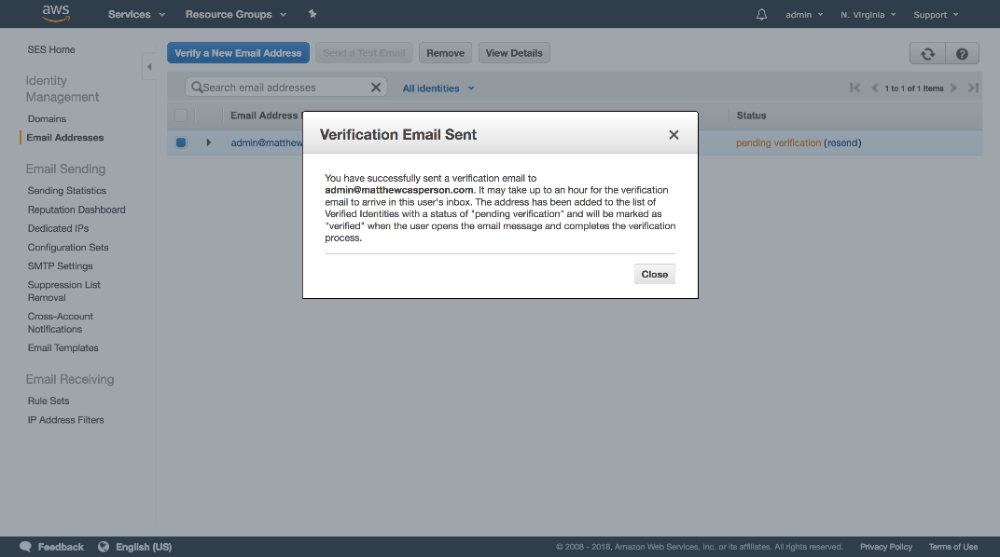
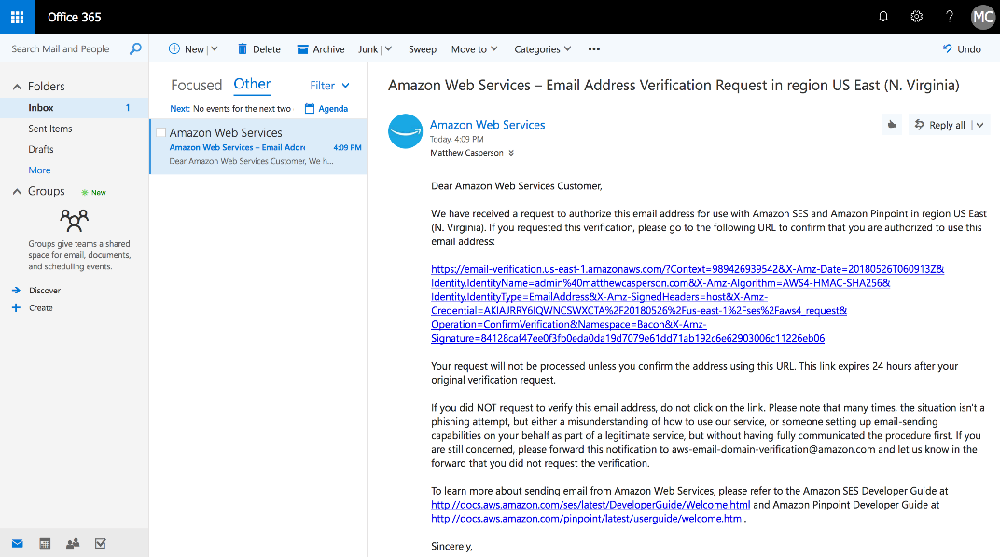
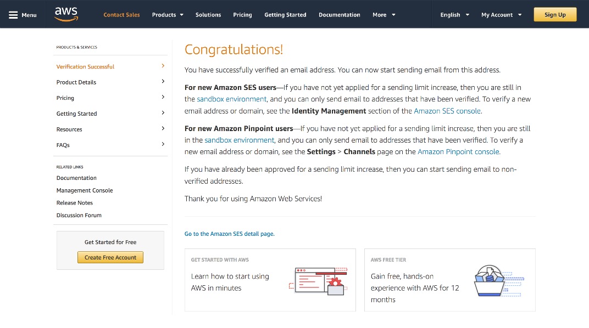
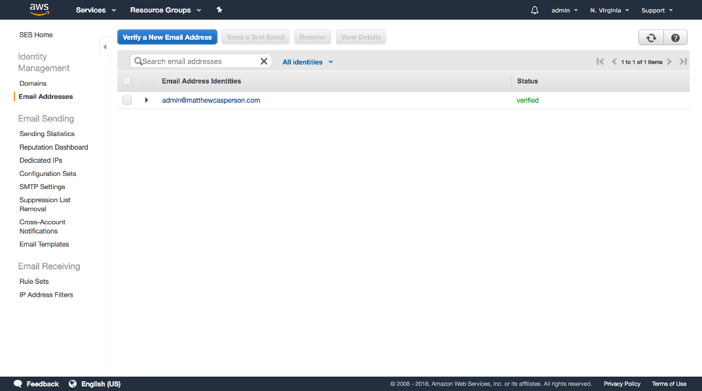
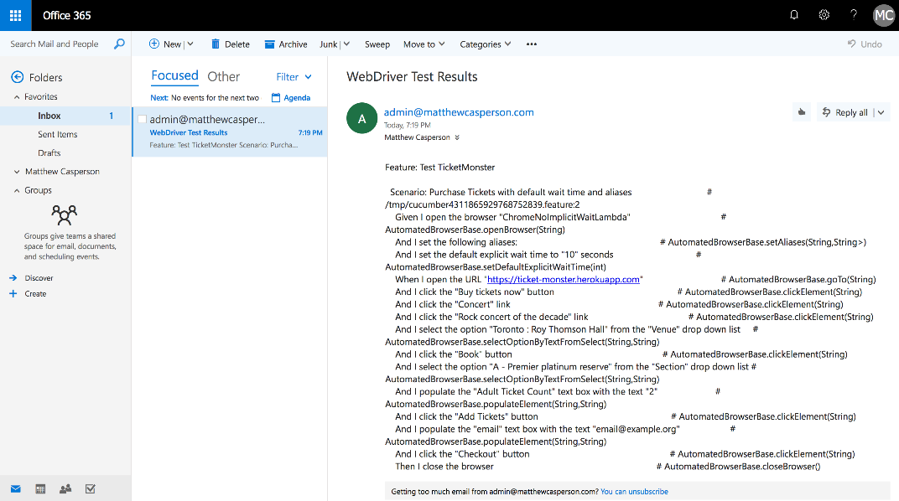

Return to the [table of contents](../0-toc/webdriver-toc.md). 

We now have the ability to run Gherkin feature files from a HTTP POST request that is forwarded to an AWS Lambda, but because of the differing time limits of API Gateway and Lambda requests, we were forced to run the tests in an asynchronous manner. This means our original HTTP requests no longer  receives the output of the test, so we need another solution for returning the test results.

An easy solution is to have the test results emailed to us when they are available. By sending an email, the `runCucumber` function can notify us of the results using a communication platform that you already have in place, freeing us from having to implement a custom solution.

The good news is that AWS provides a service for sending emails that we can tie into our Lambda functions quite easily. The service is called Simple Email Service (SES).

Before we can use SES, we need to verify the email address that we will appear to send the emails from. This verification process is one of the ways Amazon prevents SES from being used to send spam.

To open the SES console, click the `Services` link and then click the `Simple Email Service` link.



Click the `Email Addresses` link in the left hand menu, and then click the `Verify a New Email Address` button.



Enter an email address that you have access to, and click the `Verify This Email Address` button.



You will see a prompt telling you that a verification email has been sent.



The email will have a link in it that you need to open.



Clicking the link takes you to a page that tells you that the email address has been successfully verified.



Back in the SES console, we can now see that the email address has been verified. You may need to click the refresh button to update the status to verified.



Now that we have configured SES, we need to incorporate it into our code.

In the `pom.xml` file, add the `com.amazonaws:aws-java-sdk-ses` dependency. This library contains the classes we need to create and send emails with SES:

```xml
<project xmlns="http://maven.apache.org/POM/4.0.0"
xmlns:xsi="http://www.w3.org/2001/XMLSchema-instance"
xsi:schemaLocation="http://maven.apache.org/POM/4.0.0
http://maven.apache.org/xsd/maven-4.0.0.xsd">

  <modelVersion>4.0.0</modelVersion>
  <!-- ... -->
  <dependencies>
    <!-- ... -->
    <dependency>
      <groupId>com.amazonaws</groupId>
      <artifactId>aws-java-sdk-ses</artifactId>
      <version>${aws.sdk.version}</version>
    </dependency>
    <!-- ... -->
  </dependencies>
</project>
```

In the `LambdaEntry` class we'll create a new method called `sendEmail()`:

```java
package com.octopus;

import com.amazonaws.services.simpleemail.AmazonSimpleEmailService;
import com.amazonaws.services.simpleemail.AmazonSimpleEmailServiceClientBuilder;
import com.amazonaws.services.simpleemail.model.*;
// ...
public class LambdaEntry {
  // ...
  private void sendEmail(final String to, final String results) {
    try {
      final AmazonSimpleEmailService client = AmazonSimpleEmailServiceClientBuilder.standard()
        .withRegion(Regions.US_EAST_1).build();

      final SendEmailRequest request = new SendEmailRequest()
        .withDestination(

      new Destination().withToAddresses(to))
        .withMessage(new Message()
          .withBody(new Body()
            .withText(new Content()
        .withCharset("UTF-8").withData(results)))
        .withSubject(new Content()
          .withCharset("UTF-8").withData("WebDriver Test Results")))
        .withSource("admin@matthewcasperson.com");

      client.sendEmail(request);
    } catch (final Exception ex) {
      System.out.println("The email was not sent. Error message: " + ex.getMessage());
    }
  }
}
```

This method takes two parameters: the email address to send the results to, and the results themselves:

```java
private void sendEmail(final String to, final String results) {
```

We then create a new `AmazonSimpleEmailService` instance, configured to work in the US East 1 region:

```java
try {
  final AmazonSimpleEmailService client = AmazonSimpleEmailServiceClientBuilder.standard()
    .withRegion(Regions.US_EAST_1).build();
```

The `SendEmailRequest` class is used to construct the email itself. It has a fluent interface that allows us to define the destination, message body, email subject and sender address. Note that the sender address used here must be one of the email addresses that was verified in the SES console:

```java
final SendEmailRequest request = new SendEmailRequest()
  .withDestination(

new Destination().withToAddresses(to))
  .withMessage(new Message()
  .withBody(new Body()
    .withText(new Content()
    .withCharset("UTF-8").withData(results)))
  .withSubject(new Content()
    .withCharset("UTF-8").withData("WebDriver Test Results")))
  .withSource("admin@matthewcasperson.com");
```

The last step is to send the request with the client:

```java
client.sendEmail(request);
```

If anything goes wrong we write a message to the console:

```java
  } catch (final Exception ex) {
    System.out.println("The email was not sent. Error message: " + ex.getMessage());
  }
}
```

To send the email we need to make a few small changes to the `runCucumber()` method:

```java
public String runCucumber(String feature) throws Throwable {

  File driverDirectory = null;
  File chromeDirectory = null;
  File outputFile = null;
  File txtOutputFile = null;
  File featureFile = null;

  try {
    driverDirectory = downloadChromeDriver();
    chromeDirectory = downloadChromeHeadless();
    outputFile = Files.createTempFile("output", ".json").toFile();
    txtOutputFile = Files.createTempFile("output", ".txt").toFile();
    featureFile = writeFeatureToFile(feature);

    cucumber.api.cli.Main.run(
      new String[]{
        "--monochrome",
        "--glue", "com.octopus.decoratorbase",
        "--format", "json:" + outputFile.toString(),
        "--format", "pretty:" + txtOutputFile.toString(),
        featureFile.getAbsolutePath()},
      Thread.currentThread().getContextClassLoader());

    sendEmail("admin@matthewcasperson.com", FileUtils.readFileToString(txtOutputFile, Charset.defaultCharset()));

    return FileUtils.readFileToString(outputFile, Charset.defaultCharset());

  } finally {
    FileUtils.deleteQuietly(driverDirectory);
    FileUtils.deleteQuietly(chromeDirectory);
    FileUtils.deleteQuietly(outputFile);
    FileUtils.deleteQuietly(txtOutputFile);
    FileUtils.deleteQuietly(featureFile);
  }
}
```

We create a variable to hold the temporary file where the test results will be written to:

```java
File txtOutputFile = null;
```

This variable is initialized with a temporary file that has the `.txt` extension:

```java
txtOutputFile = Files.createTempFile("output", ".txt").toFile();
```

We then pass an additional parameter to the `cucumber.api.cli.Main.run()` method to have the test results saved as a text file. The pretty output format in Cucumber produces pretty printed plain text log files:

```java
"--format", "pretty:" + txtOutputFile.toString(),
```

Just before we return the JSON response, we call the `sendEmail()` method to email the plain text results. In this way we can get the results even if there is no longer any process listening to the return value of this method:

```java
sendEmail("admin@matthewcasperson.com", FileUtils.readFileToString(txtOutputFile, Charset.defaultCharset()));
```

The final change is to give the `runCucumber()` function the permission to use SES to send an email.

The Identity and Access Management (IAM) service provides the security for code and services running in AWS. We saw this service earlier when we created the access and secret keys to use with the serverless application.

In additional to managing users, IAM also manages the permissions granted to other AWS services, including Lambda. In our case we need to grant the Lambda function the ability to send emails with SES. We grant this permission by adding a `iamRoleStatements` section under the provider section in the `serverless.yml` file.

Here we set the `Effect` setting to `Allow` to indicate that we are granting the ability to perform some action. The `Resource` setting is set to `"*"`, which is the only valid value for this option. The `Action` setting is set to `ses:SendEmail`, which is the name of the action that relates to sending emails in SES.

:::hint
Only a subset of AWS actions can be limited to specific resources. The documentation at [https://docs.aws.amazon.com/AWSEC2/latest/UserGuide/ec2-supported-iam-actions-resources.html](https://docs.aws.amazon.com/AWSEC2/latest/UserGuide/ec2-supported-iam-actions-resources.html) lists actions that support a Resource setting more granular than the asterisk wildcard. The ses:SendEmail action is not in this list, therefore the Resource setting can only be configured with an asterisk.
:::

```yaml
provider:
  name: aws
  runtime: java8
  region: us-east-1
  iamRoleStatements:
    - Effect: Allow
      Resource: "*"
      Action:
        - ses:SendEmail
```

Recompile the code with Maven and redeploy it with serverless. Then make another request to the `runCucumber` URL.

As before, we get an empty response. But after some time the email address passed to the `sendEmail()` method will receive a message with the results of the test.

:::hint
If you don't see the email, check your spam folder. Outlook 365 constantly identified these emails as spam, and other providers may do the same.
:::



We now have a complete solution for launching WebDriver tests in Lambda from a HTTP request, and receiving the results as an email. Whether we launch 1 test or 1000, the infrastructure we have deployed here will scale seamlessly and reliably to accommodate our requests. This is the power of using cloud services like AWS.

Return to the [table of contents](../0-toc/webdriver-toc.md).
