Return to the [table of contents](../0-toc/webdriver-toc.md).

Now that we have the basis of the framework that we'll be using to write WebDriver tests, it is time to start interacting with a web page.

To demonstrate the power of WebDriver, we'll start by creating a simple web page that contains common form elements, as well as other common HTML elements like images and divs.

The complete webpage is shown below:

```html
<!DOCTYPE html>
<html lang="en">
<head>
    <meta charset="UTF-8">
    <title>A sample web site</title>
    <style>
        form > * {
            display: block;
        }

    </style>
    <script>
        /*
            Print a message to the page
        */
        function interactionMessage(message) {
            document.getElementById('message').textContent = message;
        }

        /*
            Create a new element on the page after 5 seconds
        */
        setTimeout(function() {
            var newDiv = document.createElement("div");
            newDiv.setAttribute("id", "newdiv_element");
            newDiv.textContent = "I am a newly created div";
            document.body.appendChild(newDiv);
            document.getElementById("div3_element").style.display = "";
        }, 5000);

    </script>
</head>
<body>
<div id="message"></div>
<form id="form_element" onsubmit="interactionMessage('Form Submitted'); return false">
    <button name="button_element" id="button_element" type="button" onclick="interactionMessage('Button Clicked')">Form Button</button>
    <input name="text_element" id="text_element" type="text" oninput="interactionMessage('Text Input Changed')">
    <select name="select_element" id="select_element" onchange="interactionMessage('Select Changed')">
        <optgroup label="Group 1">
            <option id="option1.1_element">Option 1.1</option>
        </optgroup>
        <optgroup label="Group 2">
            <option id="option2.1_element">Option 2.1</option>
            <option id="option2.2_element">Option 2.2</option>
        </optgroup>
        <optgroup label="Group 3" disabled>
            <option id="option3.1_element">Option 3.1</option>
            <option id="option3.2_element">Option 3.2</option>
            <option id="option3.3_element">Option 3.3</option>
        </optgroup>
    </select>
    <textarea name="textarea_element" id="textarea_element" name="textarea" rows="10" cols="50"
              oninput="interactionMessage('Text Area Changed')"></textarea>
    <div><input name="radio_group" id="radio1_element" type="radio" name="color" value="blue"
                onchange="interactionMessage('Radio Button Changed')"> Blue
    </div>
    <div><input name="radio_group" id="radio2_element" type="radio" name="color" value="green"
                onchange="interactionMessage('Radio Button Changed')"> Green
    </div>
    <div><input name="radio_group" id="radio3_element" type="radio" name="color" value="red"
                onchange="interactionMessage('Radio Button Changed')"> Red
    </div>
    <div><input name="checkbox1_element" id="checkbox1_element" type="checkbox" name="vehicle" value="Bike"
                onchange="interactionMessage('Checkbox Changed')"> I have a bike
    </div>
    <div><input name="checkbox2_element" id="checkbox2_element" type="checkbox" name="vehicle" value="Car" checked
                onchange="interactionMessage('Checkbox Changed')"> I have a car
    </div>
    <input id="submit_element" type="submit">
</form>

<div id="div_element" onclick="interactionMessage('Div Clicked')">I am a div</div>
<div id="div2_element" onclick="interactionMessage('Div 2 Clicked')">I am a div too</div>
<div id="div3_element" style="display: none" onclick="interactionMessage('Div 3 Clicked')">I am a hidden div</div>
</body>
</html>
```

Let's have a look at some of the interesting aspects of this web page.

We have a JavaScript function called `interactionMessage()` that displays some text onto the page. The HTML elements that we'll interact with via WebDriver will use events like `onclick`, `onchange`, or `oninput` to print a message to the page. We can then verify the presence of this message to ensure that WebDriver did in fact interact with the elements as we expected.

```JavaScript
function interactionMessage(message) {
  document.getElementById('message').textContent = message;
}
```

The second JavaScript function uses the `setTimeout()` function to wait for 5 seconds and then append a new `<div>` element to the page. It also resets the style of a div with the ID `div3_element`, which will have the effect of displaying a hidden element.

We'll use both of these dynamic updates to the web page to demonstrate how to use implicit and explicit waits in a future post:

```JavaScript
setTimeout(function() {
  var newDiv = document.createElement("div");
  newDiv.setAttribute("id", "newdiv_element");
  newDiv.textContent = "I am a newly created div";
  document.body.appendChild(newDiv);
  document.getElementById("div3_element").style.display = "";
}, 5000);
```

We have a `<form>` element that will hold a collection of common HTML form elements like buttons, text boxes, radio buttons, etc. The `onsubmit` event calls the `interactionMessage()` method to display a message when the form is submitted. The form is prevented from trying to do a page reload on submission by returning `false`:

```HTML
<form id="form_element" onsubmit="interactionMessage('Form Submitted'); return false">
```

Inside the form is a collection of text box, text area, button, radio button, checkbox and select elements. Like for parent `<form>` element, most of these child elements call the `interactionMessage()` method in response to an event:

```html
<button name="button_element" id="button_element" type="button" onclick="interactionMessage('Button Clicked')">Form Button</button>
<input name="text_element" id="text_element" type="text" oninput="interactionMessage('Text Input Changed')">
<select name="select_element" id="select_element" onchange="interactionMessage('Select Changed')">
    <optgroup label="Group 1">
        <option id="option1.1_element">Option 1.1</option>
    </optgroup>
    <optgroup label="Group 2">
        <option id="option2.1_element">Option 2.1</option>
        <option id="option2.2_element">Option 2.2</option>
    </optgroup>
    <optgroup label="Group 3" disabled>
        <option id="option3.1_element">Option 3.1</option>
        <option id="option3.2_element">Option 3.2</option>
        <option id="option3.3_element">Option 3.3</option>
    </optgroup>
</select>
<textarea name="textarea_element" id="textarea_element" name="textarea" rows="10" cols="50"
          oninput="interactionMessage('Text Area Changed')"></textarea>
<div><input name="radio_group" id="radio1_element" type="radio" name="color" value="blue"
            onchange="interactionMessage('Radio Button Changed')"> Blue
</div>
<div><input name="radio_group" id="radio2_element" type="radio" name="color" value="green"
            onchange="interactionMessage('Radio Button Changed')"> Green
</div>
<div><input name="radio_group" id="radio3_element" type="radio" name="color" value="red"
            onchange="interactionMessage('Radio Button Changed')"> Red
</div>
<div><input name="checkbox1_element" id="checkbox1_element" type="checkbox" name="vehicle" value="Bike"
            onchange="interactionMessage('Checkbox Changed')"> I have a bike
</div>
<div><input name="checkbox2_element" id="checkbox2_element" type="checkbox" name="vehicle" value="Car" checked
            onchange="interactionMessage('Checkbox Changed')"> I have a car
</div>
<input id="submit_element" type="submit">
```

Outside of the `<form>` we have some image and div elements:

```html

<div id="div_element" onclick="interactionMessage('Div Clicked')">I am a div</div>
<div id="div2_element" onclick="interactionMessage('Div 2 Clicked')">I am a div too</div>
```

The final div element has its `display` style set to `none`, effectively hiding it on the page. This element will be displayed after 5 seconds by the JavaScript called by the `setTimeout()` method:

```HTML
<div id="div3_element" style="display: none" onclick="interactionMessage('Div 3 Clicked')">I am a hidden div</div>
```

The end result looks like this.

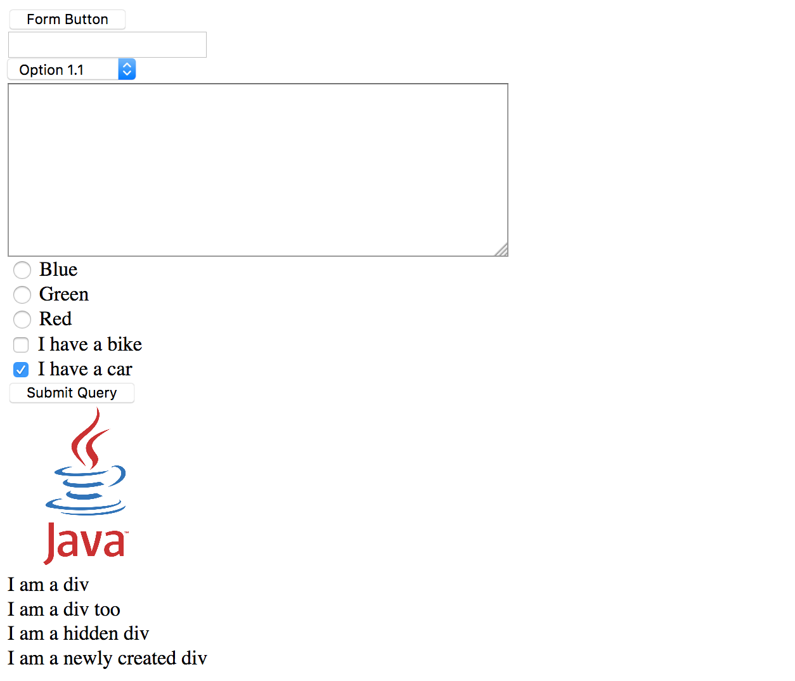

In order to make use of this page as part of a Java test, we need to save it in the `src/test/resources` directory. This is the standard Maven directory where resource files are found.

This directory doesn't exist yet, so we create it by right clicking on the test directory and selecting {{New,Directory}}.

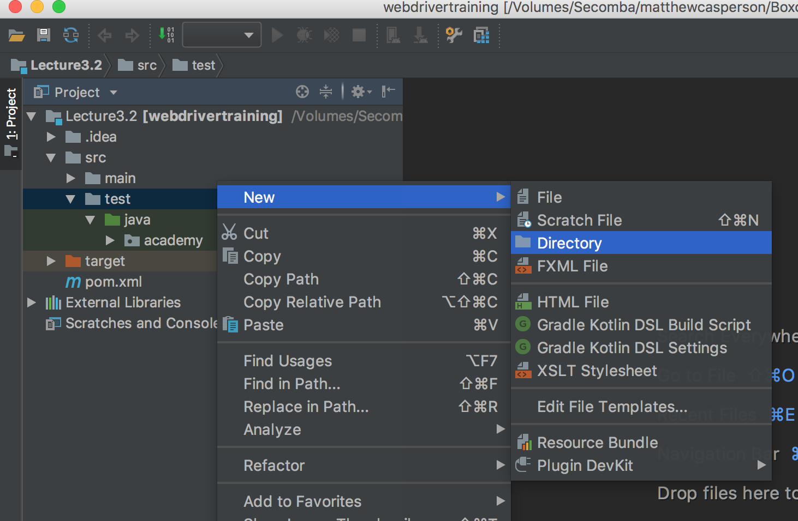

Enter the name resources, and click the `OK` button.

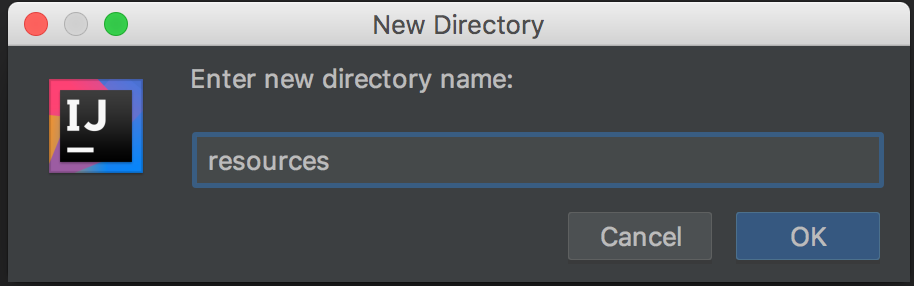

As we have seen a few times now, creating a directory that has special meaning in a Maven project does not automatically update the IntelliJ project. We can see in the screenshot below that the `resources` directory now exists, but it looks like a plain directory in out project.

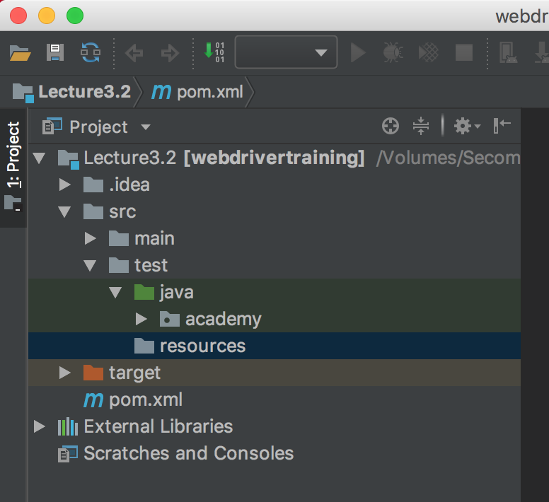

To update the IntelliJ project, open the `Maven Projects` tool window and click the `Reimport All Maven Projects` button.

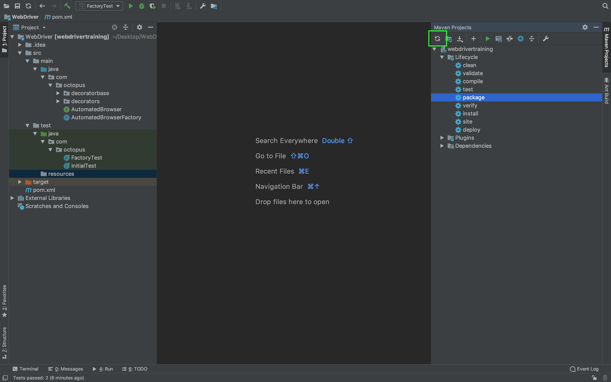

The icon for the `resources` directory is updated to reflect the fact that this will hold file like our sample web page.

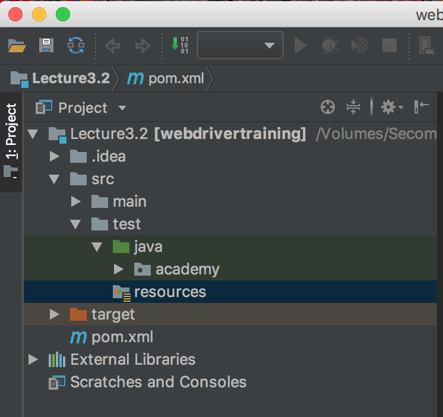

Once the `resources` folder is configured, save the HTML code to a file called `form.html`.

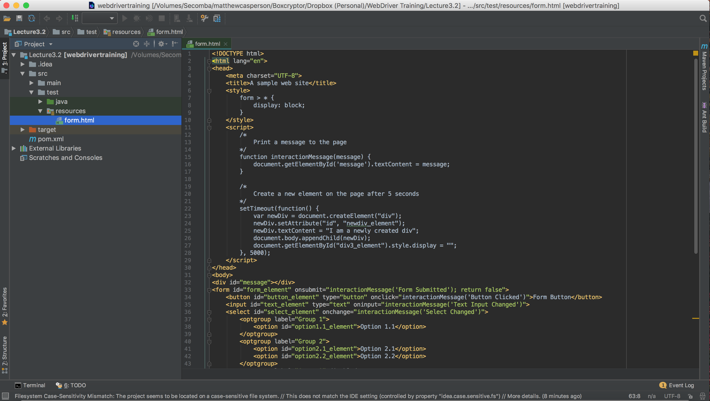

We now have two important pieces of the puzzle completed. First, we have the beginnings of the framework that will allow us to create flexible `AutomatedBrowser` objects through which we interact with web pages. Second, we have a sample web page that includes most of the elements we are likely to encounter while writing WebDriver tests. So now it is time to write some real WebDriver tests.

Let's create a test method `formTestByID()` inside a class `FormTest` that will open the browser, open our test web page, and close the browser again:

```java
package com.octopus;

import org.junit.Test;
import java.net.URISyntaxException;

public class FormTest {

  private static final AutomatedBrowserFactory AUTOMATED_BROWSER_FACTORY = new AutomatedBrowserFactory();

  @Test
  public void formTestByID() throws URISyntaxException {
    final AutomatedBrowser automatedBrowser =
      AUTOMATED_BROWSER_FACTORY.getAutomatedBrowser("Chrome");

    try {
      automatedBrowser.init();
      automatedBrowser.goTo(FormTest.class.getResource("/form.html").toURI().toString());
    } finally {
      automatedBrowser.destroy();
    }
  }
}
```

Notice that we can get access to the sample HTML file by the call to `FormTest.class.getResource()`. Because we saved this file under the standard directory `src/test/resources`, Maven (and by extension IntelliJ) allows us to access this file through our Java code. The following code returns the complete URL to the sample HTML file:

```java
FormTest.class.getResource("/form.html").toURI().toString()
```

Now let's manually open the same web page. IntelliJ provides a handy service for hosting webpages locally. This can be accessed by clicking the shortcut in the top right hand corner of the screen when the HTML file is opened in the editor.

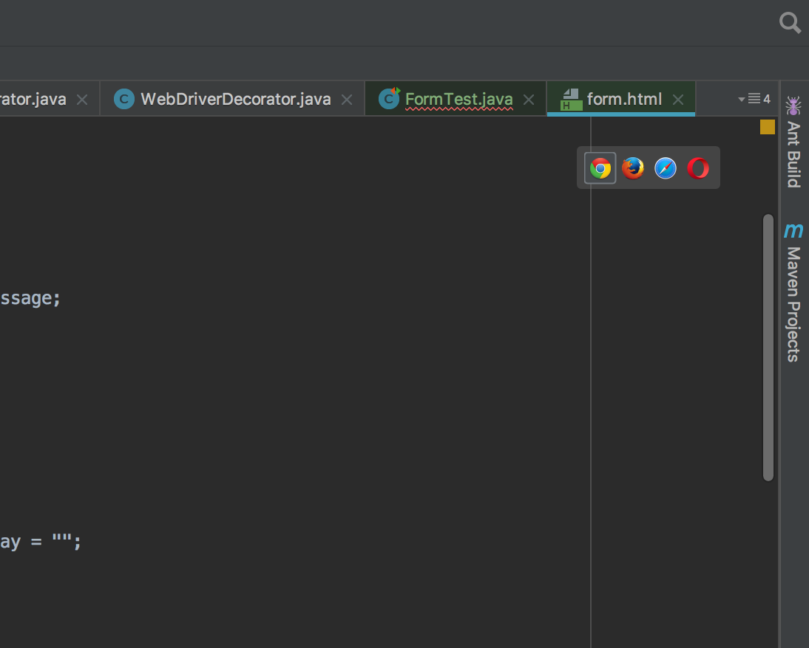

Clicking the Chrome browser icon will open up Chrome to a page with a URL like [http://localhost:63342/webdrivertraining/form.html?_ijt=2r0gmmveunmkptr759pintjfe5](http://localhost:63342/webdrivertraining/form.html?_ijt=2r0gmmveunmkptr759pintjfe5). This is a quick and easy way to view our sample web page.

:::hint
The URL generated by IntelliJ is not the same URL we got by calling `FormTest.class.getResource()`. Using IntelliJ to host the web page is simply a convenience for us as end users, but we do not use this URL for our tests. Indeed, we could not use this URL as the query string on the end is randomly generated and prevents any other user or process from accessing pages hosted by IntelliJ.
:::

The first thing we'll test is using WebDriver to click the button at the top of the page.

To interact with the button, we need to know its ID. We know that this button has the ID of `button_element`, because we wrote the HTML. But it is not always possible to get access to the source code for the web application you will be testing. So we will assume that we don't have access the HTML source code and instead use the tools provided by Chrome to find this information.

With the page loaded in Chrome, right click on the button element and click the `Inspect` option.

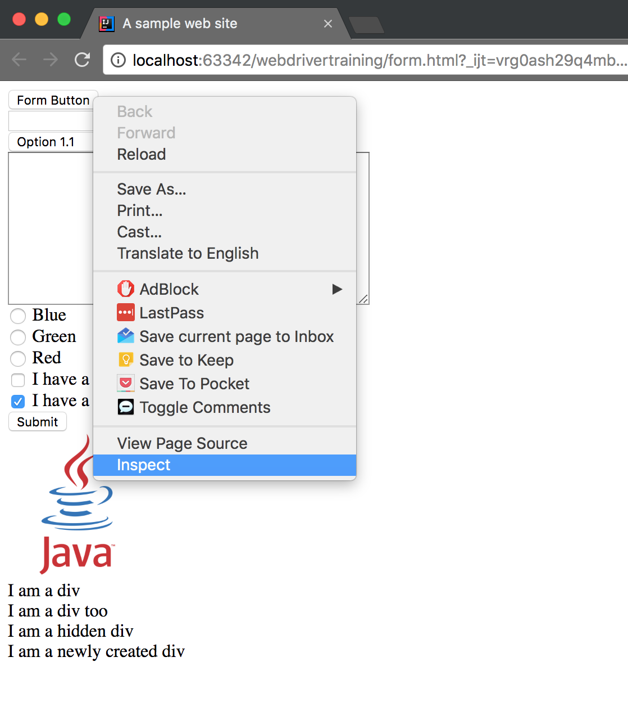

This will open Chrome's Developer Tools, and highlight the button HTML element inside the `Elements` tab.

The HTML elements displayed in the Developer Tools `Elements` tab are updated in real time as elements are added, removed and changed by JavaScript calls. This means you will often get more information from the Developer Tools than you would simply looking at the HTML source code.

You can see this for yourself by right clicking on the text that says `I am a newly created div` and selecting the `Inspect` option. This will reveal the `<div>` element created as a result of the `setTimeout()` method call. You will not see that `<div>` element in the HTML source code, as it is dynamically generated at run time.

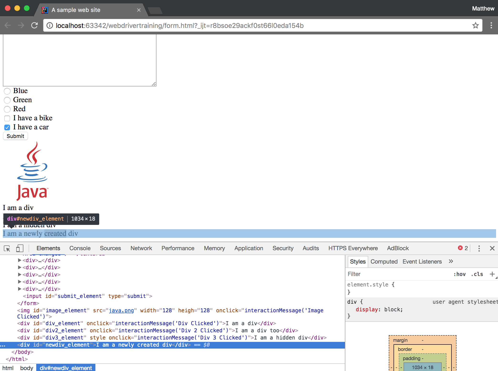

Going back to the `<button>` element, we can see that the ID attribute is indeed `button_element`.

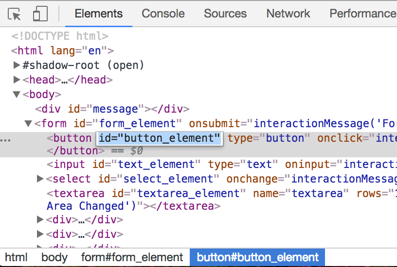

Now that we know the ID of the element we wish to interact with, we can start building out our test. We start by making a call to `clickElementWithId()`, passing in the ID of the element that we wish to click:

```java
@Test
public void formTestByID() throws URISyntaxException {
  final AutomatedBrowser automatedBrowser = AUTOMATED_BROWSER_FACTORY.getAutomatedBrowser("Chrome");

  try {
    automatedBrowser.init();
    automatedBrowser.goTo(FormTest.class.getResource("/form.html").toURI().toString());
    automatedBrowser.clickElementWithId("button_element");
  } finally {
    automatedBrowser.destroy();
  }
}
```

Next, in the `WebDriverDecorator` class, we need to add an implementation of the `clickElementWithId()` method:

```java
@Override
public void clickElementWithId(final String id) {
  webDriver.findElement(By.id(id)).click();
}
```

When you paste this code into the  `WebDriverDecorator` class, ItelliJ will display the `By` class in red. This is because we have not imported the package that contains the `By` class.

To fix this place the mouse cursor over the red text and click ALT + Enter. This will display a context menu that has the `Import class` option.

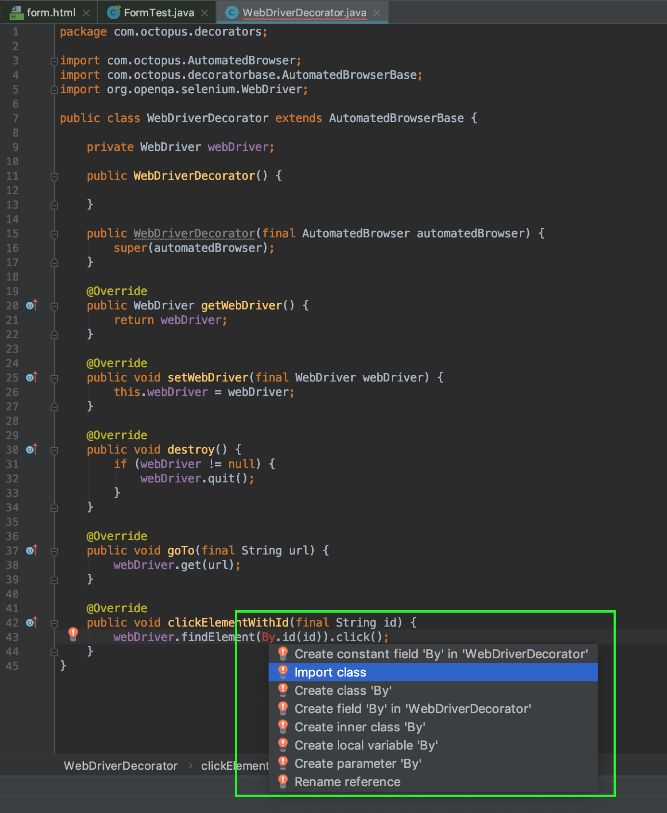

IntelliJ is usually pretty good at working out which package to import based on the context of the class, and in this case will add the `import org.openqa.selenium.By;` statement to the top of the class.

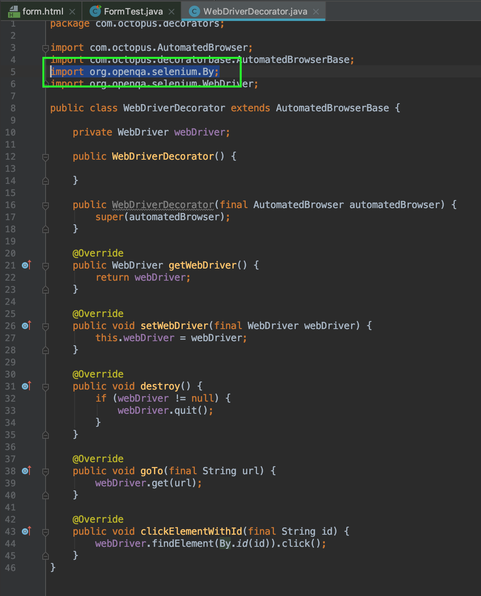

The `clickElementWithId()` method does three important things.

First, it finds the element we wish to interact with using a call to `By.id(id)`. The `By` class is used to find elements in a web page and offers a range of methods to perform the search. Because we are searching for an element by its ID, we call `By.id()`.

Second, we call the `findElement()` method on the web driver class to find the element.

Third, we take the element returned by `findElement()`, and call the `click()` method to simulate an end user clicking the element.

This process of defining how to search for elements with the `By` class, finding the elements with the `findElement()` method, and calling a method like `click()` to simulate an action is something that we'll repeat over and over as we build up the testing framework.

But how can we be sure that WebDriver actually clicked the button? If you look back at the source of the `form.html` page you will see that the `<button>` element has the attribute `onclick="interactionMessage('Button Clicked')"`. This means that when the button is clicked, the `interactionMessage()` method is called with `'Button Clicked'`, which in turn will display the text `Button Clicked` on the page.

We can then extract the text from the element that holds the message `Button Clicked` and verify that it says what we expect it to say.

To do this, we call the `getTextFromElementWithId()` method, passing in the ID of the element containing the text we wish to return, which in our case is the ID of the `<div>` element that holds the message text we wish to verify. We then verify the result of this method call using the `assertEquals()` provided by JUnit:

```java
@Test
public void formTestByID() throws URISyntaxException {
  final AutomatedBrowser automatedBrowser =
  AUTOMATED_BROWSER_FACTORY.getAutomatedBrowser("Chrome");

  try {
    automatedBrowser.init();
    automatedBrowser.goTo(FormTest.class.getResource("/form.html").toURI().toString());

    automatedBrowser.clickElementWithId("button_element");
    assertEquals("Button Clicked", automatedBrowser.getTextFromElementWithId("message"));
  } finally {
    automatedBrowser.destroy();
  }
}
```

The `getTextFromElementWithId()` method then needs an implementation in the `WebDriverDecorator` class.

Notice that the `getTextFromElementWithId()` method follows the same pattern as the `clickElementWithId()`. In fact, the only difference is that we call `getText()` on the resulting element instead of `click()`:

```java
@Override
public String getTextFromElementWithId(final String id) {
  return webDriver.findElement(By.id(id)).getText();
}
```

And with that, we have successfully clicked an element with WebDriver and verified that the page responded how we expected.

Let's move onto populating text boxes and text areas with some text, and verifying that the event handlers on those fields print the expected message to the page:

```Java
automatedBrowser.populateElementWithId("text_element", "test text");
assertEquals("Text Input Changed", automatedBrowser.getTextFromElementWithId("message"));

automatedBrowser.populateElementWithId("textarea_element", "test text");
assertEquals("Text Area Changed", automatedBrowser.getTextFromElementWithId("message"));
```

The `populateElementWithId()` method then needs an implementation in the `WebDriverDecorator` class. In this case, we use the `sendKeys()` method on the returned element to populate the text:

```Java
@Override
public void populateElementWithId(String id, String text) {
  webDriver.findElement(By.id(id)).sendKeys(text);
}
```

Next we will select an option from the drop down list:

```Java
automatedBrowser.selectOptionByTextFromSelectWithId("Option 2.1", "select_element");
assertEquals("Select Changed", automatedBrowser.getTextFromElementWithId("message"));
```

The `selectOptionByTextFromSelectWithId()` method is slightly different to the pattern we have seen previously.

The `findElement()` method returns an instance of the `WebElement` interface. The `WebElement` interface in turn exposes a number of common actions through methods like:

-   `click()`
-   `sendKeys()`
-   `clear()`
-   `submit()`
-   `getText()`

You can get a complete listing of the methods by viewing the [Javadoc](https://seleniumhq.github.io/selenium/docs/api/java/org/openqa/selenium/WebElement.html) API documentation.

Noticeably absent from that list of actions is the ability to select an option from a drop down list. In order to interact with a `<select>` element, we need to create an instance of the `Select` class, whose constructor takes the `WebElement` returned by `findElement()`. We then have access to the `selectByVisibleText()` method, which selects the option with the corresponding text:

```java
@Override
public void selectOptionByTextFromSelectWithId(String optionText, String selectId) {
  new Select(webDriver.findElement(By.id(selectId))).selectByVisibleText(optionText);
}
```

Clicking radio buttons and checkboxes can be done with the same `clickElementWithId()` method we used to click the button:

```Java
automatedBrowser.clickElementWithId("radio3_element");
assertEquals("Radio Button Changed", automatedBrowser.getTextFromElementWithId("message"));

automatedBrowser.clickElementWithId("checkbox2_element");
assertEquals("Checkbox Changed", automatedBrowser.getTextFromElementWithId("message"));
```

We are not limited to interacting with form elements. The `clickElementWithId()` method works just as well on elements like images and plain old divs:

```Java
automatedBrowser.clickElementWithId("image_element");
assertEquals("Image Clicked", automatedBrowser.getTextFromElementWithId("message"));

automatedBrowser.clickElementWithId("div_element");
assertEquals("Div Clicked", automatedBrowser.getTextFromElementWithId("message"));
```

With the `formTestByID()` test we have successfully clicked, checked, typed and selected options with a live, interactive web page, and verified the results. This, in a nutshell, is what writing WebDrivers tests is all about. However, we will not always have the luxury of locating elements based on an ID attribute. In these situations, WebDriver offers a number of other ways to locate elements in a web page, and we'll look at those next.

Return to the [table of contents](../0-toc/webdriver-toc.md).
