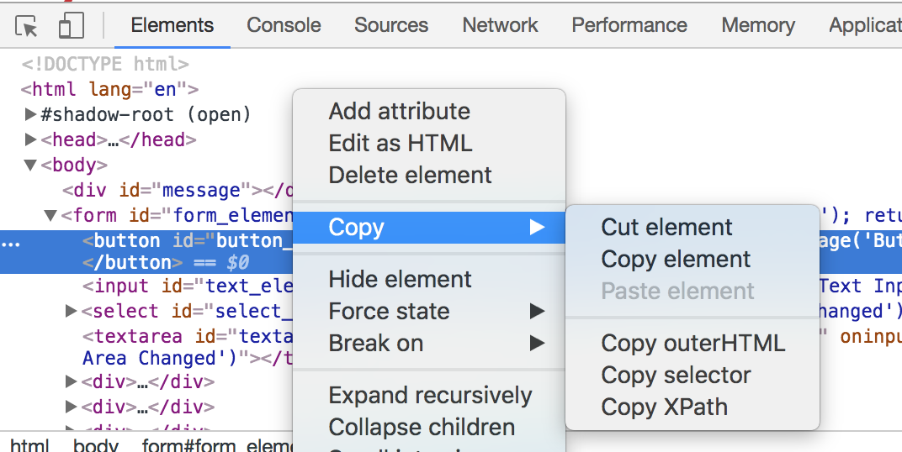
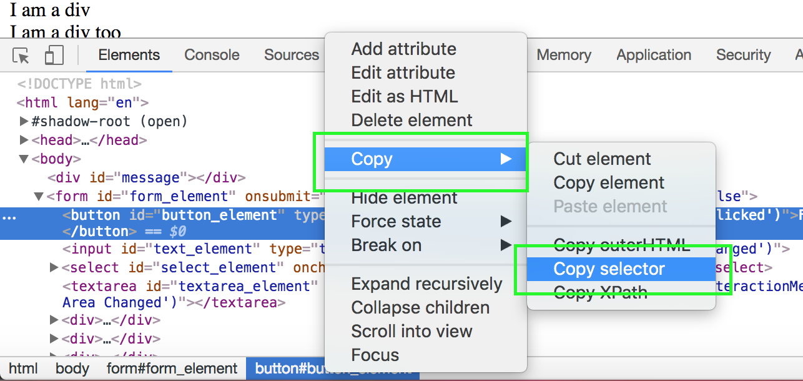

Return to the [table of contents](../0-toc/webdriver-toc.md).

In the last section we searched for the elements that we wished to interact with by their ID attribute. Using the ID attribute is very convenient, but in real world scenarios not every element you wish to interact with will have an ID, or the ID will be generated by a templating language and not something you can rely on being static.

Unlike ID attributes, every element in a web page has a unique XPath. An XPath (XML Path Language) is a query language for selecting nodes from XML like documents, such as HTML in our case.

XPath queries can get quite complex. It is not uncommon for unique XPaths to look like `//*[@id="request-summary"]/div/div[2]/div/form/div[2]/input`.

Fortunately Chrome and other browsers provide an easy way to generate unique XPaths for elements. Right clicking on the element in the `Elements` tab and selecting {{Copy,Copy XPath}} will place the most succinct unique XPath that identifies the element into the clipboard. This functionality means that you don't need to understand the nitty gritty details of XPaths in order to make use of them, as you can let the browser take care of generating the XPaths for you.



For our test web page, the XPaths generated by Chrome make use of the fact that the elements all have unique ID attributes, which results in relatively concise XPaths like `//*[@id="button_element"]`.

To use XPaths instead of IDs as a means of locating elements in a page, we need to add four new methods to the `AutomatedBrowser` interface:

```java
void clickElementWithXPath(String xpath);

void selectOptionByTextFromSelectWithXPath(String optionText, String xpath);

void populateElementWithXPath(String xpath, String text);

String getTextFromElementWithXPath(String xpath);
```

In turn we add implementations for these four methods to the
`AutomatedBrowserBase` class:

```java
@Override
public void clickElementWithXPath(final String xpath) {
  if (getAutomatedBrowser() != null) {
      getAutomatedBrowser().clickElementWithXPath(xpath);
  }
}

@Override
public void selectOptionByTextFromSelectWithXPath(final String optionText, final String xpath) {
  if (getAutomatedBrowser() != null) {
    getAutomatedBrowser().selectOptionByTextFromSelectWithXPath(optionText, xpath);
  }
}

@Override
public void populateElementWithXPath(final String xpath, final String text) {
  if (getAutomatedBrowser() != null) {
    getAutomatedBrowser().populateElementWithXPath(xpath, text);
  }
}

@Override
public String getTextFromElementWithXPath(final String xpath) {
  if (getAutomatedBrowser() != null) {
    return getAutomatedBrowser().getTextFromElementWithXPath(xpath);
  }
  return null;
}
```

Then we define implementations of these methods in the `WebDriverDecorator` class.

Note that we call `By.xpath()` instead of `By.id()` in these methods. This is how we search for elements based on their XPath:

```java
@Override
public void clickElementWithXPath(final String xpath) {
  webDriver.findElement(By.xpath(xpath)).click();
}

@Override
public void selectOptionByTextFromSelectWithXPath(final String optionText, final String xpath) {
  new Select(webDriver.findElement(By.xpath(xpath))).selectByVisibleText(optionText);
}

@Override
public void populateElementWithXPath(final String xpath, final String text) {
  webDriver.findElement(By.xpath(xpath)).sendKeys(text);
}

@Override
public String getTextFromElementWithXPath(final String xpath) {
  return webDriver.findElement(By.xpath(xpath)).getText();
}
```

Finally we create a new test method that interacts with our sample web page, but this time taking advantage of the new XPath based methods:

```java
@Test
public void formTestByXPath() throws URISyntaxException {

  final AutomatedBrowser automatedBrowser = AUTOMATED_BROWSER_FACTORY.getAutomatedBrowser("Chrome");

  try {
    automatedBrowser.init();

    automatedBrowser.goTo(FormTest.class.getResource("/form.html").toURI().toString());

    automatedBrowser.clickElementWithXPath("//*[@id=\"button_element\"]");
    assertEquals("Button Clicked", automatedBrowser.getTextFromElementWithId("message"));

    automatedBrowser.populateElementWithXPath("//*[@id=\"text_element\"]", "test text");
    assertEquals("Text Input Changed", automatedBrowser.getTextFromElementWithId("message"));

    automatedBrowser.populateElementWithXPath("//*[@id=\"textarea_element\"]", "test text");
    assertEquals("Text Area Changed", automatedBrowser.getTextFromElementWithId("message"));

    automatedBrowser.selectOptionByTextFromSelectWithXPath("Option 2.1", "//*[@id=\"select_element\"]");
    assertEquals("Select Changed", automatedBrowser.getTextFromElementWithId("message"));

    automatedBrowser.clickElementWithXPath("//*[@id=\"radio3_element\"]");
    assertEquals("Radio Button Changed", automatedBrowser.getTextFromElementWithId("message"));

    automatedBrowser.clickElementWithXPath("//*[@id=\"checkbox2_element\"]");
    assertEquals("Checkbox Changed", automatedBrowser.getTextFromElementWithId("message"));

    automatedBrowser.clickElementWithXPath("//*[@id=\"image_element\"]");
    assertEquals("Image Clicked", automatedBrowser.getTextFromElementWithId("message"));

    automatedBrowser.clickElementWithXPath("//*[@id=\"div_element\"]");
    assertEquals("Div Clicked", automatedBrowser.getTextFromElementWithId("message"));
  } finally {
    automatedBrowser.destroy();
  }
}
```

Like XPaths, all elements in a HTML document have a unique CSS Selector that they can be identified with.

CSS Selectors are the same identifiers used in CSS rule sets. If you have done any web development then you will most likely be familiar CSS Selectors. But even if you aren't familiar with them, Chrome and other browsers provide a way to generate CSS Selectors for HTML elements. In Chrome, right click the element in the `Elements` tab, and select {{Copy,Copy Selector}}.



In our case, because the elements we are interacting with all have ID attributes, this menu option will place a CSS Selector like `#button_element` into the clipboard.

The process of making use of CSS Selector is much the same that we went through to support XPaths.

We define new methods in the `AutomatedBrowser` interface:

```java
void clickElementWithCSSSelector(final String cssSelector);

void selectOptionByTextFromSelectWithCSSSelector(final String optionText, final String cssSelector);

void populateElementWithCSSSelector(final String cssSelector, final String text);

String getTextFromElementWithCSSSelector(final String cssSelector);
```

Then we provide default implementations in the `AutomatedBrowserBase` class:

```java
@Override
public void clickElementWithCSSSelector(final String cssSelector) {
  if (getAutomatedBrowser() != null) {
    getAutomatedBrowser().clickElementWithCSSSelector(cssSelector);
  }
}

@Override
public void selectOptionByTextFromSelectWithCSSSelector(final String optionText, final String cssSelector) {
  if (getAutomatedBrowser() != null) {
    getAutomatedBrowser().selectOptionByTextFromSelectWithCSSSelector(optionText, cssSelector);
  }
}

@Override
public void populateElementWithCSSSelector(final String cssSelector, final String text) {
  if (getAutomatedBrowser() != null) {
    getAutomatedBrowser().populateElementWithCSSSelector(cssSelector, text);
  }
}

@Override
public String getTextFromElementWithCSSSelector(final String cssSelector) {
  if (getAutomatedBrowser() != null) {
    return getAutomatedBrowser().getTextFromElementWithCSSSelector(cssSelector);
  }
  return null;
}
```

The `WebDriverDecorator` class is updated with the new methods. We use the `By.cssSelector()` method to search for elements by their CSS selectors:

```java
@Override
public void clickElementWithCSSSelector(final String cssSelector) {
  webDriver.findElement(By.cssSelector(cssSelector)).click();
}

@Override
public void selectOptionByTextFromSelectWithCSSSelector(final String optionText, final String cssSelector) {
  new Select(webDriver.findElement(By.cssSelector(cssSelector))).selectByVisibleText(optionText);
}

@Override
public void populateElementWithCSSSelector(final String cssSelector, final String text) {
  webDriver.findElement(By.cssSelector(cssSelector)).sendKeys(text);
}

@Override
public String getTextFromElementWithCSSSelector(final String cssSelector) {
  return webDriver.findElement(By.cssSelector(cssSelector)).getText();
}
```

Finally, we tie all the new methods together with a new test that locates elements using CSS Selectors:

```java
@Test
public void formTestByCSSSelector() throws URISyntaxException {
  final AutomatedBrowser automatedBrowser = AUTOMATED_BROWSER_FACTORY.getAutomatedBrowser("Chrome");

  try {
    automatedBrowser.init();

    automatedBrowser.goTo(FormTest.class.getResource("/form.html").toURI().toString());

    automatedBrowser.clickElementWithCSSSelector("#button_element");
    assertEquals("Button Clicked", automatedBrowser.getTextFromElementWithId("message"));

    automatedBrowser.populateElementWithCSSSelector("#text_element", "test text");
    assertEquals("Text Input Changed", automatedBrowser.getTextFromElementWithId("message"));

    automatedBrowser.populateElementWithCSSSelector("#textarea_element", "test text");
    assertEquals("Text Area Changed", automatedBrowser.getTextFromElementWithId("message"));

    automatedBrowser.selectOptionByTextFromSelectWithCSSSelector("Option 2.1", "#select_element");
    assertEquals("Select Changed", automatedBrowser.getTextFromElementWithId("message"));

    automatedBrowser.clickElementWithCSSSelector("#radio3_element");
    assertEquals("Radio Button Changed", automatedBrowser.getTextFromElementWithId("message"));

    automatedBrowser.clickElementWithCSSSelector("#checkbox2_element");
    assertEquals("Checkbox Changed", automatedBrowser.getTextFromElementWithId("message"));

    automatedBrowser.clickElementWithCSSSelector("#image_element");
    assertEquals("Image Clicked", automatedBrowser.getTextFromElementWithId("message"));

    automatedBrowser.clickElementWithCSSSelector("#div_element");
    assertEquals("Div Clicked", automatedBrowser.getTextFromElementWithId("message"));
  } finally {
    automatedBrowser.destroy();
  }
}
```

We have now seen three different methods of identifying elements in a HTML page: via the ID, using XPaths, and using CSS Selectors. But which way is the best?

In valid HTML, `id` attributes must be unique. In a well designed page the `id` attribute also provides some meaningful context to the element it is defined on. Elements also typically retain the same `id` attribute as they are moved around the page by developers updating the application. This makes finding elements by their ID the most concise and reliable way to locate elements in a page.

Unfortunately, because the `id` attribute has to be manually assigned to an element, you can not rely the elements you wish to interact with having `id` attributes. In fact, in my experience it is quite rare to have `id` attributes that can be used when writing tests against real world applications.

Unlike the `id` attributes, all elements can be located using XPaths and CSS Selectors. So in the absence of a usable ID, you will have to fall back to one of these locators.

CSS Selectors tend to be more familiar than XPaths, because CSS Selectors are used by web developers to design CSS rule sets. For this reason I would recommend CSS Selectors over XPaths.

Return to the [table of contents](../0-toc/webdriver-toc.md).
