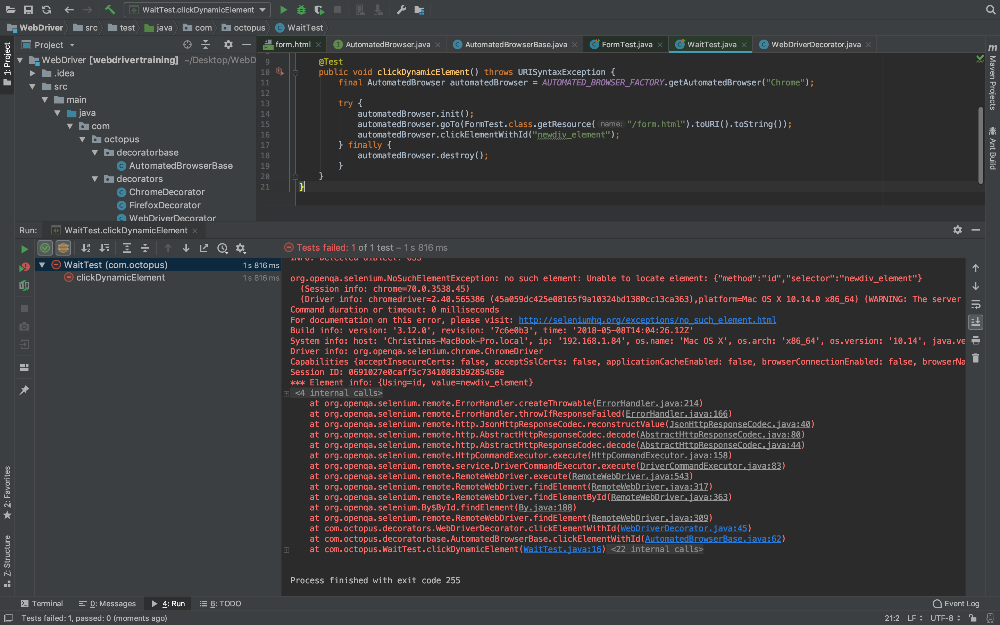
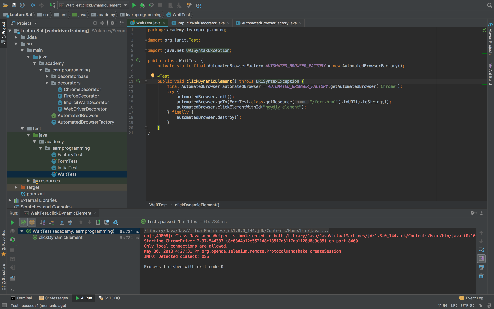
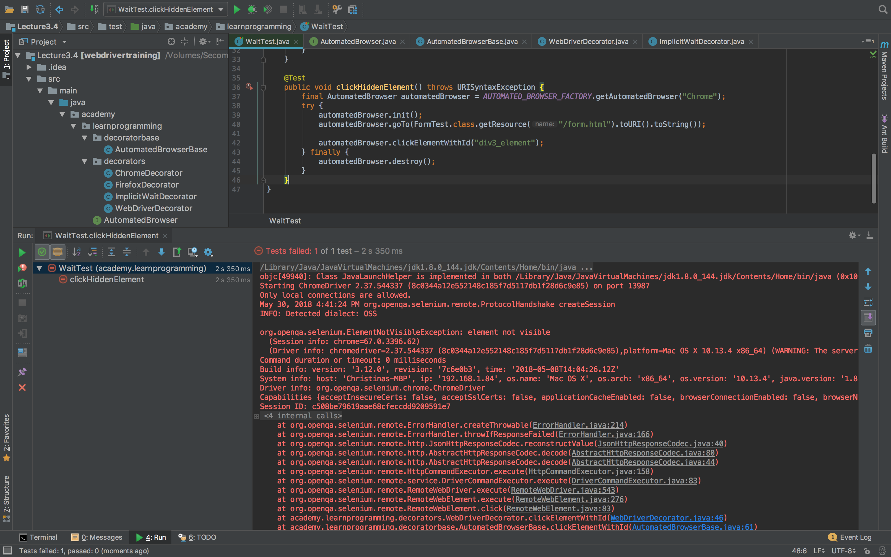

Return to the [table of contents](../0-toc/webdriver-toc.md).

In our test web page we have a `setTimeout()` method call that created a new `<div>` with the ID of `newdiv_element` after 5 seconds. Such dynamic updates are common in modern web development, and are used extensively with Single Page Applications (SPAs) written with libraries like React and Angular.

These dynamic elements present a challenge when writing tests though. Let's create a new test that attempts to click this dynamic element: 

```java
package com.octopus;

import org.junit.Test;
import java.net.URISyntaxException;

public class WaitTest {
  private static final AutomatedBrowserFactory AUTOMATED_BROWSER_FACTORY = new AutomatedBrowserFactory();

  @Test
  public void clickDynamicElement() throws URISyntaxException {
    final AutomatedBrowser automatedBrowser = AUTOMATED_BROWSER_FACTORY.getAutomatedBrowser("Chrome");

    try {
      automatedBrowser.init();
      automatedBrowser.goTo(FormTest.class.getResource("/form.html").toURI().toString());
      automatedBrowser.clickElementWithId("newdiv_element");
    } finally {
      automatedBrowser.destroy();
    }
  }
}
```

Running this test will result in an exception like:

```
org.openqa.selenium.NoSuchElementException: no such element: Unable to
locate element: {"method":"id","selector":"newdiv_element"}
```



This exception is not surprising. Our test is attempting to click an element that won't be created for another 5 seconds.

We could wait a few seconds ourselves in the test. By adding the code `Thread.sleep(6000);` before the attempt to click the element, we can ensure that the element is available:

```java
package com.octopus;

import org.junit.Test;
import java.net.URISyntaxException;

public class WaitTest {

  private static final AutomatedBrowserFactory AUTOMATED_BROWSER_FACTORY = new AutomatedBrowserFactory();

  @Test
  public void clickDynamicElement() throws URISyntaxException, InterruptedException {
    final AutomatedBrowser automatedBrowser = AUTOMATED_BROWSER_FACTORY.getAutomatedBrowser("Chrome");

    try {
      automatedBrowser.init();
      automatedBrowser.goTo(FormTest.class.getResource("/form.html").toURI().toString());
      Thread.sleep(6000);
      automatedBrowser.clickElementWithId("newdiv_element");
    } finally {
      automatedBrowser.destroy();
    }
  }
}
```

While this test will pass, it is not a reliable solution.

In our test web page we can know that the element will appear after 5 seconds because the call to `setTimeout()` very clearly creates the element after 5 seconds. However, it is very unlikely that real world web applications will create the elements that a test needs to interact with in such a predictable way. Most likely elements will be created in response to API calls, page navigation or other processing, and there is no way for our test code to know how long these events will take.

Fortunately WebDriver provides two methods for waiting for dynamic elements to be available: implicit waits and explicit waits.

Implicit waits are the simpler of the two. With implicit waits, we define a global amount of time to wait for elements that our test is interacting with to be present in the web page.

We can implement implicit waits with a new decorator called `ImplicitWaitDecorator`, which will make a call to `manage().timeouts().implicitlyWait()`:

```java
package com.octopus.decorators;

import com.octopus.AutomatedBrowser;
import com.octopus.decoratorbase.AutomatedBrowserBase;
import java.util.concurrent.TimeUnit;

public class ImplicitWaitDecorator extends AutomatedBrowserBase {

  private final int waitTime;

  public ImplicitWaitDecorator(final int waitTime, final AutomatedBrowser automatedBrowser) {

  super(automatedBrowser);
    this.waitTime = waitTime;
  }

  @Override
  public void init() {
    getAutomatedBrowser()
      .getWebDriver()
      .manage()
      .timeouts()
      .implicitlyWait(waitTime, TimeUnit.SECONDS);

    getAutomatedBrowser().init();
  }
}
```

We can then make use of this decorator by editing the `AutomatedBrowserFactory` class:

```java
private AutomatedBrowser getChromeBrowser() {
  return new ChromeDecorator(
    new ImplicitWaitDecorator(10,
      new WebDriverDecorator()
      )
    );
}
```

With the implicit wait time configured, we can run the original test (i.e. the one without `Thread.sleep()`), and it will pass. This is because WebDriver will wait for up to 10 seconds for any element we search for to be present in the web page. This gives our dynamic element, created after 5 seconds, plenty of time to appear on the page.



Explicit waits are the second method provided by WebDriver to wait for elements to be available. Unlike implicit waits, which apply to any element we attempt to find in the page, explicit waits can be used on an element-by-element case.

To make use of explicit waits, we add a new method to the `AutomatedBrowser` interface that takes the amount of time to wait for an element as a parameter:

```java
void clickElementWithId(String id, int waitTime);
```

A default method is added to the `AutomatedBrowserBase` class:

```java
@Override
public void clickElementWithId(final String id, final int waitTime) {
  if (getAutomatedBrowser() != null) {
    getAutomatedBrowser().clickElementWithId(id, waitTime);
  }
}
```

And then the method is then defined in the `WebDriverDecorator` class:

```java
@Override
public void clickElementWithId(final String id, final int waitTime) {
  if (waitTime <= 0) {
    clickElementWithId(id);
  } else {
    final WebDriverWait wait = new WebDriverWait(webDriver, waitTime);
    wait.until(ExpectedConditions.elementToBeClickable((By.id(id)))).click();
  }
}
```

There are three parts an explicit wait.

We start by defining the amount of time that we wish to wait for an element.  This is done by creating an instance of the `WebDriverWait` class:

```java
final WebDriverWait wait = new WebDriverWait(webDriver, waitTime);
```

We then call the `until()` method on the resulting `WebDriverWait` instance.

Finally, we use one of the static methods on the `ExpectedCondition` class to indicate what state the element we are searching for must be in before the element is returned to us.

Because we are attempting to click on the element, we want to ensure that the element is clickable. This is done by calling the `ExpectedConditions.elementToBeClickable()` method:

```java
wait.until(ExpectedConditions.elementToBeClickable((By.id(id)))).click();
```

The end result of this code is that the element we are finding by an ID will only be clicked if it is in a clickable state within the duration specified.

To test the explicit wait we create a new test that makes use of the new `clickElementWithId()` method:

```java
@Test
public void clickDynamicElementWithExplicitWait() throws URISyntaxException {
  final AutomatedBrowser automatedBrowser =
    AUTOMATED_BROWSER_FACTORY.getAutomatedBrowser("Chrome");

  try {
    automatedBrowser.init();
    automatedBrowser.goTo(FormTest.class.getResource("/form.html").toURI().toString());
    automatedBrowser.clickElementWithId("newdiv_element", 10);

  } finally {
    automatedBrowser.destroy();
  }
}
```

As before, the test will wait for the dynamic element to be created before clicking on it, and the test will pass.

But you may be asking why anyone would bother using explicit waits? They require more code to implement, so what is the benefit of explicit waits over implicit waits?

To demonstrate why explicit waits are useful, let's attempt to click on the div with the ID of `div3_element`. If you look back at the source code for the sample web page, you will see that this element is hidden with `style="display: none"`, and is un-hidden from the call to `setTimeout()`.

Although there is little difference to someone viewing the page between a hidden element and an element that simply does not exist, this distinction is very important to our tests.

Let's create a test that relies on an implicit wait to click the hidden element:

```java
@Test
public void clickHiddenElement() throws URISyntaxException {

  final AutomatedBrowser automatedBrowser =
    AUTOMATED_BROWSER_FACTORY.getAutomatedBrowser("Chrome");

  try {
  automatedBrowser.init();
  automatedBrowser.goTo(FormTest.class.getResource("/form.html").toURI().toString());
  automatedBrowser.clickElementWithId("div3_element");
  } finally {
    automatedBrowser.destroy();
  }
}
```

Running this test will throw the exception:

```
org.openqa.selenium.ElementNotVisibleException: element not visible
```



We get this exception because the implicit wait immediately returned the `<div>` since it was present on the web page. Implicit waits don't take into account if the element is disabled or hidden. If the element is available on the page, the implicit wait is satisfied, and the test continues. Or, in our case, fails, because you can not click on an invisible element.

Compare this behavior to a test that make use of explicit waits:

```java
@Test
public void clickHiddenElementWithExplicitWait() throws URISyntaxException {
  final AutomatedBrowser automatedBrowser =
    AUTOMATED_BROWSER_FACTORY.getAutomatedBrowser("Chrome");

  try {
    automatedBrowser.init();
    automatedBrowser.goTo(FormTest.class.getResource("/form.html").toURI().toString());
    automatedBrowser.clickElementWithId("div3_element", 10);
  } finally {
    automatedBrowser.destroy();
  }
}
```

This test succeeds, because we are explicitly waiting for the target element to be in a very specific state (a clickable state) before continuing the test. Because we are waiting for the element to be clickable, instead of just merely present on the page, the test works as expected.

Explicit waits provide a much greater level of control by allowing us to define the desired state of an element before we attempt to interact with it. Implicit waits are much more general, and only wait for elements to be present on the page.

In practice explicit waits allow us to write much more robust tests. There is some more work initially to support explicit waits, but once the `WebDriverDecorator` class has been populated with methods that make use of explicit waits, they are quite easy to use.

Let's take a look at how the methods in `WebDriverDecorator` can be overloaded to take advantage of explicit waits.

Selecting an option from a drop down list waits for the `<select>` element to be clickable:

```java
@Override
public void selectOptionByTextFromSelectWithId(final String optionText, final String id, final int waitTime) {
  if (waitTime <= 0) {
    selectOptionByTextFromSelectWithId(id, optionText);
  } else {
    final WebDriverWait wait = new WebDriverWait(webDriver, waitTime);
    new Select(wait.until(ExpectedConditions.elementToBeClickable((By.id(id))))).selectByVisibleText(optionText);
  }
}
```

Likewise we wait for elements like `<textarea>` to be clickable before trying to populate them:

```java
@Override
public void populateElementWithId(final String id, final String text, final int waitTime) {
  if (waitTime <= 0) {
    populateElementWithId(id, text);
  } else {
    final WebDriverWait wait = new WebDriverWait(webDriver, waitTime);
    wait.until(ExpectedConditions.elementToBeClickable((By.id(id)))).sendKeys(text);
  }
}
```

When returning the text from an element, it only needs to be present on the page, so we call `ExpectedConditions.presenceOfElementLocated()`:

```java
@Override
public String getTextFromElementWithId(final String id, final int waitTime) {
  if (waitTime <= 0) {
    return getTextFromElementWithId(id);
  } else {
    final WebDriverWait wait = new WebDriverWait(webDriver, waitTime);

    return
    wait.until(ExpectedConditions.presenceOfElementLocated((By.id(id)))).getText();
  }
}
```

This same pattern is repeated with the methods that find elements using XPaths and CSS Selectors. We won't go over all these methods individually, but you can see them in the copy of the populated classes and interfaces below.

Here is the `AutomatedBrowser` interface with all the methods defined for explicit waits:

```java
package com.octopus;

import org.openqa.selenium.WebDriver;

public interface AutomatedBrowser {

  WebDriver getWebDriver();

  void setWebDriver(WebDriver webDriver);

  void init();

  void destroy();

  void goTo(String url);

  void clickElementWithId(String id);

  void clickElementWithId(String id, int waitTime);

  void selectOptionByTextFromSelectWithId(String optionText, String id);

  void selectOptionByTextFromSelectWithId(String optionText, String id, int waitTime);

  void populateElementWithId(String id, String text);

  void populateElementWithId(String id, String text, int waitTime);

  String getTextFromElementWithId(String id);

  String getTextFromElementWithId(String id, int waitTime);

  void clickElementWithXPath(String xpath);

  void clickElementWithXPath(String xpath, int waitTime);

  void selectOptionByTextFromSelectWithXPath(String optionText, String xpath);

  void selectOptionByTextFromSelectWithXPath(String optionText, String xpath, int waitTime);

  void populateElementWithXPath(String xpath, String text);

  void populateElementWithXPath(String xpath, String text, int waitTime);

  String getTextFromElementWithXPath(String xpath);

  String getTextFromElementWithXPath(String xpath, int waitTime);

  void clickElementWithCSSSelector(String cssSelector);

  void clickElementWithCSSSelector(String cssSelector, int waitTime);

  void selectOptionByTextFromSelectWithCSSSelector(String optionText, String cssSelector);

  void selectOptionByTextFromSelectWithCSSSelector(String optionText, String cssSelector, int waitTime);

  void populateElementWithCSSSelector(String cssSelector, String text);

  void populateElementWithCSSSelector(String cssSelector, String text, int waitTime);

  String getTextFromElementWithCSSSelector(String cssSelector);

  String getTextFromElementWithCSSSelector(String cssSelector, int waitTime);
}
```

Here is the `AutomatedBrowserBase` class with default implementations for the new methods:

```java
package com.octopus.decoratorbase;

import com.octopus.AutomatedBrowser;
import org.openqa.selenium.WebDriver;

public class AutomatedBrowserBase implements AutomatedBrowser {
    private AutomatedBrowser automatedBrowser;

    public AutomatedBrowserBase() {
    }

    public AutomatedBrowserBase(final AutomatedBrowser automatedBrowser) {
        this.automatedBrowser = automatedBrowser;
    }

    public AutomatedBrowser getAutomatedBrowser() {
        return automatedBrowser;
    }

    @Override
    public WebDriver getWebDriver() {
        if (getAutomatedBrowser() != null) {
            return getAutomatedBrowser().getWebDriver();
        }
        return null;
    }

    @Override
    public void setWebDriver(final WebDriver webDriver) {
        if (getAutomatedBrowser() != null) {
            getAutomatedBrowser().setWebDriver(webDriver);
        }
    }

    @Override
    public void init() {
        if (getAutomatedBrowser() != null) {
            getAutomatedBrowser().init();
        }
    }

    @Override
    public void destroy() {
        if (getAutomatedBrowser() != null) {
            getAutomatedBrowser().destroy();
        }
    }

    @Override
    public void goTo(String url) {
        if (getAutomatedBrowser() != null) {
            getAutomatedBrowser().goTo(url);
        }
    }

    @Override
    public void clickElementWithId(final String id) {
        if (getAutomatedBrowser() != null) {
            getAutomatedBrowser().clickElementWithId(id);
        }
    }

    @Override
    public void clickElementWithId(final String id, final int waitTime) {
        if (getAutomatedBrowser() != null) {
            getAutomatedBrowser().clickElementWithId(id, waitTime);
        }
    }

    @Override
    public void selectOptionByTextFromSelectWithId(final String optionText, final String id) {
        if (getAutomatedBrowser() != null) {
            getAutomatedBrowser().selectOptionByTextFromSelectWithId(optionText, id);
        }
    }

    @Override
    public void selectOptionByTextFromSelectWithId(final String optionText, final String id, final int waitTime) {
        if (getAutomatedBrowser() != null) {
            getAutomatedBrowser().selectOptionByTextFromSelectWithId(optionText, id, waitTime);
        }
    }

    @Override
    public void populateElementWithId(final String id, final String text) {
        if (getAutomatedBrowser() != null) {
            getAutomatedBrowser().populateElementWithId(id, text);
        }
    }

    @Override
    public void populateElementWithId(final String id, final String text, final int waitTime) {
        if (getAutomatedBrowser() != null) {
            getAutomatedBrowser().populateElementWithId(id, text, waitTime);
        }
    }

    @Override
    public String getTextFromElementWithId(final String id) {
        if (getAutomatedBrowser() != null) {
            return getAutomatedBrowser().getTextFromElementWithId(id);
        }
        return null;
    }

    @Override
    public String getTextFromElementWithId(final String id, final int waitTime) {
        if (getAutomatedBrowser() != null) {
            return getAutomatedBrowser().getTextFromElementWithId(id, waitTime);
        }
        return null;
    }

    @Override
    public void clickElementWithXPath(final String xpath) {
        if (getAutomatedBrowser() != null) {
            getAutomatedBrowser().clickElementWithXPath(xpath);
        }
    }

    @Override
    public void clickElementWithXPath(final String xpath, final int waitTime) {
        if (getAutomatedBrowser() != null) {
            getAutomatedBrowser().clickElementWithXPath(xpath, waitTime);
        }
    }

    @Override
    public void selectOptionByTextFromSelectWithXPath(final String optionText, final String xpath) {
        if (getAutomatedBrowser() != null) {
            getAutomatedBrowser().selectOptionByTextFromSelectWithXPath(optionText, xpath);
        }
    }

    @Override
    public void selectOptionByTextFromSelectWithXPath(final String optionText, final String xpath, final int waitTime) {
        if (getAutomatedBrowser() != null) {
            getAutomatedBrowser().selectOptionByTextFromSelectWithXPath(optionText, xpath, waitTime);
        }
    }

    @Override
    public void populateElementWithXPath(final String xpath, final String
            text) {
        if (getAutomatedBrowser() != null) {
            getAutomatedBrowser().populateElementWithXPath(xpath, text);
        }
    }

    @Override
    public void populateElementWithXPath(final String xpath, final String text, final int waitTime) {
        if (getAutomatedBrowser() != null) {
            getAutomatedBrowser().populateElementWithXPath(xpath, text, waitTime);
        }
    }

    @Override
    public String getTextFromElementWithXPath(final String xpath) {
        if (getAutomatedBrowser() != null) {
            return getAutomatedBrowser().getTextFromElementWithXPath(xpath);
        }
        return null;
    }

    @Override
    public String getTextFromElementWithXPath(final String xpath, final int waitTime) {
        if (getAutomatedBrowser() != null) {
            return getAutomatedBrowser().getTextFromElementWithXPath(xpath,
                    waitTime);
        }
        return null;
    }

    @Override
    public void clickElementWithCSSSelector(final String cssSelector) {
        if (getAutomatedBrowser() != null) {
            getAutomatedBrowser().clickElementWithCSSSelector(cssSelector);
        }
    }

    @Override
    public void clickElementWithCSSSelector(final String cssSelector, final
    int waitTime) {
        if (getAutomatedBrowser() != null) {
            getAutomatedBrowser().clickElementWithCSSSelector(cssSelector, waitTime);
        }
    }

    @Override
    public void selectOptionByTextFromSelectWithCSSSelector(final String optionText, final String cssSelector) {
        if (getAutomatedBrowser() != null) {
            getAutomatedBrowser().selectOptionByTextFromSelectWithCSSSelector(optionText,
                    cssSelector);
        }
    }

    @Override
    public void selectOptionByTextFromSelectWithCSSSelector(final String optionText, final String cssSelector, final int waitTime) {
        if (getAutomatedBrowser() != null) {
            getAutomatedBrowser().selectOptionByTextFromSelectWithCSSSelector(optionText,
                    cssSelector, waitTime);
        }
    }

    @Override
    public void populateElementWithCSSSelector(final String cssSelector, final String text) {
        if (getAutomatedBrowser() != null) {
            getAutomatedBrowser().populateElementWithCSSSelector(cssSelector, text);
        }
    }

    @Override
    public void populateElementWithCSSSelector(final String cssSelector, final String text, final int waitTime) {
        if (getAutomatedBrowser() != null) {
            getAutomatedBrowser().populateElementWithCSSSelector(cssSelector, text, waitTime);
        }
    }

    @Override
    public String getTextFromElementWithCSSSelector(final String cssSelector) {
        if (getAutomatedBrowser() != null) {
            return getAutomatedBrowser().getTextFromElementWithCSSSelector(cssSelector);
        }
        return null;
    }

    @Override
    public String getTextFromElementWithCSSSelector(final String cssSelector, final int waitTime) {
        if (getAutomatedBrowser() != null) {
            return getAutomatedBrowser().getTextFromElementWithCSSSelector(cssSelector, waitTime);
        }
        return null;
    }
}
```

And here is the `WebDriverDecorator` class with explicit wait implementations for XPath and CSS Selector methods:

```java
package com.octopus.decorators;

import com.octopus.decoratorbase.AutomatedBrowserBase;
import org.openqa.selenium.By;
import org.openqa.selenium.WebDriver;
import org.openqa.selenium.support.ui.ExpectedConditions;
import org.openqa.selenium.support.ui.Select;
import org.openqa.selenium.support.ui.WebDriverWait;

public class WebDriverDecorator extends AutomatedBrowserBase {
    private WebDriver webDriver;

    public WebDriverDecorator() {
    }

    @Override
    public WebDriver getWebDriver() {
        return webDriver;
    }

    @Override
    public void setWebDriver(final WebDriver webDriver) {
        this.webDriver = webDriver;
    }

    @Override
    public void destroy() {
        if (webDriver != null) {
            webDriver.quit();
        }
    }

    @Override
    public void goTo(final String url) {
        webDriver.get(url);
    }

    @Override
    public void clickElementWithId(final String id) {
        webDriver.findElement(By.id(id)).click();
    }

    @Override
    public void clickElementWithId(final String id, final int waitTime) {
        if (waitTime <= 0) {
            clickElementWithId(id);
        } else {
            final WebDriverWait wait = new WebDriverWait(webDriver, waitTime);
            wait.until(ExpectedConditions.elementToBeClickable((By.id(id)))).click();
        }
    }

    @Override
    public void selectOptionByTextFromSelectWithId(final String optionText, final String selectId) {
        new Select(webDriver.findElement(By.id(selectId))).selectByVisibleText(optionText);
    }

    @Override
    public void selectOptionByTextFromSelectWithId(final String optionText, final String id, final int waitTime) {
        if (waitTime <= 0) {
            selectOptionByTextFromSelectWithId(id, optionText);
        } else {
            final WebDriverWait wait = new WebDriverWait(webDriver, waitTime);
            new Select(wait.until(ExpectedConditions.elementToBeClickable((By.id(id))))).selectByVisibleText(optionText);
        }
    }

    @Override
    public void populateElementWithId(final String id, final String text) {
        webDriver.findElement(By.id(id)).sendKeys(text);
    }

    @Override
    public void populateElementWithId(final String id, final String text,
                                      final int waitTime) {
        if (waitTime <= 0) {
            populateElementWithId(id, text);
        } else {
            final WebDriverWait wait = new WebDriverWait(webDriver, waitTime);
            wait.until(ExpectedConditions.elementToBeClickable((By.id(id)))).sendKeys(text);
        }
    }

    @Override
    public String getTextFromElementWithId(final String id) {
        return webDriver.findElement(By.id(id)).getText();
    }

    @Override
    public String getTextFromElementWithId(final String id, final int
            waitTime) {
        if (waitTime <= 0) {
            return getTextFromElementWithId(id);
        } else {
            final WebDriverWait wait = new WebDriverWait(webDriver, waitTime);
            return wait.until(ExpectedConditions.presenceOfElementLocated((By.id(id)))).getText();
        }
    }

    @Override
    public void clickElementWithXPath(final String xpath) {
        webDriver.findElement(By.xpath(xpath)).click();
    }

    @Override
    public void clickElementWithXPath(final String xpath, final int waitTime) {
        if (waitTime <= 0) {
            clickElementWithXPath(xpath);
        } else {
            final WebDriverWait wait = new WebDriverWait(webDriver, waitTime);
            wait.until(ExpectedConditions.elementToBeClickable((By.xpath(xpath)))).click();
        }
    }

    @Override
    public void selectOptionByTextFromSelectWithXPath(final String optionText, final String xpath) {
        new Select(webDriver.findElement(By.xpath(xpath))).selectByVisibleText(optionText);
    }

    @Override
    public void selectOptionByTextFromSelectWithXPath(final String
                                                              optionText, final String xpath, final int waitTime) {
        if (waitTime <= 0) {
            selectOptionByTextFromSelectWithXPath(xpath, optionText);
        } else {
            final WebDriverWait wait = new WebDriverWait(webDriver, waitTime);
            new Select(wait.until(ExpectedConditions.elementToBeClickable((By.xpath(xpath))))).selectByVisibleText(optionText);
        }
    }

    @Override
    public void populateElementWithXPath(final String xpath, final String
            text) {
        webDriver.findElement(By.xpath(xpath)).sendKeys(text);
    }

    @Override
    public void populateElementWithXPath(final String xpath, final String
            text, final int waitTime) {
        if (waitTime <= 0) {
            populateElementWithXPath(xpath, text);
        } else {
            final WebDriverWait wait = new WebDriverWait(webDriver, waitTime);
            wait.until(ExpectedConditions.elementToBeClickable((By.xpath(xpath)))).sendKeys(text);
        }
    }

    @Override
    public String getTextFromElementWithXPath(final String xpath) {
        return webDriver.findElement(By.xpath(xpath)).getText();
    }

    @Override
    public String getTextFromElementWithXPath(final String xpath, final int
            waitTime) {
        if (waitTime <= 0) {
            return getTextFromElementWithXPath(xpath);
        } else {
            final WebDriverWait wait = new WebDriverWait(webDriver, waitTime);
            return wait.until(ExpectedConditions.presenceOfElementLocated((By.xpath(xpath)))).getText();
        }
    }

    @Override
    public void clickElementWithCSSSelector(final String cssSelector) {
        webDriver.findElement(By.cssSelector(cssSelector)).click();
    }

    @Override
    public void clickElementWithCSSSelector(String css, final int waitTime) {
        if (waitTime <= 0) {
            clickElementWithCSSSelector(css);
        } else {
            final WebDriverWait wait = new WebDriverWait(webDriver, waitTime);
            wait.until(ExpectedConditions.elementToBeClickable((By.cssSelector(css)))).click();
        }
    }

    @Override
    public void selectOptionByTextFromSelectWithCSSSelector(final String optionText, final String cssSelector) {
        new
                Select(webDriver.findElement(By.cssSelector(cssSelector))).selectByVisibleText(optionText);
    }

    @Override
    public void selectOptionByTextFromSelectWithCSSSelector(final String optionText, final String css, final int waitTime) {
        if (waitTime <= 0) {
            selectOptionByTextFromSelectWithCSSSelector(css, optionText);
        } else {
            final WebDriverWait wait = new WebDriverWait(webDriver, waitTime);
            new Select(wait.until(ExpectedConditions.elementToBeClickable((By.cssSelector(css))))).selectByVisibleText(optionText);
        }
    }

    @Override
    public void populateElementWithCSSSelector(final String cssSelector,
                                               final String text) {
        webDriver.findElement(By.cssSelector(cssSelector)).sendKeys(text);
    }

    @Override
    public void populateElementWithCSSSelector(String css, final String text, final int waitTime) {
        if (waitTime <= 0) {
            populateElementWithCSSSelector(css, text);
        } else {
            final WebDriverWait wait = new WebDriverWait(webDriver, waitTime);
            wait.until(ExpectedConditions.elementToBeClickable((By.cssSelector(css)))).sendKeys(text);
        }
    }

    @Override
    public String getTextFromElementWithCSSSelector(final String cssSelector) {
        return webDriver.findElement(By.cssSelector(cssSelector)).getText();
    }

    @Override
    public String getTextFromElementWithCSSSelector(String css, final int waitTime) {
        if (waitTime <= 0) {
            return getTextFromElementWithCSSSelector(css);
        } else {
            final WebDriverWait wait = new WebDriverWait(webDriver, waitTime);
            return wait.until(ExpectedConditions.presenceOfElementLocated((By.cssSelector(css)))).getText();
        }
    }
}
```

Now that we have seen how implicit and explicit waits work, it is important to understand some of unexpected consequences of using them at the same time. In the next post we'll learn about some unexpected behavior when implicit and explicit waits are mixed.

Return to the [table of contents](../0-toc/webdriver-toc.md).
