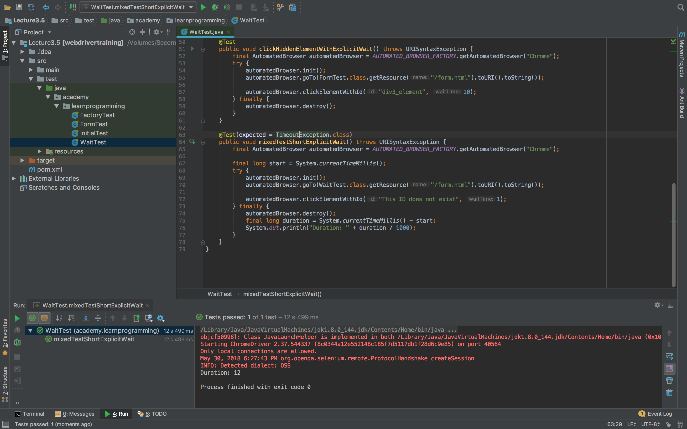
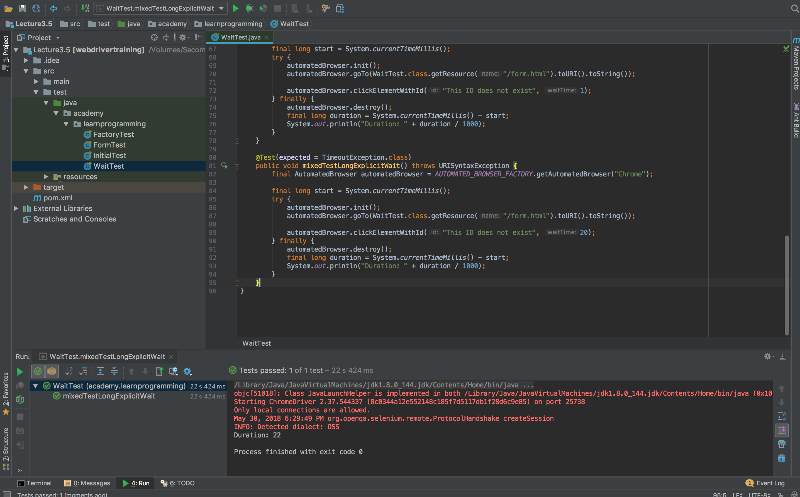
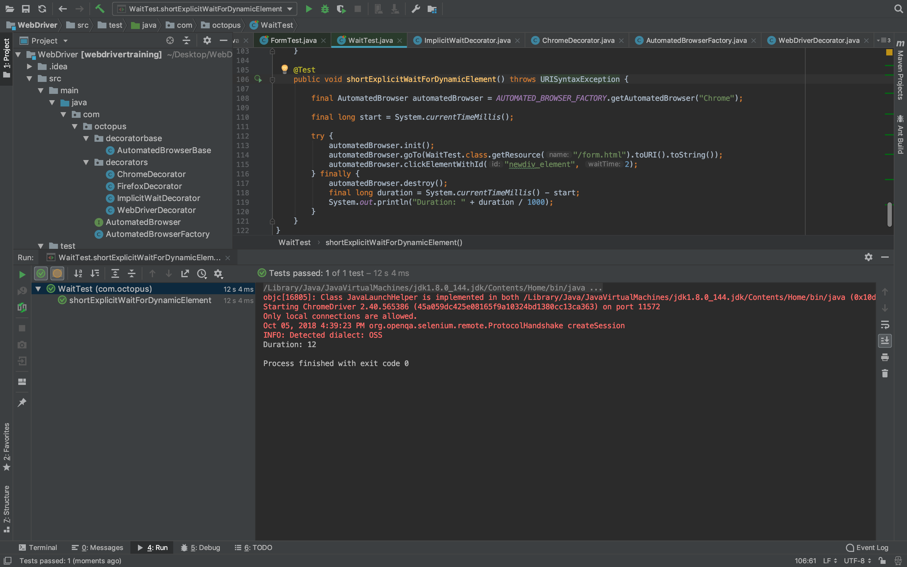

Return to the [table of contents](../0-toc/webdriver-toc.md).

We have seen that there are two types of waits: implicit and explicit. Both are implemented independently of one another, so what happens when you have both an implicit and an explicit wait in a single test?

To find out, let's create a test that implements both kinds of waits.

In our `AutomatedBrowserFactory` class we have the `ImplicitWaitDecorator` class created as part of the construction of the `AutomatedBrowser` that opens a Chrome browser. So we know that the test will make use of implicit waits.

```java
private AutomatedBrowser getChromeBrowser() {
  return new ChromeDecorator(
    new ImplicitWaitDecorator(10,
      new WebDriverDecorator()
    )
  );
}
```

Let's then create a test that attempts to click an element that will never be found on the page.

The addition of the `expected` exception on the `@Test` annotation indicates that this test will only pass if a `TimeoutException` exception is thrown, and we expect this exception to be thrown because there will never be an element with the ID of `This ID does not exist`.

```java
@Test(expected = TimeoutException.class)
public void mixedTestShortExplicitWait() throws URISyntaxException {

  final AutomatedBrowser automatedBrowser = AUTOMATED_BROWSER_FACTORY.getAutomatedBrowser("Chrome");

  final long start = System.currentTimeMillis();

  try {
    automatedBrowser.init();
    automatedBrowser.goTo(WaitTest.class.getResource("/form.html").toURI().toString());
    automatedBrowser.clickElementWithId("This ID does not exist", 1);
  } finally {
    automatedBrowser.destroy();
    final long duration = System.currentTimeMillis() - start;
    System.out.println("Duration: " + duration / 1000);
  }
}
```

To track how long we waited for the element, we start by capturing the current system time before the test starts.

```java
final long start = System.currentTimeMillis();
```

In the `finally` block we display the difference between the current system time and the time when the test was started. This gives us a rough idea of how long the test took to complete.

```java
final long duration = System.currentTimeMillis() - start;
System.out.println("Duration: " + duration / 1000);
```

When trying to click on the element, we use the method that takes a wait time, which in turn means that we implement an explicit wait. In this test we'll use an explicit wait of 1 second. Remember that this explicit wait is in addition to the implicit wait of 10 seconds that was configured as part of the `AutomatedDriver`.

```java
automatedBrowser.clickElementWithId("This ID does not exist", 1);
```

Running this test reveals that the test always takes over 10 seconds to complete.



This result may be surprising when the code has used an explicit wait of only 1 second to wait for the missing element. What it shows is that when mixing a short explicit wait with a long implicit wait, the test will pause for the full time of the implicit wait.

Let's now flip the test around, and add a longer explicit wait. This time we'll use an explicit wait of 20 seconds.

```java
@Test(expected = TimeoutException.class)
public void mixedTestLongExplicitWait() throws URISyntaxException {

  final AutomatedBrowser automatedBrowser = AUTOMATED_BROWSER_FACTORY.getAutomatedBrowser("Chrome");

  final long start = System.currentTimeMillis();

  try {
    automatedBrowser.init();
    automatedBrowser.goTo(WaitTest.class.getResource("/form.html").toURI().toString());
    automatedBrowser.clickElementWithId("This ID does not exist", 20);
  } finally {
    automatedBrowser.destroy();
    final long duration = System.currentTimeMillis() - start;
    System.out.println("Duration: " + duration / 1000);
  }
}
```

Running this test reveals that the test always takes over 20 seconds to complete. This is a more expected result, and shows that the larger of the times assigned to the implicit and explicit waits are used.



Let's try a third scenario, where we use a explicit wait time of 2 seconds for the div element that is created after 5 seconds. If you recall from a previous post, the div with the id of `newdiv_element` is created and dynamically added to the page using a JavaScript function after 5 seconds.

You may add steps like these to a test to ensure that a web application performs actions within an acceptable amount of time, and doesn't leave the user waiting to continue their progress.

```java
@Test
public void shortExplicitWaitForDynamicElement() throws URISyntaxException {

  final AutomatedBrowser automatedBrowser = AUTOMATED_BROWSER_FACTORY.getAutomatedBrowser("Chrome");

  final long start = System.currentTimeMillis();

  try {
    automatedBrowser.init();
    automatedBrowser.goTo(WaitTest.class.getResource("/form.html").toURI().toString());
    automatedBrowser.clickElementWithId("newdiv_element", 2);
  } finally {
    automatedBrowser.destroy();
    final long duration = System.currentTimeMillis() - start;
    System.out.println("Duration: " + duration / 1000);
  }
}
```

This test passes. Even though we have explicitly waited only 2 seconds for an element we know won't be created for 5 seconds, the element is found and clicked.



This behavior is counter-intuitive, and if we had been using a wait time of 2 seconds to enforce the performance requirements of our application, this test would produce a false positive.

Let's rectify this limitation. For the final scenario, we need to get an instance of `AutomatedBrowser` that does not have an implicit wait. For that we will add two new options to the `AutomatedBrowserFactory` class: `ChromeNoImplicitWait` and `FirefoxNoImplicitWait`.

These options in turn call the `getChromeBrowserNoImplicitWait()` and `getFirefoxBrowserNoImplicitWait()` methods, which build `AutomatedBrowser` objects that do not have an implicit wait defined.

```java
package com.octopus;

import com.octopus.decorators.*;

public class AutomatedBrowserFactory {

  public AutomatedBrowser getAutomatedBrowser(String browser) {

    if ("ChromeNoImplicitWait".equalsIgnoreCase(browser)) {
      return getChromeBrowserNoImplicitWait();
    }

    if ("FirefoxNoImplicitWait".equalsIgnoreCase(browser)) {
      return getFirefoxBrowserNoImplicitWait();
    }

    // ...
  }

  // ...

  private AutomatedBrowser getChromeBrowserNoImplicitWait() {
    return new ChromeDecorator(
      new WebDriverDecorator()
      );
  }

  private AutomatedBrowser getFirefoxBrowserNoImplicitWait() {
    return new FirefoxDecorator(
      new WebDriverDecorator()
    );
  }
}
```

We then recreate the same test using an explicit wait, waiting for a shorter period of time than it takes for the element to be generated. But this time we run the test without any implicit wait by passing the `ChromeNoImplicitWait` option to the factory.

```java
@Test(expected = TimeoutException.class)
public void shortExplicitWaitNoImplicitWaitForDynamicElement() throws URISyntaxException {
  final AutomatedBrowser automatedBrowser = AUTOMATED_BROWSER_FACTORY.getAutomatedBrowser("ChromeNoImplicitWait");
  final long start = System.currentTimeMillis();

  try {
    automatedBrowser.init();
    automatedBrowser.goTo(WaitTest.class.getResource("/form.html").toURI().toString());
    automatedBrowser.clickElementWithId("newdiv_element", 2);
  } finally {
    automatedBrowser.destroy();
    final long duration = System.currentTimeMillis() - start;
    System.out.println("Duration: " + duration / 1000);
  }
}
```

This time we get the expected result of a test that throws a `TimeoutException`.

What these tests show us is that implicit and explicit waits are not mutually exclusive. Even though they are defined independently, and have no obvious impact on each other, implicit wait times do impact explicit wait operations.

Because explicit waits allow us to write more robust tests that enforce the state of an element within a time period, as well as providing an individual duration for each interaction to be completed in, it makes sense to use explicit waits for our tests. What we have seen here is that to take advantage of explicit waits, we also need to disable implicit waits.

Return to the [table of contents](../0-toc/webdriver-toc.md).
