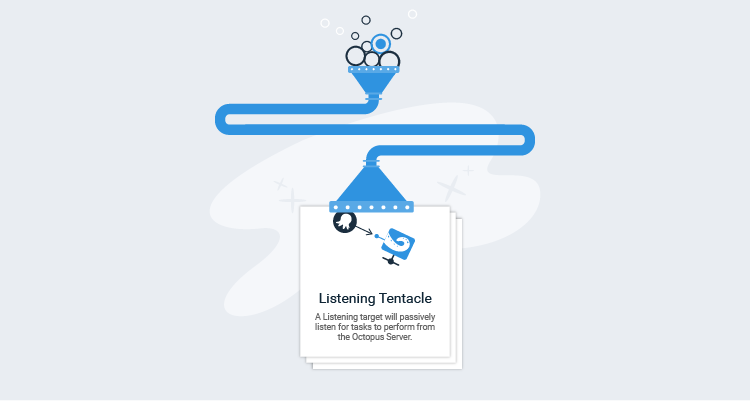
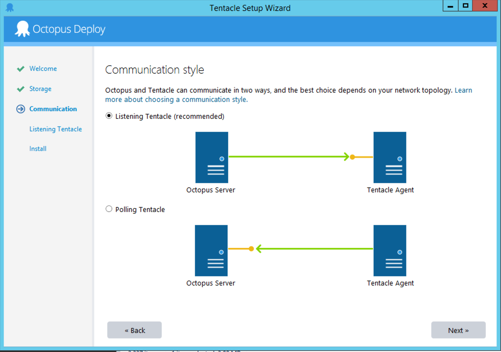
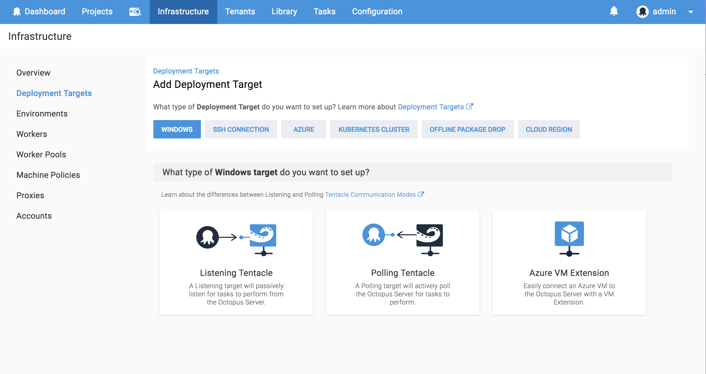
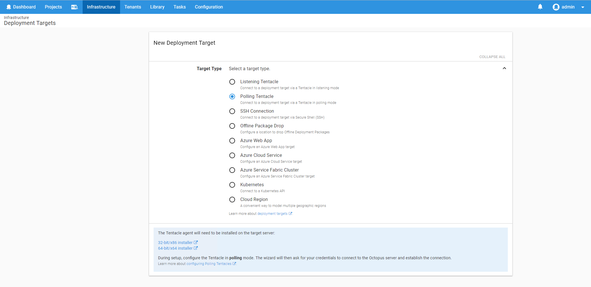
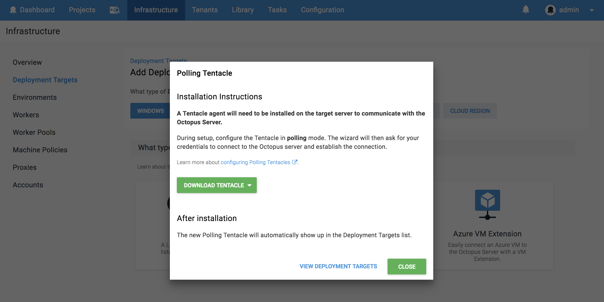

We want Octopus to be easy to use for both first-time and existing users, but when we looked at our telemetry data, we saw new users created lots of environments and not many deployment targets during their onboarding session.
At the start of this year, we did some usability testing around the onboarding experience to identify any pain points our users were hitting, and as a result of those tests, we recently changed the user experience for adding new deployment targets.
Let's look at the problems we found and how we tried to solve them.

## Too Many Radio Buttons

We've introduced quite a few new deployment target types recently. Users have always clicked the radio button to select the type of deployment target they are adding, but radio buttons don't scale very well with a large number of choices. It felt like the number of options reached a tipping point and therefore required some love.

**The Solution**

We could have converted the radio buttons to cards and left it at that, however, that didn't feel like it solved the underlying problem and would have still been rather overwhelming. To start with, we decided to move the deployment target selection to a separate screen to make the selection more focused.
This also provided us with an opportunity to categorize deployment targets in a way that more closely mirrors our documentation and what you, the user, are thinking when you come to this screen.

## Terminology

The usability studies made it clear we didn't do enough to explain our terminology or difficult concepts and we needed to do more to help.
The deployment targets screen is one such screen. We had numerous customers get stuck and ask about the differences between Polling Tentacles and Listening Tentacles.
It's even more confusing for new customers who don't know what a Tentacle is. It wasn’t until users installed a Tentacle that they saw this image that explains what a Tentacle is and the differences between the two types.

**The solution**

Because the images on the Tentacle installer were so helpful, as part of the card design, we've added these images along with a description.

## Dead Ends

During the usability testing, we saw users hit a dead end in the UI when they were adding a Polling Tentacle. We didn't tell you Polling Tentacles are automatically added to the Deployment Targets list.

**The Solution**

We now make it clear that after installing a Polling Tentacle it will appear in the Deployment Target list, and we added a link back to the Deployment Targets list.

## Other Improvements

There are a number of other small changes we've made to improve the navigation between the different deployment target screens and to make things easier to find. This includes adding breadcrumbs where possible and featuring the Tentacle download buttons more prominently.

## Conclusion

Diagrams, descriptions, and timely links rock! Suffice to say, we are excited about it and hope it makes adding a deployment target a more pleasant experience overall.
Download the latest version and have a look at the new UI and UX and let us know what you think.
