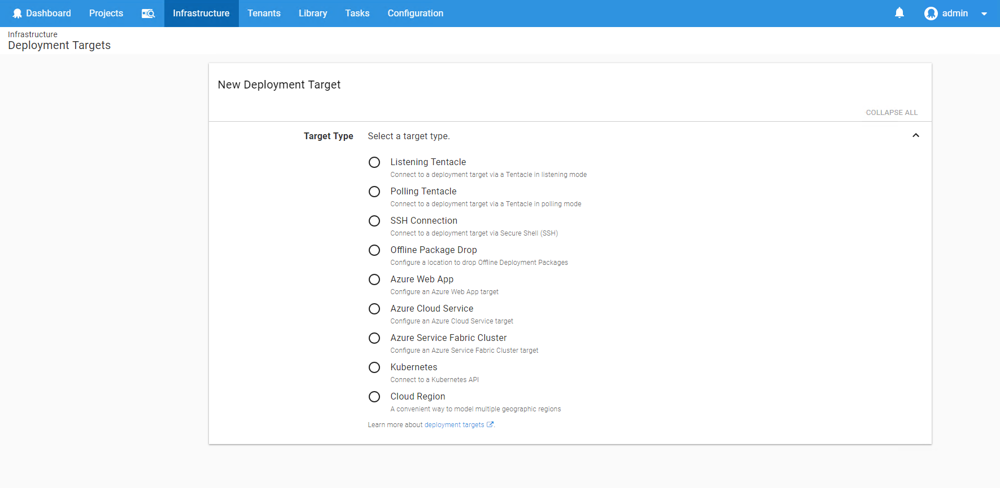

We want Octopus to be easy to use for first-time and existing users but we were seeings stats that new users created lots of environments and not many deployment targets during their onboarding session.
At the start of this year we did some onboarding usability testing to see if we could determine any pain points for our users. It is because of the results we recently changed the user experience for adding a new deployment target.
Let's look at the problems we found and how we have tried to solve them.

## Too Many Radio Buttons

**The Problem**
It's a little known fact that radio buttons don't necessarily scale very well for a large number of choices. We've also been introducing new deployment targets
which exacerbates the problem. It felt like the number of choice reached a tipping point and therefore required some love.

**The Solution**
We could have converted the radio buttons to cards and left it at that, however, that didn't feel like it solved the underlying problem and still would have
been rather overwhelming. To start with we decided to move the deployment target selection to a separate screen in order to make the selection more focused.
This also provided us with an opportunity to categorize deployment targets in a way that more closely mirrors our documentation and what you, the user, would be thinking when you come to this screen.

{Insert image of categories}

## Terminology

**The Problem**
These usability studies made it clear that we didn't do enough to explain our terminology or difficult concepts and we needed to do more to help.
The deployment targets screen is one such screen, where we had numerous customers get stuck asking about what the differences are between polling and listening tentacles.
It's even more confusing to new customers that don't know what a tentacle is. It wasn’t until users installed the tentacle did they see this image that seemed to make sense to them and help understand what a tentacle was.

**The solution**
Because the images on the tentacle installer were so helpful, as part of the card design, we've added these images along with a description.

{Insert image of window targets cards}

## Dead Ends
**The Problem**
During the usability testing we also saw users hit a dead end in the UI when adding a Polling Tentacle and not realising that when they set up a polling tentacle it would automatically be added to the Deployment Targets list.

**The Solution**
We now make it clear that after installing a Polling Tentacle it will appear in the Deployment Target list and provide a link to go back to the Deployment Targets list.

{insert image of polling tentacle dialog box}

## Other Improvements

There were also a number of other small changes added in order to improve the navigation between the various deployment target screens and to make certain
things slightly easier to find. This includes adding breadcrumbs where possible and featuring tentacle download buttons more prominently.

## Conclusion

Diagrams, descriptions and timely links rock! Suffice to say, we are excited about it and hope it makes adding a deployment target a more pleasant experience overall.
Download the latest version and have a look at the new UI amd UX and let us know what you think.