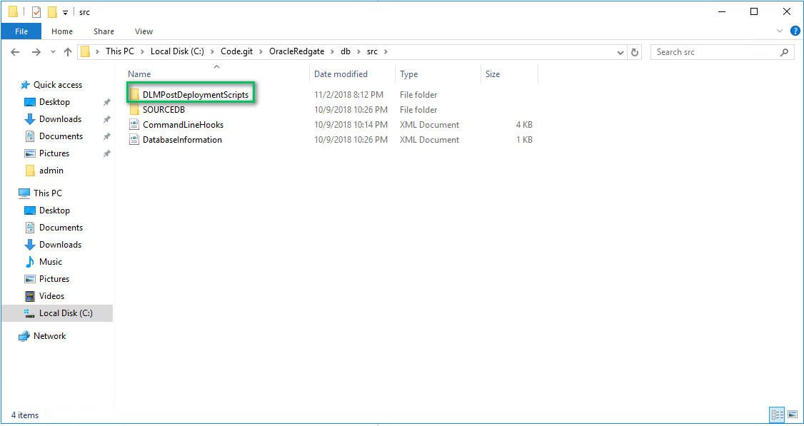
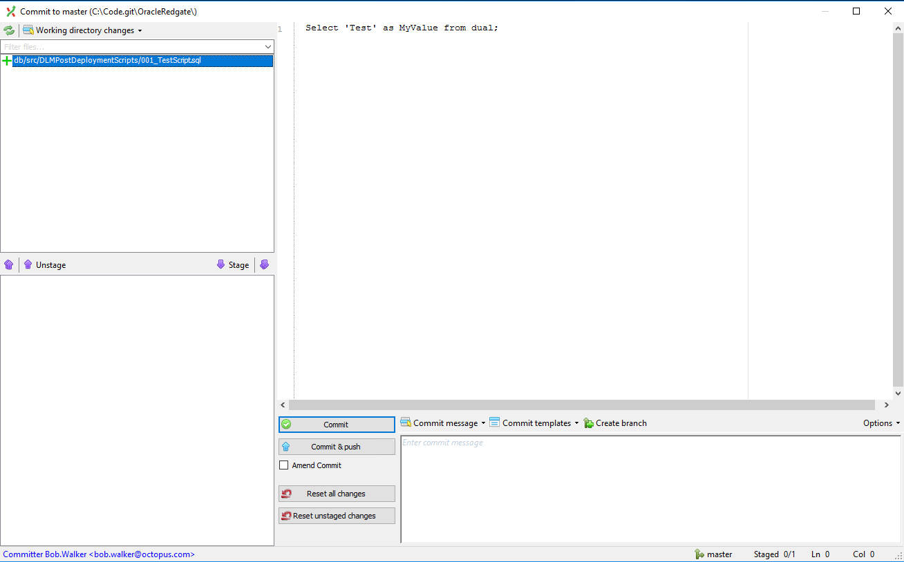
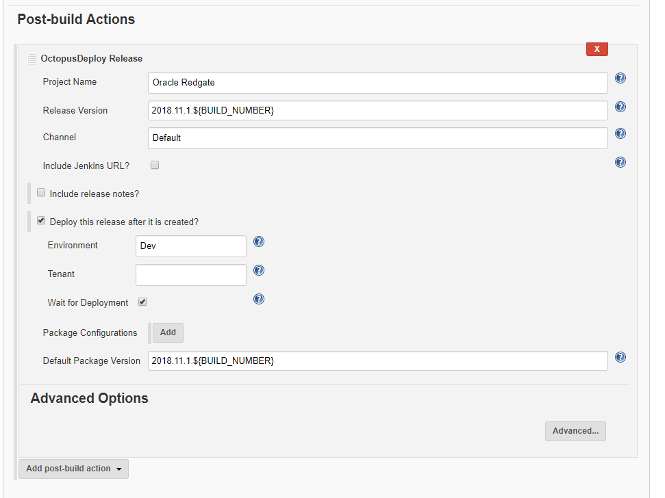
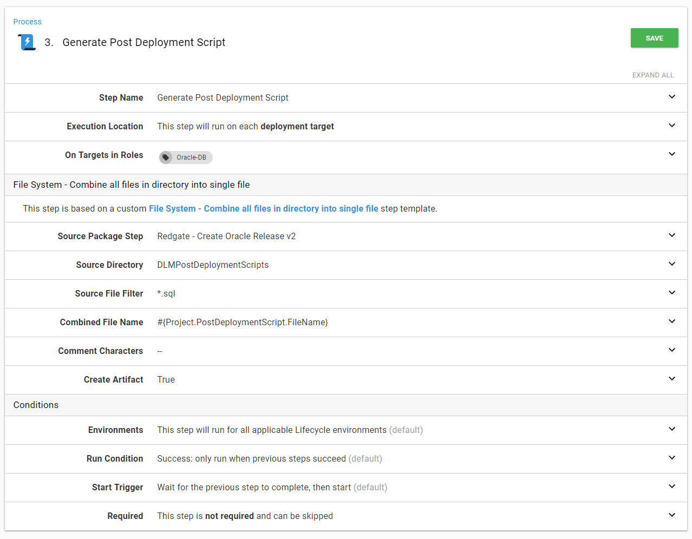

In my previous [article](https://octopus.com/blog/oracle-database-using-redgate), I walked through how to set up a CI/CD pipeline to deploy to Oracle using TeamCity as the build server, Octopus Deploy (of course) as the deployment server with Redgate handling all the heavy lifting.  There are some core concepts in that previous article that are important for this article.  If you haven't had the chance, please read that and then come back to this post.  Trust me, this article isn't going anywhere.

Redgate's tooling uses what is known as a model-based, or desired state approach, to database deployments.  A developer configures a database how they want it.  Add a table here, a view there, and then checks in the entire state of the database into source control.  During a deployment that desired state is compared with the destination database and a delta script is generated.  

For teams starting out with automated database deployments, this is a very easy process to pick up and adapt.  Often times, tools that use this approach have plug-ins, or an external program with a nice UI, to handle all the heavy lifting.  Everyone can keep using their existing tooling.  All someone needs to do is make some changes, hit a few buttons, and boom, off to the races.

The model-based approach is great...most of the time.  It covers 85% of the scenarios out there.  What it doesn't cover are complex database changes.  Scenarios such as renaming a table, moving a column from one table to another, renaming a column, etc.  With a model-based approach if you were to rename a table and deploy that the tool would generate a drop table script to delete the old table and a create table script for the new table.

Dropping a table is never a good thing.  This blog post will walk through how to manage that scenario as well as move the build server from TeamCity over to Jenkins.

!toc

## Non-Breaking Database Changes

Renaming a column, moving a column from one table to another table, consolidating tables.  These are all breaking changes.  In order to deploy them the system needs to be shut down.  Otherwise, the code will start throwing errors.  This means an off-hours deployment.  A 2 am deployment.

A better approach to this is to make non-breaking database changes.  Let's use moving a column from one table to another as an example.  Using the tooling as is, this is what would happen:

1. ColumnA is added to TableB
2. ColumnA is removed from TableA

In reality, you want the tooling to do this:

1. ColumnA is added to TableB
2. Data from TableA is backfilled into TableB
3. ColumnA is removed from TableA

The tooling doesn't support that kind of functionality.  Or does it?  Do all three steps really need to be run in a single deployment?  What happens if a show-stopping bug is found and you need to rollback your code changes?  Rather than do all three steps in a single deployment could you break it into multiple deployments?

Deployment #1
1. ColumnA is added to TableB
2. Data from TableA is backfilled into TableB

Deployment #2
1. ColumnA is removed from TableA

Now we are getting somewhere.  You can deploy your database changes and then your code changes can be deployed across a web farm in a rolling deployment.  So now the process would look something like this.

Deployment #1
1. ColumnA is added to TableB as a nullable column
2. The code is deployed to web farm
3. Data from TableA is backfilled into TableB

Deployment #2
1. ColumnA is removed from TableA
2. ColumnA on TableB is converted to a non-nullable field (if needed)

This approach takes a bit of discipline from both the database developer and the code developer (if they are two people).  The code needs to be flexible to handle when ColumnA on TableB only has null values.  It will also take discipline to remember to remove the column from TableA in the subsequent deployment.  

The discipline will pay off as you now have flexibility in your deployments.  With your database supporting the two most recent versions of your code you can now start looking into more advanced deployment strategies such as blue/green deployments.

## Post Deployment Scripts

If you followed along in my previous article, everything needed is in place except for the scripts to backfill data from TableA into TableB.  All the necessary infrastructure is in place, we just need to make a few modifications to the overall process.

To begin with, we are going to add a new folder into the db/src folder called `DLMPostDeploymentScripts`


This folder will contain idempotent scripts, which is a fancy way of saying scripts that can always be run after a deployment.  In other words, if the script is moving data from one table to another then the script should have logic in it to not overwrite existing data.  Write the scripts with the assumption they will be run dozens upon dozens of times.

Redgate's Source Control for Oracle is okay with that folder being there.  It doesn't throw an error or anything like that.  It just ignores the folder.


But Git doesn't ignore the folder which is perfect for our needs.  I've added in a new file called 001_TestScript.sql.  All it is doing is selecting a test value from dual.  



## Jenkins Configuration

I've checked in that test file and pushed it.  Now it is time to set up the build (again).  For this article, I am going to be switching over from TeamCity to Jenkins.  I'm not changing because of a lack of functionality.  Rather because I want to show how easy it is to configure any build server to deploy using Octopus Deploy.  Be it Jenkins, TeamCity, Bamboo, or TFS/Azure DevOps.  

### Prepping Jenkins for Octopus Deploy

**Please note:** You will need to follow [these instructions](https://jenkins.io/doc/book/managing/plugins/) to install the Octopus Deploy plug-in.  Please do that first.

After installing the Octopus plug-in you will need to configure an Octopus Server.  To do that click on `Manage Jenkins` and then `Configure System`.


Scroll down a little bit until you find the Octopus Deploy plug-in section.  Enter in an ID, URL for the Octopus Deploy Server and the API key and click the add `Save` button at the bottom of the screen.


The Octopus Deploy plug-in will handle creating the release and deploying the release, but it doesn't handle packing and publishing those packages.  For this, we will use Octo.exe.  You can download the latest version at https://octopus.com/downloads.  I'm going to be putting octo.exe into a folder for the build to access.  In this case, it will be `C:\Utilities\Octo`.

**Please Note:** The Octopus Deploy plug-in was created by the Jenkins community.  They have done an awesome job.  But it doesn't have the exact functionality our other plug-ins have.


### Project Set Up

I'm starting this project from scratch.  I'll create a new freestyle project.


Next up, I'll specify the Git repo I will be building from.  

**Please note:** this is a public repo in GitHub, this is why I'm not entering in credentials.


For this demo, I am going to tell Jenkins to poll GitHub every three minutes using a cron expression.  You can adjust this as needed.  But for my purposes, this is all I need.


The build steps are going to pack the db\src folder into a .zip file and then push that .zip file up to Octopus Deploy to, um, deploy it.


We got the packages built and pushed, let's create the release.  

**Please Note:** I haven't made any changes to Octopus Deploy yet, I just want to get this build working and pushing to Octopus Deploy.  Once that is successful then I make changes to the process.



That is it!  Let's kick off a build and see what happens!  It fails!  I think the first ten builds in any CI system should count as "alpha" builds.  I've yet to have a build on the first try.


Let's make a couple of tweaks to the pack and push process.  Use %BUILD_NUMBER% instead of $BUILD_NUMBER, have the second step do a push instead of a pack, and make a few other tweaks.

Rather than trying to copy my text out of an image, here are the command lines for you to use.

```
C:\Utilities\Octo\Octo.exe Pack --Id=RedgateOracle --format=Zip --version=2018.11.1.%BUILD_NUMBER% --BasePath=db\src
C:\Utilities\Octo\Octo.exe Push --Package=RedgateOracle.2018.11.1.%BUILD_NUMBER%.zip --Server=[Your Server URL] --ApiKey=[Your API Key]
```


It took a few times but eventually, Jenkins is pushing to Octopus Deploy and deploying the release to dev.


### Project Update

At the end of the previous article the deployment process looked like this:


We are going to extend that process to support the additional scripts.  First, we need to rearrange a few items.  Let's start with moving some hardcoded values out of the steps and into variables.  For example, the export path.


After some re-configuration, these are the variables I now have configured.


In looking at the Redgate - Create Oracle Release step you can see all the spots where I used these variables.

**Please Note:** Since my last article I have updated this step template based on feedback from users.  You now have more fine grained control.  


The same thing can be seen on the last step.  All the hardcoded values have been replaced by the variables.


We are going to add two new steps to the process.  The first step will combine all the scripts found in the `DLMPostDeploymentScripts` folder into a single script and upload it as an artifact.  This will allow an approver to look through the script to ensure it won't do anything crazy.

I've created a step template in the library you can use called `File System - Combine all files in a directory into single file`. The step will handle all the heavy lifting for you.  You just need to provide it the necessary parameters.  



The next step I am going to add is another `Run Oracle SQLPlus Script` step.  This time it will run the post-deployment script.


When all is said and done the process now looks like this:


It is time to run a deployment through and see what happens.  As you can see an additional artifact was created.


And the script was run successfully.


## Conclusion

With some minor modifications to the process, we can cover a lot more scenarios than before.  It will take a bit of discipline to use this process.  You will need to ensure the scripts can be run multiple times.  You will also have to you remember to remove the scripts after they have been run so you aren't running scripts over and over.  The scripts will be manually written so there is a small to large chance you will run into errors the first time the scripts run.  

But those are some minor issues.  When I helped write this process at a previous company I was surprised how well people took to it.  Once they knew they could write their own scripts to handle data migration or anything else, I started seeing some very unique uses out of it.  One use was running a series of scripts to insert some initialization, or seed, data into tables.  We extended the process even further to check if the database existed.  If the database did not, then it would create it on the fly and initialize it with seed data.  This allowed us to spin up and down test environments and customers quickly.

And that is just the start.  With this is in place it is possible to think about having a blue/green deployment strategy.  A process could be in place to finish the regular deployment and once a blue/green switch is finished and successfully tested a final database script could run to clean up the data.

Finally, as a side bonus, now you know how to build an Octopus Deploy package and deploy that using Octopus Deploy with both TeamCity and Jenkins.  

Until next time, Happy Deployments!