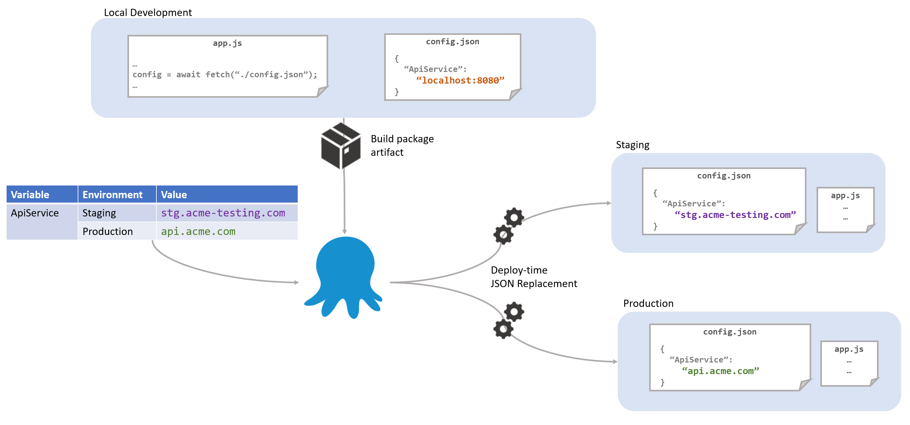
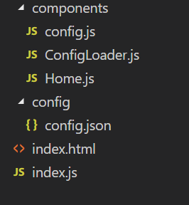

It is common to develop and deploy a single page application (SPA) as a standalone JavaScript app; however, there is a common question that comes up when it's time to integrate these projects into a typical continuous deployment pipeline.

[](https://twitter.com/cnlawrence1183/status/1026901050131980289)

Being good DevOps practitioners we know we should build once and deploy many times, but how can we make this work for our front-end applications?

## JavaScript Configuration from JSON

### First let's just get one approach off the table.

Some proponents swear by the commandments laid out in the [twelve-factor app](https://12factor.net/config) and take it as dogma that all configuration for your application should be pulled out of individual environment variables. In my humble opinion, this approach is very limiting for a few reasons.

- First, this doesn't work easily for browser-based runtimes where you have a static website to serve and need to get that configuration in the browser.
- Secondly, this adds complexity to your hosting environment, whereby you need to ensure that each process that runs your application has its own collection of environment variables which _persist across restarts_ and _doesn't leak across to other instances_ (for example where your testing VM hosts multiple instances of the same application).
- Lastly, this may be straight forward when you have just one URL that needs to differ between environments, but in many applications, the configuration may include many different variables, some of which are deeply nested values. Trying to manage and consolidate hierarchical information through environment variables has a bunch of downsides.

Ultimately, the 12-factor app solution of not storing config in code and to store it in environment variables instead is a bit of a false dilemma. We know that storing configuration in code is neither the most flexible nor secure way to provide configuration, but it is the proposed alternative. Any good deployment tool should also be capable of providing the environment specific variables needed to run your application in a self-contained manner. 

### Configuration as JSON
Create a simple `config.json` file that contains the configuration needed for your application. The values in this configuration can just be those you need for development time. There is no need to create a `config.staging.json` or `config.prod.json` in your source code, the environmental configuration will be provided by Octopus (or your deployment tool of choice) at deploy time. Avoiding these "environmental" configuration files makes our CD process much more flexible and avoids leaking our infrastructure phases into the source code. At runtime, all our code needs to do is retrieve this `config.json` file from the server like any other resource.



For those who are concerned about having a `/config.json` available from the root of your application, remember that if these values were embedded in your javascript files that would be just as "in-the-open". If you are concerned about leaking sensitive information then perhaps the front-end isn't the right place for that information. One nice side effect is that it makes it super easy to check if the static content has been successfully deployed by just loading the config from your browser yourself. By including things like the build number and release date as properties in the config file, I can easily check that they have been deployed to the right place and they are getting through the various CDNs and caches.

Let's walk through a couple of examples of how this can be achieved. There are many ways that this pattern can be accomplished in whatever framework you are using so you may want to modify the following examples to suit your needs.

## Examples
### NodeJs Application
NodeJs is a really simple use case. So long as we include the config file in the distributed application, we can load it directly as if it were any other module:

```javascript
const config = require("./config");
console.log(`Hello ${config.message}`);
```
You couldn't get easier configuration than that if you tried.


No need to muck around detecting environments, loading `config.prod.json` and combining with defaults in `config.json` or consolidating with environment variables!

### React App
Using React, we want to minify and combine all our application files into a single JavaScript file to optimize the run-time experience. We don't want to embed the configuration file into that single application file since that makes it more difficult for us to update at deploy-time with our environment specific values. Instead, we have decided that we want to show a splash screen while the config file is loading. This can be done with just a few steps.



Starting with a simple `config.json` file in our application we provide a value that we can use during development and local testing. This file will be copied to our distribution directory when we build our application as-is:

#### `config/config.js`
```json
{ "message": "My Dev Machine" }
```

In this scenario we are using Webpack to develop our code, and as such we include a line to copy our `config.json` file to the output directory:

#### `webpack.config.js`
```javascript
const HtmlWebPackPlugin = require("html-webpack-plugin");
const CopyWebpackPlugin = require('copy-webpack-plugin');

module.exports = {
  module: {
    rules: [
      { test: /\.js$/, exclude: /node_modules/, use: { } },
      { test: /\.html$/, use: [ { loader: "html-loader" }] }
    ]
  },
  plugins: [
    new HtmlWebPackPlugin({ template: "./src/index.html", filename: "./index.html" }),
    new CopyWebpackPlugin([ { from: 'src/config/config.json', to: 'config.json', toType: 'file' } ], { })
  ]
};
```

Our entry point `index.js` file will use a `ConfigLoader` component to load the configuration file at runtime and display the `Home` component when it completes:

#### `index.js`
```javascript
import React, { Component } from 'react';
import ReactDOM from 'react-dom';
import ConfigLoader from './components/ConfigLoader';
import Home from './components/Home';

class App extends Component {
  render() {
    // When the configuration is loaded, render the Home module
    return <ConfigLoader ready={() => <Home />} />;
  }
}

ReactDOM.render(<App />, document.getElementById('root'));
```

The `Home` component displays the message provided via configuration:

#### `components/Home.js`
```javascript
import React, { Component } from 'react';
import config from './config';

export default class Home extends Component {
    render() {        return <div className="App">        
        <header className="App-header">
          <h1 className="App-title">Welcome to {config.message}</h1>
        </header>
      </div>;
    }
}
```

As you can see, we are importing a `config` module. This is not the raw JSON file created above. This is a special module I will show below. Since this component will not render until the `ConfigLoader` component has loaded the `config.json` file, we can assume that the config object has all the properties we need, in this case just `message`.

The `ConfigLoader` component simply calls a `load` method on our config module and renders the requested component via its props when the configuration has loaded:

#### `components/ConfigLoader.js`
```javascript
import { Component } from 'react';
import {load} from "./config";

export default class ConfigLoader extends Component {
    constructor(props){
        super(props);
        this.state = {isLoaded: false};
    }


  componentDidMount() {
     // Once the configuration is loaded set `isLoaded` to true so we know to render our component
     load().then(config =>  this.setState({isLoaded: true, config}));
  }

  render() {      
    // If we haven't yet loaded the config, show either a "splash" component provided via a `loading` props or return nothing.
    if(!this.state.isLoaded) {
        return this.props.loading ? this.props.loading() : null;
    }

    // The config is loaded so show the component set on the `ready()` props
    return this.props.ready(this.state.config);
  }
}
```

The real magic happens in our `config.json` component. We initially provide an empty object in place of our configuration. We do this so that when we load the config via the HTTP fetch command, we effectively _copy_ the properties from the loaded object onto the exported object. This is because the exported object is effectively cached the first time this module is loaded:

#### `components/config.js`
```javascript
const config = {};
export default config;

function load() {
    return fetch('config.json')
    .then(result => result.json())
    .then((newconfig) => {
        for(let prop in config) {
            delete config[prop]
        }
        for(let prop in newconfig) {
            config[prop] = newconfig[prop]
        }
        return config;
    });
}
export {load}
```

The great thing about this is that as we are developing we can modify the config file, and Webpack will trigger a refresh as if we were updating any other file.


_...and who said I wasn't a great designer_

Everywhere in our app that we want to use the configuration (like the `Home` component above), we can load and simply use the `config` module and access the properties directly since all modules downwards are only rendered once the `ConfigLoader` component has retrieved the configuration. Remember that so long as we transform the `config.json` file as part of our CD pipeline, we will then get the appropriate values supplied and consumed by our application.

This is a fairly simple demonstration, and depending on your use case you may want to dispatch the config into a redux store, or you may also want to deal with more complex scenarios like cache busting, etc.

### Angular App
Rather than go into too much detail reiterating the same points above for a different framework, I'm going to shamelessly plug another blog post by Pam Loahoud on creating Editable [config files](https://blogs.msdn.microsoft.com/premier_developer/2018/03/01/angular-how-to-editable-config-files/) for Angular since this essentially follows the same basic premise as the examples provided above.

In Pam's example, it boils down to creating a service to retrieve the statically hosted `config.json` file.

```typescript
import { Injectable } from '@angular/core’;
import { Http, Response } from '@angular/http';
import { environment } from '../environments/environment';
import { IAppConfig } from './models/app-config.model';

@Injectable()
export class AppConfig {

    static settings: IAppConfig;

    constructor(private http: Http) {}

    load() {
        const jsonFile = `assets/config/config.${environment.name}.json`;
        return new Promise<void>((resolve, reject) => {
            this.http.get(jsonFile).toPromise().then((response : Response) => {
               AppConfig.settings = <IAppConfig>response.json();
               resolve();
            }).catch((response: any) => {
               reject(`Could not load file '${jsonFile}': ${JSON.stringify(response)}`);
            });
        });
    }
}

```

And then updating the `app.module.ts` file to invoke this service on startup:

```typescript
import { APP_INITIALIZER } from '@angular/core';
import { AppConfig } from './app.config';

export function initializeApp(appConfig: AppConfig) {
  return () => appConfig.load();
}
@NgModule({
    imports: [ , , , ],
    declarations: [ . . . ],
    providers: [
       AppConfig,
       { provide: APP_INITIALIZER,
         useFactory: initializeApp,
         deps: [AppConfig], multi: true }
    ],
    bootstrap: [
      AppComponent
    ]
})
export class AppModule { }
```

Just like with the React example, when this runs during startup you can then use the configuration throughout the app:

``` javascript
export class DataService {
    protected apiServer = AppConfig.settings.apiServer;
    . . .
    if (AppConfig.settings.aad.requireAuth) { . . . }
}
```

I like the added touch in this case of using typescript to provide type checking of the configuration at dev time. Once again, with the single configuration file available in your built package, the key is to let your deployment tool perform the appropriate configuration replacements and transforms.

## JavaScript Configuration
To paraphrase a point made in one of my earlier blog posts [we need to start treating JavaScript seriously in our CD pipelines](https://octopus.com/blog/deploying-nodejs), and part of this involves following the "build once, deploy many" mantra. Configuration shouldn't live alongside your code, but it seems natural to assume that the code itself knows what configuration is required. Let your CD tools like Octopus Deploy provide the configuration for your application at deploy time, making it just as simple and secure to deploy to 50 different environments as it is to deploy 1.
